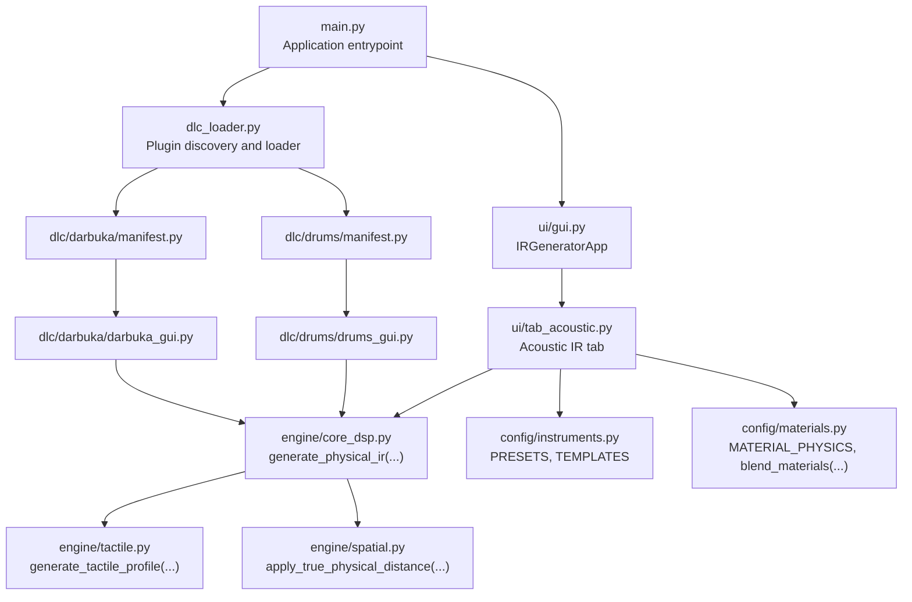
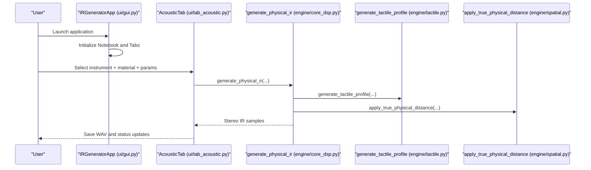
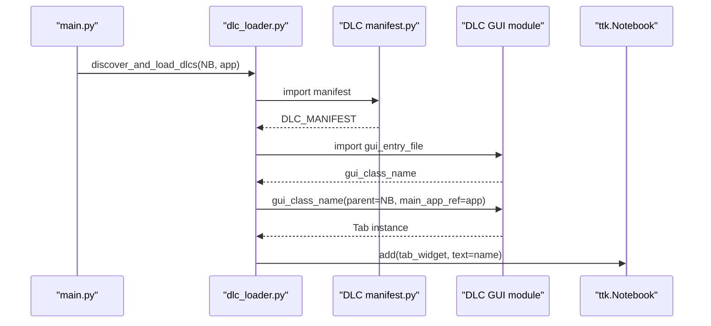
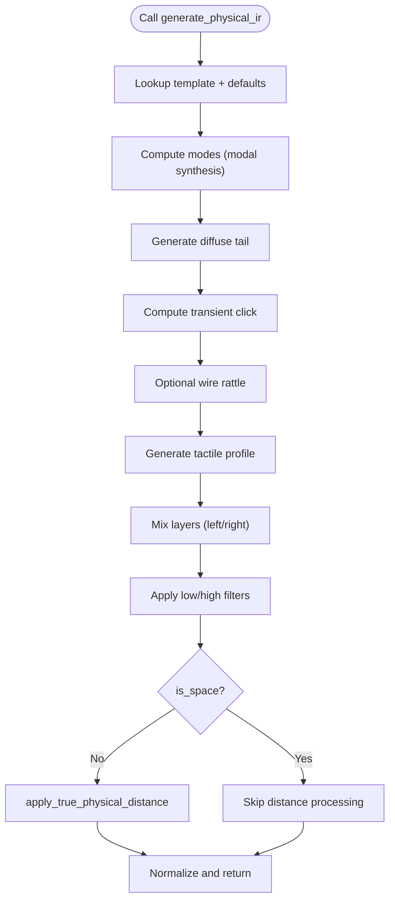
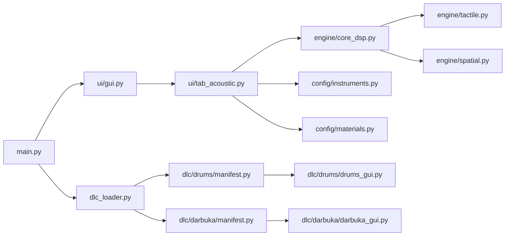

# API Reference

<cite>
**Referenced Files in This Document**
- [main.py](file://main.py)
- [dlc_loader.py](file://dlc_loader.py)
- [engine/core_dsp.py](file://engine/core_dsp.py)
- [engine/core_drums.py](file://engine/core_drums.py)
- [engine/tactile.py](file://engine/tactile.py)
- [engine/spatial.py](file://engine/spatial.py)
- [ui/gui.py](file://ui/gui.py)
- [ui/tab_acoustic.py](file://ui/tab_acoustic.py)
- [config/instruments.py](file://config/instruments.py)
- [config/materials.py](file://config/materials.py)
- [config/shapes.py](file://config/shapes.py)
- [dlc/drums/manifest.py](file://dlc/drums/manifest.py)
- [dlc/darbuka/manifest.py](file://dlc/darbuka/manifest.py)
- [dlc/drums/drums_gui.py](file://dlc/drums/drums_gui.py)
- [dlc/darbuka/darbuka_gui.py](file://dlc/darbuka/darbuka_gui.py)
</cite>

## Table of Contents
1. [Introduction](#introduction)
2. [Project Structure](#project-structure)
3. [Core Components](#core-components)
4. [Architecture Overview](#architecture-overview)
5. [Detailed Component Analysis](#detailed-component-analysis)
6. [Dependency Analysis](#dependency-analysis)
7. [Performance Considerations](#performance-considerations)
8. [Troubleshooting Guide](#troubleshooting-guide)
9. [Conclusion](#conclusion)
10. [Appendices](#appendices)

## Introduction
This API reference documents the public interfaces and core functions of the TroakarIR simulation engine. It covers:
- Public API functions for impulse response generation and physical modeling
- Plugin/DLC interfaces and manifest requirements
- GUI component APIs, event handling, and callback systems
- Configuration parameters, enumerations, and constants
- Usage examples, error handling patterns, and integration workflows
- Versioning, compatibility, and migration guidance

## Project Structure
The project is organized around a main application launcher, a GUI front-end, configurable presets and material databases, core DSP engines, and modular DLC plugins.

**Diagram sources**
- [main.py:23-73](file://main.py#L23-L73)
- [ui/gui.py:8-46](file://ui/gui.py#L8-L46)
- [ui/tab_acoustic.py:126-193](file://ui/tab_acoustic.py#L126-L193)
- [dlc_loader.py:9-62](file://dlc_loader.py#L9-L62)
- [dlc/drums/manifest.py:1-9](file://dlc/drums/manifest.py#L1-L9)
- [dlc/darbuka/manifest.py:1-9](file://dlc/darbuka/manifest.py#L1-L9)
- [engine/core_dsp.py:90-273](file://engine/core_dsp.py#L90-L273)
- [engine/tactile.py:193-250](file://engine/tactile.py#L193-L250)
- [engine/spatial.py:5-61](file://engine/spatial.py#L5-L61)
- [config/instruments.py:4-279](file://config/instruments.py#L4-L279)
- [config/materials.py:642-766](file://config/materials.py#L642-L766)
- [dlc/drums/drums_gui.py:14-333](file://dlc/drums/drums_gui.py#L14-L333)
- [dlc/darbuka/darbuka_gui.py:161-426](file://dlc/darbuka/darbuka_gui.py#L161-L426)

**Section sources**
- [main.py:23-73](file://main.py#L23-L73)
- [ui/gui.py:8-46](file://ui/gui.py#L8-L46)
- [dlc_loader.py:9-62](file://dlc_loader.py#L9-L62)
- [engine/core_dsp.py:90-273](file://engine/core_dsp.py#L90-L273)
- [engine/tactile.py:193-250](file://engine/tactile.py#L193-L250)
- [engine/spatial.py:5-61](file://engine/spatial.py#L5-L61)
- [config/instruments.py:4-279](file://config/instruments.py#L4-L279)
- [config/materials.py:642-766](file://config/materials.py#L642-L766)
- [dlc/drums/manifest.py:1-9](file://dlc/drums/manifest.py#L1-L9)
- [dlc/darbuka/manifest.py:1-9](file://dlc/darbuka/manifest.py#L1-L9)
- [dlc/drums/drums_gui.py:14-333](file://dlc/drums/drums_gui.py#L14-L333)
- [dlc/darbuka/darbuka_gui.py:161-426](file://dlc/darbuka/darbuka_gui.py#L161-L426)

## Core Components
This section documents the primary public APIs for generating impulse responses and managing physical models.

- Acoustic IR Generation
  - Function: generate_physical_ir
  - Purpose: Synthesize a full-space or instrument IR using modal synthesis and physical parameters
  - Parameters:
    - inst_dict: Instrument preset dictionary (from config/instruments.py)
    - mat_dict: Material dictionary for the primary structure (from config/materials.py)
    - def_mat_dict: Default material used to compute velocity scaling
    - shell_mat_dict: Optional override for shell/backing material
    - wire_mat_dict: Optional override for wire/spring material
    - user_scale: Geometric scaling factor applied to sizes and frequencies
    - duration: Target duration in seconds
    - sample_rate: Sampling rate in Hz
    - mic_distance_m: Microphone distance for spatial processing (0.0 disables)
    - custom_f0: Optional fundamental override for presets
  - Returns: NumPy array of shape (samples, 2) stereo IR
  - Notes: Applies modal synthesis, diffuse tail, transient click, wire rattle, tactile profile, and spatial distance model

- Drum IR Generation
  - Function: generate_drum_ir
  - Purpose: Synthesize a drum/cymbal IR with mallet strike, snare wires, tactile profile, and psychoacoustic filters
  - Parameters:
    - Same as generate_physical_ir plus:
      - mic_distance_m: Microphone distance for spatial processing
      - compensate_delay: Whether to auto-trim silence before onset
  - Returns: NumPy array of shape (samples, 2) stereo IR
  - Notes: Includes cymbal-specific swell, material transient shaping, and comb-filter floor reflection

- Tactile Profile Generation
  - Function: generate_tactile_profile
  - Purpose: Compute tactile noise components from material properties and motion derivatives
  - Parameters:
    - mat: Material dictionary
    - t: Time vector
    - ir_signal: Modal IR signal
    - velocity_arr, acceleration_arr, stress_arr: Motion-derived signals
    - sample_rate, nyquist, is_space
    - fatness, strike_force
  - Returns: Tactile noise component (mono)

- Spatial Distance Model
  - Function: apply_true_physical_distance
  - Purpose: Apply proximity effect, air absorption, stereo width reduction, and early room reflections
  - Parameters:
    - stereo_ir: Stereo IR samples
    - sample_rate
    - distance_m: Microphone distance
  - Returns: Modified stereo IR

- Material Blending
  - Function: blend_materials
  - Purpose: Interpolate two materials with support for heterogeneous inclusions and tactile profiles
  - Parameters:
    - mat1, mat2: Material dictionaries
    - blend_ratio: 0.0 to 1.0
  - Returns: Blended material dictionary

- Utility Functions
  - generate_modal_cloud_physics: Synthesize diffuse tail via modal cloud
  - calculate_coincidence_frequency, calculate_radiation_efficiency: Plate acoustics helpers
  - generate_pure_material_noise: Pure texture noise generator

**Section sources**
- [engine/core_dsp.py:90-273](file://engine/core_dsp.py#L90-L273)
- [engine/core_drums.py:96-249](file://engine/core_drums.py#L96-L249)
- [engine/tactile.py:193-250](file://engine/tactile.py#L193-L250)
- [engine/spatial.py:5-61](file://engine/spatial.py#L5-L61)
- [config/materials.py:642-766](file://config/materials.py#L642-L766)

## Architecture Overview
The system integrates a GUI front-end with core engines and optional DLC plugins. The main loop initializes the app, loads DLC tabs, and routes user actions to engine functions.

**Diagram sources**
- [ui/gui.py:8-46](file://ui/gui.py#L8-L46)
- [ui/tab_acoustic.py:126-193](file://ui/tab_acoustic.py#L126-L193)
- [engine/core_dsp.py:90-273](file://engine/core_dsp.py#L90-L273)
- [engine/tactile.py:193-250](file://engine/tactile.py#L193-L250)
- [engine/spatial.py:5-61](file://engine/spatial.py#L5-L61)

## Detailed Component Analysis

### GUI Application and Tabs
- IRGeneratorApp
  - Responsibilities: Creates main window, builds notebook, adds tabs, manages status bar
  - Methods: build_notebook(), build_status_bar()
  - Integration: Instantiated by main.py and passed to DLC loaders

- AcousticTab
  - Responsibilities: Presents instrument/material selection, sliders, and generate button
  - Methods: generate() runs synthesis in a background thread
  - Inputs: Instrument preset key, material key, scale, duration, microphone distance, autocrop flag
  - Outputs: Saves WAV file and updates status

- Event Handling and Callbacks
  - Combobox selections trigger description and label updates
  - Progress bars and status labels reflect long-running tasks
  - Background threads prevent UI blocking during synthesis

**Section sources**
- [ui/gui.py:8-46](file://ui/gui.py#L8-L46)
- [ui/tab_acoustic.py:17-193](file://ui/tab_acoustic.py#L17-L193)

### Plugin/DLC Interfaces
- Manifest Requirements
  - Keys: name, version, author, description, gui_entry_file, gui_class_name
  - Example manifests:
    - [drums manifest:1-9](file://dlc/drums/manifest.py#L1-L9)
    - [darbuka manifest:1-9](file://dlc/darbuka/manifest.py#L1-L9)

- Loader Behavior
  - Discovers directories under dlc/, imports manifest, loads GUI module, instantiates tab class
  - Passes parent Notebook and main app reference to tab constructor
  - Mounts tab widgets into the main notebook

- Tab API Contract
  - Each DLC tab must accept (parent, main_app_ref) and derive from a tkinter widget (e.g., ttk.Notebook or ttk.Frame)
  - Tabs expose controls and callbacks to trigger synthesis and export

**Diagram sources**
- [main.py:44-67](file://main.py#L44-L67)
- [dlc_loader.py:9-62](file://dlc_loader.py#L9-L62)
- [dlc/drums/manifest.py:1-9](file://dlc/drums/manifest.py#L1-L9)
- [dlc/darbuka/manifest.py:1-9](file://dlc/darbuka/manifest.py#L1-L9)

**Section sources**
- [dlc_loader.py:9-62](file://dlc_loader.py#L9-L62)
- [dlc/drums/manifest.py:1-9](file://dlc/drums/manifest.py#L1-L9)
- [dlc/darbuka/manifest.py:1-9](file://dlc/darbuka/manifest.py#L1-L9)
- [main.py:44-67](file://main.py#L44-L67)

### Drum Kit Builder (DLC)
- DrumsDLCFrame
  - Features: Batch render of kick/snare/toms/cymbals, velocity layers, round robins, abort control, progress reporting
  - Controls: Grid resolution, material selectors, global tweaks (muffling, snare tension, tactile boost), bell toggles
  - Callback: yield_cb(step, num_steps) allows external progress updates and abort signaling
  - Export: Generates WAV files per configuration

- Workflow
  - Single test: Generates a single snare sample with abort capability
  - Batch render: Iterates across active pieces, velocities, and RR indices, invoking synthesis with callbacks

**Section sources**
- [dlc/drums/drums_gui.py:14-333](file://dlc/drums/drums_gui.py#L14-L333)

### Darbuka Engine (DLC)
- DarbukaDLCFrame
  - Features: Tuning selection, skin/shell material selection, saturation and tactile boosts, batch rendering, progress and console
  - Articulations: doum, tek, ka, slap, roll, mute
  - Export: Saves multisample WAVs with dynamic velocity layers and RR indexing

- DarbukaPackerFrame
  - Purpose: Packs rendered WAVs into .multisample archives with generated XML
  - Pattern matching: Parses filenames to extract articulation, note, skin, shell, velocity, RR index

**Section sources**
- [dlc/darbuka/darbuka_gui.py:161-426](file://dlc/darbuka/darbuka_gui.py#L161-L426)

### Core Engines and Data Structures

#### Acoustic IR Engine
- generate_physical_ir
  - Steps: Template lookup, modal synthesis, diffuse tail, transient click, wire rattle, tactile profile, sympathetic strings, filtering, spatial processing, normalization
  - Inputs validated via templates and material defaults
  - Outputs normalized stereo IR

**Diagram sources**
- [engine/core_dsp.py:90-273](file://engine/core_dsp.py#L90-L273)
- [engine/spatial.py:5-61](file://engine/spatial.py#L5-L61)

**Section sources**
- [engine/core_dsp.py:90-273](file://engine/core_dsp.py#L90-L273)

#### Drum IR Engine
- generate_drum_ir
  - Steps: Mode synthesis, material transient (mallet/cymbal), snare wires, tactile profile, psychoacoustic filters (air absorption, floor bounce), auto-trim, fade/attack shaping
  - Special handling for cymbals vs drums (swell, bloom, transient envelope)

**Section sources**
- [engine/core_drums.py:96-249](file://engine/core_drums.py#L96-L249)

#### Tactile Engine
- generate_tactile_profile
  - Components: fibrous waveshaping, fluid viscoelasticity, granular stutter, brittle cracks, inclusion effects
  - Protection: soft-knee limiting and slew smoothing to avoid digital artifacts

**Section sources**
- [engine/tactile.py:193-250](file://engine/tactile.py#L193-L250)

#### Spatial Model
- apply_true_physical_distance
  - Effects: proximity HP, air absorption LP, stereo width narrowing, early room reflection mixing, final normalization

**Section sources**
- [engine/spatial.py:5-61](file://engine/spatial.py#L5-L61)

### Configuration Parameters and Presets
- Instruments
  - RESONATOR_TEMPLATES: Defines modal builders and flags (e.g., has_helmholtz, is_space, transient_click)
  - INSTRUMENT_PRESETS: Complete instrument configurations (category, name, template, size/body_depth, low_cut, bridge_hill, f0/ratios, sympathetic_strings)
  - PERCUSSION_PRESETS: Percussion presets with additional fields (e.g., size_m, body_depth)

- Materials
  - MATERIAL_PHYSICS: Extensive database of materials with density, elastic moduli, loss factors, visco-gamma, base thickness, tactile_profile, and inclusions
  - blend_materials: Interpolates two materials and merges tactile and inclusion properties

- Shapes
  - SHAPES: Shape descriptors for geometric presets

**Section sources**
- [config/instruments.py:4-279](file://config/instruments.py#L4-L279)
- [config/materials.py:18-766](file://config/materials.py#L18-L766)
- [config/shapes.py:1-8](file://config/shapes.py#L1-L8)

## Dependency Analysis
The following diagram shows key internal dependencies among modules.

**Diagram sources**
- [main.py:23-73](file://main.py#L23-L73)
- [ui/gui.py:8-46](file://ui/gui.py#L8-L46)
- [ui/tab_acoustic.py:126-193](file://ui/tab_acoustic.py#L126-L193)
- [engine/core_dsp.py:90-273](file://engine/core_dsp.py#L90-L273)
- [engine/tactile.py:193-250](file://engine/tactile.py#L193-L250)
- [engine/spatial.py:5-61](file://engine/spatial.py#L5-L61)
- [config/instruments.py:4-279](file://config/instruments.py#L4-L279)
- [config/materials.py:642-766](file://config/materials.py#L642-L766)
- [dlc_loader.py:9-62](file://dlc_loader.py#L9-L62)
- [dlc/drums/manifest.py:1-9](file://dlc/drums/manifest.py#L1-L9)
- [dlc/darbuka/manifest.py:1-9](file://dlc/darbuka/manifest.py#L1-L9)
- [dlc/drums/drums_gui.py:14-333](file://dlc/drums/drums_gui.py#L14-L333)
- [dlc/darbuka/darbuka_gui.py:161-426](file://dlc/darbuka/darbuka_gui.py#L161-L426)

**Section sources**
- [main.py:23-73](file://main.py#L23-L73)
- [ui/gui.py:8-46](file://ui/gui.py#L8-L46)
- [ui/tab_acoustic.py:126-193](file://ui/tab_acoustic.py#L126-L193)
- [engine/core_dsp.py:90-273](file://engine/core_dsp.py#L90-L273)
- [engine/tactile.py:193-250](file://engine/tactile.py#L193-L250)
- [engine/spatial.py:5-61](file://engine/spatial.py#L5-L61)
- [config/instruments.py:4-279](file://config/instruments.py#L4-L279)
- [config/materials.py:642-766](file://config/materials.py#L642-L766)
- [dlc_loader.py:9-62](file://dlc_loader.py#L9-L62)
- [dlc/drums/manifest.py:1-9](file://dlc/drums/manifest.py#L1-L9)
- [dlc/darbuka/manifest.py:1-9](file://dlc/darbuka/manifest.py#L1-L9)
- [dlc/drums/drums_gui.py:14-333](file://dlc/drums/drums_gui.py#L14-L333)
- [dlc/darbuka/darbuka_gui.py:161-426](file://dlc/darbuka/darbuka_gui.py#L161-L426)

## Performance Considerations
- Modal synthesis and FFT-based filtering dominate CPU usage; adjust user_scale and duration to balance quality and speed.
- Diffuse tail generation uses large mode counts; reduce num_modes for faster previews.
- Spatial processing and tactile components add modest overhead; disable unnecessary effects for real-time scenarios.
- Use autocrop to trim silent tails and reduce file sizes.

## Troubleshooting Guide
- Unknown resonator template
  - Symptom: Error logged and exception raised when synthesizing
  - Cause: inst_dict["resonator_template"] not present in RESONATOR_TEMPLATES
  - Resolution: Verify preset keys and template names

- Aborting renders
  - DrumsDLCFrame: abort_current_render flag stops FDTD loops and saves aborted samples
  - DarbukaDLCFrame: yield_cb returns False to halt synthesis; progress reflects remaining files

- Material blending
  - blend_materials handles missing keys with safe defaults; ensure both materials exist in MATERIAL_PHYSICS

- Logging
  - Main app logs startup and DLC mounting
  - GUI tabs log generation progress and errors
  - Loader logs manifest parsing and import failures

**Section sources**
- [engine/core_dsp.py:95-99](file://engine/core_dsp.py#L95-L99)
- [dlc/drums/drums_gui.py:156-227](file://dlc/drums/drums_gui.py#L156-L227)
- [dlc/darbuka/darbuka_gui.py:377-426](file://dlc/darbuka/darbuka_gui.py#L377-L426)
- [config/materials.py:642-766](file://config/materials.py#L642-L766)
- [main.py:32-33](file://main.py#L32-L33)
- [dlc_loader.py:59-61](file://dlc_loader.py#L59-L61)

## Conclusion
This API reference outlines the public interfaces for impulse response generation, plugin/DLC integration, and GUI controls. By leveraging the documented functions, manifests, and configuration presets, developers can integrate new instruments, materials, and synthesis features while maintaining consistent behavior and performance.

## Appendices

### API Summary Tables

- Acoustic IR Generation
  - Function: generate_physical_ir(inst_dict, mat_dict, def_mat_dict, shell_mat_dict=None, wire_mat_dict=None, user_scale=1.0, duration=2.0, sample_rate=44100, mic_distance_m=0.0, custom_f0=None)
  - Returns: NumPy array (samples, 2)

- Drum IR Generation
  - Function: generate_drum_ir(inst_dict, mat_dict, def_mat_dict, shell_mat_dict=None, wire_mat_dict=None, user_scale=1.0, duration=2.0, sample_rate=44100, mic_distance_m=0.5, custom_f0=None, compensate_delay=True)
  - Returns: NumPy array (samples, 2)

- Tactile Profile
  - Function: generate_tactile_profile(mat, t, ir_signal, velocity_arr, acceleration_arr, stress_arr, sample_rate, nyquist, is_space, fatness=0.0, strike_force=1.0)
  - Returns: Mono signal

- Spatial Distance
  - Function: apply_true_physical_distance(stereo_ir, sample_rate, distance_m)
  - Returns: Stereo IR

- Material Blending
  - Function: blend_materials(mat1, mat2, blend_ratio)
  - Returns: Material dictionary

**Section sources**
- [engine/core_dsp.py:90-93](file://engine/core_dsp.py#L90-L93)
- [engine/core_drums.py:100](file://engine/core_drums.py#L100)
- [engine/tactile.py:193-196](file://engine/tactile.py#L193-L196)
- [engine/spatial.py:5](file://engine/spatial.py#L5)
- [config/materials.py:642-647](file://config/materials.py#L642-L647)

### Plugin Manifest Fields
- name: Human-readable name
- version: Semantic version
- author: Author identifier
- description: Short description
- gui_entry_file: Python file containing the tab class
- gui_class_name: Name of the tab class

**Section sources**
- [dlc/drums/manifest.py:2-9](file://dlc/drums/manifest.py#L2-L9)
- [dlc/darbuka/manifest.py:2-9](file://dlc/darbuka/manifest.py#L2-L9)

### Configuration References
- Instruments
  - RESONATOR_TEMPLATES: Template builders and flags
  - INSTRUMENT_PRESETS: Instrument definitions (category, name, template, size/body_depth, low_cut, bridge_hill, f0/ratios, sympathetic_strings)
  - PERCUSSION_PRESETS: Percussion definitions (category, name, template, size_m/body_depth, low_cut, bridge_hill, f0/ratios, sympathetic_strings)

- Materials
  - MATERIAL_PHYSICS: Material entries with physics, tactile_profile, and inclusions
  - blend_materials: Interpolation and property merging

- Shapes
  - SHAPES: Shape descriptors

**Section sources**
- [config/instruments.py:4-279](file://config/instruments.py#L4-L279)
- [config/materials.py:18-766](file://config/materials.py#L18-L766)
- [config/shapes.py:1-8](file://config/shapes.py#L1-L8)

### Usage Examples and Patterns
- Generating an acoustic IR
  - Select instrument and material from presets
  - Adjust scale, duration, and microphone distance
  - Click generate; save WAV; observe auto-crop trimming

- Using the Drum Kit Builder
  - Choose active kit elements, set grid resolution, material selectors, and global tweaks
  - Start batch render; monitor progress; abort to keep tail

- Using the Darbuka Engine
  - Set tuning, skin/shell materials, saturation and tactile boosts
  - Choose articulations and velocity layers; run generation; pack multisamples

- Plugin Integration
  - Create manifest with gui_entry_file and gui_class_name
  - Implement tab class accepting (parent, main_app_ref)
  - Import engine functions and expose controls

**Section sources**
- [ui/tab_acoustic.py:126-193](file://ui/tab_acoustic.py#L126-L193)
- [dlc/drums/drums_gui.py:228-333](file://dlc/drums/drums_gui.py#L228-L333)
- [dlc/darbuka/darbuka_gui.py:323-426](file://dlc/darbuka/darbuka_gui.py#L323-L426)
- [dlc_loader.py:9-62](file://dlc_loader.py#L9-L62)

### Version Compatibility and Migration
- Manifest format is stable; ensure gui_entry_file and gui_class_name match exported module/class names
- Engine function signatures are consistent; maintain backward-compatible parameter names
- If migrating from older versions, verify preset keys and template names align with RESONATOR_TEMPLATES