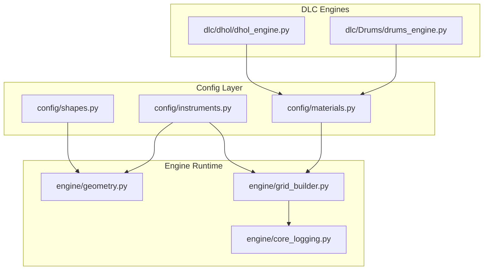
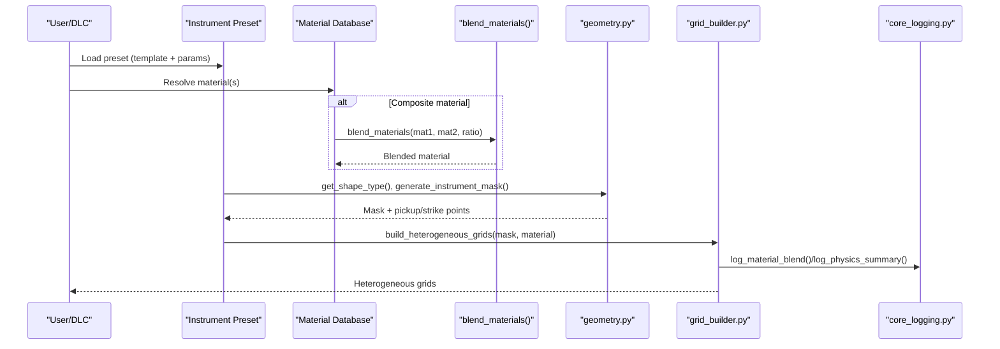
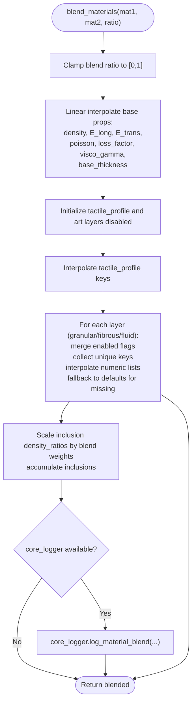
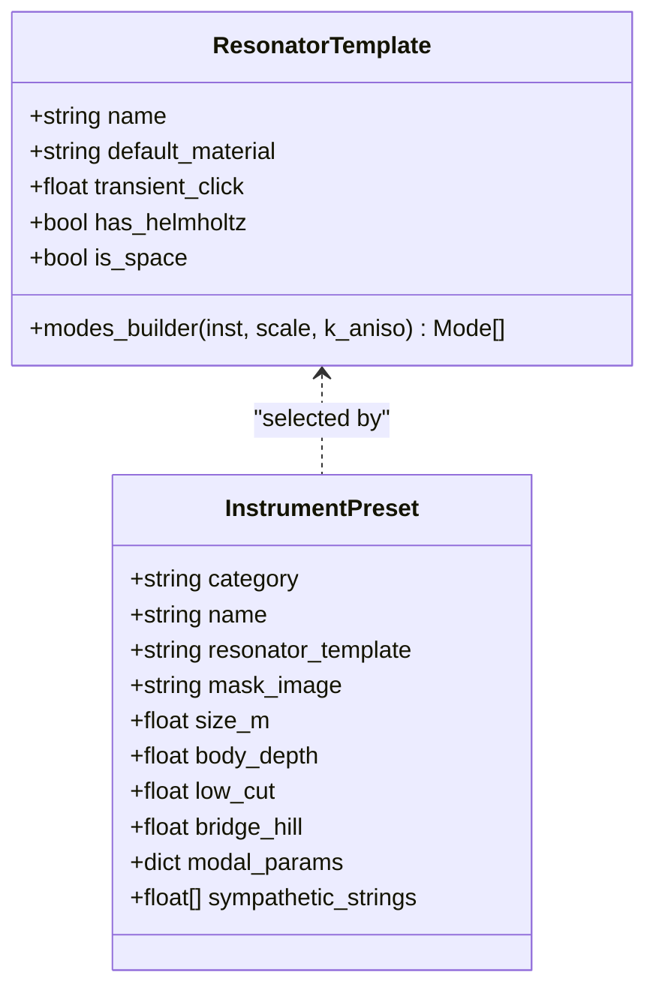
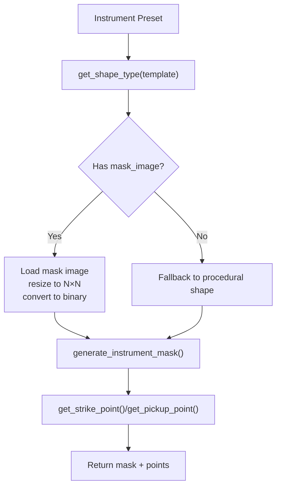
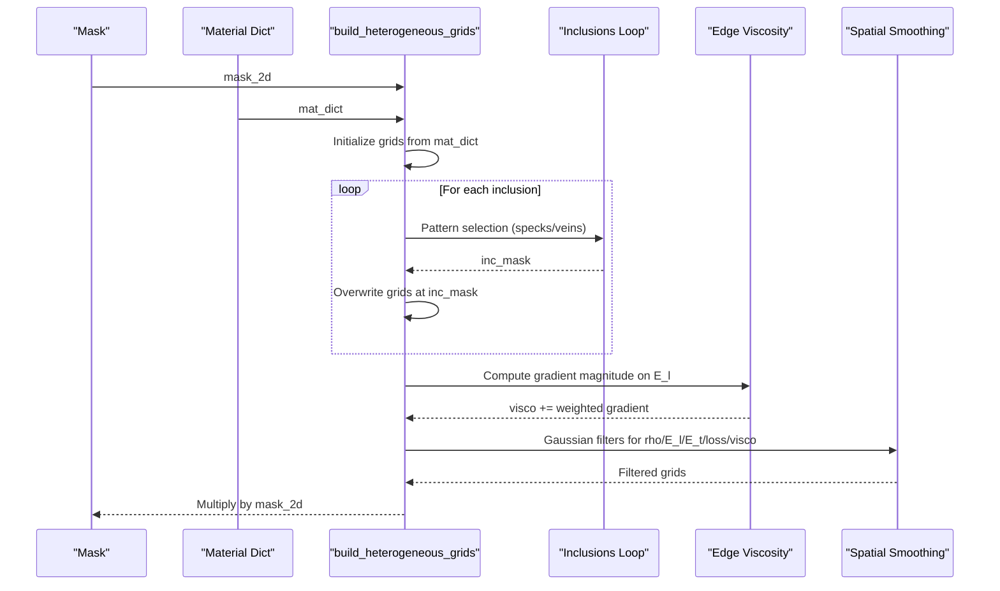
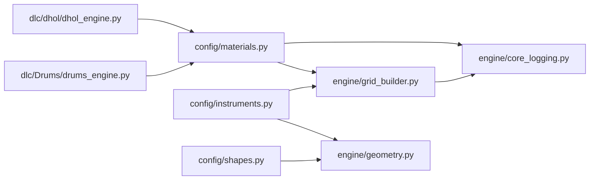

# Configuration API

<cite>
**Referenced Files in This Document**
- [materials.py](file://config/materials.py)
- [instruments.py](file://config/instruments.py)
- [shapes.py](file://config/shapes.py)
- [geometry.py](file://engine/geometry.py)
- [grid_builder.py](file://engine/grid_builder.py)
- [core_logging.py](file://engine/core_logging.py)
- [drums_engine.py](file://dlc/Drums/drums_engine.py)
- [dhol_engine.py](file://dlc/dhol/dhol_engine.py)
</cite>

## Table of Contents
1. [Introduction](#introduction)
2. [Project Structure](#project-structure)
3. [Core Components](#core-components)
4. [Architecture Overview](#architecture-overview)
5. [Detailed Component Analysis](#detailed-component-analysis)
6. [Dependency Analysis](#dependency-analysis)
7. [Performance Considerations](#performance-considerations)
8. [Troubleshooting Guide](#troubleshooting-guide)
9. [Conclusion](#conclusion)
10. [Appendices](#appendices)

## Introduction
This document describes the configuration system interfaces that power TroakarIR’s acoustic modeling. It focuses on:
- Material property database structure and interpolation
- Instrument template system with modal parameter specifications
- Geometric shape configuration and boundary conditions
- Validation, defaults, and property blending
- Extensibility patterns for adding materials and templates
- Configuration formats, versioning, and migration strategies

## Project Structure
The configuration system is organized around three primary modules under config/, with runtime usage in engine/ and DLC-specific engines in dlc/.

**Diagram sources**
- [materials.py:1-766](file://config/materials.py#L1-L766)
- [instruments.py:1-279](file://config/instruments.py#L1-L279)
- [shapes.py:1-8](file://config/shapes.py#L1-L8)
- [geometry.py:1-120](file://engine/geometry.py#L1-L120)
- [grid_builder.py:1-99](file://engine/grid_builder.py#L1-L99)
- [core_logging.py:1-203](file://engine/core_logging.py#L1-L203)
- [drums_engine.py:1-67](file://dlc/Drums/drums_engine.py#L1-L67)
- [dhol_engine.py:1-74](file://dlc/dhol/dhol_engine.py#L1-L74)

**Section sources**
- [materials.py:1-766](file://config/materials.py#L1-L766)
- [instruments.py:1-279](file://config/instruments.py#L1-L279)
- [shapes.py:1-8](file://config/shapes.py#L1-L8)
- [geometry.py:1-120](file://engine/geometry.py#L1-L120)
- [grid_builder.py:1-99](file://engine/grid_builder.py#L1-L99)
- [core_logging.py:1-203](file://engine/core_logging.py#L1-L203)
- [drums_engine.py:1-67](file://dlc/Drums/drums_engine.py#L1-L67)
- [dhol_engine.py:1-74](file://dlc/dhol/dhol_engine.py#L1-L74)

## Core Components
- Material Property Database: Defines physical and tactile properties for materials, categories, and inclusions. Provides blending logic for composites.
- Instrument Template System: Encapsulates modal definitions, transient click, and geometry hints for acoustic bodies.
- Shape Configuration: Supplies procedural and image-based geometry masks and boundary conditions.
- Grid Builder: Converts material dictionaries into spatially heterogeneous grids for simulation.
- Logging and Validation: Centralized logging for material blends and physics summaries; default fallbacks and sanitization in usage sites.

**Section sources**
- [materials.py:9-640](file://config/materials.py#L9-L640)
- [instruments.py:4-101](file://config/instruments.py#L4-L101)
- [shapes.py:2-7](file://config/shapes.py#L2-L7)
- [grid_builder.py:10-87](file://engine/grid_builder.py#L10-L87)
- [core_logging.py:38-202](file://engine/core_logging.py#L38-L202)

## Architecture Overview
The configuration system orchestrates material definitions, instrument templates, and geometry to produce simulation-ready grids. The flow:
- Materials define base physics and optional art layers (granular, fibrous, fluid) plus inclusions.
- Instruments select a template and supply modal parameters and geometry hints.
- Geometry resolves a mask and pick-up positions; Grid Builder constructs heterogeneous grids and applies inclusions.
- Logging records blending and physics summaries.

**Diagram sources**
- [instruments.py:149-175](file://config/instruments.py#L149-L175)
- [materials.py:642-766](file://config/materials.py#L642-L766)
- [geometry.py:8-120](file://engine/geometry.py#L8-L120)
- [grid_builder.py:10-87](file://engine/grid_builder.py#L10-L87)
- [core_logging.py:116-139](file://engine/core_logging.py#L116-L139)

## Detailed Component Analysis

### Material Property Database (config/materials.py)
- Categories: Wood, metal, bio, polymer, mineral/synthetic, and alloy.
- Base Properties: Density, longitudinal/transverse elastic moduli, Poisson ratio, loss factor, viscous gamma, base thickness.
- Art Layers: Granular (intensity, particle count, density, frequency/duration envelopes), Fibrous (intensity, tension, tear frequency), Fluid (intensity, LFO frequency range).
- Tactile Profile: Fibrousness, fluidity, granularity, brittleness.
- Inclusions: List of inclusion entries referencing materials by name or inline, with density ratios and patterns (specks, veins).
- Blending: blend_materials() performs linear interpolation for base physics, merges art layers, and aggregates inclusions with scaled densities.

Key behaviors:
- Interpolation preserves enabled flags for art layers and selects qualitative ranges from the non-null side when keys mismatch.
- Defaults are provided for missing art-layer parameters to prevent NaN propagation.
- Inclusions are accumulated with density ratios scaled by blend weights.

**Diagram sources**
- [materials.py:642-766](file://config/materials.py#L642-L766)
- [core_logging.py:116-139](file://engine/core_logging.py#L116-L139)

**Section sources**
- [materials.py:9-640](file://config/materials.py#L9-L640)
- [materials.py:642-766](file://config/materials.py#L642-L766)
- [core_logging.py:116-139](file://engine/core_logging.py#L116-L139)

### Instrument Template System (config/instruments.py)
- Resonator Templates: Define modal builders, default materials, transient click, Helmholtz presence, and 3D space flags. Each template exposes a modes_builder lambda that computes modal frequencies and amplitudes given instrument parameters and an anisotropy factor.
- Presets: Group templates with instrument-specific parameters (e.g., drum shells, cymbals, tuned bars, woodwind bells, spaces).
- Categories: Organize presets by type for UI and selection.

Template parameters commonly used:
- Transient click: Controls initial click strength.
- Has Helmholtz: Indicates air-coupled modes.
- Is space: Indicates 3D room-like templates.
- Body depth: Used as height or thickness depending on template.
- Modal anchors: Frequencies like f0, A0, B1_center/width, T1–T3, F1–F4, ratios for tuned bars.

**Diagram sources**
- [instruments.py:4-101](file://config/instruments.py#L4-L101)
- [instruments.py:149-175](file://config/instruments.py#L149-L175)

**Section sources**
- [instruments.py:4-101](file://config/instruments.py#L4-L101)
- [instruments.py:149-175](file://config/instruments.py#L149-L175)

### Geometric Shape Configuration (config/shapes.py + engine/geometry.py)
- Shapes: Minimal registry mapping shape names to human-readable labels.
- Geometry Engine: Determines shape type from template names, generates masks from images or procedural shapes, and computes strike/pickup points. Supports stereo pickup placement.

Procedural shapes include:
- Circle (membrane/cymbal-like)
- Square (plate-like)
- Violin/guitar-like outlines
- Bar and horn profiles
- Hall patterns

**Diagram sources**
- [shapes.py:2-7](file://config/shapes.py#L2-L7)
- [geometry.py:8-120](file://engine/geometry.py#L8-L120)

**Section sources**
- [shapes.py:2-7](file://config/shapes.py#L2-L7)
- [geometry.py:8-120](file://engine/geometry.py#L8-L120)

### Grid Construction and Inclusions (engine/grid_builder.py)
- Base Grids: Initializes rho, E_l, E_t, loss, visco arrays from material dictionary.
- Inclusions: Applies speckled or vein-like distributions based on density ratios and patterns; injects extra viscosity at heterogeneity edges to reduce spurious resonance.
- Smoothing: Separate smoothing for structure vs damping to preserve tactile textures while stabilizing boundaries.
- Output: Masks grids to instrument shape.

**Diagram sources**
- [grid_builder.py:10-87](file://engine/grid_builder.py#L10-L87)

**Section sources**
- [grid_builder.py:10-87](file://engine/grid_builder.py#L10-L87)

## Dependency Analysis
- materials.py is consumed by:
  - grid_builder.py for heterogeneous grid construction
  - core_logging.py for logging material blends
  - DLC engines for effective material computation
- instruments.py is consumed by:
  - geometry.py for mask generation and geometry hints
  - grid_builder.py for modal-driven templates
- geometry.py depends on instruments.py for template-to-shape mapping and on mask images for procedural fallback.
- core_logging.py is a sink for instrumentation events from blending and physics summaries.

**Diagram sources**
- [materials.py:1-766](file://config/materials.py#L1-L766)
- [instruments.py:1-279](file://config/instruments.py#L1-L279)
- [shapes.py:1-8](file://config/shapes.py#L1-L8)
- [geometry.py:1-120](file://engine/geometry.py#L1-L120)
- [grid_builder.py:1-99](file://engine/grid_builder.py#L1-L99)
- [core_logging.py:1-203](file://engine/core_logging.py#L1-L203)
- [drums_engine.py:1-67](file://dlc/Drums/drums_engine.py#L1-L67)
- [dhol_engine.py:1-74](file://dlc/dhol/dhol_engine.py#L1-L74)

**Section sources**
- [materials.py:1-766](file://config/materials.py#L1-L766)
- [instruments.py:1-279](file://config/instruments.py#L1-L279)
- [shapes.py:1-8](file://config/shapes.py#L1-L8)
- [geometry.py:1-120](file://engine/geometry.py#L1-L120)
- [grid_builder.py:1-99](file://engine/grid_builder.py#L1-L99)
- [core_logging.py:1-203](file://engine/core_logging.py#L1-L203)
- [drums_engine.py:1-67](file://dlc/Drums/drums_engine.py#L1-L67)
- [dhol_engine.py:1-74](file://dlc/dhol/dhol_engine.py#L1-L74)

## Performance Considerations
- Blending Complexity: Linear interpolation scales with the number of base properties and inclusion count; art-layer merging adds overhead proportional to unique keys across layers.
- Grid Construction: Gaussian filtering and inclusion masking dominate compute; edge viscosity injection is localized and efficient.
- Procedural Masks: Simple analytical shapes are fast; image-based masks incur I/O and conversion costs.
- Logging: Buffered writes minimize I/O contention; adjust verbosity to balance diagnostics and throughput.

[No sources needed since this section provides general guidance]

## Troubleshooting Guide
Common issues and remedies:
- Missing mask image: geometry.py falls back to procedural shapes; ensure mask_image is present in presets or accept fallback behavior.
- Invalid material keys: blend_materials() and grid_builder.py use safe defaults; verify keys match expected names.
- Inclusion density too low: Inclusions below a threshold are ignored; increase density_ratio or enable pattern explicitly.
- Excessive artifacts at boundaries: grid_builder.py intentionally increases viscosity at edges; tune smoothing parameters if needed.
- Logging not written: Ensure TAICHI_LOG_PATH and format environment variables are set appropriately.

**Section sources**
- [geometry.py:17-88](file://engine/geometry.py#L17-L88)
- [grid_builder.py:32-87](file://engine/grid_builder.py#L32-L87)
- [core_logging.py:48-87](file://engine/core_logging.py#L48-L87)

## Conclusion
The configuration system cleanly separates material definitions, instrument templates, and geometry, enabling flexible composition and robust simulation. The blending and grid construction pipelines provide physically meaningful defaults and extensibility for custom materials and templates.

[No sources needed since this section summarizes without analyzing specific files]

## Appendices

### Configuration File Formats and Versioning
- Python modules (config/*.py) serve as the primary configuration format. They export dictionaries and functions used by the engine.
- DLC manifests (dlc/*/manifest.py) define metadata and entry points for content packs.

Versioning and compatibility:
- No explicit version fields are present in config modules. Maintain backward compatibility by preserving key names and default semantics.
- When extending materials or templates, add new keys with sensible defaults to avoid breaking existing blending and rendering logic.

Migration strategies:
- Add new categories or materials without removing old ones.
- For blending, ensure new art-layer keys are handled gracefully by defaulting to zero or neutral values.
- For templates, keep modes_builder signatures compatible or introduce optional parameters with defaults.

**Section sources**
- [instruments.py:149-175](file://config/instruments.py#L149-L175)
- [materials.py:642-766](file://config/materials.py#L642-L766)
- [manifest.py:1-9](file://dlc/Drums/manifest.py#L1-L8)
- [manifest.py:1-9](file://dlc/dhol/manifest.py#L1-L9)

### Extending the Configuration System

- Adding a new material:
  - Define base properties, optional art layers, and inclusions in the material database.
  - Optionally add a blending rule by invoking blend_materials() with two materials.
  - Verify defaults for missing keys are reasonable; otherwise update blending logic.

- Creating a new instrument template:
  - Add a template with a modes_builder lambda and default parameters.
  - Register a preset that references the template and supplies modal anchors and geometry hints.
  - Ensure get_shape_type() mapping covers the new template if procedural masks are desired.

- Supporting custom geometry:
  - Provide a mask_image in the preset; geometry.py will load it automatically.
  - Alternatively, rely on procedural shapes mapped by get_shape_type().

- Example extension points:
  - New art-layer parameter: Extend blending defaults and grid builder to incorporate the parameter.
  - New inclusion pattern: Add pattern handling in grid_builder and adjust inclusion density scaling.
  - New template category: Update geometry mapping and consider new modal anchors in presets.

**Section sources**
- [materials.py:642-766](file://config/materials.py#L642-L766)
- [instruments.py:4-101](file://config/instruments.py#L4-L101)
- [geometry.py:8-16](file://engine/geometry.py#L8-L16)
- [grid_builder.py:43-61](file://engine/grid_builder.py#L43-L61)