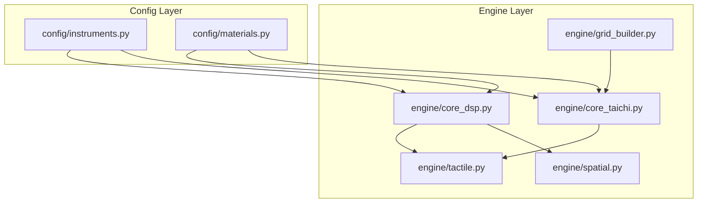
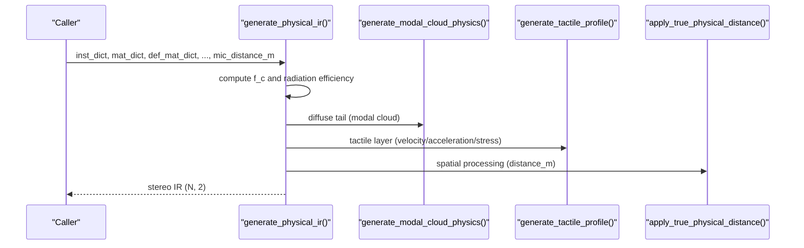
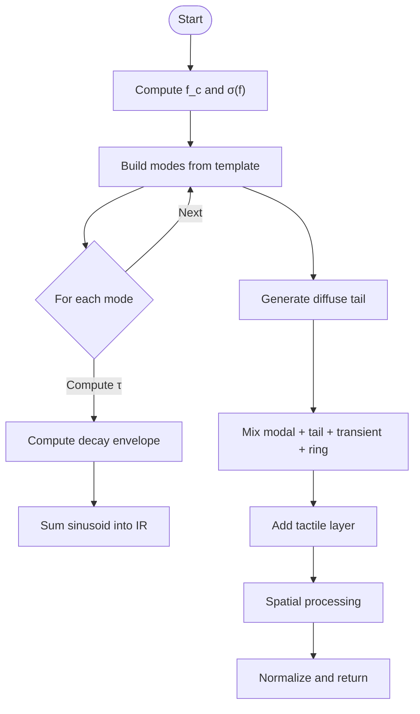
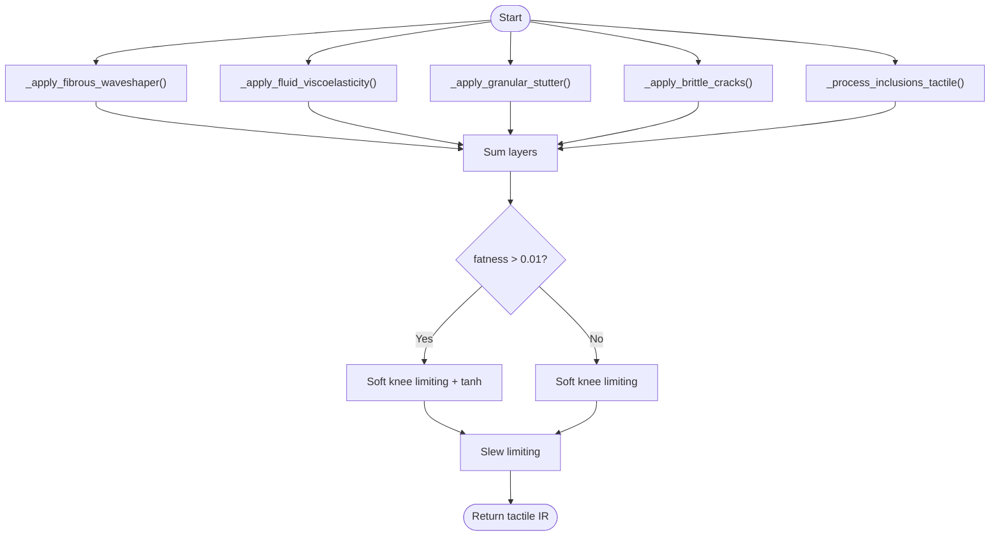
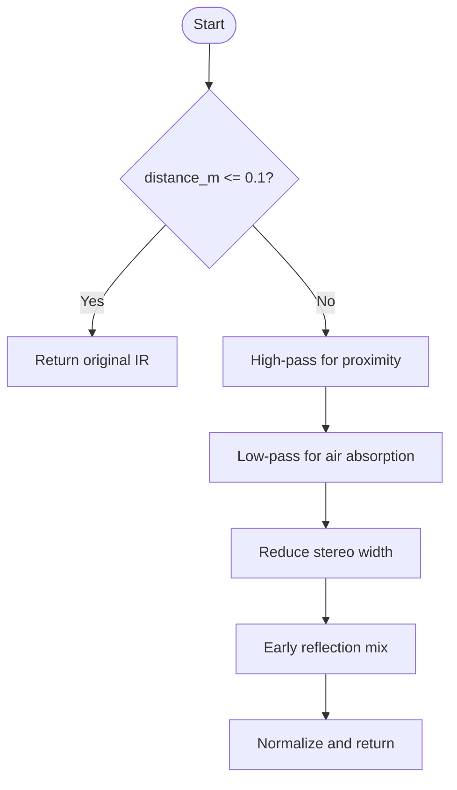
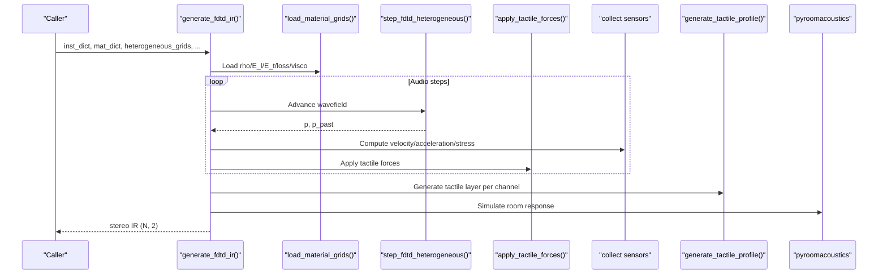
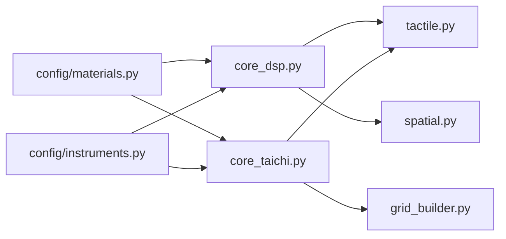

# Core Engine API

<cite>
**Referenced Files in This Document**
- [core_dsp.py](file://engine/core_dsp.py)
- [tactile.py](file://engine/tactile.py)
- [spatial.py](file://engine/spatial.py)
- [core_taichi.py](file://engine/core_taichi.py)
- [grid_builder.py](file://engine/grid_builder.py)
- [instruments.py](file://config/instruments.py)
- [materials.py](file://config/materials.py)
- [drums_engine.py](file://dlc/Drums/drums_engine.py)
</cite>

## Table of Contents
1. [Introduction](#introduction)
2. [Project Structure](#project-structure)
3. [Core Components](#core-components)
4. [Architecture Overview](#architecture-overview)
5. [Detailed Component Analysis](#detailed-component-analysis)
6. [Dependency Analysis](#dependency-analysis)
7. [Performance Considerations](#performance-considerations)
8. [Troubleshooting Guide](#troubleshooting-guide)
9. [Conclusion](#conclusion)

## Introduction
This document provides comprehensive API documentation for TroakarIR's core simulation engines. It focuses on the physical modeling pipeline that synthesizes realistic impulse responses and tactile textures for percussion and acoustic instruments. Covered APIs include:
- generate_physical_ir(): main synthesis function for modal and spatial IR generation
- calculate_coincidence_frequency(): computes coincidence frequency for plates
- calculate_radiation_efficiency(): computes radiation efficiency vs. coincidence frequency
- generate_modal_cloud_physics(): generates diffuse high-frequency tails
- generate_tactile_profile(): tactile texture synthesis from physical sensors
- Spatial processing APIs and integration patterns

The guide includes parameter specifications, input validation, error handling, usage examples, and performance considerations tailored for practical integration.

## Project Structure
The core simulation logic resides primarily under engine/ with supporting configuration under config/. The main orchestration functions are:
- engine/core_dsp.py: modal synthesis, coincidence/radiation calculations, modal cloud generation, and primary IR assembly
- engine/tactile.py: tactile profile generation from material physics and sensor-derived kinematics
- engine/spatial.py: true physical distance modeling for microphone placement
- engine/core_taichi.py: FDTD-based Taichi engine for heterogeneous material simulations
- engine/grid_builder.py: heterogeneous grid construction for Taichi
- config/instruments.py: instrument templates and presets
- config/materials.py: material database and blending utilities

**Diagram sources**
- [core_dsp.py:90-273](file://engine/core_dsp.py#L90-L273)
- [tactile.py:193-229](file://engine/tactile.py#L193-L229)
- [spatial.py:5-61](file://engine/spatial.py#L5-L61)
- [core_taichi.py:266-717](file://engine/core_taichi.py#L266-L717)
- [grid_builder.py:10-57](file://engine/grid_builder.py#L10-L57)
- [instruments.py:4-101](file://config/instruments.py#L4-L101)
- [materials.py:18-766](file://config/materials.py#L18-L766)

**Section sources**
- [core_dsp.py:90-273](file://engine/core_dsp.py#L90-L273)
- [tactile.py:193-229](file://engine/tactile.py#L193-L229)
- [spatial.py:5-61](file://engine/spatial.py#L5-L61)
- [core_taichi.py:266-717](file://engine/core_taichi.py#L266-L717)
- [grid_builder.py:10-57](file://engine/grid_builder.py#L10-L57)
- [instruments.py:4-101](file://config/instruments.py#L4-L101)
- [materials.py:18-766](file://config/materials.py#L18-L766)

## Core Components
This section documents the primary APIs used to synthesize physical IRs and tactile textures.

### generate_physical_ir()
- Purpose: Synthesize a stereo impulse response combining modal bodies, diffuse tails, transients, tactile textures, sympathetic strings, and spatial effects.
- Parameters:
  - inst_dict: Instrument template selection and parameters. Keys include:
    - resonator_template: Template name (e.g., "drum_shell", "cymbal_plate", "space_cathedral"). Must match config/instruments.py.
    - f0/A0: Fundamental and Helmholtz resonance frequencies; may be overridden via custom_f0.
    - low_cut: Low-pass filter cutoff (Hz) scaled by user_scale.
    - bridge_hill: Broad EQ hill center frequency for high-frequency tail shaping.
    - snare_rattle: Optional wire rattle intensity.
    - sympathetic_strings: Optional list of tuned string frequencies (Hz).
    - Additional keys depend on selected template (e.g., size_m, body_depth for spaces).
  - mat_dict: Target material properties for the main body. Required keys:
    - density, E_long, E_trans, loss_factor, visco_gamma, base_thickness, poisson, tactile_profile, inclusions.
  - def_mat_dict: Default/reference material used to compute velocity ratios and scaling.
  - shell_mat_dict: Optional shell material (e.g., air cavity) for specific templates.
  - wire_mat_dict: Optional wire material for snare rattle.
  - user_scale: Scale factor to adjust size/frequency response.
  - duration: Output duration in seconds.
  - sample_rate: Sampling rate in Hz.
  - mic_distance_m: Microphone distance in meters for spatial processing (contact if <= 0.1).
  - custom_f0: Optional override for fundamental frequency.
- Returns: NumPy array of shape (N, 2) containing left/right channels normalized to [-1, 1].
- Validation and errors:
  - Unknown resonator_template raises KeyError logged with inst_dict keys.
  - Frequency Nyquist checks prevent aliasing.
  - Energy normalization applied post-filtering.
- Integration pattern:
  - Uses generate_modal_cloud_physics() for diffuse tails.
  - Applies generate_tactile_profile() for tactile layer.
  - Filters with Butterworth high/low-pass filters.
  - Spatial processing via apply_true_physical_distance() unless is_space.
- Example usage:
  - Select template "drum_shell" with spruce wood and custom f0=120 Hz.
  - Use pomor_bog_pine material for tactile richness.
  - Set user_scale=1.2 for larger perceived size.
  - Call with duration=2.0 s and sample_rate=48000 Hz.
- Performance considerations:
  - Modal synthesis loops scale with number of modes per template.
  - Diffuse tails use 800–1200 modes depending on template.
  - Tactile profile adds vectorized filtering and waveshaping per sample.
  - Spatial filtering adds minimal overhead.

**Section sources**
- [core_dsp.py:90-273](file://engine/core_dsp.py#L90-L273)
- [instruments.py:4-101](file://config/instruments.py#L4-L101)
- [materials.py:18-766](file://config/materials.py#L18-L766)

### calculate_coincidence_frequency(mat_props, h)
- Purpose: Compute the coincidence frequency fc for a plate of thickness h using material properties.
- Parameters:
  - mat_props: Dict with keys density, E_long, poisson (optional, defaults to 0.3).
  - h: Plate thickness in meters.
- Returns: Float coincidence frequency in Hz.
- Notes: Uses exact formula derived from plate bending stiffness and density.

**Section sources**
- [core_dsp.py:12-25](file://engine/core_dsp.py#L12-L25)

### calculate_radiation_efficiency(f, f_c)
- Purpose: Compute radiation efficiency σ(f) relative to coincidence frequency.
- Parameters:
  - f: Frequency in Hz.
  - f_c: Coincidence frequency computed from calculate_coincidence_frequency().
- Returns: Efficiency in [0, 1].

**Section sources**
- [core_dsp.py:27-31](file://engine/core_dsp.py#L27-L31)

### generate_modal_cloud_physics(...)
- Purpose: Generate a diffuse high-frequency tail using modal summation with phase modulation and exponential decay.
- Parameters:
  - duration, sample_rate: Output length and sampling rate.
  - freq_start, freq_end, num_modes: Frequency range and mode count.
  - mat_props: Material properties for loss and radiation.
  - user_scale: Scales thickness and frequency.
  - is_space: If True, uses space-specific parameters and optional space_size.
  - space_size: Optional size of 3D space affecting low-frequency cutoff.
  - eq_curve_func: Optional function to shape high-frequency tail (e.g., bridge_hill).
- Returns: NumPy array of length round(duration*sample_rate).
- Validation:
  - Skips modes at or above Nyquist.
  - Normalizes output to unit peak.

**Section sources**
- [core_dsp.py:33-88](file://engine/core_dsp.py#L33-L88)

### generate_tactile_profile(...)
- Purpose: Assemble tactile textures from fibrous, fluid, granular, brittle, and inclusion contributions.
- Parameters:
  - mat: Material dict with tactile_profile and optional inclusions.
  - t: Time array matching IR length.
  - ir_signal: Modal IR used as base.
  - velocity_arr, acceleration_arr, stress_arr: Sensor-derived kinematic arrays from FDTD.
  - sample_rate, nyquist, is_space: Audio metadata and environment flag.
  - fatness: Optional compression and limiting parameter.
  - strike_force: Amplitude scaling for tactile effects.
- Returns: NumPy array of tactile layer.
- Validation:
  - Intensity thresholds below ~0.01 are ignored per-layer.
  - Soft knee limiter prevents clipping.
  - Slew limiting smooths transients.

**Section sources**
- [tactile.py:193-229](file://engine/tactile.py#L193-L229)

### Spatial Processing: apply_true_physical_distance(...)
- Purpose: Apply true physical distance model including proximity effect, air absorption, stereo width reduction, and early reflections mix.
- Parameters:
  - stereo_ir: Stereo IR array (N, 2).
  - sample_rate: Sampling rate in Hz.
  - distance_m: Microphone distance in meters.
- Returns: Modified stereo IR array.
- Behavior:
  - No processing if distance_m <= 0.1 (contact).
  - High-pass for proximity effect for distance_m > 1.0.
  - Low-pass for air absorption.
  - Stereo width reduction proportional to distance.
  - Early reflection mix with configurable direct/room balance.

**Section sources**
- [spatial.py:5-61](file://engine/spatial.py#L5-L61)

## Architecture Overview
The synthesis pipeline integrates modal synthesis, tactile generation, and spatial processing:

**Diagram sources**
- [core_dsp.py:90-273](file://engine/core_dsp.py#L90-L273)
- [core_dsp.py:33-88](file://engine/core_dsp.py#L33-L88)
- [tactile.py:193-229](file://engine/tactile.py#L193-L229)
- [spatial.py:5-61](file://engine/spatial.py#L5-L61)

## Detailed Component Analysis

### Modal Synthesis and Cloud Generation
- Modal synthesis computes decay times from material loss, radiation, and viscosity, then sums sinusoids with phase modulation.
- Diffuse tail generation uses a broader frequency range and optional EQ shaping to emulate scattering and rough surfaces.

**Diagram sources**
- [core_dsp.py:12-25](file://engine/core_dsp.py#L12-L25)
- [core_dsp.py:33-88](file://engine/core_dsp.py#L33-L88)
- [core_dsp.py:90-273](file://engine/core_dsp.py#L90-L273)

**Section sources**
- [core_dsp.py:12-25](file://engine/core_dsp.py#L12-L25)
- [core_dsp.py:33-88](file://engine/core_dsp.py#L33-L88)
- [core_dsp.py:90-273](file://engine/core_dsp.py#L90-L273)

### Tactile Profile Assembly
- Fibrous: waveshaping and HP filtering based on velocity envelope.
- Fluid: noise synthesis modulated by velocity envelope.
- Granular: gated noise triggered by acceleration envelope.
- Brittle: sparse crack events modulated by stress envelope.
- Inclusions: per-inclusion tactile contributions blended by density_ratio.

**Diagram sources**
- [tactile.py:46-187](file://engine/tactile.py#L46-L187)
- [tactile.py:193-229](file://engine/tactile.py#L193-L229)

**Section sources**
- [tactile.py:46-187](file://engine/tactile.py#L46-L187)
- [tactile.py:193-229](file://engine/tactile.py#L193-L229)

### Spatial Processing Integration
- Distance-dependent proximity effect, air absorption, stereo width, and early reflection mix are applied unless distance_m <= 0.1.

**Diagram sources**
- [spatial.py:5-61](file://engine/spatial.py#L5-L61)

**Section sources**
- [spatial.py:5-61](file://engine/spatial.py#L5-L61)

### Taichi-Based Heterogeneous Simulation (Advanced)
- Generates FDTD wavefields on heterogeneous grids, captures kinematic sensors, applies tactile forces, and produces stereo IR with optional room simulation and resonance suppression.

**Diagram sources**
- [core_taichi.py:266-717](file://engine/core_taichi.py#L266-L717)
- [grid_builder.py:10-57](file://engine/grid_builder.py#L10-L57)

**Section sources**
- [core_taichi.py:266-717](file://engine/core_taichi.py#L266-L717)
- [grid_builder.py:10-57](file://engine/grid_builder.py#L10-L57)

## Dependency Analysis
Key dependencies and coupling:
- core_dsp.py depends on tactile.py for tactile synthesis and spatial.py for distance modeling.
- tactile.py relies on scipy.signal for filtering and numpy for vectorized operations.
- core_taichi.py depends on Taichi for GPU/CPU kernels, pyroomacoustics for room simulation, and config materials for heterogeneous grids.
- grid_builder.py constructs heterogeneous grids from materials and inclusions.

**Diagram sources**
- [core_dsp.py:6-8](file://engine/core_dsp.py#L6-L8)
- [tactile.py:1-4](file://engine/tactile.py#L1-L4)
- [spatial.py:1-3](file://engine/spatial.py#L1-L3)
- [core_taichi.py:10-12](file://engine/core_taichi.py#L10-L12)
- [grid_builder.py:10-13](file://engine/grid_builder.py#L10-L13)
- [materials.py:18-766](file://config/materials.py#L18-L766)
- [instruments.py:4-101](file://config/instruments.py#L4-L101)

**Section sources**
- [core_dsp.py:6-8](file://engine/core_dsp.py#L6-L8)
- [tactile.py:1-4](file://engine/tactile.py#L1-L4)
- [spatial.py:1-3](file://engine/spatial.py#L1-L3)
- [core_taichi.py:10-12](file://engine/core_taichi.py#L10-L12)
- [grid_builder.py:10-13](file://engine/grid_builder.py#L10-L13)
- [materials.py:18-766](file://config/materials.py#L18-L766)
- [instruments.py:4-101](file://config/instruments.py#L4-L101)

## Performance Considerations
- Modal synthesis cost scales with number of modes per template; typical counts are 4–10 for modal bodies and 800–1200 for diffuse tails.
- Tactile profile computation is vectorized but adds per-sample nonlinearities; reduce fatness and strike_force for lower CPU usage.
- Spatial filtering is lightweight compared to synthesis.
- Taichi-based simulation:
  - CFL stability requires substepping M; larger N_grid increases memory and compute.
  - GPU acceleration recommended; fallback to CPU is supported.
  - Heterogeneous grids require padding to N_MAX² buffers.
- Memory usage:
  - Core DSP: primarily arrays for IR, modal envelopes, and diffuse tails.
  - Taichi: N_MAX² fields plus optional heterogeneous grids; device memory allocation controlled during initialization.
- Recommendations:
  - Reduce num_modes for real-time use.
  - Lower N_grid or disable GUI for headless operation.
  - Use is_space templates judiciously due to room simulation overhead.
  - Precompute or cache material blends when repeatedly used.

[No sources needed since this section provides general guidance]

## Troubleshooting Guide
Common issues and resolutions:
- Unknown resonator_template:
  - Symptom: KeyError raised while logging unknown template name.
  - Resolution: Verify inst_dict["resonator_template"] matches config/instruments.py keys.
- Excessive clipping or distortion:
  - Cause: High strike_force or fatness values.
  - Resolution: Reduce strike_force and fatness; rely on soft knee limiting and slew limiting.
- Unnatural high-frequency roll-off:
  - Cause: Low mic_distance_m or insufficient eq_curve_func.
  - Resolution: Increase distance_m or provide a suitable bridge_hill EQ function.
- Slow performance in Taichi:
  - Cause: Large N_grid or insufficient device memory.
  - Resolution: Decrease N_grid, enable headless mode, or switch to CPU fallback.

**Section sources**
- [core_dsp.py:95-99](file://engine/core_dsp.py#L95-L99)
- [tactile.py:222-227](file://engine/tactile.py#L222-L227)
- [core_taichi.py:104-113](file://engine/core_taichi.py#L104-L113)

## Conclusion
TroakarIR’s core engine combines physically grounded modal synthesis, tactile texture generation, and realistic spatial processing to produce high-fidelity impulse responses. The APIs documented here provide a robust foundation for integrating physical modeling into audio applications, with clear parameterization, validation, and performance controls. For advanced scenarios, the Taichi-based engine enables heterogeneous material simulations with rich tactile feedback and room acoustics.