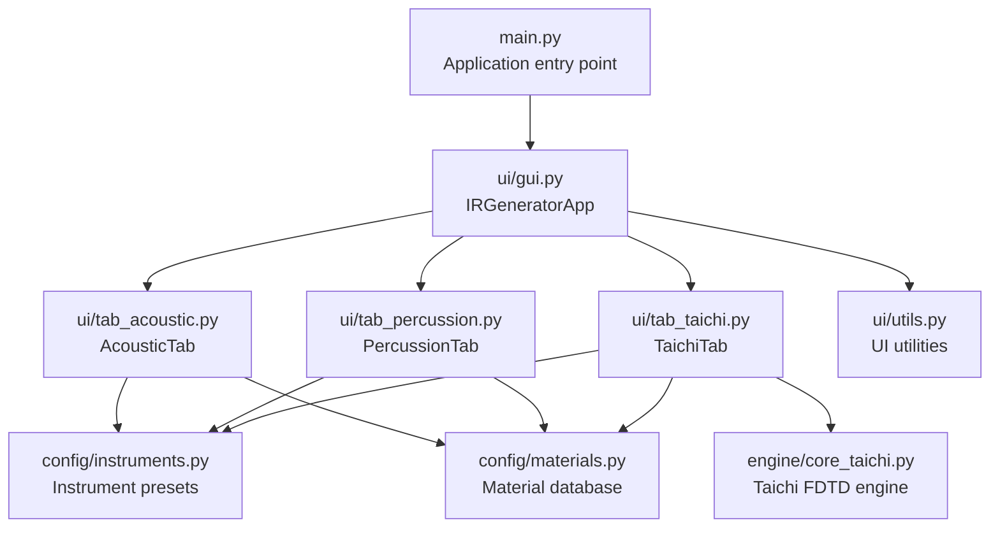
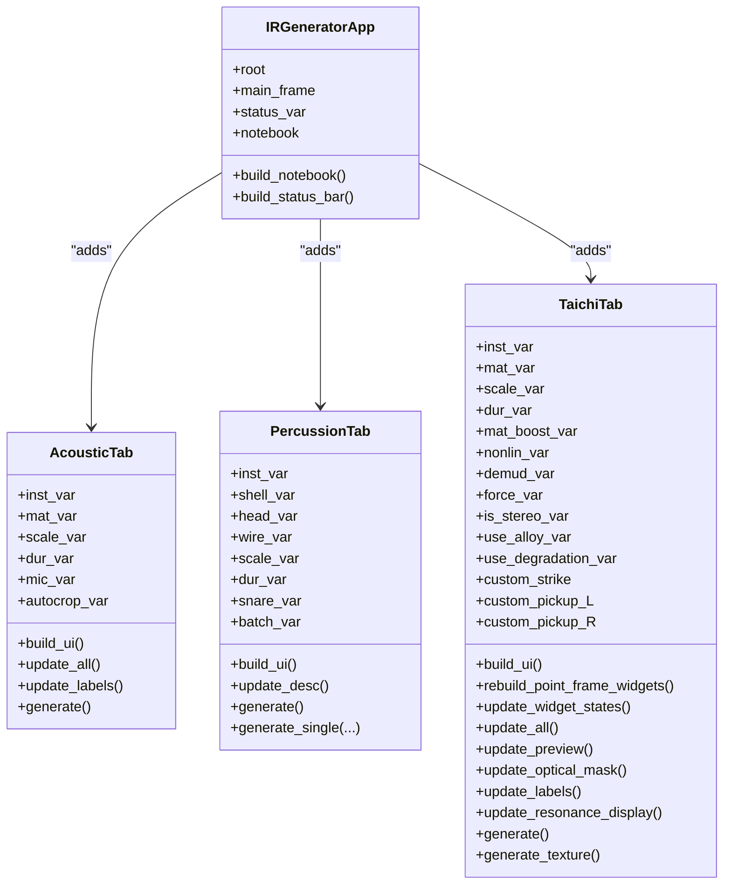
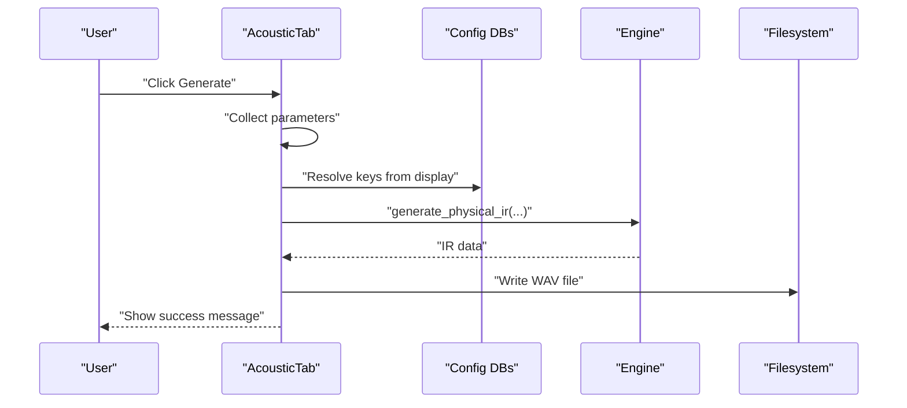
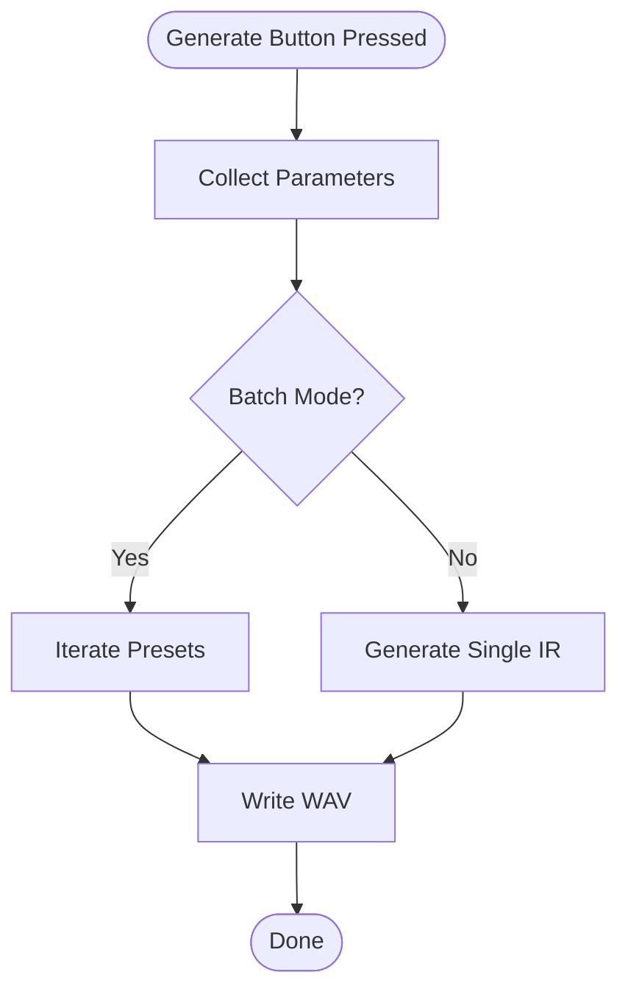
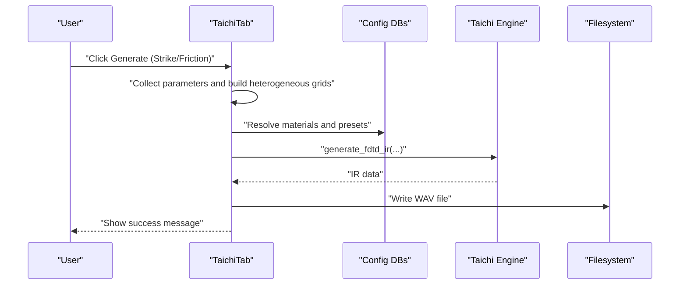
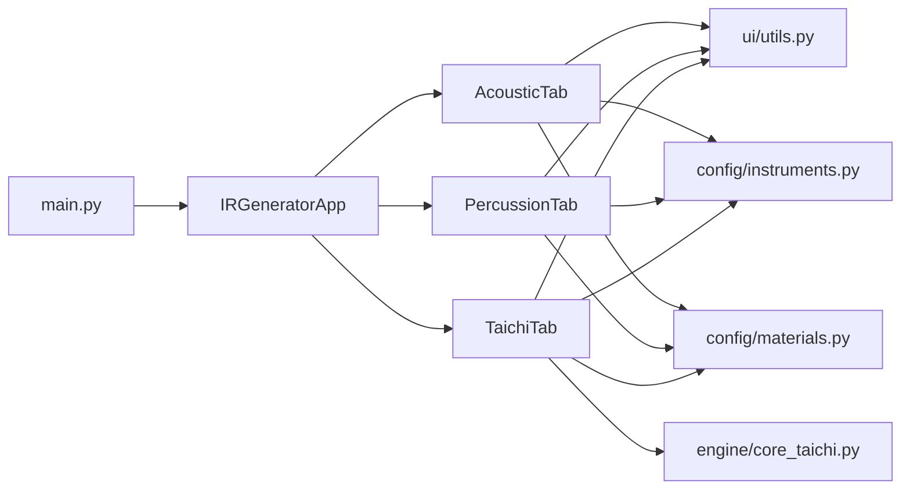

# GUI Component API

<cite>
**Referenced Files in This Document**
- [main.py](file://main.py)
- [ui/gui.py](file://ui/gui.py)
- [ui/tab_acoustic.py](file://ui/tab_acoustic.py)
- [ui/tab_percussion.py](file://ui/tab_percussion.py)
- [ui/tab_taichi.py](file://ui/tab_taichi.py)
- [ui/utils.py](file://ui/utils.py)
- [config/instruments.py](file://config/instruments.py)
- [config/materials.py](file://config/materials.py)
- [engine/core_taichi.py](file://engine/core_taichi.py)
- [ui/README_tab_taichi.md](file://ui/README_tab_taichi.md)
</cite>

## Table of Contents
1. [Introduction](#introduction)
2. [Project Structure](#project-structure)
3. [Core Components](#core-components)
4. [Architecture Overview](#architecture-overview)
5. [Detailed Component Analysis](#detailed-component-analysis)
6. [Dependency Analysis](#dependency-analysis)
7. [Performance Considerations](#performance-considerations)
8. [Troubleshooting Guide](#troubleshooting-guide)
9. [Conclusion](#conclusion)
10. [Appendices](#appendices)

## Introduction
This document describes the GUI component interfaces for the TroakarIR application, focusing on the main application window initialization, tab management, and widget creation patterns. It documents the tab-specific APIs for acoustic simulation controls, percussion physics parameters, and the Taichi FDTD visualization interface. It also covers event handling mechanisms, callback registration systems, data binding patterns, utility functions for parameter validation, real-time preview systems, progress reporting, and integration with the underlying engine APIs. Accessibility considerations and user interaction patterns are addressed throughout.

## Project Structure
The GUI is organized around a central application window that hosts a notebook of tabs. Each tab encapsulates a distinct functional area with its own widgets, event bindings, and data flow. Utility functions support category building and key extraction for consistent UI behavior across tabs.

**Diagram sources**
- [main.py:23-73](file://main.py#L23-L73)
- [ui/gui.py:8-46](file://ui/gui.py#L8-L46)
- [ui/tab_acoustic.py:17-193](file://ui/tab_acoustic.py#L17-L193)
- [ui/tab_percussion.py:17-144](file://ui/tab_percussion.py#L17-L144)
- [ui/tab_taichi.py:38-743](file://ui/tab_taichi.py#L38-L743)
- [ui/utils.py:1-33](file://ui/utils.py#L1-L33)
- [config/instruments.py:1-200](file://config/instruments.py#L1-L200)
- [config/materials.py:1-200](file://config/materials.py#L1-L200)
- [engine/core_taichi.py:1-200](file://engine/core_taichi.py#L1-L200)

**Section sources**
- [main.py:23-73](file://main.py#L23-L73)
- [ui/gui.py:8-46](file://ui/gui.py#L8-L46)

## Core Components
- Application window and layout
  - Root window configuration, sizing, and grid weights
  - Central main frame with padding and grid configuration
  - Status bar with a shared StringVar for status messages
- Tab management
  - Notebook hosting three primary tabs: Acoustic, Percussion, and Taichi FDTD
  - Each tab is a dedicated ttk.Frame subclass with its own UI construction and logic
- Shared utilities
  - Category dictionary builder for comboboxes
  - Key extraction from display strings for consistent parameter resolution

Key implementation references:
- Application window and status bar: [ui/gui.py:8-46](file://ui/gui.py#L8-L46)
- Tab instantiation and notebook population: [ui/gui.py:27-37](file://ui/gui.py#L27-L37)
- Utility functions: [ui/utils.py:1-33](file://ui/utils.py#L1-L33)

**Section sources**
- [ui/gui.py:8-46](file://ui/gui.py#L8-L46)
- [ui/gui.py:27-37](file://ui/gui.py#L27-L37)
- [ui/utils.py:1-33](file://ui/utils.py#L1-L33)

## Architecture Overview
The GUI follows a modular, tabbed architecture. The main application creates a notebook and instantiates tab widgets. Tabs manage their own UI, bind events, and coordinate with configuration databases and engine modules. A shared status variable propagates progress and error messages to the user.

**Diagram sources**
- [ui/gui.py:8-46](file://ui/gui.py#L8-L46)
- [ui/tab_acoustic.py:17-193](file://ui/tab_acoustic.py#L17-L193)
- [ui/tab_percussion.py:17-144](file://ui/tab_percussion.py#L17-L144)
- [ui/tab_taichi.py:38-743](file://ui/tab_taichi.py#L38-L743)

## Detailed Component Analysis

### Main Application Window (IRGeneratorApp)
Responsibilities:
- Initialize root window with title, geometry, and minimum size
- Configure grid weights for responsive layout
- Create central main frame and status bar
- Build notebook and attach tabs
- Share a single status StringVar across tabs for unified messaging

Key behaviors:
- Grid configuration ensures the main frame expands with the window
- Status bar displays a shared status variable updated by tabs
- Tabs receive the status variable to report progress and errors

Implementation references:
- Window and layout: [ui/gui.py:9-21](file://ui/gui.py#L9-L21)
- Status bar: [ui/gui.py:39-46](file://ui/gui.py#L39-L46)
- Notebook and tabs: [ui/gui.py:27-37](file://ui/gui.py#L27-L37)

**Section sources**
- [ui/gui.py:9-21](file://ui/gui.py#L9-L21)
- [ui/gui.py:39-46](file://ui/gui.py#L39-L46)
- [ui/gui.py:27-37](file://ui/gui.py#L27-L37)

### Acoustic Simulation Tab (AcousticTab)
Purpose:
- Provide controls for acoustic impulse response generation
- Allow selection of instrument presets, materials, and geometry scaling
- Offer real-time label updates and automatic cropping

UI elements:
- Instrument and material comboboxes with category dictionaries
- Scale slider for geometry/size
- Duration slider for maximum tail length
- Microphone distance slider
- Auto-crop checkbox
- Generate button

Event handling and callbacks:
- Combobox selection triggers update_all() to refresh descriptions and labels
- Slider commands update labels dynamically
- Generate button starts a background thread to compute IR and write WAV

Real-time preview and validation:
- update_labels() computes derived values (size, duration, microphone distance)
- Auto-crop logic trims silence below a threshold with padding and fade-out

Integration with engine:
- Calls physical IR generator with selected parameters
- Writes WAV file with 44.1 kHz sample rate

Implementation references:
- UI construction: [ui/tab_acoustic.py:24-76](file://ui/tab_acoustic.py#L24-L76)
- Description updates: [ui/tab_acoustic.py:82-86](file://ui/tab_acoustic.py#L82-L86)
- Label updates: [ui/tab_acoustic.py:88-123](file://ui/tab_acoustic.py#L88-L123)
- Generation workflow: [ui/tab_acoustic.py:126-192](file://ui/tab_acoustic.py#L126-L192)

**Diagram sources**
- [ui/tab_acoustic.py:126-192](file://ui/tab_acoustic.py#L126-L192)
- [config/instruments.py:187-200](file://config/instruments.py#L187-L200)
- [config/materials.py:18-200](file://config/materials.py#L18-L200)

**Section sources**
- [ui/tab_acoustic.py:24-76](file://ui/tab_acoustic.py#L24-L76)
- [ui/tab_acoustic.py:88-123](file://ui/tab_acoustic.py#L88-L123)
- [ui/tab_acoustic.py:126-192](file://ui/tab_acoustic.py#L126-L192)

### Percussion Physics Tab (PercussionTab)
Purpose:
- Provide controls for drum and percussion impulse response generation
- Allow selection of instrument, shell/head/wire materials, and geometry scaling
- Enable batch export and optional snare rattle addition

UI elements:
- Instrument, shell, head, wire material comboboxes
- Size and reverberation sliders
- Snare rattle checkbox
- Batch export checkbox
- Generate button

Event handling and callbacks:
- Combobox selection updates instrument description
- Generate button starts a background thread
- Supports single or batch generation modes

Integration with engine:
- Calls drum IR generator with selected materials and parameters
- Writes WAV files to a chosen directory

Implementation references:
- UI construction: [ui/tab_percussion.py:24-74](file://ui/tab_percussion.py#L24-L74)
- Description update: [ui/tab_percussion.py:76-78](file://ui/tab_percussion.py#L76-L78)
- Generation workflow: [ui/tab_percussion.py:80-114](file://ui/tab_percussion.py#L80-L114)
- Single generation: [ui/tab_percussion.py:116-142](file://ui/tab_percussion.py#L116-L142)

**Diagram sources**
- [ui/tab_percussion.py:80-114](file://ui/tab_percussion.py#L80-L114)
- [ui/tab_percussion.py:116-142](file://ui/tab_percussion.py#L116-L142)

**Section sources**
- [ui/tab_percussion.py:24-74](file://ui/tab_percussion.py#L24-L74)
- [ui/tab_percussion.py:76-78](file://ui/tab_percussion.py#L76-L78)
- [ui/tab_percussion.py:80-114](file://ui/tab_percussion.py#L80-L114)
- [ui/tab_percussion.py:116-142](file://ui/tab_percussion.py#L116-L142)

### Taichi FDTD Visualization Tab (TaichiTab)
Purpose:
- Provide advanced controls for FDTD-based impulse response generation
- Visualize instrument masks and optical masks
- Allow interactive placement of strike and pickup points
- Control material blending, nonlinearity, de-mud, and rendering options

UI structure:
- Left panel: instrument/material selection, geometry scaling, render duration, material detail boost, nonlinearity, de-mud, force, resonance targets, and two generation buttons
- Right panel: drawing canvas for strike/pickup visualization, optical mask canvas, experiment options (True Stereo, Degradation, Alloy), and a texture synthesis button
- Dynamic point frame widgets switch between mono and stereo sensor placement

Event handling and callbacks:
- trace_add on Boolean and Double variables to update UI state and previews
- Canvas click handler to set custom strike/pickup points
- Resonance target entries bound to Enter key for live tuning
- Generate buttons trigger asynchronous tasks with progress reporting

Real-time preview system:
- update_preview() renders a mask with strike and pickup markers
- update_optical_mask() builds heterogeneous grids and renders RGB map
- update_labels() updates descriptive text and numeric labels
- update_resonance_display() computes and displays resonance frequencies

Integration with engine:
- Uses Taichi kernels for FDTD simulation
- Supports both strike and friction modes
- Writes WAV files with configurable parameters

Implementation references:
- Initialization and UI: [ui/tab_taichi.py:38-279](file://ui/tab_taichi.py#L38-L279)
- Point frame rebuild: [ui/tab_taichi.py:280-300](file://ui/tab_taichi.py#L280-L300)
- Widget state updates: [ui/tab_taichi.py:301-322](file://ui/tab_taichi.py#L301-L322)
- Canvas interaction: [ui/tab_taichi.py:333-344](file://ui/tab_taichi.py#L333-L344)
- Preview updates: [ui/tab_taichi.py:350-436](file://ui/tab_taichi.py#L350-L436)
- Label updates: [ui/tab_taichi.py:437-486](file://ui/tab_taichi.py#L437-L486)
- Resonance display: [ui/tab_taichi.py:503-574](file://ui/tab_taichi.py#L503-L574)
- Generation: [ui/tab_taichi.py:622-680](file://ui/tab_taichi.py#L622-L680)
- Texture generation: [ui/tab_taichi.py:681-742](file://ui/tab_taichi.py#L681-L742)

**Diagram sources**
- [ui/tab_taichi.py:622-680](file://ui/tab_taichi.py#L622-L680)
- [engine/core_taichi.py:1-200](file://engine/core_taichi.py#L1-L200)
- [config/instruments.py:1-200](file://config/instruments.py#L1-L200)
- [config/materials.py:1-200](file://config/materials.py#L1-L200)

**Section sources**
- [ui/tab_taichi.py:38-279](file://ui/tab_taichi.py#L38-L279)
- [ui/tab_taichi.py:350-436](file://ui/tab_taichi.py#L350-L436)
- [ui/tab_taichi.py:437-486](file://ui/tab_taichi.py#L437-L486)
- [ui/tab_taichi.py:503-574](file://ui/tab_taichi.py#L503-L574)
- [ui/tab_taichi.py:622-680](file://ui/tab_taichi.py#L622-L680)
- [ui/tab_taichi.py:681-742](file://ui/tab_taichi.py#L681-L742)

### Utility Functions (ui/utils.py)
Purpose:
- Build category dictionaries for comboboxes from configuration databases
- Format material display strings
- Extract keys from display strings for parameter resolution

Key functions:
- build_category_dict(db, cat_ref): organizes presets by category
- format_material_display(key, db): formats "Name [key]"
- format_material_list(db): formats list for combobox
- extract_key_from_display(display_str): extracts key from "Name [key]"

Implementation references:
- Category builder: [ui/utils.py:2-13](file://ui/utils.py#L2-L13)
- Material formatters: [ui/utils.py:16-24](file://ui/utils.py#L16-L24)
- Key extractor: [ui/utils.py:27-31](file://ui/utils.py#L27-L31)

**Section sources**
- [ui/utils.py:2-13](file://ui/utils.py#L2-L13)
- [ui/utils.py:16-24](file://ui/utils.py#L16-L24)
- [ui/utils.py:27-31](file://ui/utils.py#L27-L31)

## Dependency Analysis
The GUI components depend on configuration databases and engine modules. Tabs rely on shared utilities for consistent parameter handling. The main entry point discovers and mounts DLC tabs dynamically.

**Diagram sources**
- [main.py:23-73](file://main.py#L23-L73)
- [ui/gui.py:8-46](file://ui/gui.py#L8-L46)
- [ui/utils.py:1-33](file://ui/utils.py#L1-L33)
- [config/instruments.py:1-200](file://config/instruments.py#L1-L200)
- [config/materials.py:1-200](file://config/materials.py#L1-L200)
- [engine/core_taichi.py:1-200](file://engine/core_taichi.py#L1-L200)

**Section sources**
- [main.py:23-73](file://main.py#L23-L73)
- [ui/gui.py:8-46](file://ui/gui.py#L8-L46)

## Performance Considerations
- Asynchronous generation: All heavy computations run in background threads to keep the UI responsive. Tabs use after(0, ...) to update the status bar safely from worker threads.
- Real-time preview: TaichiTab updates canvases and labels efficiently during parameter changes. Use trace_add judiciously to avoid excessive recomputation.
- Memory footprint: Taichi engine initializes fields up to a fixed maximum grid size. Large render durations increase computation time and memory usage.
- File I/O: WAV writing occurs on the main thread after completion to prevent race conditions.

[No sources needed since this section provides general guidance]

## Troubleshooting Guide
Common issues and resolutions:
- No Notebook found for DLC mounting: The main entry point scans the widget tree and attributes to locate the notebook. If not found, logging reports a critical error. Ensure the application window is fully built before attempting to mount DLC tabs.
- Generation failures: Tabs catch exceptions during generation and update the status variable and show error dialogs. Check logs for detailed error messages.
- Parameter resolution: Ensure keys extracted from display strings match configuration databases. Use the provided extract_key_from_display utility consistently.
- Taichi initialization: The engine initializes Taichi runtime if not ready. If rendering fails, verify Taichi installation and GPU/CPU availability.

Implementation references:
- Notebook discovery and DLC mounting: [main.py:8-73](file://main.py#L8-L73)
- Error handling in tabs: [ui/tab_acoustic.py:187-190](file://ui/tab_acoustic.py#L187-L190), [ui/tab_percussion.py:109-112](file://ui/tab_percussion.py#L109-L112), [ui/tab_taichi.py:677-742](file://ui/tab_taichi.py#L677-L742)

**Section sources**
- [main.py:8-73](file://main.py#L8-L73)
- [ui/tab_acoustic.py:187-190](file://ui/tab_acoustic.py#L187-L190)
- [ui/tab_percussion.py:109-112](file://ui/tab_percussion.py#L109-L112)
- [ui/tab_taichi.py:677-742](file://ui/tab_taichi.py#L677-L742)

## Conclusion
The TroakarIR GUI provides a modular, event-driven interface for acoustic and percussion impulse response generation, with a powerful Taichi FDTD visualization tab. Tabs share a common status variable, use consistent utilities for parameter handling, and integrate with configuration databases and engine modules. The architecture supports real-time previews, dynamic UI updates, and robust error handling, enabling both novice and advanced users to explore physical modeling with intuitive controls.

[No sources needed since this section summarizes without analyzing specific files]

## Appendices

### API Reference Index
- Application window
  - IRGeneratorApp: [ui/gui.py:8-46](file://ui/gui.py#L8-L46)
- Acoustic tab
  - AcousticTab: [ui/tab_acoustic.py:17-193](file://ui/tab_acoustic.py#L17-L193)
- Percussion tab
  - PercussionTab: [ui/tab_percussion.py:17-144](file://ui/tab_percussion.py#L17-L144)
- Taichi FDTD tab
  - TaichiTab: [ui/tab_taichi.py:38-743](file://ui/tab_taichi.py#L38-L743)
- Utilities
  - build_category_dict, format_material_display, format_material_list, extract_key_from_display: [ui/utils.py:1-33](file://ui/utils.py#L1-L33)
- Configuration
  - Instruments: [config/instruments.py:1-200](file://config/instruments.py#L1-L200)
  - Materials: [config/materials.py:1-200](file://config/materials.py#L1-L200)
- Engine
  - Taichi FDTD: [engine/core_taichi.py:1-200](file://engine/core_taichi.py#L1-L200)
- Documentation
  - Taichi FDTD guide: [ui/README_tab_taichi.md:1-119](file://ui/README_tab_taichi.md#L1-L119)