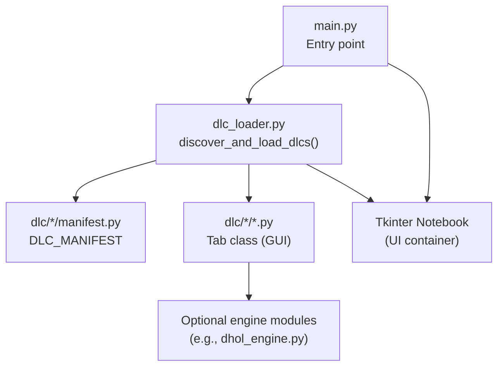
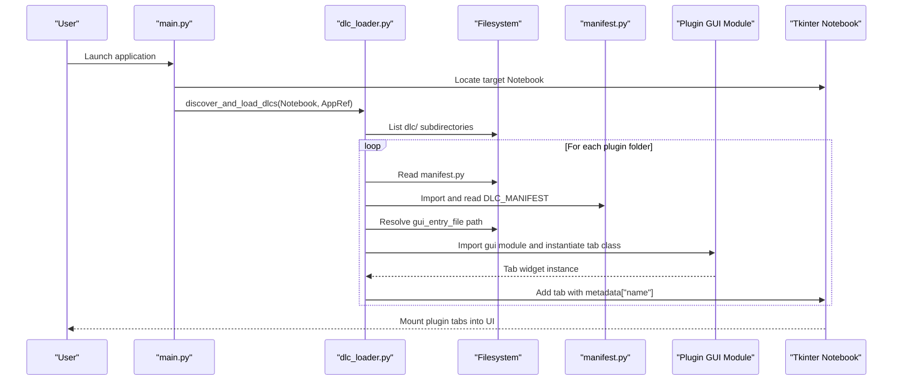
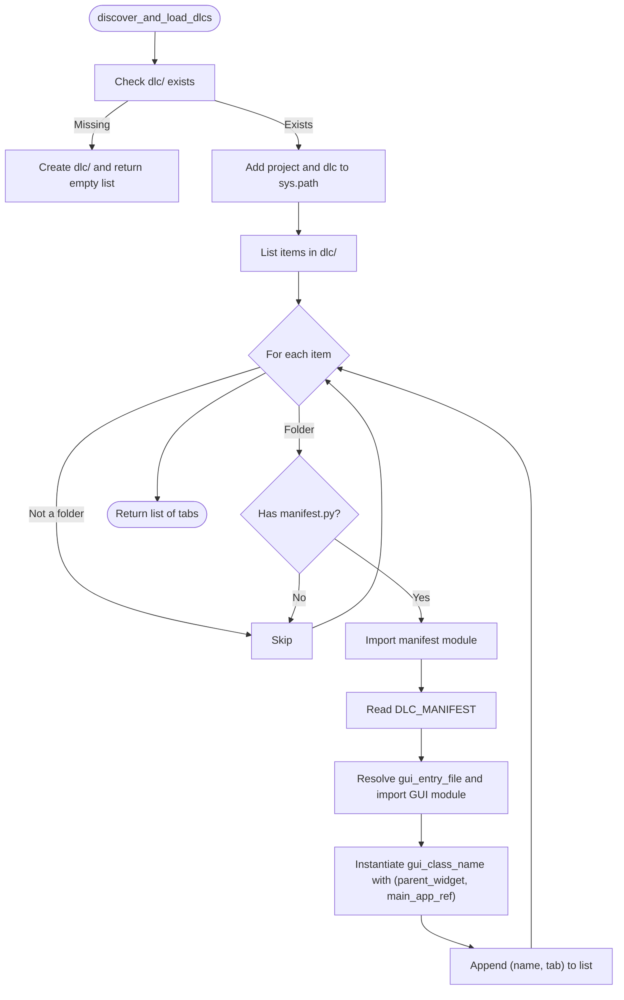
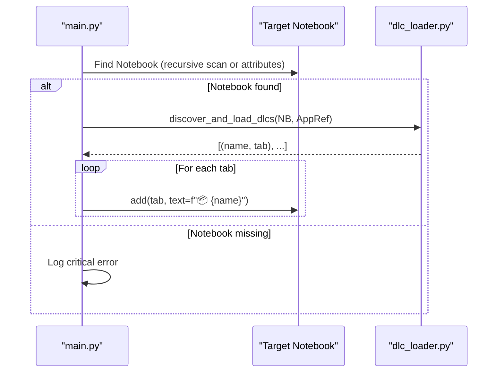
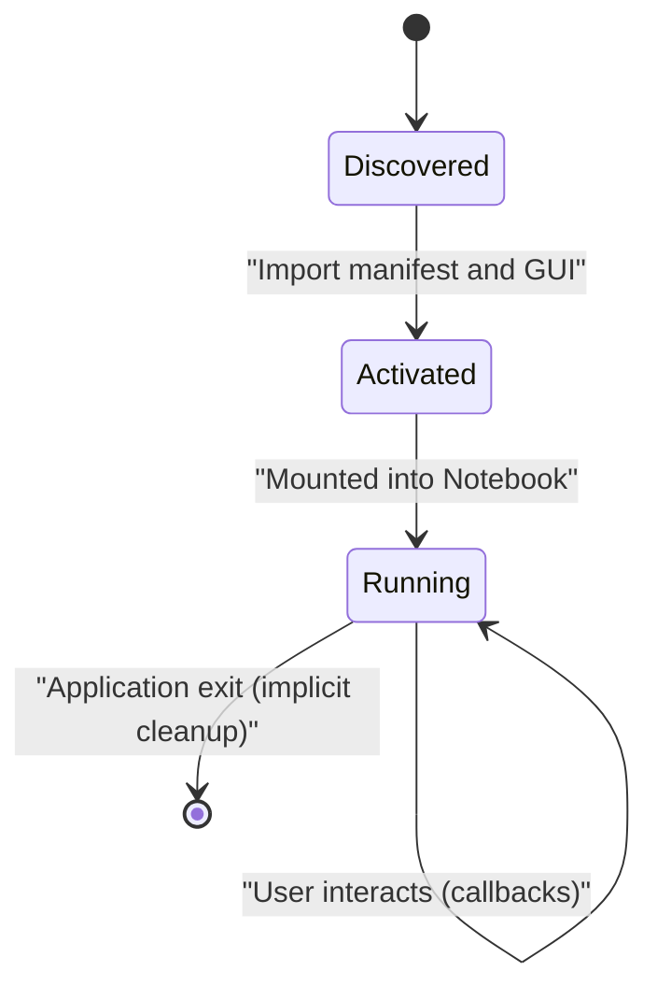
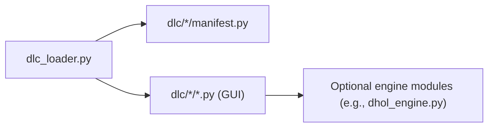

# Plugin Interface API

<cite>
**Referenced Files in This Document**
- [dlc_loader.py](file://dlc_loader.py)
- [main.py](file://main.py)
- [drums/manifest.py](file://dlc/drums/manifest.py)
- [darbuka/manifest.py](file://dlc/darbuka/manifest.py)
- [dhol/manifest.py](file://dlc/dhol/manifest.py)
- [spectral_resynth/manifest.py](file://dlc/spectral_resynth/manifest.py)
- [drums/drums_gui.py](file://dlc/drums/drums_gui.py)
- [darbuka/darbuka_gui.py](file://dlc/darbuka/darbuka_gui.py)
- [dhol/dhol_gui.py](file://dlc/dhol/dhol_gui.py)
- [spectral_resynth/gui.py](file://dlc/spectral_resynth/gui.py)
- [dhol_engine.py](file://dhol_engine.py)
</cite>

## Table of Contents
1. [Introduction](#introduction)
2. [Project Structure](#project-structure)
3. [Core Components](#core-components)
4. [Architecture Overview](#architecture-overview)
5. [Detailed Component Analysis](#detailed-component-analysis)
6. [Dependency Analysis](#dependency-analysis)
7. [Performance Considerations](#performance-considerations)
8. [Troubleshooting Guide](#troubleshooting-guide)
9. [Conclusion](#conclusion)
10. [Appendices](#appendices)

## Introduction
This document describes the plugin system interfaces used by TroakarIR’s DLC loader and plugin tabs. It covers:
- Manifest structure requirements for plugin metadata, load order, and dependencies
- Dynamic plugin loading and initialization via dlc_loader.py
- Plugin registration and mounting into the main application UI
- Callback systems and inter-plugin communication patterns
- Lifecycle from discovery to activation, including resource management and cleanup
- Examples of manifest configurations, plugin development templates, and integration testing approaches
- Security, isolation, and compatibility considerations

## Project Structure
The plugin system centers around a dlc/ directory containing individual plugins. Each plugin exposes:
- A manifest.py defining metadata and entry points
- A GUI module implementing a tab class that inherits from a Tkinter notebook/tab container
- Optional engine modules implementing synthesis or processing logic

Key runtime integration occurs in main.py, which discovers and mounts plugin tabs into the main application UI.

**Diagram sources**
- [main.py:23-73](file://main.py#L23-L73)
- [dlc_loader.py:9-62](file://dlc_loader.py#L9-L62)

**Section sources**
- [main.py:1-76](file://main.py#L1-L76)
- [dlc_loader.py:1-62](file://dlc_loader.py#L1-L62)

## Core Components
- Manifest definition: Each plugin defines a single dictionary constant that declares metadata and entry points.
- Loader: Discovers plugin directories, loads manifests, imports GUI modules, instantiates tab classes, and mounts them into the UI.
- Tab interface: Each plugin tab is a class that accepts a parent widget and a main application reference, and returns a tabbed container for mounting.
- Engine modules: Optional modules providing synthesis or processing functions used by plugin tabs.

**Section sources**
- [dlc_loader.py:9-62](file://dlc_loader.py#L9-L62)
- [drums/manifest.py:1-8](file://dlc/drums/manifest.py#L1-L8)
- [darbuka/manifest.py:1-9](file://dlc/darbuka/manifest.py#L1-L9)
- [dhol/manifest.py:1-9](file://dlc/dhol/manifest.py#L1-L9)
- [spectral_resynth/manifest.py:1-8](file://dlc/spectral_resynth/manifest.py#L1-L8)
- [drums/drums_gui.py:15-334](file://dlc/drums/drums_gui.py#L15-L334)
- [darbuka/darbuka_gui.py:162-427](file://dlc/darbuka/darbuka_gui.py#L162-L427)
- [dhol/dhol_gui.py:16-747](file://dlc/dhol/dhol_gui.py#L16-L747)
- [spectral_resynth/gui.py:11-181](file://dlc/spectral_resynth/gui.py#L11-L181)

## Architecture Overview
The plugin architecture follows a dynamic discovery and mount pattern:
- main.py initializes the UI and locates the target Notebook container
- dlc_loader.py scans the dlc/ directory, imports each plugin’s manifest, and dynamically imports the GUI module
- The loader constructs the tab class and appends it to the Notebook with a descriptive label

**Diagram sources**
- [main.py:23-73](file://main.py#L23-L73)
- [dlc_loader.py:9-62](file://dlc_loader.py#L9-L62)

## Detailed Component Analysis

### Manifest Definition API
Each plugin must provide a manifest.py exporting a single dictionary constant named DLC_MANIFEST with the following keys:
- name: Human-readable plugin name
- version: Semantic version string
- author: Author or organization
- description: Short description of the plugin
- gui_entry_file: Name of the Python file containing the tab class
- gui_class_name: Name of the tab class to instantiate

Example manifests:
- [drums/manifest.py:1-8](file://dlc/drums/manifest.py#L1-L8)
- [darbuka/manifest.py:1-9](file://dlc/darbuka/manifest.py#L1-L9)
- [dhol/manifest.py:1-9](file://dlc/dhol/manifest.py#L1-L9)
- [spectral_resynth/manifest.py:1-8](file://dlc/spectral_resynth/manifest.py#L1-L8)

Notes:
- No explicit load order or dependency fields are defined in the manifests.
- Dependencies are implicit via Python imports inside the GUI module.

**Section sources**
- [drums/manifest.py:1-8](file://dlc/drums/manifest.py#L1-L8)
- [darbuka/manifest.py:1-9](file://dlc/darbuka/manifest.py#L1-L9)
- [dhol/manifest.py:1-9](file://dlc/dhol/manifest.py#L1-L9)
- [spectral_resynth/manifest.py:1-8](file://dlc/spectral_resynth/manifest.py#L1-L8)

### Dynamic Loading and Initialization
The loader performs:
- Directory scanning under dlc/
- Dynamic import of manifest.py to read metadata
- Dynamic import of the GUI module and instantiation of the tab class
- Mounting the resulting tab into the main Notebook

Key behaviors:
- Uses importlib.util.spec_from_file_location and module_from_spec for safe dynamic imports
- Logs discovery and errors during import
- Ensures sys.path includes project and plugin directories for imports

**Diagram sources**
- [dlc_loader.py:9-62](file://dlc_loader.py#L9-L62)

**Section sources**
- [dlc_loader.py:9-62](file://dlc_loader.py#L9-L62)

### Plugin Registration and UI Mounting
- main.py finds the target Notebook container either by traversing widget tree or inspecting the main app object
- Calls discover_and_load_dlcs and adds each returned tab to the Notebook with a labeled text
- Error logging is performed if mounting fails or if no Notebook is found

**Diagram sources**
- [main.py:8-73](file://main.py#L8-L73)

**Section sources**
- [main.py:8-73](file://main.py#L8-L73)

### Tab Class Interfaces and Callback Patterns
Each plugin tab class must:
- Accept two constructor arguments: parent widget and main application reference
- Provide a tabbed container (e.g., a ttk.Notebook or ttk.Frame) that holds controls and outputs
- Expose callbacks for rendering or processing (e.g., step callbacks passed to synthesis functions)

Representative implementations:
- Drums tab: [drums/drums_gui.py:15-334](file://dlc/drums/drums_gui.py#L15-L334)
- Darbuka tab: [darbuka/darbuka_gui.py:162-427](file://dlc/darbuka/darbuka_gui.py#L162-L427)
- Dhol tab: [dhol/dhol_gui.py:16-747](file://dlc/dhol/dhol_gui.py#L16-L747)
- Spectral resynthesis tab: [spectral_resynth/gui.py:11-181](file://dlc/spectral_resynth/gui.py#L11-L181)

Callback patterns observed:
- Rendering functions accept a yield callback receiving progress steps
- Tabs update progress bars and handle abort signals via flags
- Exceptions are caught and surfaced to the user via message boxes

**Section sources**
- [drums/drums_gui.py:15-334](file://dlc/drums/drums_gui.py#L15-L334)
- [darbuka/darbuka_gui.py:162-427](file://dlc/darbuka/darbuka_gui.py#L162-L427)
- [dhol/dhol_gui.py:16-747](file://dlc/dhol/dhol_gui.py#L16-L747)
- [spectral_resynth/gui.py:11-181](file://dlc/spectral_resynth/gui.py#L11-L181)

### Inter-Plugin Communication Patterns
- Plugins are isolated at the module level; no explicit inter-plugin registry is present
- Communication can occur via shared application references passed to plugin constructors
- Example: Dhol tab inspects the main app for grid-related settings by iterating attributes and reading values

**Section sources**
- [dhol/dhol_gui.py:609-621](file://dlc/dhol/dhol_gui.py#L609-L621)

### Plugin Lifecycle: Discovery to Activation
- Discovery: Loader scans dlc/ and imports manifests
- Activation: Loader imports GUI modules and instantiates tab classes
- Runtime: Tabs expose interactive controls and callbacks; synthesis functions may use optional engine modules
- Cleanup: No explicit teardown hooks are defined; tabs rely on normal Tkinter widget destruction

[No sources needed since this diagram shows conceptual workflow, not actual code structure]

## Dependency Analysis
- Loader depends on filesystem layout and manifest presence
- GUI modules depend on manifest entries for module and class names
- Optional engine modules are imported by GUI modules when needed (e.g., dhol_engine.py)

**Diagram sources**
- [dlc_loader.py:9-62](file://dlc_loader.py#L9-L62)
- [dhol_engine.py:1-1737](file://dhol_engine.py#L1-L1737)

**Section sources**
- [dlc_loader.py:9-62](file://dlc_loader.py#L9-L62)
- [dhol_engine.py:1-1737](file://dhol_engine.py#L1-L1737)

## Performance Considerations
- GPU acceleration: Engine modules initialize Taichi with GPU preference and fall back to CPU if unavailable
- Rendering loops: Tabs implement progress reporting and abort handling to avoid blocking the UI
- Batch processing: Tabs support batch rendering with configurable velocity layers and round-robin counts

Recommendations:
- Keep rendering callbacks lightweight and non-blocking
- Use abort flags to terminate long-running synthesis early
- Prefer batching with reasonable chunk sizes to maintain UI responsiveness

**Section sources**
- [dhol_engine.py:92-115](file://dhol_engine.py#L92-L115)
- [drums/drums_gui.py:157-334](file://dlc/drums/drums_gui.py#L157-L334)
- [darbuka/darbuka_gui.py:324-427](file://dlc/darbuka/darbuka_gui.py#L324-L427)
- [dhol/dhol_gui.py:587-747](file://dlc/dhol/dhol_gui.py#L587-L747)

## Troubleshooting Guide
Common issues and remedies:
- Missing dlc/ directory: Loader creates it automatically and logs creation
- Import failures: Loader catches exceptions and logs detailed error info
- Missing Notebook: main.py logs a critical error if no Notebook is found for mounting
- Aborted renders: Tabs set abort flags and update UI state accordingly

Actions:
- Check troakar_debug.log for loader and plugin-specific logs
- Verify manifest.py exports DLC_MANIFEST and correct gui_entry_file/gui_class_name
- Ensure gui_entry_file resides in the same plugin folder and is importable

**Section sources**
- [dlc_loader.py:18-21](file://dlc_loader.py#L18-L21)
- [dlc_loader.py:59-61](file://dlc_loader.py#L59-L61)
- [main.py:65-71](file://main.py#L65-L71)

## Conclusion
TroakarIR’s plugin system is a straightforward, dynamic loader that supports modular extension of the UI via manifests and tab classes. While manifests define minimal metadata and entry points, the loader and main application orchestrate discovery, import, and mounting. Plugins implement their own callback-driven rendering and can optionally integrate engine modules. For robust operation, ensure manifests are valid, GUI modules are importable, and the main application provides a Notebook for mounting.

## Appendices

### Manifest Configuration Reference
Required keys in DLC_MANIFEST:
- name: String
- version: String
- author: String
- description: String
- gui_entry_file: String (module name)
- gui_class_name: String (class name)

Examples:
- [drums/manifest.py:1-8](file://dlc/drums/manifest.py#L1-L8)
- [darbuka/manifest.py:1-9](file://dlc/darbuka/manifest.py#L1-L9)
- [dhol/manifest.py:1-9](file://dlc/dhol/manifest.py#L1-L9)
- [spectral_resynth/manifest.py:1-8](file://dlc/spectral_resynth/manifest.py#L1-L8)

**Section sources**
- [drums/manifest.py:1-8](file://dlc/drums/manifest.py#L1-L8)
- [darbuka/manifest.py:1-9](file://dlc/darbuka/manifest.py#L1-L9)
- [dhol/manifest.py:1-9](file://dlc/dhol/manifest.py#L1-L9)
- [spectral_resynth/manifest.py:1-8](file://dlc/spectral_resynth/manifest.py#L1-L8)

### Plugin Development Template
Steps to create a new plugin:
1. Create a new folder under dlc/<your_plugin>/
2. Add manifest.py exporting DLC_MANIFEST with required keys
3. Implement a GUI module with a tab class that:
   - Accepts (parent_widget, main_app_ref) in __init__
   - Returns a tabbed container (e.g., ttk.Notebook or ttk.Frame)
4. Optionally add an engine module for synthesis/processing
5. Ensure the manifest.gui_entry_file points to your GUI module and gui_class_name matches your tab class

Reference implementations:
- [drums/drums_gui.py:15-334](file://dlc/drums/drums_gui.py#L15-L334)
- [darbuka/darbuka_gui.py:162-427](file://dlc/darbuka/darbuka_gui.py#L162-L427)
- [dhol/dhol_gui.py:16-747](file://dlc/dhol/dhol_gui.py#L16-L747)
- [spectral_resynth/gui.py:11-181](file://dlc/spectral_resynth/gui.py#L11-L181)

**Section sources**
- [drums/drums_gui.py:15-334](file://dlc/drums/drums_gui.py#L15-L334)
- [darbuka/darbuka_gui.py:162-427](file://dlc/darbuka/darbuka_gui.py#L162-L427)
- [dhol/dhol_gui.py:16-747](file://dlc/dhol/dhol_gui.py#L16-L747)
- [spectral_resynth/gui.py:11-181](file://dlc/spectral_resynth/gui.py#L11-L181)

### Integration Testing Approaches
- Manual verification: Launch main.py and confirm plugin tabs appear in the Notebook
- Logging: Review troakar_debug.log for loader and plugin import messages
- Error simulation: Temporarily corrupt a manifest or remove gui_entry_file to validate error handling paths

**Section sources**
- [main.py:23-73](file://main.py#L23-L73)
- [dlc_loader.py:59-61](file://dlc_loader.py#L59-L61)

### Security and Isolation Considerations
- Dynamic imports: Loader uses importlib.util.spec_from_file_location; ensure dlc/ contains trusted code
- Path injection: Loader inserts project and dlc into sys.path; keep dlc/ clean and controlled
- Resource isolation: Each plugin’s GUI module manages its own resources; no central resource pool is defined

**Section sources**
- [dlc_loader.py:23-27](file://dlc_loader.py#L23-L27)
- [dlc_loader.py:36-49](file://dlc_loader.py#L36-L49)

### Compatibility and Versioning Notes
- Manifest includes a version field; no explicit semantic version checks are enforced by the loader
- Engine modules may evolve independently; ensure GUI modules remain compatible with engine APIs

**Section sources**
- [drums/manifest.py:3](file://dlc/drums/manifest.py#L3)
- [darbuka/manifest.py:4](file://dlc/darbuka/manifest.py#L4)
- [dhol/manifest.py:4](file://dlc/dhol/manifest.py#L4)
- [spectral_resynth/manifest.py:3](file://dlc/spectral_resynth/manifest.py#L3)