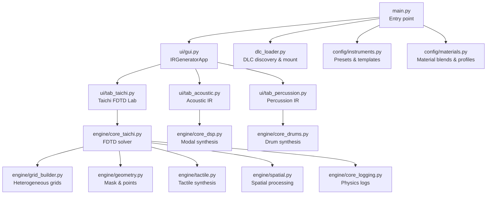
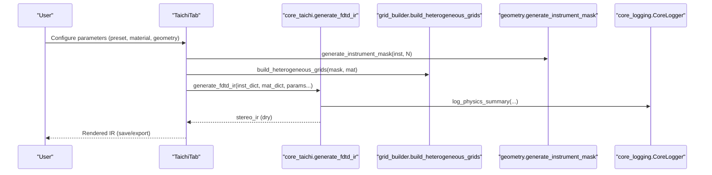
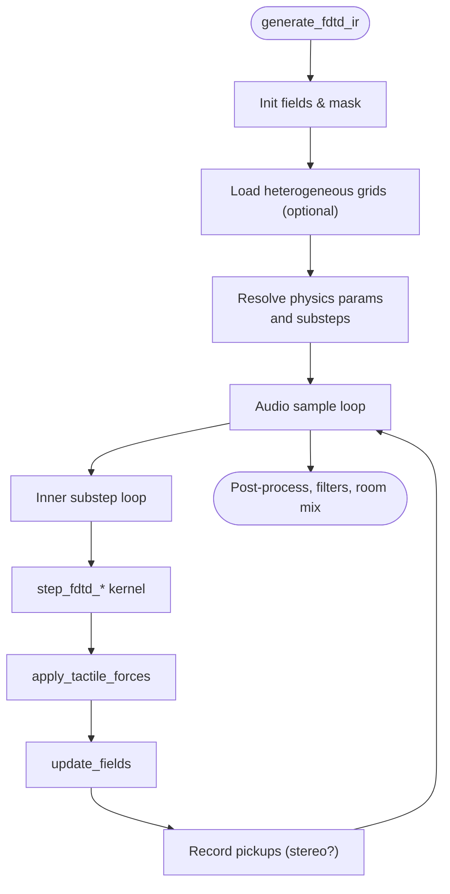
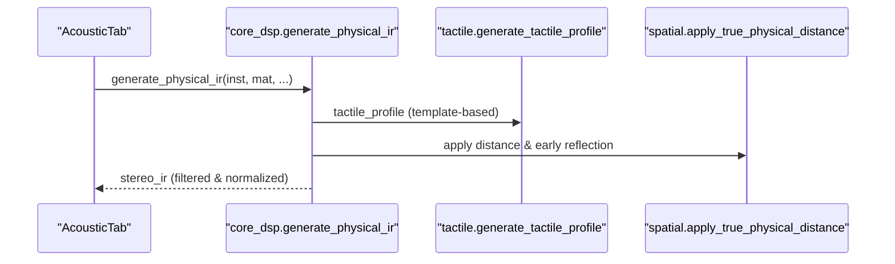
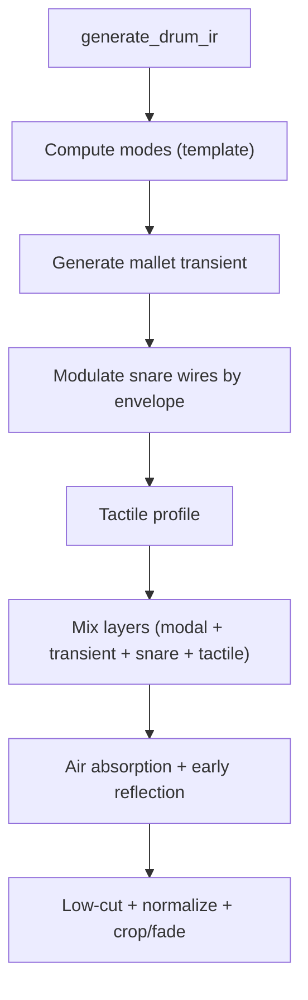
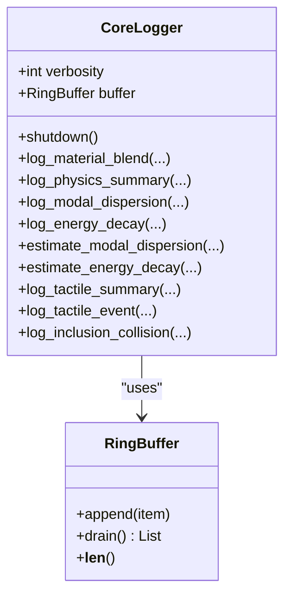
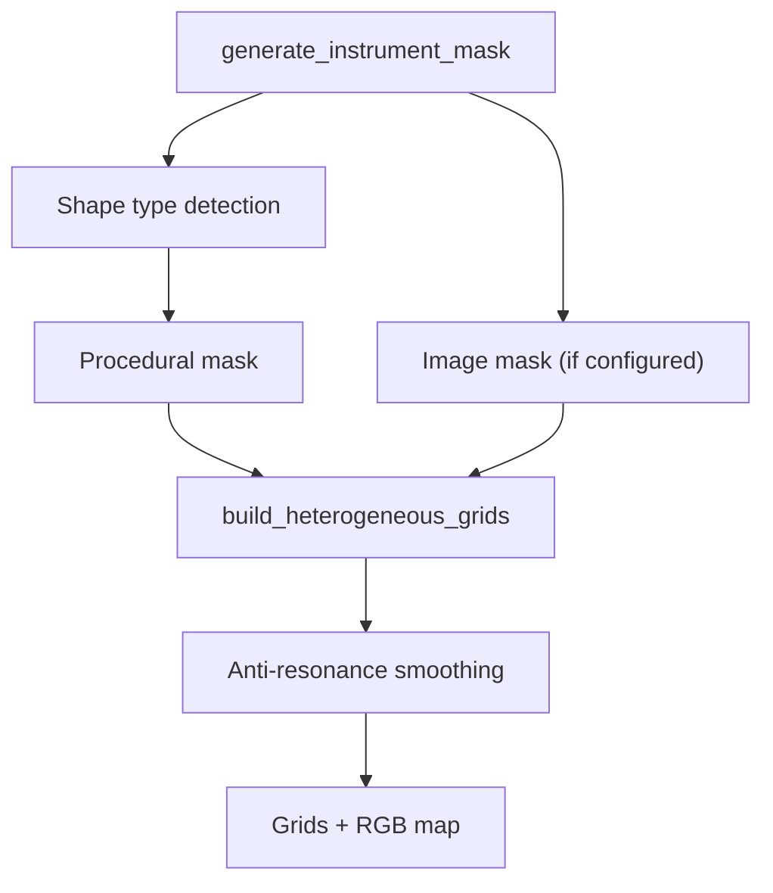
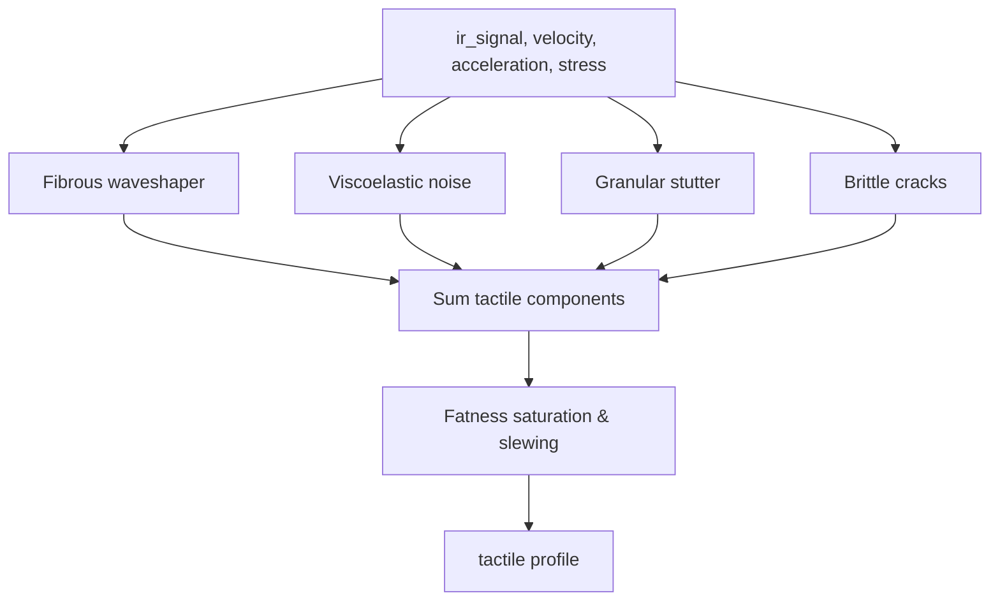
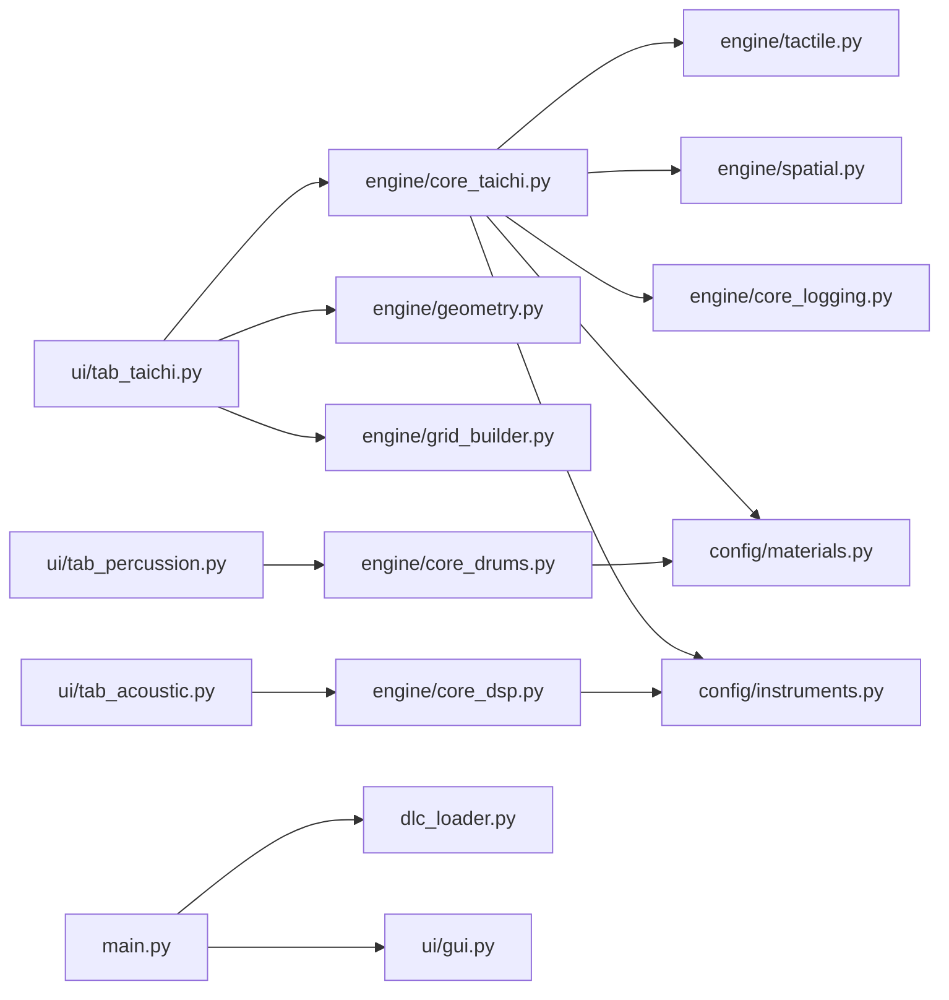

# Advanced Topics

<cite>
**Referenced Files in This Document**
- [main.py](file://main.py)
- [core_taichi.py](file://engine/core_taichi.py)
- [core_logging.py](file://engine/core_logging.py)
- [core_dsp.py](file://engine/core_dsp.py)
- [tactile.py](file://engine/tactile.py)
- [spatial.py](file://engine/spatial.py)
- [geometry.py](file://engine/geometry.py)
- [grid_builder.py](file://engine/grid_builder.py)
- [instruments.py](file://config/instruments.py)
- [materials.py](file://config/materials.py)
- [tab_taichi.py](file://ui/tab_taichi.py)
- [tab_acoustic.py](file://ui/tab_acoustic.py)
- [tab_percussion.py](file://ui/tab_percussion.py)
- [dlc_loader.py](file://dlc_loader.py)
- [core_drums.py](file://engine/core_drums.py)
- [declick_utility.py](file://tools/declick_utility.py)
</cite>

## Table of Contents
1. [Introduction](#introduction)
2. [Project Structure](#project-structure)
3. [Core Components](#core-components)
4. [Architecture Overview](#architecture-overview)
5. [Detailed Component Analysis](#detailed-component-analysis)
6. [Dependency Analysis](#dependency-analysis)
7. [Performance Considerations](#performance-considerations)
8. [Troubleshooting Guide](#troubleshooting-guide)
9. [Conclusion](#conclusion)
10. [Appendices](#appendices)

## Introduction
This document targets advanced users and developers of TroakarIR who require deep insights into performance optimization, advanced simulation parameters, material customization, and integration with external audio workflows. It covers GPU utilization strategies, memory management, computational efficiency, logging and debugging systems, profiling techniques, research and academic use cases, and contribution guidelines for extending the simulation algorithms.

## Project Structure
TroakarIR is organized around modular engines for physical modeling, a GUI built with Tkinter, and configuration-driven presets for instruments and materials. The system supports:
- Taichi-based FDTD simulations for strike and friction textures
- Configurable acoustic impulse generation via modal synthesis
- Percurssion-specific modeling with membrane, shell, and wire interactions
- Spatial and tactile post-processing
- Logging and instrumentation for physics and tactile events
- Extensible DLC plugin system

**Diagram sources**
- [main.py:23-73](file://main.py#L23-L73)
- [tab_taichi.py:614-734](file://ui/tab_taichi.py#L614-L734)
- [tab_acoustic.py:126-192](file://ui/tab_acoustic.py#L126-L192)
- [tab_percussion.py:80-143](file://ui/tab_percussion.py#L80-L143)
- [core_taichi.py:266-716](file://engine/core_taichi.py#L266-L716)
- [grid_builder.py:10-98](file://engine/grid_builder.py#L10-L98)
- [geometry.py:17-120](file://engine/geometry.py#L17-L120)
- [tactile.py:193-250](file://engine/tactile.py#L193-L250)
- [spatial.py:5-61](file://engine/spatial.py#L5-L61)
- [core_logging.py:38-202](file://engine/core_logging.py#L38-L202)
- [core_dsp.py:90-273](file://engine/core_dsp.py#L90-L273)
- [core_drums.py:96-248](file://engine/core_drums.py#L96-L248)
- [dlc_loader.py:9-61](file://dlc_loader.py#L9-L61)
- [instruments.py:4-101](file://config/instruments.py#L4-L101)
- [materials.py:642-766](file://config/materials.py#L642-L766)

**Section sources**
- [main.py:23-73](file://main.py#L23-L73)
- [dlc_loader.py:9-61](file://dlc_loader.py#L9-L61)

## Core Components
- Taichi FDTD engine: GPU-accelerated wave propagation solver with heterogeneous material grids, substepping for stability, tactile forces, and optional GUI visualization.
- Modal synthesis engine: Configurable acoustic IR generation using resonance templates and physical parameters.
- Drum synthesis engine: Membrane, shell, and wire interactions with realistic transient shaping and spatial effects.
- Tactile synthesis: Material-aware friction, granular, fibrous, and brittle effects with dynamic compression and slewing.
- Spatial processing: Distance-dependent filtering, early reflections, and stereo width adjustments.
- Logging and instrumentation: Background JSON/CSV logging of physics summaries, modal dispersion, energy decay, and tactile events.
- Geometry and grid builder: Procedural and image-based masks, heterogeneous material injection, and anti-resonance smoothing.
- UI tabs: Interactive controls for presets, material blending, geometry scaling, and rendering options.

**Section sources**
- [core_taichi.py:43-234](file://engine/core_taichi.py#L43-L234)
- [core_dsp.py:90-273](file://engine/core_dsp.py#L90-L273)
- [core_drums.py:96-248](file://engine/core_drums.py#L96-L248)
- [tactile.py:193-250](file://engine/tactile.py#L193-L250)
- [spatial.py:5-61](file://engine/spatial.py#L5-L61)
- [core_logging.py:38-202](file://engine/core_logging.py#L38-L202)
- [geometry.py:17-120](file://engine/geometry.py#L17-L120)
- [grid_builder.py:10-98](file://engine/grid_builder.py#L10-L98)
- [tab_taichi.py:34-271](file://ui/tab_taichi.py#L34-L271)
- [tab_acoustic.py:17-77](file://ui/tab_acoustic.py#L17-L77)
- [tab_percussion.py:17-75](file://ui/tab_percussion.py#L17-L75)

## Architecture Overview
The system integrates UI-driven parameterization with physics engines. The Taichi FDTD tab orchestrates heterogeneous material grids, strike/friction excitation, and real-time visualization. The acoustic and percussion tabs leverage modal synthesis and drum physics respectively, with optional spatial and tactile post-processing.

**Diagram sources**
- [tab_taichi.py:614-734](file://ui/tab_taichi.py#L614-L734)
- [core_taichi.py:266-716](file://engine/core_taichi.py#L266-L716)
- [grid_builder.py:10-98](file://engine/grid_builder.py#L10-L98)
- [geometry.py:17-120](file://engine/geometry.py#L17-L120)
- [core_logging.py:133-158](file://engine/core_logging.py#L133-L158)

## Detailed Component Analysis

### Taichi FDTD Engine
Key capabilities:
- Kernel-based finite-difference time-domain solver with isotropic/anisotropic elastic propagation
- Heterogeneous material grids with anti-resonance smoothing
- Substepping for numerical stability and CFL compliance
- Tactile forces (fibrous, fluid, granular, brittle) applied on top of wavefield
- Optional GUI visualization and progress feedback
- Room simulation via PyRoomAcoustics for wet IR mixing

**Diagram sources**
- [core_taichi.py:43-234](file://engine/core_taichi.py#L43-L234)
- [core_taichi.py:266-716](file://engine/core_taichi.py#L266-L716)

**Section sources**
- [core_taichi.py:43-234](file://engine/core_taichi.py#L43-L234)
- [core_taichi.py:266-716](file://engine/core_taichi.py#L266-L716)

### Modal Synthesis Engine (Acoustic IR)
Capabilities:
- Resonator templates define modal content and transient characteristics
- Radiation efficiency and coincidence frequency shaping
- Diffuse tail synthesis and transient click shaping
- Wire rattle emulation for snare-like textures
- Spatial distance compensation and early reflection modeling

**Diagram sources**
- [tab_acoustic.py:126-192](file://ui/tab_acoustic.py#L126-L192)
- [core_dsp.py:90-273](file://engine/core_dsp.py#L90-L273)
- [tactile.py:193-250](file://engine/tactile.py#L193-L250)
- [spatial.py:5-61](file://engine/spatial.py#L5-L61)

**Section sources**
- [core_dsp.py:90-273](file://engine/core_dsp.py#L90-L273)
- [tab_acoustic.py:126-192](file://ui/tab_acoustic.py#L126-L192)

### Drum Synthesis Engine
Capabilities:
- Mallet strike modeling with material stiffness and contact dynamics
- Membrane and shell modes with dynamic pitch drop
- Snare wire rattle modulation by membrane envelope
- Air absorption and comb-filter early reflection modeling
- Auto-crop and fade shaping

**Diagram sources**
- [core_drums.py:96-248](file://engine/core_drums.py#L96-L248)

**Section sources**
- [core_drums.py:96-248](file://engine/core_drums.py#L96-L248)

### Logging and Instrumentation
CoreLogger writes JSONL and CSV logs asynchronously with a ring buffer. Events include resolved physics, modal dispersion, energy decay, and tactile summaries. Environment variables control verbosity and output format.

**Diagram sources**
- [core_logging.py:38-202](file://engine/core_logging.py#L38-L202)

**Section sources**
- [core_logging.py:38-202](file://engine/core_logging.py#L38-L202)

### Geometry and Heterogeneous Material Grids
- Procedural masks for various shapes with fallback logic
- Image-based masks with transparency handling
- Heterogeneous grids injection with anti-resonance smoothing
- Material description rendering for UI

**Diagram sources**
- [geometry.py:17-120](file://engine/geometry.py#L17-L120)
- [grid_builder.py:10-98](file://engine/grid_builder.py#L10-L98)

**Section sources**
- [geometry.py:17-120](file://engine/geometry.py#L17-L120)
- [grid_builder.py:10-98](file://engine/grid_builder.py#L10-L98)

### Tactile Synthesis
- Fibrous (wood grain), fluid (viscoelastic), granular (inclusions), brittle (fracture) generators
- Dynamic envelope followers and soft-knee limiting
- Fatness parameter for saturation and slewing
- Pure material noise generator for friction textures

**Diagram sources**
- [tactile.py:46-229](file://engine/tactile.py#L46-L229)

**Section sources**
- [tactile.py:46-229](file://engine/tactile.py#L46-L229)

### Spatial Processing
- Air absorption and proximity effect filters
- Early reflection comb filter
- Stereo width narrowing with distance
- Final normalization and volume balancing

**Section sources**
- [spatial.py:5-61](file://engine/spatial.py#L5-L61)

### Materials and Instruments
- Comprehensive material database with tactile profiles and inclusions
- Blend two materials with interpolation and inclusion merging
- Instrument presets with resonance templates and geometric scaling

**Section sources**
- [materials.py:18-640](file://config/materials.py#L18-L640)
- [materials.py:642-766](file://config/materials.py#L642-L766)
- [instruments.py:4-101](file://config/instruments.py#L4-L101)
- [instruments.py:187-279](file://config/instruments.py#L187-L279)

### DLC Plugin System
- Discovers and loads DLC manifests and GUI entries dynamically
- Mounts DLC tabs into the main notebook

**Section sources**
- [dlc_loader.py:9-61](file://dlc_loader.py#L9-L61)
- [main.py:44-71](file://main.py#L44-L71)

## Dependency Analysis

**Diagram sources**
- [tab_taichi.py:12-14](file://ui/tab_taichi.py#L12-L14)
- [core_taichi.py:10-12](file://engine/core_taichi.py#L10-L12)
- [tab_acoustic.py:14](file://ui/tab_acoustic.py#L14)
- [tab_percussion.py:14](file://ui/tab_percussion.py#L14)
- [main.py:5-6](file://main.py#L5-L6)
- [dlc_loader.py:36-56](file://dlc_loader.py#L36-L56)

**Section sources**
- [tab_taichi.py:12-14](file://ui/tab_taichi.py#L12-L14)
- [core_taichi.py:10-12](file://engine/core_taichi.py#L10-L12)
- [tab_acoustic.py:14](file://ui/tab_acoustic.py#L14)
- [tab_percussion.py:14](file://ui/tab_percussion.py#L14)
- [main.py:5-6](file://main.py#L5-L6)
- [dlc_loader.py:36-56](file://dlc_loader.py#L36-L56)

## Performance Considerations
- GPU utilization strategies
  - Taichi backend acceleration: The FDTD solver runs on GPU via Taichi kernels. Ensure Taichi runtime initialization and device availability. Use appropriate grid sizes and substepping to balance accuracy and speed.
  - Visualization overhead: Disabling GUI (`show_gui=False`) reduces rendering overhead for headless environments.
  - Memory footprint: Limit grid size to N_MAX and pad arrays efficiently to avoid fragmentation.

- Memory management best practices
  - Pre-allocate fields and reuse buffers; pad arrays to N_MAX consistently.
  - Use float32 for grids and intermediate arrays to reduce memory usage.
  - Avoid repeated allocations inside tight loops; keep arrays contiguous.

- Computational efficiency improvements
  - Automatic substepping: The engine computes required substeps per sample to satisfy CFL stability, preventing unnecessary work while maintaining accuracy.
  - Anti-resonance smoothing: Gaussian smoothing of material parameters reduces numerical artifacts and improves stability.
  - Selective logging: Control verbosity via environment variables to minimize I/O overhead during batch processing.

- Practical tips
  - Batch export: Use UI batch modes for percussion to generate multiple IRs efficiently.
  - Declick utility: Apply the declick utility to remove high-frequency artifacts post-rendering.

**Section sources**
- [core_taichi.py:22-33](file://engine/core_taichi.py#L22-L33)
- [core_taichi.py:323-332](file://engine/core_taichi.py#L323-L332)
- [grid_builder.py:63-82](file://engine/grid_builder.py#L63-L82)
- [core_logging.py:15-17](file://engine/core_logging.py#L15-L17)
- [tab_percussion.py:80-143](file://ui/tab_percussion.py#L80-L143)
- [declick_utility.py:31-99](file://tools/declick_utility.py#L31-L99)

## Troubleshooting Guide
- Logging and debugging
  - Enable verbose logging via environment variables for CoreLogger and configure JSON/CSV output paths.
  - Inspect physics summaries, modal dispersion, and energy decay estimates to diagnose material or template mismatches.
  - Use tactile event logs for fine-grained analysis of micro-events.

- Error analysis methodologies
  - Review Taichi kernel errors and boundary conditions (mask-based propagation).
  - Validate material blends and inclusion densities; ensure ratios are within supported ranges.
  - Confirm instrument templates match intended geometry and body depth.

- Performance profiling techniques
  - Measure render time per preset and grid size; compare with substepping counts.
  - Profile tactile synthesis separately to isolate CPU-bound bottlenecks.
  - Use declick utility to identify and quantify high-frequency artifacts.

- Common issues and resolutions
  - No Notebook found: Ensure UI initialization completes before DLC mounting; check widget tree traversal logic.
  - Silent or truncated IRs: Verify low-cut filters and auto-crop thresholds; adjust duration and sample rate.
  - Excessive noise or clicks: Reduce de-mud strength, adjust tactile parameters, or apply declick utility.

**Section sources**
- [core_logging.py:15-17](file://engine/core_logging.py#L15-L17)
- [main.py:44-71](file://main.py#L44-L71)
- [tab_acoustic.py:149-192](file://ui/tab_acoustic.py#L149-L192)
- [declick_utility.py:152-221](file://tools/declick_utility.py#L152-L221)

## Conclusion
TroakarIR provides a robust, GPU-accelerated pipeline for generating high-fidelity impulse responses across acoustic, percussion, and custom FDTD scenarios. Advanced users can tune material properties, explore heterogeneous grids, and integrate post-processing chains for professional-grade results. The logging and instrumentation systems support reproducible research and iterative refinement.

## Appendices

### Research Applications and Academic Use Cases
- Material characterization: Use heterogeneous grids and tactile synthesis to emulate composite materials and inclusions.
- Acoustic research: Investigate modal dispersion and energy decay under varying geometries and boundary conditions.
- Educational demonstrations: Visualize wave propagation and tactile effects in interactive labs.

### Contribution Guidelines for Extending Simulation Algorithms
- Add new instrument templates: Define a new template in instruments configuration with a modes_builder and default material.
- Extend materials: Introduce new material entries with tactile profiles and inclusions; implement blending logic if needed.
- Custom FDTD kernels: Implement new kernels in the Taichi module with proper boundary handling and stability checks.
- Logging enhancements: Add new event types to CoreLogger and update UI displays accordingly.

### Advanced Material Property Manipulation
- Modify base density, elastic moduli, Poisson ratio, loss factors, and viscoelastic gamma.
- Adjust tactile profiles: fibrousness, fluidity, granularity, brittleness.
- Inject inclusions: specify density ratios, patterns, and colors; ensure anti-resonance smoothing remains effective.

### Custom Instrument Model Development
- Choose a suitable template (e.g., bowed, drum_shell, cymbal_plate, tuned_bar).
- Provide geometric scaling and body depth parameters.
- Calibrate resonance frequencies and transient characteristics using the provided UI controls.

### Integration with Professional Audio Workflows
- Export IRs in WAV format at 44.1 kHz; apply spatial and tactile post-processing as needed.
- Use declick utility to clean up artifacts prior to convolution.
- Batch export for large libraries; automate with UI batch modes.

### System Administration and Deployment
- Ensure Taichi runtime and compatible GPU drivers are installed.
- Set logging verbosity and output paths via environment variables.
- Mount DLC plugins by placing manifests and GUI modules under the dlc directory.