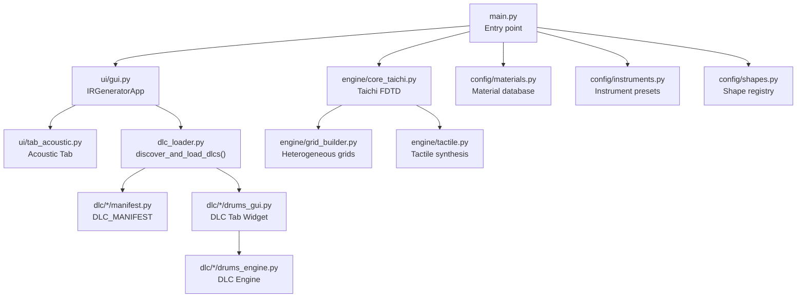
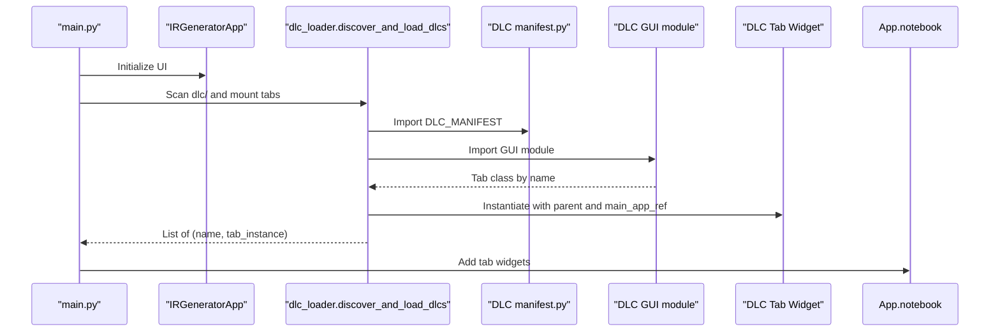
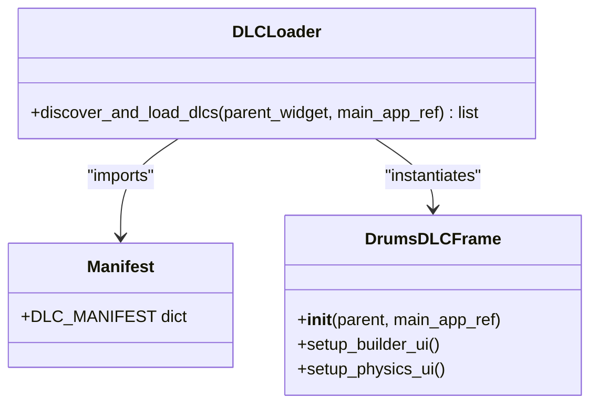
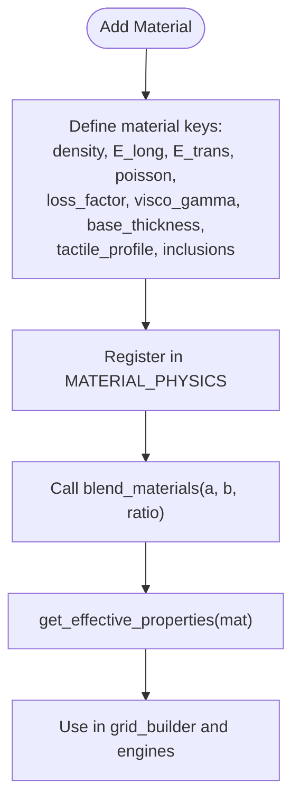
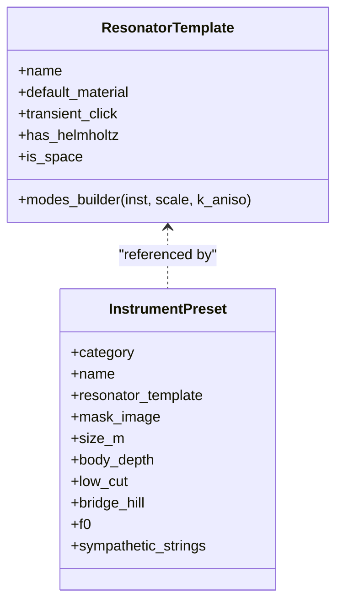
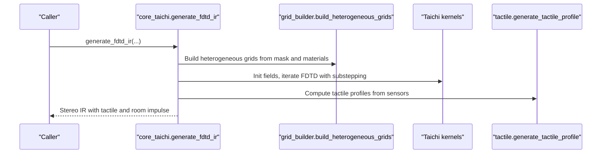
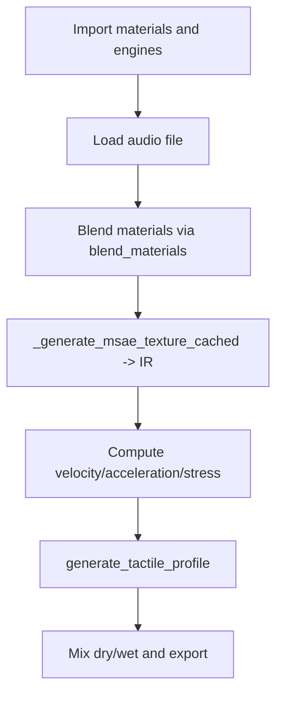
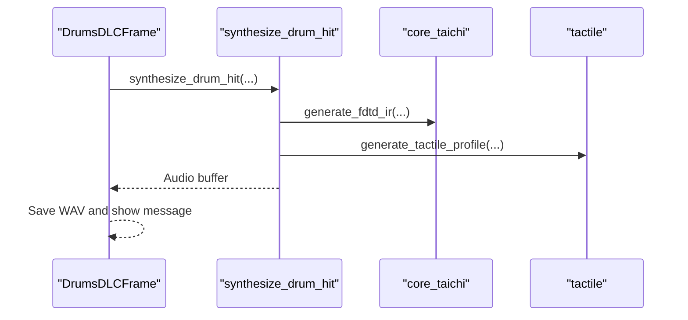
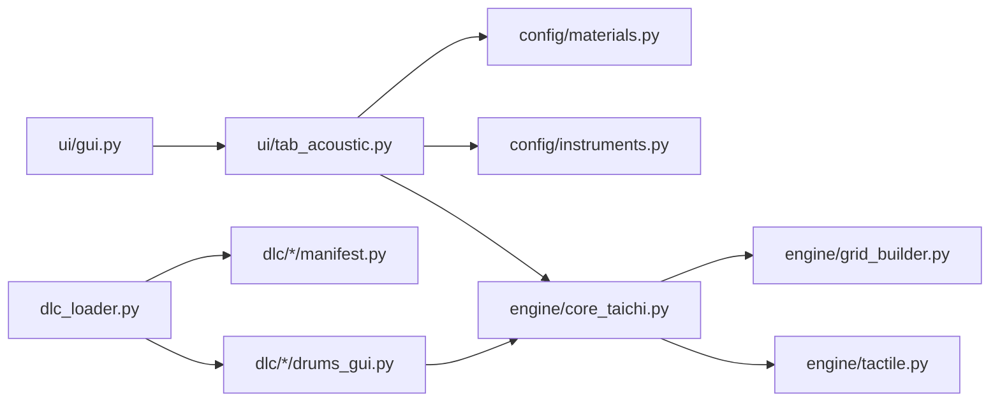

# Custom Development Extensions

<cite>
**Referenced Files in This Document**
- [main.py](file://main.py)
- [dlc_loader.py](file://dlc_loader.py)
- [config/instruments.py](file://config/instruments.py)
- [config/materials.py](file://config/materials.py)
- [config/shapes.py](file://config/shapes.py)
- [dlc/Drums/manifest.py](file://dlc/Drums/manifest.py)
- [dlc/Drums/drums_gui.py](file://dlc/Drums/drums_gui.py)
- [dlc/Drums/drums_engine.py](file://dlc/Drums/drums_engine.py)
- [dlc/spectral_resynth/manifest.py](file://dlc/spectral_resynth/manifest.py)
- [dlc/spectral_resynth/engine.py](file://dlc/spectral_resynth/engine.py)
- [dlc/dhol/manifest.py](file://dlc/dhol/manifest.py)
- [ui/gui.py](file://ui/gui.py)
- [ui/tab_acoustic.py](file://ui/tab_acoustic.py)
- [engine/grid_builder.py](file://engine/grid_builder.py)
- [engine/tactile.py](file://engine/tactile.py)
- [engine/core_taichi.py](file://engine/core_taichi.py)
</cite>

## Table of Contents
1. [Introduction](#introduction)
2. [Project Structure](#project-structure)
3. [Core Components](#core-components)
4. [Architecture Overview](#architecture-overview)
5. [Detailed Component Analysis](#detailed-component-analysis)
6. [Dependency Analysis](#dependency-analysis)
7. [Performance Considerations](#performance-considerations)
8. [Troubleshooting Guide](#troubleshooting-guide)
9. [Conclusion](#conclusion)
10. [Appendices](#appendices)

## Introduction
This document explains how to extend TroakarIR with custom functionality via its plugin architecture. It covers:
- The Dynamic Loading of DLC tabs and their lifecycle
- Manifest-driven plugin discovery and initialization
- Extending materials, instrument presets, and simulation engines
- Creating new GUI components and integrating external libraries
- Version and backward compatibility considerations
- Contribution guidelines, testing, and debugging strategies

## Project Structure
The application is organized around a core UI and a modular plugin system:
- Core UI and tabs live under ui/
- Simulation engines live under engine/
- Configurations for materials, instruments, and shapes live under config/
- Plugins (DLC) live under dlc/<plugin_name>/ with a manifest.py and GUI/engine modules
- The main entry point initializes the UI, logs, and loads DLC tabs dynamically

**Diagram sources**
- [main.py:23-73](file://main.py#L23-L73)
- [ui/gui.py:8-37](file://ui/gui.py#L8-L37)
- [dlc_loader.py:9-61](file://dlc_loader.py#L9-L61)
- [dlc/Drums/manifest.py:1-8](file://dlc/Drums/manifest.py#L1-L8)
- [dlc/Drums/drums_gui.py:15-334](file://dlc/Drums/drums_gui.py#L15-L334)
- [engine/core_taichi.py:266-716](file://engine/core_taichi.py#L266-L716)
- [engine/grid_builder.py:10-99](file://engine/grid_builder.py#L10-L99)
- [engine/tactile.py:193-229](file://engine/tactile.py#L193-L229)
- [config/materials.py:18-640](file://config/materials.py#L18-L640)
- [config/instruments.py:4-279](file://config/instruments.py#L4-L279)
- [config/shapes.py:2-7](file://config/shapes.py#L2-L7)

**Section sources**
- [main.py:23-73](file://main.py#L23-L73)
- [ui/gui.py:8-37](file://ui/gui.py#L8-L37)
- [dlc_loader.py:9-61](file://dlc_loader.py#L9-L61)
- [config/instruments.py:4-279](file://config/instruments.py#L4-L279)
- [config/materials.py:18-640](file://config/materials.py#L18-L640)
- [config/shapes.py:2-7](file://config/shapes.py#L2-L7)

## Core Components
- Plugin Loader: Discovers DLC directories, imports manifest, GUI module, and instantiates the tab class
- Material System: Centralized material database with physical properties and blending utilities
- Instrument Presets: Resonator templates and instrument presets define geometry, modes, and defaults
- Taichi FDTD Engine: GPU-accelerated wave propagation solver with heterogeneous material support
- Tactile Engine: Physics-aware texture synthesis for fibrous, fluid, granular, and brittle effects
- Grid Builder: Generates heterogeneous acoustic grids from masks and material inclusions
- UI Tabs: Core acoustic tab and dynamic DLC tabs integrated into the main notebook

Key extension surfaces:
- Add new DLC entries under dlc/<Name>/ with manifest.py and a GUI class
- Extend config/materials.py and config/instruments.py for new materials and presets
- Integrate new simulation algorithms into engine/ or as DLC engines
- Create new GUI widgets that integrate with the main notebook

**Section sources**
- [dlc_loader.py:9-61](file://dlc_loader.py#L9-L61)
- [config/materials.py:18-640](file://config/materials.py#L18-L640)
- [config/instruments.py:4-279](file://config/instruments.py#L4-L279)
- [engine/core_taichi.py:266-716](file://engine/core_taichi.py#L266-L716)
- [engine/tactile.py:193-229](file://engine/tactile.py#L193-L229)
- [engine/grid_builder.py:10-99](file://engine/grid_builder.py#L10-L99)
- [ui/gui.py:8-37](file://ui/gui.py#L8-L37)

## Architecture Overview
The runtime architecture centers on dynamic plugin discovery and integration into the main UI notebook. The loader scans the dlc/ directory, imports each plugin’s manifest, resolves the GUI entry, and constructs a tab widget passed the main app reference.

**Diagram sources**
- [main.py:44-67](file://main.py#L44-L67)
- [dlc_loader.py:9-61](file://dlc_loader.py#L9-L61)
- [dlc/Drums/manifest.py:1-8](file://dlc/Drums/manifest.py#L1-L8)
- [dlc/Drums/drums_gui.py:15-31](file://dlc/Drums/drums_gui.py#L15-L31)

**Section sources**
- [main.py:44-67](file://main.py#L44-L67)
- [dlc_loader.py:9-61](file://dlc_loader.py#L9-L61)

## Detailed Component Analysis

### Plugin Architecture and Manifest System
- Discovery: The loader enumerates dlc/<dir>, checks for manifest.py, imports it, reads DLC_MANIFEST, imports the GUI module, and instantiates the tab class
- Contract: Each DLC must expose a manifest with name, version, author, description, gui_entry_file, and gui_class_name
- Integration: The tab receives the main app reference and the parent notebook container

**Diagram sources**
- [dlc_loader.py:9-61](file://dlc_loader.py#L9-L61)
- [dlc/Drums/manifest.py:1-8](file://dlc/Drums/manifest.py#L1-L8)
- [dlc/Drums/drums_gui.py:15-31](file://dlc/Drums/drums_gui.py#L15-L31)

**Section sources**
- [dlc_loader.py:9-61](file://dlc_loader.py#L9-L61)
- [dlc/Drums/manifest.py:1-8](file://dlc/Drums/manifest.py#L1-L8)
- [dlc/Drums/drums_gui.py:15-31](file://dlc/Drums/drums_gui.py#L15-L31)

### Material Properties Extension
- Add new materials to config/materials.py with category, name, description, density, elastic moduli, Poisson ratio, loss factor, visco_gamma, base_thickness, tactile_profile, granular/fibrous/fluid layers, and inclusions
- Blend two materials using blend_materials to create composites with interpolated properties and layered art layers
- Use get_effective_properties in engines to derive blended material properties for simulations

**Diagram sources**
- [config/materials.py:18-640](file://config/materials.py#L18-L640)
- [engine/grid_builder.py:10-99](file://engine/grid_builder.py#L10-L99)
- [dlc/Drums/drums_engine.py:12-67](file://dlc/Drums/drums_engine.py#L12-L67)

**Section sources**
- [config/materials.py:18-640](file://config/materials.py#L18-L640)
- [engine/grid_builder.py:10-99](file://engine/grid_builder.py#L10-L99)
- [dlc/Drums/drums_engine.py:12-67](file://dlc/Drums/drums_engine.py#L12-L67)

### Instrument Templates and Presets
- Resonator templates define default materials, transient click, Helmholtz presence, space flag, and a modes_builder lambda
- Instrument presets specify category, name, resonator template, mask image, size/body depth, low-cut, bridge hill, and mode ratios/frequencies
- Shapes provide geometric shape descriptors used by engines

**Diagram sources**
- [config/instruments.py:4-101](file://config/instruments.py#L4-L101)
- [config/instruments.py:149-175](file://config/instruments.py#L149-L175)
- [config/shapes.py:2-7](file://config/shapes.py#L2-L7)

**Section sources**
- [config/instruments.py:4-101](file://config/instruments.py#L4-L101)
- [config/instruments.py:149-175](file://config/instruments.py#L149-L175)
- [config/shapes.py:2-7](file://config/shapes.py#L2-L7)

### Taichi FDTD Engine and Heterogeneous Grids
- The engine initializes Taichi fields, builds masks, and runs substepped FDTD iterations
- Heterogeneous grids are generated from masks and material inclusions, with anti-resonance smoothing and viscosity injection at boundaries
- Tactile forces are applied per strain to emulate fibrous, fluid, granular, and brittle textures

**Diagram sources**
- [engine/core_taichi.py:266-716](file://engine/core_taichi.py#L266-L716)
- [engine/grid_builder.py:10-99](file://engine/grid_builder.py#L10-L99)
- [engine/tactile.py:193-229](file://engine/tactile.py#L193-L229)

**Section sources**
- [engine/core_taichi.py:266-716](file://engine/core_taichi.py#L266-L716)
- [engine/grid_builder.py:10-99](file://engine/grid_builder.py#L10-L99)
- [engine/tactile.py:193-229](file://engine/tactile.py#L193-L229)

### Spectral Resynthesis Engine (DLC Example)
- Demonstrates flexible imports across config.materials and engine modules, enabling hybrid material processing and tactile synthesis
- Provides batch processing and preview playback

**Diagram sources**
- [dlc/spectral_resynth/engine.py:14-157](file://dlc/spectral_resynth/engine.py#L14-L157)

**Section sources**
- [dlc/spectral_resynth/engine.py:14-157](file://dlc/spectral_resynth/engine.py#L14-L157)

### Drum Kit DLC (Example Engine and GUI)
- GUI tab aggregates multiple kits, supports batch rendering, and exposes material selection and global tweaks
- Engine integrates Taichi FDTD, acoustic shell modeling, tactile forces, and optional internal bells/snare wires

**Diagram sources**
- [dlc/Drums/drums_gui.py:163-334](file://dlc/Drums/drums_gui.py#L163-L334)
- [dlc/Drums/drums_engine.py:745-983](file://dlc/Drums/drums_engine.py#L745-L983)
- [engine/core_taichi.py:266-716](file://engine/core_taichi.py#L266-L716)
- [engine/tactile.py:193-229](file://engine/tactile.py#L193-L229)

**Section sources**
- [dlc/Drums/drums_gui.py:163-334](file://dlc/Drums/drums_gui.py#L163-L334)
- [dlc/Drums/drums_engine.py:745-983](file://dlc/Drums/drums_engine.py#L745-L983)
- [engine/core_taichi.py:266-716](file://engine/core_taichi.py#L266-L716)
- [engine/tactile.py:193-229](file://engine/tactile.py#L193-L229)

## Dependency Analysis
- UI depends on config databases and engine modules
- Loader depends on manifest and GUI module resolution
- Engines depend on grid_builder and tactile synthesis
- Materials and instruments feed into engines and grid construction

**Diagram sources**
- [ui/gui.py:8-37](file://ui/gui.py#L8-L37)
- [ui/tab_acoustic.py:12-16](file://ui/tab_acoustic.py#L12-L16)
- [engine/core_taichi.py:266-716](file://engine/core_taichi.py#L266-L716)
- [engine/grid_builder.py:10-99](file://engine/grid_builder.py#L10-L99)
- [engine/tactile.py:193-229](file://engine/tactile.py#L193-L229)
- [dlc_loader.py:9-61](file://dlc_loader.py#L9-L61)
- [dlc/Drums/manifest.py:1-8](file://dlc/Drums/manifest.py#L1-L8)
- [dlc/Drums/drums_gui.py:15-31](file://dlc/Drums/drums_gui.py#L15-L31)

**Section sources**
- [ui/gui.py:8-37](file://ui/gui.py#L8-L37)
- [ui/tab_acoustic.py:12-16](file://ui/tab_acoustic.py#L12-L16)
- [engine/core_taichi.py:266-716](file://engine/core_taichi.py#L266-L716)
- [engine/grid_builder.py:10-99](file://engine/grid_builder.py#L10-L99)
- [engine/tactile.py:193-229](file://engine/tactile.py#L193-L229)
- [dlc_loader.py:9-61](file://dlc_loader.py#L9-L61)
- [dlc/Drums/manifest.py:1-8](file://dlc/Drums/manifest.py#L1-L8)
- [dlc/Drums/drums_gui.py:15-31](file://dlc/Drums/drums_gui.py#L15-L31)

## Performance Considerations
- Taichi FDTD stability requires substepping proportional to CFL; larger grids increase memory and compute cost
- Heterogeneous grids benefit from anti-resonance smoothing and boundary viscosity to reduce numerical artifacts
- Tactile synthesis applies vectorized envelope followers and soft-knee limiting to avoid clipping
- Auto-cropping trims silence tails while preserving fades to prevent clicks

Practical tips:
- Choose grid sizes (N_grid) appropriate to target runtime
- Use heterogeneous grids judiciously; excessive inclusions increase filtering overhead
- Apply tactile boosts and saturation carefully to avoid digital distortion

[No sources needed since this section provides general guidance]

## Troubleshooting Guide
Common issues and remedies:
- Plugin fails to load: Verify manifest exists and exports DLC_MANIFEST; check gui_entry_file and gui_class_name; confirm module paths are importable
- Missing materials or engine functions: The spectral resynthesis engine demonstrates robust fallback and error reporting for missing imports
- GUI not mounting: Ensure main window contains a ttk.Notebook; the loader scans recursively and also checks app attributes
- Rendering stalls: Implement abort flags and yield callbacks to gracefully terminate long-running tasks
- Clicks and artifacts: Use declick utilities and auto-cropping; adjust low-cut filters and tactile mix levels

**Section sources**
- [dlc/spectral_resynth/engine.py:58-69](file://dlc/spectral_resynth/engine.py#L58-L69)
- [main.py:44-71](file://main.py#L44-L71)
- [dlc/Drums/drums_gui.py:157-179](file://dlc/Drums/drums_gui.py#L157-L179)
- [ui/tab_acoustic.py:153-182](file://ui/tab_acoustic.py#L153-L182)

## Conclusion
TroakarIR offers a robust, extensible framework for adding custom instruments, simulation engines, and GUI components. By adhering to the manifest contract, leveraging the material and instrument catalogs, and integrating with the Taichi-based engine and tactile synthesis pipeline, developers can deliver high-quality, physically grounded audio simulations as DLC plugins.

[No sources needed since this section summarizes without analyzing specific files]

## Appendices

### How to Develop a New DLC Plugin
- Create dlc/<YourPlugin>/ with:
  - manifest.py exporting DLC_MANIFEST with name, version, author, description, gui_entry_file, gui_class_name
  - A GUI module that defines a tab class inheriting from a suitable container (e.g., ttk.Notebook)
  - Optional engine module implementing synthesis routines
- Place the plugin folder alongside dlc/ so the loader discovers it automatically

**Section sources**
- [dlc/Drums/manifest.py:1-8](file://dlc/Drums/manifest.py#L1-L8)
- [dlc/Drums/drums_gui.py:15-31](file://dlc/Drums/drums_gui.py#L15-L31)
- [dlc_loader.py:9-61](file://dlc_loader.py#L9-L61)

### Extending Materials and Instruments
- Add entries to config/materials.py and register them in MATERIAL_PHYSICS
- Use blend_materials to create composites and inclusions
- Define instrument presets and templates in config/instruments.py; reference shapes from config/shapes.py

**Section sources**
- [config/materials.py:18-640](file://config/materials.py#L18-L640)
- [config/instruments.py:4-279](file://config/instruments.py#L4-L279)
- [config/shapes.py:2-7](file://config/shapes.py#L2-L7)

### Integrating External Libraries
- The spectral resynthesis engine demonstrates flexible imports across multiple locations for materials and engines
- Ensure imports are guarded and errors are logged; provide fallbacks or clear error messages

**Section sources**
- [dlc/spectral_resynth/engine.py:14-69](file://dlc/spectral_resynth/engine.py#L14-L69)

### Version Compatibility and Backward Migration
- Maintain stable manifest keys and GUI class names to preserve plugin compatibility
- Keep material property keys consistent; introduce new keys with sensible defaults
- When changing engine APIs, provide compatibility shims or deprecation warnings
- Test across Python versions and Taichi architectures (CPU/GPU)

[No sources needed since this section provides general guidance]

### Contributing to the Core Codebase
- Follow existing code styles and docstring conventions
- Add unit tests for new algorithms and integration tests for plugins
- Document new APIs and maintain backward-compatible overloads where feasible
- Use structured logging and error handling as shown in the loader and engines

[No sources needed since this section provides general guidance]

### Testing Methodologies and Debugging
- Use the loader’s logging to track plugin discovery and initialization
- For GUI-heavy plugins, implement yield callbacks and abort flags to test responsiveness
- Validate material blends and grid generation with small N_grid sizes during development
- Employ auto-cropping and low-cut filtering to detect residual artifacts

**Section sources**
- [dlc_loader.py:7-7](file://dlc_loader.py#L7-L7)
- [dlc/Drums/drums_gui.py:157-179](file://dlc/Drums/drums_gui.py#L157-L179)
- [ui/tab_acoustic.py:153-182](file://ui/tab_acoustic.py#L153-L182)