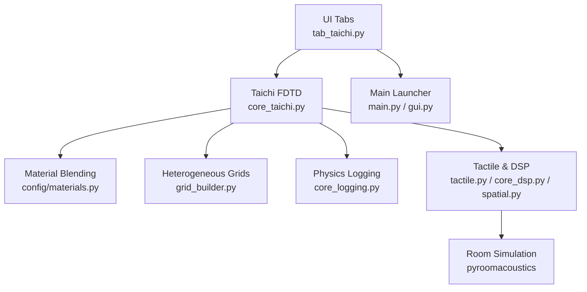
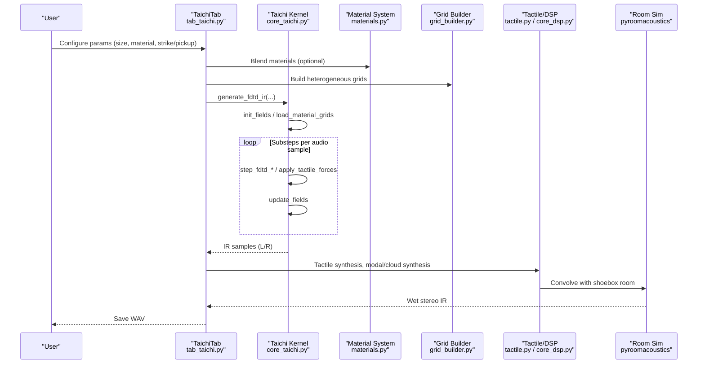
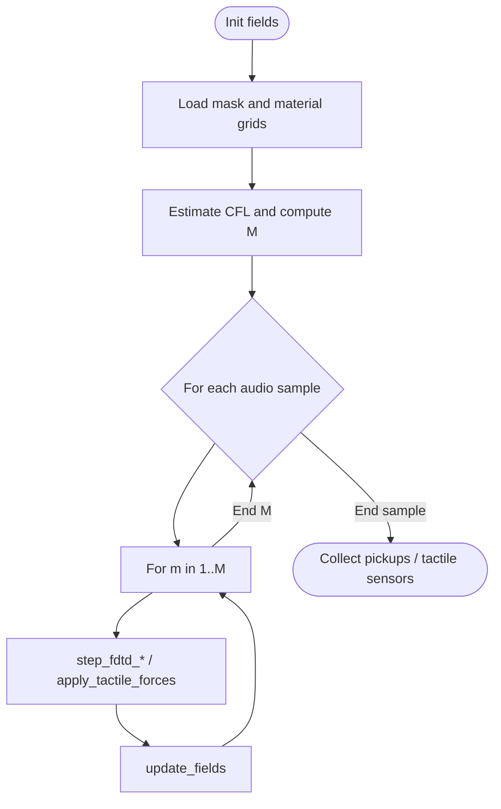
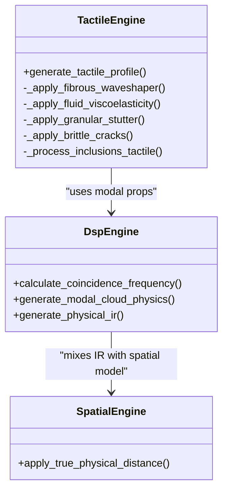
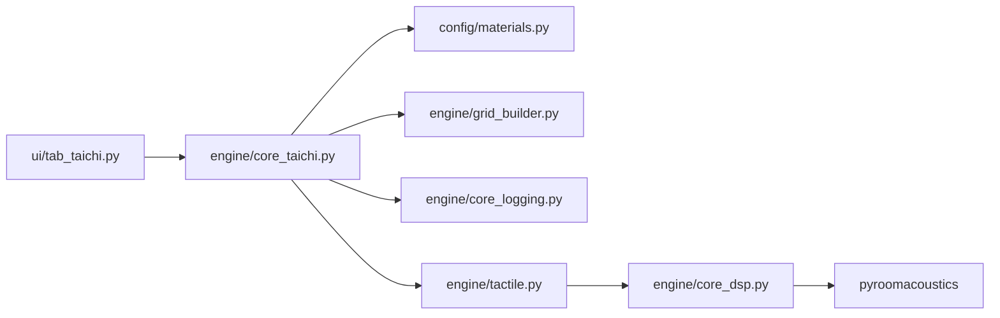

# Performance Optimization

<cite>
**Referenced Files in This Document**
- [engine/core_taichi.py](file://engine/core_taichi.py)
- [engine/tactile.py](file://engine/tactile.py)
- [engine/grid_builder.py](file://engine/grid_builder.py)
- [engine/core_dsp.py](file://engine/core_dsp.py)
- [engine/spatial.py](file://engine/spatial.py)
- [engine/core_logging.py](file://engine/core_logging.py)
- [ui/tab_taichi.py](file://ui/tab_taichi.py)
- [ui/gui.py](file://ui/gui.py)
- [main.py](file://main.py)
- [config/materials.py](file://config/materials.py)
- [dlc/dhol/dhol_engine.py](file://dlc/dhol/dhol_engine.py)
- [ui/README_tab_taichi.md](file://ui/README_tab_taichi.md)
</cite>

## Table of Contents
1. [Introduction](#introduction)
2. [Project Structure](#project-structure)
3. [Core Components](#core-components)
4. [Architecture Overview](#architecture-overview)
5. [Detailed Component Analysis](#detailed-component-analysis)
6. [Dependency Analysis](#dependency-analysis)
7. [Performance Considerations](#performance-considerations)
8. [Troubleshooting Guide](#troubleshooting-guide)
9. [Conclusion](#conclusion)
10. [Appendices](#appendices)

## Introduction
This document provides comprehensive performance optimization guidance for TroakarIR’s GPU-accelerated impulse response generation using Taichi FDTD, alongside CPU-intensive post-processing and DSP stages. It covers GPU utilization strategies (tensor sizing, memory bandwidth, parallel efficiency), CPU algorithm optimizations (threading, complexity reduction), memory management and GC tuning, benchmarking and profiling, platform-specific optimizations, and scaling techniques for larger grids and real-time performance.

## Project Structure
The performance-critical pipeline spans GPU kernels (Taichi), CPU-side DSP and tactile synthesis, and UI orchestration:
- GPU: FDTD simulation with Taichi kernels for wave propagation and heterogeneous material fields
- CPU: Material blending, grid construction, tactile synthesis, spatial processing, and room simulation
- UI: Interactive controls and rendering feedback during simulation

**Diagram sources**
- [ui/tab_taichi.py:1-735](file://ui/tab_taichi.py#L1-735)
- [engine/core_taichi.py:1-717](file://engine/core_taichi.py#L1-717)
- [config/materials.py:642-766](file://config/materials.py#L642-766)
- [engine/grid_builder.py:1-99](file://engine/grid_builder.py#L1-99)
- [engine/core_logging.py:1-203](file://engine/core_logging.py#L1-203)
- [engine/tactile.py:1-250](file://engine/tactile.py#L1-250)
- [engine/core_dsp.py:1-273](file://engine/core_dsp.py#L1-273)
- [engine/spatial.py:1-61](file://engine/spatial.py#L1-61)
- [main.py:1-76](file://main.py#L1-76)
- [ui/gui.py:1-46](file://ui/gui.py#L1-46)

**Section sources**
- [ui/tab_taichi.py:1-735](file://ui/tab_taichi.py#L1-735)
- [engine/core_taichi.py:1-717](file://engine/core_taichi.py#L1-717)
- [config/materials.py:642-766](file://config/materials.py#L642-766)
- [engine/grid_builder.py:1-99](file://engine/grid_builder.py#L1-99)
- [engine/core_logging.py:1-203](file://engine/core_logging.py#L1-203)
- [engine/tactile.py:1-250](file://engine/tactile.py#L1-250)
- [engine/core_dsp.py:1-273](file://engine/core_dsp.py#L1-273)
- [engine/spatial.py:1-61](file://engine/spatial.py#L1-61)
- [main.py:1-76](file://main.py#L1-76)
- [ui/gui.py:1-46](file://ui/gui.py#L1-46)

## Core Components
- Taichi FDTD kernel suite: Anisotropic/heterogeneous wave propagation, substepping for CFL stability, tactile forces, and real-time visualization
- Material system: Blend and heterogeneous grid generation for GPU fields
- Tactile synthesis: Signal-dependent texture generators for fibrous, fluid, granular, brittle, and inclusion effects
- DSP and spatial processing: Modal cloud synthesis, modal dispersion/energy decay estimation, spatial distance modeling, and room simulation
- Logging and instrumentation: Background thread flushing, JSON/CSV logs, and verbosity control

**Section sources**
- [engine/core_taichi.py:43-227](file://engine/core_taichi.py#L43-227)
- [engine/grid_builder.py:10-87](file://engine/grid_builder.py#L10-87)
- [engine/tactile.py:46-229](file://engine/tactile.py#L46-229)
- [engine/core_dsp.py:33-273](file://engine/core_dsp.py#L33-273)
- [engine/core_logging.py:38-203](file://engine/core_logging.py#L38-203)

## Architecture Overview
The runtime architecture balances GPU compute with CPU post-processing. Taichi kernels operate on pinned fields sized up to N_MAX, while CPU stages handle material blending, tactile synthesis, and room acoustics.

**Diagram sources**
- [ui/tab_taichi.py:614-734](file://ui/tab_taichi.py#L614-734)
- [engine/core_taichi.py:266-717](file://engine/core_taichi.py#L266-717)
- [config/materials.py:642-766](file://config/materials.py#L642-766)
- [engine/grid_builder.py:10-87](file://engine/grid_builder.py#L10-87)
- [engine/tactile.py:193-229](file://engine/tactile.py#L193-229)
- [engine/core_dsp.py:90-273](file://engine/core_dsp.py#L90-273)

## Detailed Component Analysis

### GPU Utilization Strategies with Taichi
- Field sizing and memory footprint
  - Fixed-size fields up to N_MAX×N_MAX with explicit padding to maximum buffer
  - Material grids (rho, E_l, E_t, loss, visco) loaded via numpy-to-Taichi transfer
  - Mask field restricts computation to instrument geometry
- Substepping for CFL stability
  - Automatic substeps M computed from estimated Courant-like step to maintain numerical stability
  - Inner loop runs M substeps per audio sample; reduces per-step cost but increases total ops proportionally
- Parallel computation efficiency
  - Structured ndrange loops over N×N tiles mapped to GPU threads
  - Local stencil updates minimize global synchronization
  - Separate kernels for heterogeneous vs. anisotropic cases enable specialized optimizations
- Real-time visualization
  - Optional GUI updates at reduced cadence; offload visualization to avoid stalling compute

**Diagram sources**
- [engine/core_taichi.py:323-474](file://engine/core_taichi.py#L323-474)

**Section sources**
- [engine/core_taichi.py:22-42](file://engine/core_taichi.py#L22-42)
- [engine/core_taichi.py:144-149](file://engine/core_taichi.py#L144-149)
- [engine/core_taichi.py:323-332](file://engine/core_taichi.py#L323-332)
- [engine/core_taichi.py:447-474](file://engine/core_taichi.py#L447-474)

### Memory Management Best Practices
- Host-device transfers
  - Use pad_to_max and numpy arrays to align to N_MAX; avoid repeated reallocations
  - Transfer material grids once per run; reuse fields across frames
- Field lifecycle
  - Explicit initialization and zeroing of active region
  - Avoid unnecessary copies; write to p_future then swap via update_fields
- Logging overhead
  - Background thread flushes events periodically; tune verbosity to reduce I/O contention
- Garbage collection
  - Minimize Python allocations inside tight loops; preallocate arrays for tactile telemetry
  - Prefer vectorized NumPy operations over Python loops in CPU stages

**Section sources**
- [engine/core_taichi.py:39-41](file://engine/core_taichi.py#L39-41)
- [engine/core_taichi.py:43-50](file://engine/core_taichi.py#L43-50)
- [engine/core_taichi.py:230-233](file://engine/core_taichi.py#L230-233)
- [engine/core_logging.py:61-87](file://engine/core_logging.py#L61-87)

### CPU-Intensive Algorithm Optimizations
- Tactile synthesis
  - Vectorized envelope followers and soft-knee limiting reduce branching and improve cache locality
  - Band-limited noise generation via SOS filters; precompute filter coefficients
  - Sparse stochastic events (brittle cracks) use gating and smoothing to avoid excessive noise
- Modal/cloud synthesis
  - Efficient modal cloud generation with vectorized exponential decay and sinusoids
  - Radiation efficiency and coincidence frequency derived analytically to avoid iterative solvers
- Spatial processing
  - Butterworth filters applied in series; precompute coefficients per distance setting
  - Early reflections mixed with scaled direct signal to emulate room impulse

**Diagram sources**
- [engine/tactile.py:193-229](file://engine/tactile.py#L193-229)
- [engine/core_dsp.py:33-273](file://engine/core_dsp.py#L33-273)
- [engine/spatial.py:5-61](file://engine/spatial.py#L5-61)

**Section sources**
- [engine/tactile.py:10-41](file://engine/tactile.py#L10-41)
- [engine/tactile.py:46-229](file://engine/tactile.py#L46-229)
- [engine/core_dsp.py:33-273](file://engine/core_dsp.py#L33-273)
- [engine/spatial.py:5-61](file://engine/spatial.py#L5-61)

### Heterogeneous Material Fields and GPU Efficiency
- Grid construction
  - Gaussian smoothing and gradient magnitude used to introduce anti-resonance viscosity precisely at boundaries
  - Separate smoothing scales for elastic vs. damping fields to preserve texture while stabilizing interfaces
- GPU-friendly layout
  - All fields stored as float32 arrays aligned to N_MAX for efficient memory coalescing
  - Masking ensures only active domain is computed

**Section sources**
- [engine/grid_builder.py:10-87](file://engine/grid_builder.py#L10-87)

### Platform-Specific Optimizations
- GPU selection and fallback
  - Attempt GPU init with explicit device memory allocation; fallback to CPU if unavailable
  - Initialize Taichi headlessly for server/headless environments
- Environment variables
  - Control logging verbosity and output format via environment variables for diagnostics and profiling
- UI responsiveness
  - GUI updates throttled to reduce contention with GPU kernels

**Section sources**
- [dlc/dhol/dhol_engine.py:84-115](file://dlc/dhol/dhol_engine.py#L84-115)
- [engine/core_logging.py:15-17](file://engine/core_logging.py#L15-17)
- [ui/tab_taichi.py:496-520](file://ui/tab_taichi.py#L496-520)

### Scaling Simulations to Larger Grids
- Grid sizing
  - N_grid clamped to N_MAX; automatic substepping increases proportionally to maintain stability
  - CFL-estimated M grows with grid size and material speed; consider reducing duration or increasing sample rate judiciously
- Computational complexity
  - Complexity scales O(N_grid^2 × M); monitor estimated complexity and render time
- Practical guidance
  - Prefer moderate N_grid with careful material selection to balance fidelity and latency
  - Use heterogeneous grids sparingly; boundary smoothing adds compute but improves realism

**Section sources**
- [engine/core_taichi.py:281-282](file://engine/core_taichi.py#L281-282)
- [engine/core_taichi.py:323-332](file://engine/core_taichi.py#L323-332)
- [dlc/dhol/dhol_engine.py:998-1010](file://dlc/dhol/dhol_engine.py#L998-1010)

### Real-Time Performance and Resource Management
- Real-time generation
  - GUI updates occur at reduced rate; disable GUI for headless batch processing
  - Tune pickup locations and stereo mode to reduce per-frame compute
- Resource allocation
  - Pre-allocate buffers for tactile telemetry and IR; reuse arrays across frames
  - Limit concurrent sessions; ensure GPU memory headroom for device_memory_GB allocation

**Section sources**
- [ui/tab_taichi.py:496-520](file://ui/tab_taichi.py#L496-520)
- [engine/core_taichi.py:400-407](file://engine/core_taichi.py#L400-407)
- [dlc/dhol/dhol_engine.py:104-115](file://dlc/dhol/dhol_engine.py#L104-115)

## Dependency Analysis
Key dependencies and coupling:
- UI depends on Taichi FDTD generator and material system
- Taichi kernels depend on material grids and masks
- Tactile synthesis depends on DSP modal parameters and tactile profiles
- Room simulation depends on generated IR and microphone positions

**Diagram sources**
- [ui/tab_taichi.py:1-735](file://ui/tab_taichi.py#L1-735)
- [engine/core_taichi.py:1-717](file://engine/core_taichi.py#L1-717)
- [config/materials.py:642-766](file://config/materials.py#L642-766)
- [engine/grid_builder.py:1-99](file://engine/grid_builder.py#L1-99)
- [engine/core_logging.py:1-203](file://engine/core_logging.py#L1-203)
- [engine/tactile.py:1-250](file://engine/tactile.py#L1-250)
- [engine/core_dsp.py:1-273](file://engine/core_dsp.py#L1-273)

**Section sources**
- [ui/tab_taichi.py:1-735](file://ui/tab_taichi.py#L1-735)
- [engine/core_taichi.py:1-717](file://engine/core_taichi.py#L1-717)
- [config/materials.py:642-766](file://config/materials.py#L642-766)
- [engine/grid_builder.py:1-99](file://engine/grid_builder.py#L1-99)
- [engine/core_logging.py:1-203](file://engine/core_logging.py#L1-203)
- [engine/tactile.py:1-250](file://engine/tactile.py#L1-250)
- [engine/core_dsp.py:1-273](file://engine/core_dsp.py#L1-273)

## Performance Considerations
- GPU utilization
  - Keep N_grid within practical bounds; increase M gradually and measure stability
  - Use heterogeneous grids selectively; boundary smoothing improves realism but adds cost
  - Disable GUI for headless runs to eliminate rendering overhead
- Memory bandwidth
  - Reuse fields and avoid frequent host-device transfers; pad arrays to N_MAX consistently
  - Minimize redundant writes; prefer ping-pong buffers (p, p_past, p_future)
- CPU efficiency
  - Vectorize tactile and DSP stages; precompute filter coefficients
  - Reduce logging verbosity in production; background flush minimizes impact
- Stability and accuracy
  - Respect CFL-derived substepping; lowering M risks instability
  - Monitor modal dispersion and energy decay estimates to validate material blends

[No sources needed since this section provides general guidance]

## Troubleshooting Guide
- GPU not available
  - Verify GPU init and fallback to CPU; check device memory allocation
- Slow renders
  - Reduce N_grid, disable GUI, or lower duration; review estimated complexity
- Unstable simulation
  - Increase M automatically computed by CFL check; reduce material speeds or grid size
- Excessive noise or artifacts
  - Adjust tactile parameters (fatness, nonlinearity) and degrade material damping/viscosity
- Logging and diagnostics
  - Set verbosity and output format via environment variables; inspect JSON/CSV logs

**Section sources**
- [dlc/dhol/dhol_engine.py:84-115](file://dlc/dhol/dhol_engine.py#L84-115)
- [engine/core_taichi.py:323-332](file://engine/core_taichi.py#L323-332)
- [engine/core_logging.py:15-17](file://engine/core_logging.py#L15-17)
- [engine/core_logging.py:61-87](file://engine/core_logging.py#L61-87)

## Conclusion
Optimizing TroakarIR requires balancing GPU compute with CPU post-processing. Effective strategies include disciplined field sizing, controlled substepping, targeted heterogeneous grids, and efficient CPU algorithms for tactile synthesis and spatial processing. Tuning memory transfers, logging, and visualization enables scalable real-time performance across platforms.

[No sources needed since this section summarizes without analyzing specific files]

## Appendices

### Benchmarking Methodology
- Measure wall-clock time per IR generation with fixed N_grid and duration
- Record estimated complexity and render time from CFL checks
- Compare GPU vs. CPU fallback performance; adjust verbosity to minimize I/O overhead
- Use environment variables to control logging and output formats for reproducible runs

**Section sources**
- [engine/core_taichi.py:323-332](file://engine/core_taichi.py#L323-332)
- [engine/core_logging.py:15-17](file://engine/core_logging.py#L15-17)
- [dlc/dhol/dhol_engine.py:998-1010](file://dlc/dhol/dhol_engine.py#L998-1010)

### Profiling Tools Guidance
- Taichi
  - Use built-in logging and environment variables to capture physics summaries and modal dispersion
- Python/CPU
  - Profile tactile and DSP stages with standard profilers; focus on vectorized operations and filter computations
- GPU
  - Monitor kernel execution times and occupancy; reduce grid size or increase substepping to stabilize timing

**Section sources**
- [engine/core_logging.py:133-179](file://engine/core_logging.py#L133-179)
- [engine/tactile.py:10-41](file://engine/tactile.py#L10-41)
- [engine/core_dsp.py:33-88](file://engine/core_dsp.py#L33-88)

### Platform Notes
- Windows/macOS/Linux
  - GPU fallback behavior differs; ensure consistent device memory allocation and logging verbosity
  - UI responsiveness varies; prefer headless mode for batch workloads

**Section sources**
- [dlc/dhol/dhol_engine.py:84-115](file://dlc/dhol/dhol_engine.py#L84-115)
- [ui/tab_taichi.py:496-520](file://ui/tab_taichi.py#L496-520)