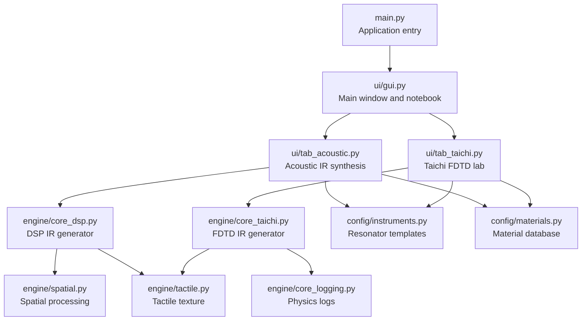
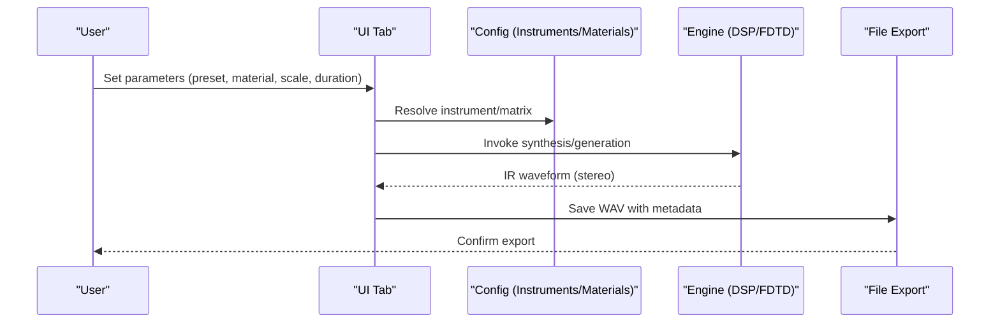
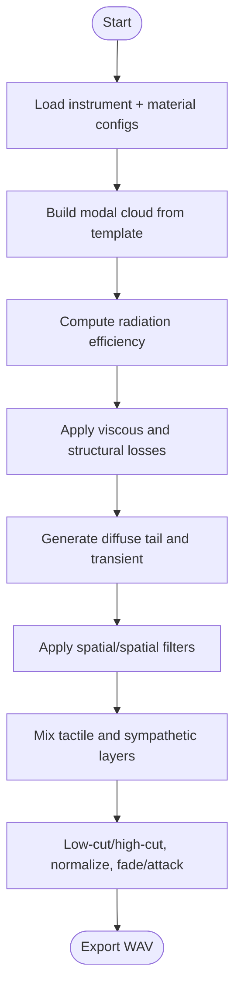
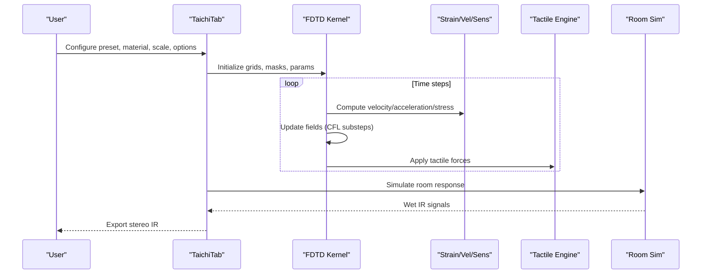
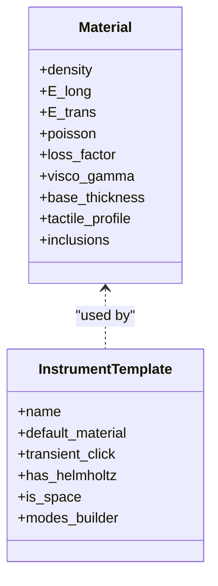
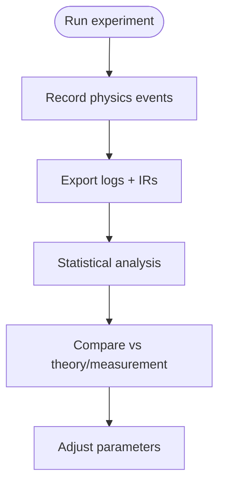
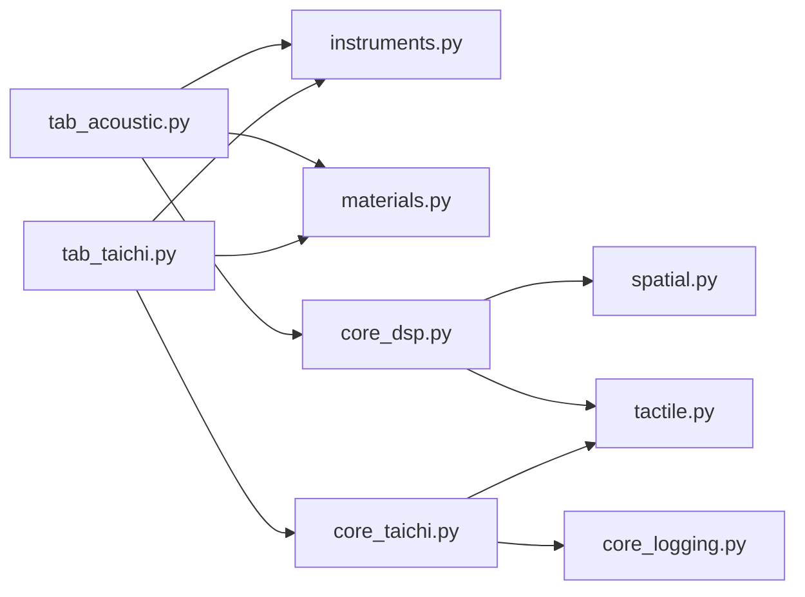

# Research Applications

<cite>
**Referenced Files in This Document**
- [main.py](file://main.py)
- [gui.py](file://ui/gui.py)
- [tab_acoustic.py](file://ui/tab_acoustic.py)
- [tab_taichi.py](file://ui/tab_taichi.py)
- [core_dsp.py](file://engine/core_dsp.py)
- [core_drums.py](file://engine/core_drums.py)
- [core_taichi.py](file://engine/core_taichi.py)
- [tactile.py](file://engine/tactile.py)
- [spatial.py](file://engine/spatial.py)
- [materials.py](file://config/materials.py)
- [instruments.py](file://config/instruments.py)
- [core_logging.py](file://engine/core_logging.py)
- [README_tab_taichi.md](file://ui/README_tab_taichi.md)
</cite>

## Table of Contents
1. [Introduction](#introduction)
2. [Project Structure](#project-structure)
3. [Core Components](#core-components)
4. [Architecture Overview](#architecture-overview)
5. [Detailed Component Analysis](#detailed-component-analysis)
6. [Dependency Analysis](#dependency-analysis)
7. [Performance Considerations](#performance-considerations)
8. [Troubleshooting Guide](#troubleshooting-guide)
9. [Conclusion](#conclusion)
10. [Appendices](#appendices)

## Introduction
This document describes how to use TroakarIR for academic and scientific research in acoustics, material property analysis, and education. It explains how to operate the simulation engines, design experiments with controlled variables, collect and analyze data, validate results against theory and measurement, and adopt reproducible research practices. It also outlines integration with research workflows, statistical analysis approaches, and peer-review considerations for computational acoustic research.

## Project Structure
TroakarIR provides:
- A GUI application entry point that launches the main window and mounts modular DLC tabs.
- Config modules defining instrument templates and material databases.
- Simulation engines for physical modeling of acoustic impulse responses (IRs) via DSP and FDTD.
- UI tabs for acoustic synthesis, percussion modeling, and a Taichi FDTD lab.
- Logging infrastructure for research-grade instrumentation and reproducibility.

**Diagram sources**
- [main.py:23-76](file://main.py#L23-L76)
- [gui.py:8-46](file://ui/gui.py#L8-L46)
- [tab_acoustic.py:17-193](file://ui/tab_acoustic.py#L17-L193)
- [tab_taichi.py:38-743](file://ui/tab_taichi.py#L38-L743)
- [core_dsp.py:90-273](file://engine/core_dsp.py#L90-L273)
- [core_taichi.py:266-717](file://engine/core_taichi.py#L266-L717)
- [spatial.py:5-61](file://engine/spatial.py#L5-L61)
- [tactile.py:193-250](file://engine/tactile.py#L193-L250)
- [instruments.py:4-101](file://config/instruments.py#L4-L101)
- [materials.py:18-640](file://config/materials.py#L18-L640)
- [core_logging.py:38-203](file://engine/core_logging.py#L38-L203)

**Section sources**
- [main.py:23-76](file://main.py#L23-L76)
- [gui.py:8-46](file://ui/gui.py#L8-L46)

## Core Components
- Acoustic tab: Generates acoustic IRs from instrument presets and material properties with controls for geometry, duration, microphone distance, and auto-cropping.
- Taichi FDTD tab: Provides interactive 2D FDTD simulation of struck or bowed textures with options for stereo pickup, heterogeneous grids, material blending, nonlinearity, and de-mud filtering.
- DSP engine: Implements modal synthesis, radiation efficiency, viscous losses, and spatial/spatially-aware processing.
- FDTD engine: Implements finite-difference time-domain dynamics with material-dependent wave speeds, damping, and tactile forces.
- Material and instrument configs: Provide curated material properties and instrument templates for reproducible experiments.
- Logging: Records physics summaries, modal dispersion, energy decay, and tactile events for reproducibility and validation.

**Section sources**
- [tab_acoustic.py:126-193](file://ui/tab_acoustic.py#L126-L193)
- [tab_taichi.py:622-743](file://ui/tab_taichi.py#L622-L743)
- [core_dsp.py:90-273](file://engine/core_dsp.py#L90-L273)
- [core_taichi.py:266-717](file://engine/core_taichi.py#L266-L717)
- [materials.py:18-640](file://config/materials.py#L18-L640)
- [instruments.py:4-101](file://config/instruments.py#L4-L101)
- [core_logging.py:116-203](file://engine/core_logging.py#L116-L203)

## Architecture Overview
The research workflow integrates GUI-driven parameterization with two complementary engines:
- DSP-based acoustic IR synthesis for quick, parametric studies of instrument and material effects.
- FDTD-based wave propagation for physically detailed simulations of contact mechanics, heterogeneous materials, and tactile textures.

**Diagram sources**
- [tab_acoustic.py:126-193](file://ui/tab_acoustic.py#L126-L193)
- [tab_taichi.py:622-743](file://ui/tab_taichi.py#L622-L743)
- [core_dsp.py:90-273](file://engine/core_dsp.py#L90-L273)
- [core_taichi.py:266-717](file://engine/core_taichi.py#L266-L717)
- [instruments.py:4-101](file://config/instruments.py#L4-L101)
- [materials.py:18-640](file://config/materials.py#L18-L640)

## Detailed Component Analysis

### Acoustic IR Synthesis (DSP)
The acoustic synthesis pipeline builds IRs from instrument templates and material properties:
- Resonator templates define modal frequencies and amplitudes.
- Radiation efficiency and loss models compute decay envelopes.
- Spatial processing applies distance-dependent filters and comb-like room reflections.
- Tactile profile adds texture-sensitive noise and nonlinear mixing.
- Auto-cropping trims silence and fade-outs.

**Diagram sources**
- [core_dsp.py:33-273](file://engine/core_dsp.py#L33-L273)
- [spatial.py:5-61](file://engine/spatial.py#L5-L61)
- [tactile.py:193-250](file://engine/tactile.py#L193-L250)

**Section sources**
- [core_dsp.py:90-273](file://engine/core_dsp.py#L90-L273)
- [spatial.py:5-61](file://engine/spatial.py#L5-L61)
- [tactile.py:193-250](file://engine/tactile.py#L193-L250)
- [tab_acoustic.py:126-193](file://ui/tab_acoustic.py#L126-L193)

### Taichi FDTD Lab
The Taichi FDTD engine simulates wave propagation on a 2D grid with:
- Anisotropic and heterogeneous material fields.
- Strike/bow excitations with configurable force.
- Tactile forces (granular, fibrous, fluid, brittle) coupled to strain/velocity/stress sensors.
- Room simulation via pyroomacoustics for wet IRs.
- De-mud filtering to reduce resonant artifacts.

**Diagram sources**
- [tab_taichi.py:622-743](file://ui/tab_taichi.py#L622-L743)
- [core_taichi.py:266-717](file://engine/core_taichi.py#L266-L717)
- [tactile.py:193-250](file://engine/tactile.py#L193-L250)

**Section sources**
- [tab_taichi.py:38-743](file://ui/tab_taichi.py#L38-L743)
- [core_taichi.py:266-717](file://engine/core_taichi.py#L266-L717)
- [tactile.py:193-250](file://engine/tactile.py#L193-L250)
- [README_tab_taichi.md:8-11](file://ui/README_tab_taichi.md#L8-L11)

### Materials and Instruments
- Materials: Comprehensive database of densities, elastic moduli, Poisson ratios, loss factors, viscoelastic gamma, and tactile profiles, including granular, fibrous, fluid, and brittle components. Supports material blending and inclusions.
- Instruments: Preset instrument families (bows, strings, percussion, wind, spaces) with template-defined modal builders and resonance parameters.

**Diagram sources**
- [materials.py:18-640](file://config/materials.py#L18-L640)
- [instruments.py:4-101](file://config/instruments.py#L4-L101)

**Section sources**
- [materials.py:18-640](file://config/materials.py#L18-L640)
- [instruments.py:4-101](file://config/instruments.py#L4-L101)

### Validation and Reproducibility
- Physics logging records resolved material properties, modal dispersion estimates, energy decay rates, and tactile events to JSONL/CSV for post-hoc analysis.
- Core verbosity controls console output and event recording depth.
- Auto-cropping and normalization ensure consistent IR lengths and levels across runs.

**Diagram sources**
- [core_logging.py:116-203](file://engine/core_logging.py#L116-L203)

**Section sources**
- [core_logging.py:38-203](file://engine/core_logging.py#L38-L203)

## Dependency Analysis
Key dependencies and coupling:
- UI tabs depend on config modules for presets and material definitions.
- DSP and FDTD engines depend on config modules and tactile/spatial utilities.
- Logging is injected into engines for reproducibility.

**Diagram sources**
- [tab_acoustic.py:12-16](file://ui/tab_acoustic.py#L12-L16)
- [tab_taichi.py:10-14](file://ui/tab_taichi.py#L10-L14)
- [core_dsp.py:6-8](file://engine/core_dsp.py#L6-L8)
- [core_taichi.py:10-12](file://engine/core_taichi.py#L10-L12)
- [spatial.py:1-3](file://engine/spatial.py#L1-L3)
- [tactile.py:1-4](file://engine/tactile.py#L1-L4)
- [core_logging.py:1-11](file://engine/core_logging.py#L1-L11)

**Section sources**
- [tab_acoustic.py:12-16](file://ui/tab_acoustic.py#L12-L16)
- [tab_taichi.py:10-14](file://ui/tab_taichi.py#L10-L14)
- [core_dsp.py:6-8](file://engine/core_dsp.py#L6-L8)
- [core_taichi.py:10-12](file://engine/core_taichi.py#L10-L12)
- [spatial.py:1-3](file://engine/spatial.py#L1-L3)
- [tactile.py:1-4](file://engine/tactile.py#L1-L4)
- [core_logging.py:1-11](file://engine/core_logging.py#L1-L11)

## Performance Considerations
- FDTD stability: Automatic substepping adjusts for CFL stability based on grid size and material speed.
- Memory footprint: Grid size capped at N_MAX; heterogeneous grids increase memory usage.
- Real-time preview: Optional GUI rendering can be disabled for headless environments.
- Filtering and normalization: Low/high-cut filters and envelope shaping reduce CPU overhead while preserving perceptual quality.

[No sources needed since this section provides general guidance]

## Troubleshooting Guide
Common issues and remedies:
- No Notebook found during DLC mounting: Indicates UI initialization timing; check logging for errors and ensure the main window is built before DLC discovery.
- Taichi runtime not ready: Engine initializes Taichi automatically; if failures persist, verify platform support and environment.
- Silent exports: Auto-cropping removes long silent tails; adjust thresholds or disable cropping in the acoustic tab.
- Excessive reverberation: Reduce room dimensions or wet mix in the FDTD tab; adjust de-mud filtering.
- Nonlinear artifacts: Lower nonlinearity or increase material detail boost to stabilize tactile feedback.

**Section sources**
- [main.py:44-71](file://main.py#L44-L71)
- [core_taichi.py:14-21](file://engine/core_taichi.py#L14-L21)
- [tab_acoustic.py:153-183](file://ui/tab_acoustic.py#L153-L183)
- [tab_taichi.py:655-679](file://ui/tab_taichi.py#L655-L679)

## Conclusion
TroakarIR offers robust, research-grade tools for acoustic simulation and material analysis. Its dual-engine architecture—DSP for rapid parametric studies and FDTD for detailed wave propagation—supports reproducible research, validated comparisons with theory and measurement, and integration into broader workflows. The comprehensive material and instrument catalogs, combined with logging and visualization features, enable rigorous experimentation and transparent reporting.

[No sources needed since this section summarizes without analyzing specific files]

## Appendices

### Experimental Design Methodologies
- Controlled variable testing:
  - Single-factor sweeps: geometry scale, material category, nonlinearity, strike force.
  - Two-way interactions: material × geometry; instrument × pickup position.
- Replication and randomization:
  - Randomize order of conditions; replicate each condition at least three times.
- Data collection:
  - Store IRs as WAV; capture parameter sets and logging outputs.
  - Record metadata: preset, material keys, scale, duration, options.

[No sources needed since this section provides general guidance]

### Validation Against Theory and Measurement
- Modal synthesis validation:
  - Compare dominant modal frequencies with analytical plate/cavity modes.
  - Cross-check decay rates against loss and viscosity parameters.
- Room impulse validation:
  - Compare reverberation times with Sabine predictions for given room dimensions and absorption coefficients.
- Tactile texture validation:
  - Correlate tactile descriptors (granularity, fibrousness, fluidity, brittleness) with perceived roughness and friction cues.

[No sources needed since this section provides general guidance]

### Reproducible Research Practices
- Environment and dependencies:
  - Pin Python packages and Taichi versions; export environment specs.
- Data and code sharing:
  - Share parameter sets, logging JSONL/CSV, and IR archives via Zenodo or institutional repositories.
- Documentation:
  - Include protocol, parameter ranges, and analysis scripts with publications.

[No sources needed since this section provides general guidance]

### Publication-Ready Methodology
- Peer review considerations:
  - Clearly describe engine choice (DSP vs FDTD), parameterization, and validation steps.
  - Report logging metrics (modal dispersion, energy decay) alongside acoustic measures.
  - Acknowledge limitations (numerical approximations, model assumptions).

[No sources needed since this section provides general guidance]

### Examples and Collaborations
- Research papers and theses:
  - Use acoustic IRs to study material damping and radiation efficiency in musical instruments.
  - Investigate tactile perception correlates with material microstructures and inclusions.
- Academic collaborations:
  - Partner with instrument makers to calibrate material properties from measured IRs.
  - Collaborate with psychoacousticians to correlate tactile features with perception studies.

[No sources needed since this section provides general guidance]