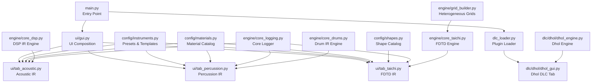
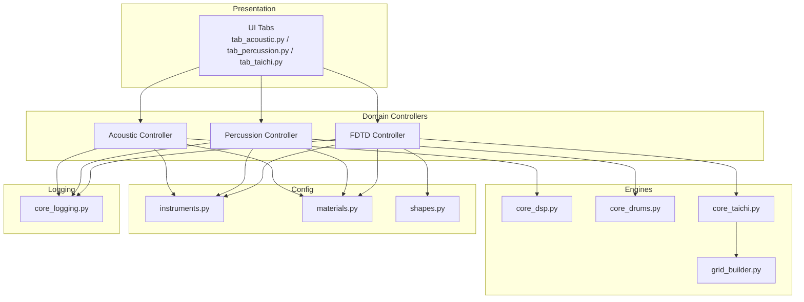
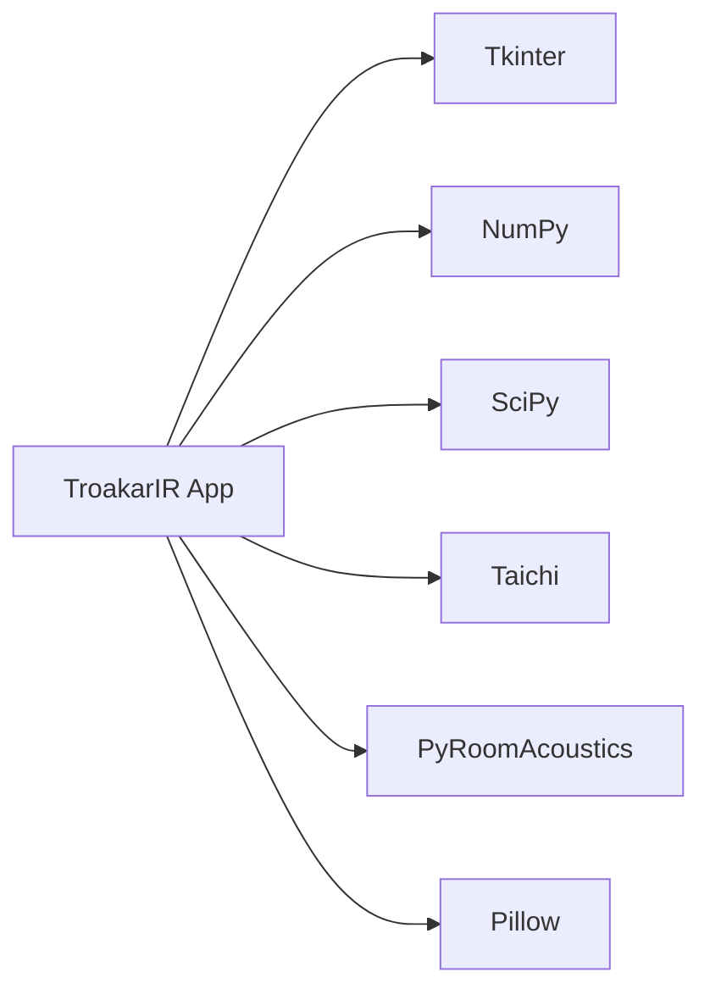

# System Administration

<cite>
**Referenced Files in This Document**
- [main.py](file://main.py)
- [dlc_loader.py](file://dlc_loader.py)
- [core_logging.py](file://engine/core_logging.py)
- [instruments.py](file://config/instruments.py)
- [materials.py](file://config/materials.py)
- [shapes.py](file://config/shapes.py)
- [gui.py](file://ui/gui.py)
- [tab_acoustic.py](file://ui/tab_acoustic.py)
- [tab_percussion.py](file://ui/tab_percussion.py)
- [tab_taichi.py](file://ui/tab_taichi.py)
- [core_drums.py](file://engine/core_drums.py)
- [core_dsp.py](file://engine/core_dsp.py)
- [core_taichi.py](file://engine/core_taichi.py)
- [grid_builder.py](file://engine/grid_builder.py)
- [dhol_engine.py](file://dlc/dhol/dhol_engine.py)
- [dhol_gui.py](file://dlc/dhol/dhol_gui.py)
</cite>

## Table of Contents
1. [Introduction](#introduction)
2. [Project Structure](#project-structure)
3. [Core Components](#core-components)
4. [Architecture Overview](#architecture-overview)
5. [Detailed Component Analysis](#detailed-component-analysis)
6. [Dependency Analysis](#dependency-analysis)
7. [Performance Considerations](#performance-considerations)
8. [Troubleshooting Guide](#troubleshooting-guide)
9. [Conclusion](#conclusion)
10. [Appendices](#appendices)

## Introduction
This document provides system administration guidance for deploying and maintaining TroakarIR installations across diverse environments. It covers installation prerequisites, environment setup, configuration management, logging and monitoring, backup and recovery, updates and maintenance, troubleshooting, security, and operational best practices. It also includes guidance for batch processing, cluster deployment, and high-performance computing integration tailored to the repository’s architecture.

## Project Structure
TroakarIR is organized around a Python-based desktop application with a modular plugin system (DLC) and a set of physics engines for impulse response (IR) synthesis. The structure supports:
- Application entry and UI composition
- Configuration catalogs for instruments, materials, and shapes
- Physics engines for acoustic, percussion, and FDTD simulations
- Plugin loader for dynamic extension tabs
- Logging and telemetry infrastructure

**Diagram sources**
- [main.py:1-76](file://main.py#L1-L76)
- [dlc_loader.py:1-62](file://dlc_loader.py#L1-L62)
- [gui.py:1-46](file://ui/gui.py#L1-L46)
- [tab_acoustic.py:1-193](file://ui/tab_acoustic.py#L1-L193)
- [tab_percussion.py:1-144](file://ui/tab_percussion.py#L1-L144)
- [tab_taichi.py:1-743](file://ui/tab_taichi.py#L1-L743)
- [instruments.py:1-279](file://config/instruments.py#L1-L279)
- [materials.py:1-766](file://config/materials.py#L1-L766)
- [shapes.py:1-8](file://config/shapes.py#L1-L8)
- [core_logging.py:1-203](file://engine/core_logging.py#L1-L203)
- [core_dsp.py:1-273](file://engine/core_dsp.py#L1-L273)
- [core_drums.py:1-249](file://engine/core_drums.py#L1-L249)
- [core_taichi.py:1-717](file://engine/core_taichi.py#L1-L717)
- [grid_builder.py:1-99](file://engine/grid_builder.py#L1-L99)
- [dhol_engine.py:1-800](file://dlc/dhol/dhol_engine.py#L1-L800)
- [dhol_gui.py:1-747](file://dlc/dhol/dhol_gui.py#L1-L747)

**Section sources**
- [main.py:1-76](file://main.py#L1-L76)
- [dlc_loader.py:1-62](file://dlc_loader.py#L1-L62)
- [gui.py:1-46](file://ui/gui.py#L1-L46)

## Core Components
- Application entry initializes logging, builds the UI, discovers and mounts DLC tabs, and runs the main loop.
- UI tabs encapsulate generation workflows for acoustic, percussion, and FDTD domains.
- Configuration catalogs define instrument presets, material properties, and shape templates.
- Physics engines implement domain-specific synthesis pipelines with optional heterogeneous material modeling.
- Logging subsystem captures runtime telemetry and writes structured logs to disk.

Key responsibilities:
- main.py: orchestration, logging, UI bootstrap, DLC discovery and mounting
- ui/*: user-driven generation workflows and parameterization
- config/*: declarative catalogs for instruments, materials, shapes
- engine/*: synthesis engines and logging
- dlc/*: extensible plugin system for specialized tabs

**Section sources**
- [main.py:1-76](file://main.py#L1-L76)
- [gui.py:1-46](file://ui/gui.py#L1-L46)
- [tab_acoustic.py:1-193](file://ui/tab_acoustic.py#L1-L193)
- [tab_percussion.py:1-144](file://ui/tab_percussion.py#L1-L144)
- [tab_taichi.py:1-743](file://ui/tab_taichi.py#L1-L743)
- [instruments.py:1-279](file://config/instruments.py#L1-L279)
- [materials.py:1-766](file://config/materials.py#L1-L766)
- [shapes.py:1-8](file://config/shapes.py#L1-L8)
- [core_logging.py:1-203](file://engine/core_logging.py#L1-L203)
- [core_dsp.py:1-273](file://engine/core_dsp.py#L1-L273)
- [core_drums.py:1-249](file://engine/core_drums.py#L1-L249)
- [core_taichi.py:1-717](file://engine/core_taichi.py#L1-L717)
- [grid_builder.py:1-99](file://engine/grid_builder.py#L1-L99)
- [dhol_engine.py:1-800](file://dlc/dhol/dhol_engine.py#L1-L800)
- [dhol_gui.py:1-747](file://dlc/dhol/dhol_gui.py#L1-L747)

## Architecture Overview
The system follows a layered architecture:
- Presentation Layer: Tkinter-based UI with notebook tabs for each domain
- Domain Controllers: UI tabs coordinate parameterization and delegate to engines
- Engines: domain-specific synthesis implementations
- Configuration Layer: catalogs of presets and material properties
- Logging and Telemetry: centralized logging with background flushing

**Diagram sources**
- [tab_acoustic.py:1-193](file://ui/tab_acoustic.py#L1-L193)
- [tab_percussion.py:1-144](file://ui/tab_percussion.py#L1-L144)
- [tab_taichi.py:1-743](file://ui/tab_taichi.py#L1-L743)
- [core_dsp.py:1-273](file://engine/core_dsp.py#L1-L273)
- [core_drums.py:1-249](file://engine/core_drums.py#L1-L249)
- [core_taichi.py:1-717](file://engine/core_taichi.py#L1-L717)
- [grid_builder.py:1-99](file://engine/grid_builder.py#L1-L99)
- [instruments.py:1-279](file://config/instruments.py#L1-L279)
- [materials.py:1-766](file://config/materials.py#L1-L766)
- [shapes.py:1-8](file://config/shapes.py#L1-L8)
- [core_logging.py:1-203](file://engine/core_logging.py#L1-L203)

## Detailed Component Analysis

### Installation and Environment Setup
- Python interpreter: the application uses standard scientific libraries and GUI bindings.
- GUI framework: Tkinter with additional drag-and-drop support via a third-party package.
- Physics simulation: Taichi for FDTD with optional GPU acceleration; fallback to CPU supported.
- Audio processing: NumPy, SciPy, PyRoomAcoustics for convolution and room simulation.
- Optional plugins: DLC loader dynamically imports plugin manifests and GUI tabs.

Recommended baseline:
- Python 3.8+ (tested on common distributions)
- Operating systems: Windows, macOS, Linux (GUI and CLI)
- GPU acceleration: CUDA-capable NVIDIA GPU recommended for FDTD; otherwise CPU fallback is available.

Platform-specific notes:
- Windows: ensure Tkinter and Tcl/Tk are bundled with Python; GPU drivers for CUDA if using FDTD.
- macOS: Xcode command line tools may be required for native extensions; Homebrew packages for scientific stack.
- Linux: install system packages for development headers and audio libraries; ensure Tkinter availability.

**Section sources**
- [main.py:1-76](file://main.py#L1-L76)
- [core_taichi.py:14-21](file://engine/core_taichi.py#L14-L21)
- [dhol_engine.py:92-115](file://dlc/dhol/dhol_engine.py#L92-L115)

### Configuration Management
- Instruments catalog defines presets and templates for acoustic and percussion synthesis.
- Materials catalog defines physical properties, tactile profiles, and heterogeneous inclusions.
- Shapes catalog provides geometric templates for FDTD simulations.
- UI tabs expose sliders and selectors mapped to these catalogs.

Operational guidance:
- Backup configuration files before major updates.
- Use presets as starting points; adjust sliders to explore parameter space.
- For FDTD, heterogeneous grids are generated from material inclusion definitions.

**Section sources**
- [instruments.py:1-279](file://config/instruments.py#L1-L279)
- [materials.py:1-766](file://config/materials.py#L1-L766)
- [shapes.py:1-8](file://config/shapes.py#L1-L8)
- [tab_taichi.py:437-486](file://ui/tab_taichi.py#L437-L486)

### Logging System Administration
- Application-wide logging configured at startup with file and stream handlers.
- Core instrumentation logger writes JSONL and CSV logs with buffered background writer.
- Environment variables control verbosity, format, and output path.

Administration tasks:
- Monitor troakar_debug.log for application lifecycle and errors.
- Configure TAICHI_LOG_VERBOSITY, TAICHI_LOG_FORMAT, TAICHI_LOG_PATH for telemetry output.
- Review JSONL/CSV logs for physics telemetry and performance metrics.

**Section sources**
- [main.py:23-33](file://main.py#L23-L33)
- [core_logging.py:13-203](file://engine/core_logging.py#L13-L203)

### Monitoring Deployment Health
- UI status bar communicates rendering progress and completion.
- Background logging captures synthesis parameters and runtime conditions.
- FDTD controller exposes real-time visualization during GPU-accelerated runs.

Monitoring checklist:
- Verify log file rotation and disk space.
- Confirm UI status transitions during long-running renders.
- Validate JSONL/CSV telemetry presence for physics events.

**Section sources**
- [tab_acoustic.py:126-193](file://ui/tab_acoustic.py#L126-L193)
- [tab_percussion.py:80-144](file://ui/tab_percussion.py#L80-L144)
- [tab_taichi.py:622-680](file://ui/tab_taichi.py#L622-L680)
- [core_taichi.py:496-524](file://engine/core_taichi.py#L496-L524)

### Backup and Recovery Procedures
- Application data: user-generated samples and logs.
- Configuration backups: preserve config/*.py files prior to upgrades.
- Recovery steps:
  - Restore config files from backup.
  - Re-run generation to regenerate missing samples.
  - Validate logs and UI status after restoration.

**Section sources**
- [main.py:23-33](file://main.py#L23-L33)
- [core_logging.py:48-60](file://engine/core_logging.py#L48-L60)

### Update and Maintenance Workflows
- Update procedure:
  - Pull latest repository changes.
  - Reinstall Python dependencies if required.
  - Restart the application; DLC tabs are discovered automatically.
- Maintenance:
  - Periodically review and prune old logs.
  - Validate material and instrument catalogs for consistency.

**Section sources**
- [dlc_loader.py:9-62](file://dlc_loader.py#L9-L62)
- [main.py:44-72](file://main.py#L44-L72)

### Troubleshooting Common System Issues
- No DLC tabs appear:
  - Ensure dlc/ directory exists and contains valid manifests.
  - Check application logs for loader errors.
- GPU initialization failures:
  - Verify CUDA availability; the engine falls back to CPU.
- Rendering stalls:
  - Check UI status and log output for exceptions.
  - Reduce render duration or disable heavy effects (e.g., de-mud, heterogeneous grids).
- Audio artifacts:
  - Adjust nonlinearity and material detail boost sliders.
  - Validate material inclusion definitions.

**Section sources**
- [dlc_loader.py:18-21](file://dlc_loader.py#L18-L21)
- [dhol_engine.py:92-115](file://dlc/dhol/dhol_engine.py#L92-L115)
- [tab_taichi.py:622-680](file://ui/tab_taichi.py#L622-L680)

### Security Considerations, Access Controls, and Data Protection
- Plugin loading: dynamic import of manifests and GUI modules; restrict dlc/ directory permissions.
- Logs: sensitive operational data may be written; secure log locations and retention policies.
- Data protection: keep configuration and generated samples in protected directories; encrypt backups if required.

**Section sources**
- [dlc_loader.py:34-61](file://dlc_loader.py#L34-L61)
- [main.py:23-33](file://main.py#L23-L33)

### Batch Processing Automation and Cluster Deployment
- Batch generation:
  - Use UI batch modes for percussion presets.
  - Automate by invoking generation routines programmatically (see UI controllers).
- Cluster deployment:
  - Run headless instances for GPU nodes; disable GUI visualization.
  - Scale across multiple workers; collect outputs centrally.
- High-performance computing:
  - Prefer GPU-enabled nodes for FDTD.
  - Tune grid resolution and substepping to balance accuracy and throughput.

**Section sources**
- [tab_percussion.py:99-114](file://ui/tab_percussion.py#L99-L114)
- [core_taichi.py:279-332](file://engine/core_taichi.py#L279-L332)
- [tab_taichi.py:622-680](file://ui/tab_taichi.py#L622-L680)

### Performance Monitoring, Resource Utilization, and Capacity Planning
- Telemetry:
  - Core logger records physics events and modal dispersion estimates.
  - FDTD controller logs stability checks and substepping metrics.
- Metrics to track:
  - Render duration per preset.
  - GPU/CPU utilization during FDTD.
  - Log file sizes and flush frequency.
- Capacity planning:
  - Provision GPU memory for larger grids.
  - Plan storage for generated samples and logs.
  - Schedule batch jobs during off-peak hours.

**Section sources**
- [core_logging.py:159-179](file://engine/core_logging.py#L159-L179)
- [core_taichi.py:323-332](file://engine/core_taichi.py#L323-L332)
- [core_taichi.py:594-652](file://engine/core_taichi.py#L594-L652)

## Dependency Analysis
Runtime dependencies include:
- GUI: Tkinter, optional drag-and-drop extension
- Math and signal processing: NumPy, SciPy
- Physics: Taichi (GPU/CPU), PyRoomAcoustics
- Audio I/O: SciPy WAV writer
- UI utilities: Pillow for images in FDTD tab

**Diagram sources**
- [main.py:1-6](file://main.py#L1-L6)
- [core_taichi.py:1-9](file://engine/core_taichi.py#L1-L9)
- [tab_taichi.py:1-14](file://ui/tab_taichi.py#L1-L14)

**Section sources**
- [main.py:1-6](file://main.py#L1-L6)
- [core_taichi.py:1-9](file://engine/core_taichi.py#L1-L9)
- [tab_taichi.py:1-14](file://ui/tab_taichi.py#L1-L14)

## Performance Considerations
- FDTD stability: automatic substepping increases computational cost; reduce duration or grid size for speed.
- Heterogeneous grids: inclusion modeling adds complexity; disable for faster runs.
- De-mud filtering: improves timbral quality but adds FFT overhead; tune strength as needed.
- GPU utilization: ensure adequate VRAM; monitor for out-of-memory conditions.

[No sources needed since this section provides general guidance]

## Troubleshooting Guide
Common symptoms and resolutions:
- Blank UI or missing tabs:
  - Verify dlc/ directory creation and manifest presence.
- GPU errors:
  - Switch to CPU mode; check driver compatibility.
- Slow renders:
  - Lower grid resolution, reduce duration, or disable advanced effects.
- Log flooding:
  - Adjust verbosity and log path via environment variables.

**Section sources**
- [dlc_loader.py:18-21](file://dlc_loader.py#L18-L21)
- [dhol_engine.py:92-115](file://dlc/dhol/dhol_engine.py#L92-L115)
- [core_taichi.py:323-332](file://engine/core_taichi.py#L323-L332)

## Conclusion
TroakarIR offers a flexible, configurable platform for impulse response synthesis across acoustic, percussion, and FDTD domains. Administrators should focus on environment provisioning, logging hygiene, and performance tuning to maintain reliable deployments. The modular architecture and configuration catalogs facilitate scalable automation and cluster integration.

[No sources needed since this section summarizes without analyzing specific files]

## Appendices

### Appendix A: Environment Variables
- TAICHI_LOG_VERBOSITY: integer verbosity level for core instrumentation
- TAICHI_LOG_FORMAT: output format (json/csv)
- TAICHI_LOG_PATH: base path for telemetry logs

**Section sources**
- [core_logging.py:15-17](file://engine/core_logging.py#L15-L17)

### Appendix B: Directory Layout Guidance
- Keep dlc/ alongside the application root for plugin discovery.
- Store generated samples in project-managed directories with descriptive names.
- Archive logs separately to control growth.

**Section sources**
- [dlc_loader.py:13-28](file://dlc_loader.py#L13-L28)
- [main.py:44-72](file://main.py#L44-L72)