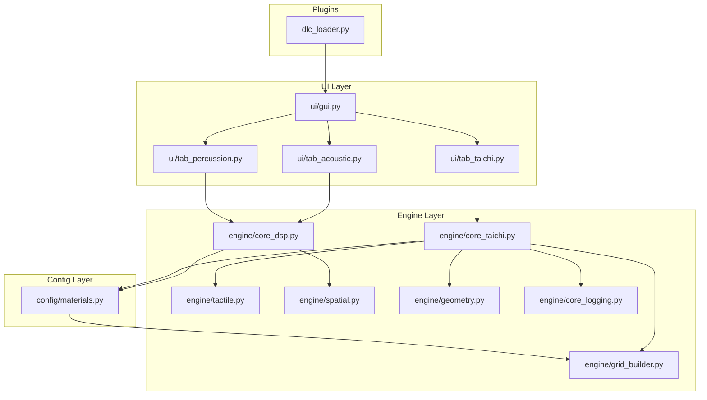
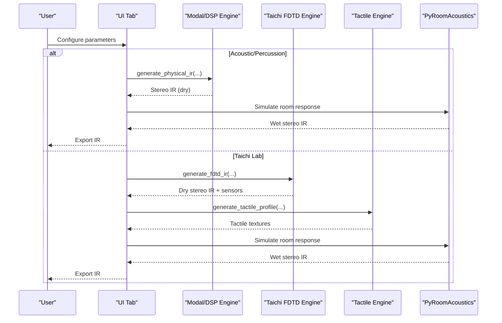
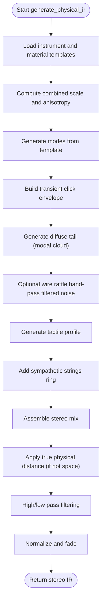
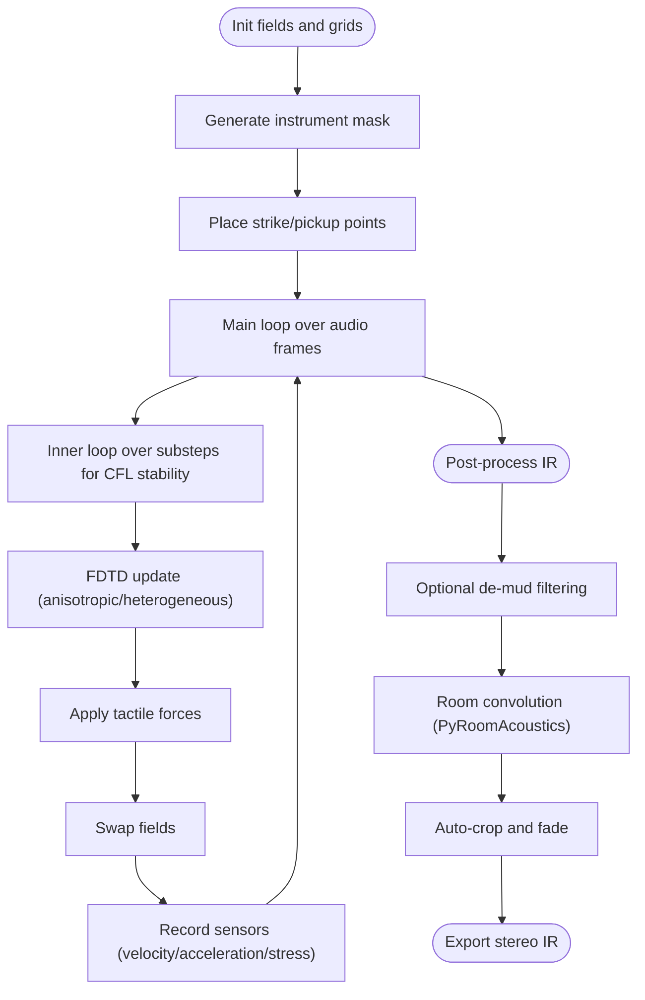
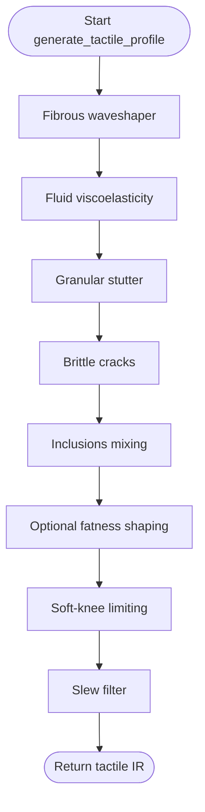
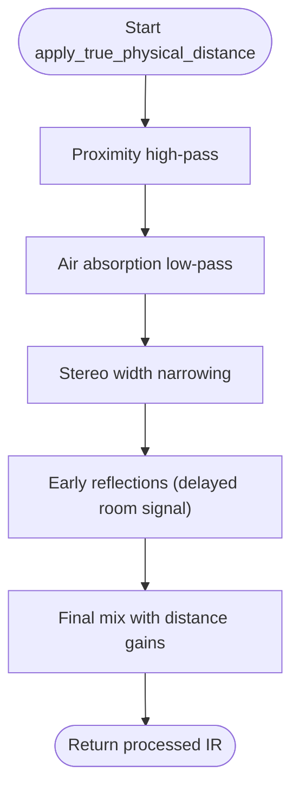
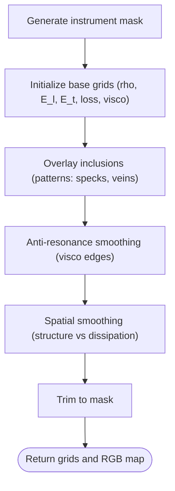
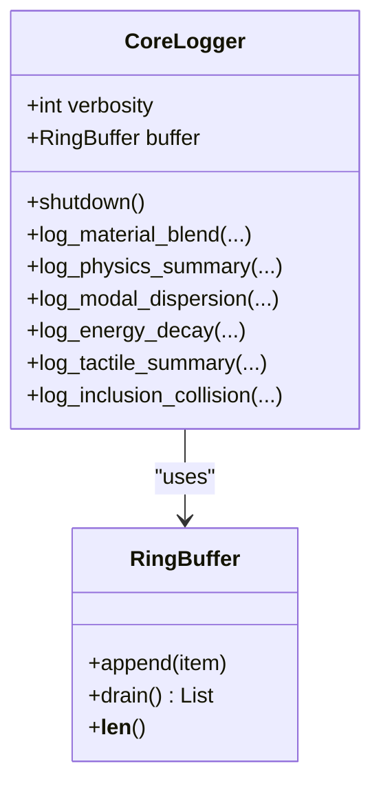
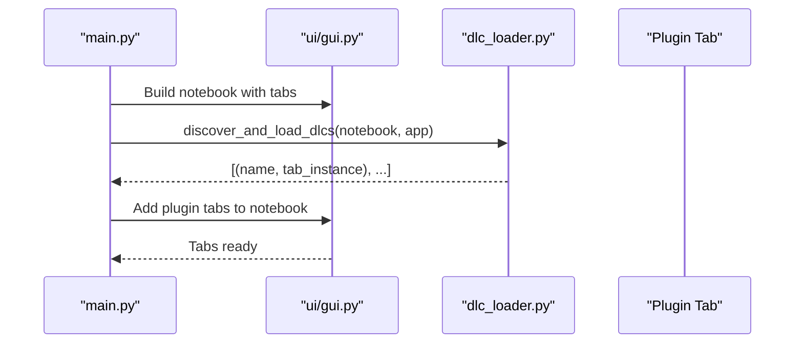
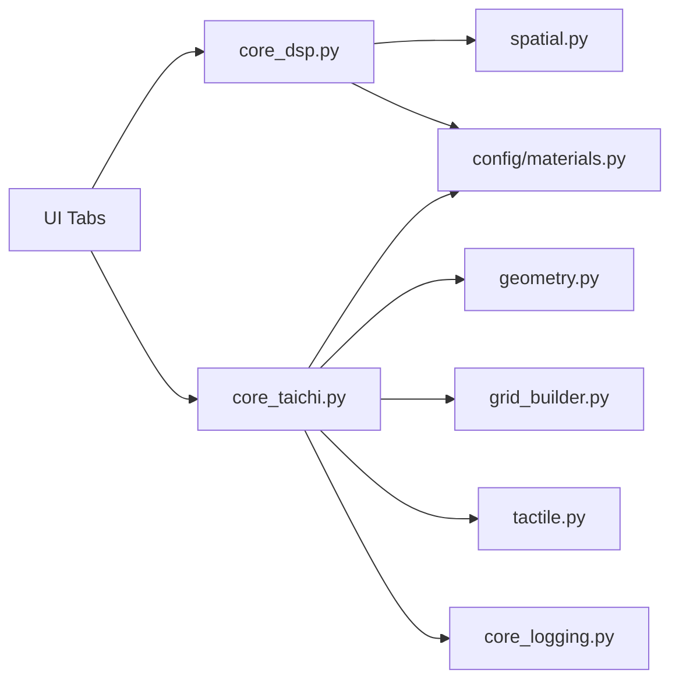

# Core Engine Architecture

<cite>
**Referenced Files in This Document**
- [main.py](file://main.py)
- [dlc_loader.py](file://dlc_loader.py)
- [engine/core_taichi.py](file://engine/core_taichi.py)
- [engine/core_dsp.py](file://engine/core_dsp.py)
- [engine/tactile.py](file://engine/tactile.py)
- [engine/spatial.py](file://engine/spatial.py)
- [engine/grid_builder.py](file://engine/grid_builder.py)
- [engine/geometry.py](file://engine/geometry.py)
- [engine/core_logging.py](file://engine/core_logging.py)
- [ui/gui.py](file://ui/gui.py)
- [ui/tab_acoustic.py](file://ui/tab_acoustic.py)
- [ui/tab_percussion.py](file://ui/tab_percussion.py)
- [ui/tab_taichi.py](file://ui/tab_taichi.py)
- [config/materials.py](file://config/materials.py)
</cite>

## Table of Contents
1. [Introduction](#introduction)
2. [Project Structure](#project-structure)
3. [Core Components](#core-components)
4. [Architecture Overview](#architecture-overview)
5. [Detailed Component Analysis](#detailed-component-analysis)
6. [Dependency Analysis](#dependency-analysis)
7. [Performance Considerations](#performance-considerations)
8. [Troubleshooting Guide](#troubleshooting-guide)
9. [Conclusion](#conclusion)

## Introduction
This document describes the core engine architecture of TroakarIR, a hybrid impulse response generation system that combines:
- Modal synthesis for acoustic bodies and rooms
- Finite-difference time-domain (FDTD) wave propagation on GPU via Taichi
- Haptic processing for tactile texture computation

The system integrates three primary engines:
- Modal/DSP engine for efficient physical modeling and room simulation
- Taichi-based GPU-accelerated FDTD engine for detailed wave propagation
- Tactile engine for material-aware haptic textures

It supports heterogeneous material grids, interactive point placement, and plugin extensibility through a modular DLC system.

## Project Structure
The project is organized into functional domains:
- engine/: Core algorithms (Taichi FDTD, modal DSP, tactile, geometry, spatial, logging)
- ui/: Tkinter-based GUI with tabs for acoustic, percussion, and Taichi labs
- config/: Presets and material databases
- dlc/: Plugin packages with manifests and GUI extensions
- tools/: Utilities (e.g., declick)
- main.py: Application entry point and DLC loader integration

**Diagram sources**
- [ui/gui.py:8-46](file://ui/gui.py#L8-L46)
- [ui/tab_acoustic.py:17-193](file://ui/tab_acoustic.py#L17-L193)
- [ui/tab_percussion.py:17-144](file://ui/tab_percussion.py#L17-L144)
- [ui/tab_taichi.py:34-735](file://ui/tab_taichi.py#L34-L735)
- [engine/core_dsp.py:90-273](file://engine/core_dsp.py#L90-L273)
- [engine/core_taichi.py:266-717](file://engine/core_taichi.py#L266-L717)
- [engine/tactile.py:193-250](file://engine/tactile.py#L193-L250)
- [engine/spatial.py:5-61](file://engine/spatial.py#L5-L61)
- [engine/geometry.py:17-120](file://engine/geometry.py#L17-L120)
- [engine/grid_builder.py:10-99](file://engine/grid_builder.py#L10-L99)
- [engine/core_logging.py:38-203](file://engine/core_logging.py#L38-L203)
- [config/materials.py:18-766](file://config/materials.py#L18-L766)
- [dlc_loader.py:9-62](file://dlc_loader.py#L9-L62)

**Section sources**
- [main.py:23-76](file://main.py#L23-L76)
- [dlc_loader.py:9-62](file://dlc_loader.py#L9-L62)

## Core Components
- Modal/DSP engine: Generates modal clouds, transient clicks, diffuse tails, and spatial IRs with Butterworth filters and physical distance modeling.
- Taichi FDTD engine: Solves anisotropic/heterogeneous plate equations on GPU, with substepping for stability, optional nonlinearity, and tactile forces.
- Tactile engine: Computes fibrous, fluid, granular, brittle, and inclusion-driven textures from FDTD sensors.
- Geometry and grid builder: Produces instrument masks and heterogeneous material grids with anti-resonance smoothing.
- Spatial engine: Applies proximity, air absorption, stereo width, and early reflections.
- Logging: Structured telemetry for physics, modal dispersion, energy decay, and tactile events.
- UI: Three tabs for acoustic, percussion, and Taichi lab; plugin integration via DLC loader.

**Section sources**
- [engine/core_dsp.py:33-273](file://engine/core_dsp.py#L33-L273)
- [engine/core_taichi.py:266-717](file://engine/core_taichi.py#L266-L717)
- [engine/tactile.py:193-250](file://engine/tactile.py#L193-L250)
- [engine/geometry.py:17-120](file://engine/geometry.py#L17-L120)
- [engine/grid_builder.py:10-99](file://engine/grid_builder.py#L10-L99)
- [engine/spatial.py:5-61](file://engine/spatial.py#L5-L61)
- [engine/core_logging.py:38-203](file://engine/core_logging.py#L38-L203)
- [ui/tab_acoustic.py:126-193](file://ui/tab_acoustic.py#L126-L193)
- [ui/tab_percussion.py:80-144](file://ui/tab_percussion.py#L80-L144)
- [ui/tab_taichi.py:614-735](file://ui/tab_taichi.py#L614-L735)

## Architecture Overview
The system orchestrates user parameters through three pathways:
- Acoustic tab → Modal/DSP engine → Room convolution (PyRoomAcoustics) → Export
- Percussion tab → Modal/DSP engine (drum-specific) → Export
- Taichi tab → Taichi FDTD engine → Tactile engine → Optional de-mud filtering → Room convolution → Export

**Diagram sources**
- [ui/tab_acoustic.py:126-193](file://ui/tab_acoustic.py#L126-L193)
- [ui/tab_percussion.py:80-144](file://ui/tab_percussion.py#L80-L144)
- [ui/tab_taichi.py:614-735](file://ui/tab_taichi.py#L614-L735)
- [engine/core_dsp.py:90-273](file://engine/core_dsp.py#L90-L273)
- [engine/core_taichi.py:266-717](file://engine/core_taichi.py#L266-L717)
- [engine/tactile.py:193-250](file://engine/tactile.py#L193-L250)

## Detailed Component Analysis

### Modal/DSP Engine
- Generates modal clouds with frequency-dependent decay and radiation efficiency.
- Builds transient clicks and diffuse tails; optionally adds wire rattle for snare-like textures.
- Mixes tactile profile and applies Butterworth filters; spatial distance processing for non-space templates.
- Supports space templates with diffuse tail generation and automatic sizing.

**Diagram sources**
- [engine/core_dsp.py:90-273](file://engine/core_dsp.py#L90-L273)

**Section sources**
- [engine/core_dsp.py:33-273](file://engine/core_dsp.py#L33-L273)
- [config/materials.py:642-766](file://config/materials.py#L642-L766)

### Taichi FDTD Engine
- Initializes pressure fields and material grids (density, elastic moduli, loss, viscosity).
- Supports isotropic/anisotropic and heterogeneous material grids with anti-resonance smoothing.
- Implements explicit FDTD update with damping, viscosity, yield stress, and optional friction-induced noise.
- Collects sensor data (velocity, acceleration, stress) at the strike point for tactile synthesis.
- Applies optional nonlinearity (brittleness, granularity) and tactile forces per grid cell.
- Exports stereo IR with optional de-mud filtering and room convolution.

**Diagram sources**
- [engine/core_taichi.py:266-717](file://engine/core_taichi.py#L266-L717)
- [engine/grid_builder.py:10-99](file://engine/grid_builder.py#L10-L99)
- [engine/geometry.py:17-120](file://engine/geometry.py#L17-L120)

**Section sources**
- [engine/core_taichi.py:43-228](file://engine/core_taichi.py#L43-L228)
- [engine/core_taichi.py:266-717](file://engine/core_taichi.py#L266-L717)
- [engine/grid_builder.py:10-99](file://engine/grid_builder.py#L10-L99)
- [engine/geometry.py:17-120](file://engine/geometry.py#L17-L120)

### Tactile Engine
- Fibrous waveshaping modulates crackling from deformation rate.
- Fluid viscoelasticity synthesizes noise with envelope-sensitive LP/HP filters.
- Granular stutter gates noise according to acceleration envelope.
- Brittle cracks trigger sparse impulses based on stress thresholds.
- Inclusions combine multiple materials with density ratios.
- Final soft-knee limiting and slew filtering prevent clipping.

**Diagram sources**
- [engine/tactile.py:193-250](file://engine/tactile.py#L193-L250)

**Section sources**
- [engine/tactile.py:46-229](file://engine/tactile.py#L46-L229)

### Spatial Processing
- Applies proximity effect (high-pass), air absorption (low-pass), stereo width narrowing, and early reflection room signals.
- Mixes direct and room components with distance-dependent gains.

**Diagram sources**
- [engine/spatial.py:5-61](file://engine/spatial.py#L5-L61)

**Section sources**
- [engine/spatial.py:5-61](file://engine/spatial.py#L5-L61)

### Geometry and Heterogeneous Grids
- Generates instrument masks from images or procedural shapes.
- Builds heterogeneous grids from base material plus inclusions with anti-resonance smoothing.
- Provides material blending utilities and descriptions.

**Diagram sources**
- [engine/geometry.py:17-120](file://engine/geometry.py#L17-L120)
- [engine/grid_builder.py:10-99](file://engine/grid_builder.py#L10-L99)

**Section sources**
- [engine/geometry.py:17-120](file://engine/geometry.py#L17-L120)
- [engine/grid_builder.py:10-99](file://engine/grid_builder.py#L10-L99)
- [config/materials.py:642-766](file://config/materials.py#L642-L766)

### Logging and Instrumentation
- Background logging thread writes JSONL/CSV logs with ring buffer batching.
- Tracks resolved physics, modal dispersion, energy decay, tactile summaries, and inclusion collisions.

**Diagram sources**
- [engine/core_logging.py:38-203](file://engine/core_logging.py#L38-L203)

**Section sources**
- [engine/core_logging.py:38-203](file://engine/core_logging.py#L38-L203)

### UI and Plugin Integration
- Main window builds notebook tabs for acoustic, percussion, and Taichi.
- DLC loader dynamically discovers plugins, imports manifests and GUI modules, and mounts tabs.

**Diagram sources**
- [main.py:23-76](file://main.py#L23-L76)
- [dlc_loader.py:9-62](file://dlc_loader.py#L9-L62)
- [ui/gui.py:8-46](file://ui/gui.py#L8-L46)

**Section sources**
- [main.py:23-76](file://main.py#L23-L76)
- [dlc_loader.py:9-62](file://dlc_loader.py#L9-L62)
- [ui/gui.py:8-46](file://ui/gui.py#L8-L46)

## Dependency Analysis
Key dependencies and coupling:
- UI depends on engine modules for generation tasks.
- Taichi engine depends on geometry, grid_builder, tactile, and core_logging.
- Modal engine depends on config materials and spatial processing.
- Logging is injected into several engines for telemetry.

**Diagram sources**
- [ui/tab_acoustic.py:14-193](file://ui/tab_acoustic.py#L14-L193)
- [ui/tab_percussion.py:14-144](file://ui/tab_percussion.py#L14-L144)
- [ui/tab_taichi.py:12-735](file://ui/tab_taichi.py#L12-L735)
- [engine/core_dsp.py:90-273](file://engine/core_dsp.py#L90-L273)
- [engine/core_taichi.py:266-717](file://engine/core_taichi.py#L266-L717)
- [engine/geometry.py:17-120](file://engine/geometry.py#L17-L120)
- [engine/grid_builder.py:10-99](file://engine/grid_builder.py#L10-L99)
- [engine/tactile.py:193-250](file://engine/tactile.py#L193-L250)
- [engine/spatial.py:5-61](file://engine/spatial.py#L5-L61)
- [engine/core_logging.py:38-203](file://engine/core_logging.py#L38-L203)
- [config/materials.py:18-766](file://config/materials.py#L18-L766)

**Section sources**
- [ui/tab_acoustic.py:126-193](file://ui/tab_acoustic.py#L126-L193)
- [ui/tab_percussion.py:80-144](file://ui/tab_percussion.py#L80-L144)
- [ui/tab_taichi.py:614-735](file://ui/tab_taichi.py#L614-L735)
- [engine/core_dsp.py:90-273](file://engine/core_dsp.py#L90-L273)
- [engine/core_taichi.py:266-717](file://engine/core_taichi.py#L266-L717)
- [engine/geometry.py:17-120](file://engine/geometry.py#L17-L120)
- [engine/grid_builder.py:10-99](file://engine/grid_builder.py#L10-L99)
- [engine/tactile.py:193-250](file://engine/tactile.py#L193-L250)
- [engine/spatial.py:5-61](file://engine/spatial.py#L5-L61)
- [engine/core_logging.py:38-203](file://engine/core_logging.py#L38-L203)
- [config/materials.py:18-766](file://config/materials.py#L18-L766)

## Performance Considerations
- GPU utilization: Taichi kernel launches are optimized with fixed-size buffers up to 512x512, with substepping to maintain CFL stability. Use smaller grids for headless environments and disable GUI rendering to reduce overhead.
- Memory management: Arrays are preallocated and trimmed to mask boundaries; heterogeneous grids are smoothed to avoid numerical artifacts. Avoid excessive inclusions and very large grids to keep memory usage reasonable.
- Filtering and convolution: De-mud filtering and room convolution add computational cost; adjust de-mud strength and room sizes accordingly.
- Real-time preview: GUI updates occur at reduced frame rates; disable GUI during long renders for throughput.

[No sources needed since this section provides general guidance]

## Troubleshooting Guide
Common issues and remedies:
- Taichi initialization failures: Ensure Taichi runtime is available; the engine initializes if not present.
- Empty or silent IR: Verify mask generation and material parameters; check auto-crop trimming and fade settings.
- Unstable FDTD: Reduce duration or grid size; enable substepping; lower nonlinearity or degradation amounts.
- Plugin mounting errors: Confirm manifest presence and correct GUI entry/class names; check Python path injection.

**Section sources**
- [engine/core_taichi.py:14-21](file://engine/core_taichi.py#L14-L21)
- [ui/tab_acoustic.py:153-183](file://ui/tab_acoustic.py#L153-L183)
- [dlc_loader.py:34-62](file://dlc_loader.py#L34-L62)

## Conclusion
TroakarIR’s core engine blends modal synthesis, GPU-accelerated FDTD, and tactile texture synthesis into a unified pipeline. The modular design allows rapid prototyping of acoustic and haptic effects, with robust spatial processing and extensive material customization. The plugin architecture further extends functionality, enabling community-driven extensions.