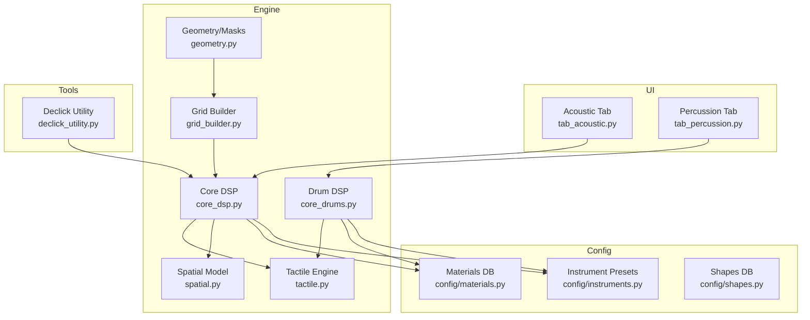
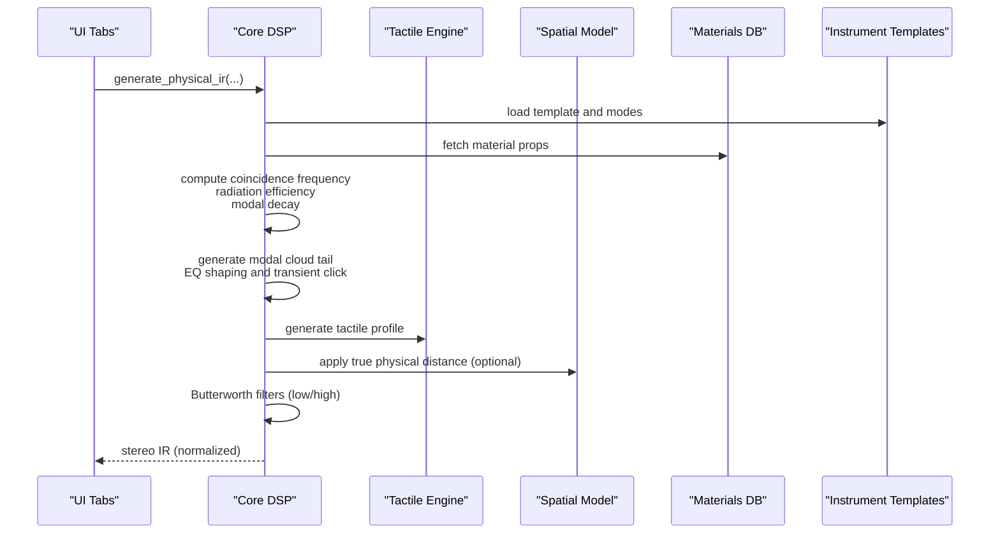
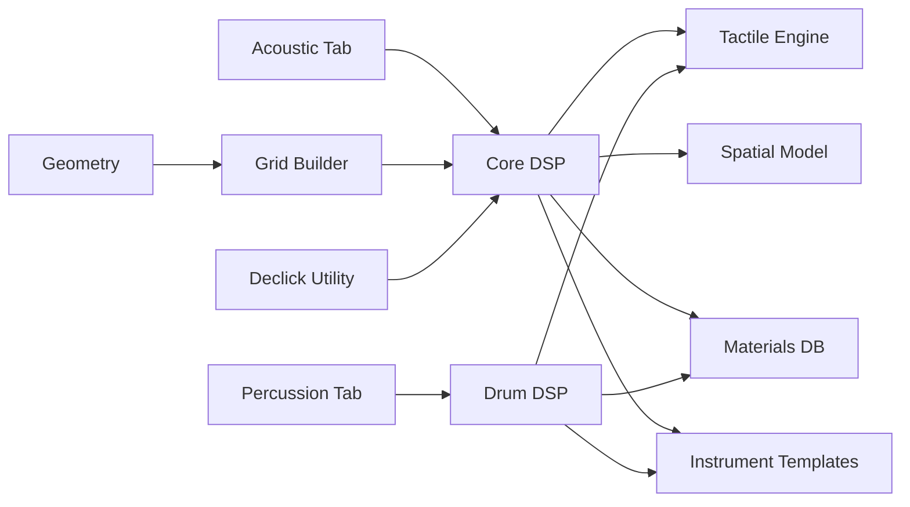

# DSP Algorithms

<cite>
**Referenced Files in This Document**
- [engine/core_dsp.py](file://engine/core_dsp.py)
- [engine/core_drums.py](file://engine/core_drums.py)
- [engine/tactile.py](file://engine/tactile.py)
- [engine/spatial.py](file://engine/spatial.py)
- [engine/grid_builder.py](file://engine/grid_builder.py)
- [engine/geometry.py](file://engine/geometry.py)
- [config/materials.py](file://config/materials.py)
- [config/instruments.py](file://config/instruments.py)
- [config/shapes.py](file://config/shapes.py)
- [ui/tab_acoustic.py](file://ui/tab_acoustic.py)
- [ui/tab_percussion.py](file://ui/tab_percussion.py)
- [tools/declick_utility.py](file://tools/declick_utility.py)
</cite>

## Table of Contents
1. [Introduction](#introduction)
2. [Project Structure](#project-structure)
3. [Core Components](#core-components)
4. [Architecture Overview](#architecture-overview)
5. [Detailed Component Analysis](#detailed-component-analysis)
6. [Dependency Analysis](#dependency-analysis)
7. [Performance Considerations](#performance-considerations)
8. [Troubleshooting Guide](#troubleshooting-guide)
9. [Conclusion](#conclusion)
10. [Appendices](#appendices)

## Introduction
This document explains the digital signal processing algorithms powering impulse response (IR) generation for acoustic and percussion instruments in TroakarIR. It covers modal synthesis methodology, physical damping models, wave propagation and frequency-domain analysis, time-domain filtering, transient click modeling, and tactile feedback integration. It also documents the pipeline from material properties to modal cloud synthesis to final stereo output, along with practical guidance for parameter manipulation, algorithm tuning, and performance optimization.

## Project Structure
The project is organized around a DSP engine, configuration databases, UI tabs, and auxiliary tools:
- engine: Core DSP modules for modal synthesis, tactile generation, spatial processing, and geometry/mask handling
- config: Material physics, instrument templates, and shape definitions
- ui: GUI tabs for acoustic and percussion IR generation
- tools: Post-processing utilities (e.g., declicking)

**Diagram sources**
- [ui/tab_acoustic.py:126-192](file://ui/tab_acoustic.py#L126-L192)
- [ui/tab_percussion.py:80-142](file://ui/tab_percussion.py#L80-L142)
- [engine/core_dsp.py:90-273](file://engine/core_dsp.py#L90-L273)
- [engine/core_drums.py:96-248](file://engine/core_drums.py#L96-L248)
- [engine/tactile.py:193-229](file://engine/tactile.py#L193-L229)
- [engine/spatial.py:5-61](file://engine/spatial.py#L5-L61)
- [engine/geometry.py:17-120](file://engine/geometry.py#L17-L120)
- [engine/grid_builder.py:10-87](file://engine/grid_builder.py#L10-L87)
- [config/materials.py:18-640](file://config/materials.py#L18-L640)
- [config/instruments.py:4-101](file://config/instruments.py#L4-L101)
- [tools/declick_utility.py:101-225](file://tools/declick_utility.py#L101-L225)

**Section sources**
- [ui/tab_acoustic.py:17-76](file://ui/tab_acoustic.py#L17-L76)
- [ui/tab_percussion.py:17-75](file://ui/tab_percussion.py#L17-L75)
- [engine/core_dsp.py:12-273](file://engine/core_dsp.py#L12-L273)
- [engine/core_drums.py:10-248](file://engine/core_drums.py#L10-L248)
- [engine/tactile.py:193-229](file://engine/tactile.py#L193-L229)
- [engine/spatial.py:5-61](file://engine/spatial.py#L5-L61)
- [engine/geometry.py:17-120](file://engine/geometry.py#L17-L120)
- [engine/grid_builder.py:10-87](file://engine/grid_builder.py#L10-L87)
- [config/materials.py:18-640](file://config/materials.py#L18-L640)
- [config/instruments.py:4-101](file://config/instruments.py#L4-L101)
- [tools/declick_utility.py:101-225](file://tools/declick_utility.py#L101-L225)

## Core Components
- Modal synthesis with coincidence frequency and radiation efficiency
- Physical damping via loss factors, viscoelasticity, and modal decay
- EQ shaping and transient click modeling
- Tactile feedback generation integrated with material textures
- Spatial distance modeling and stereo mixing
- Frequency-domain filtering and post-processing

Key functions and responsibilities:
- Coincidence frequency calculation and radiation efficiency
- Modal cloud synthesis with drift modulation and EQ shaping
- Drum and cymbal transient modeling with nonlinearities
- Tactile profile assembly from fibrous, fluid, granular, brittle, and inclusion layers
- Spatial distance effect with proximity, air absorption, comb-like room reflections, and stereo width
- Butterworth filters for low/high cuts and psychoacoustic adjustments

**Section sources**
- [engine/core_dsp.py:12-88](file://engine/core_dsp.py#L12-L88)
- [engine/core_dsp.py:90-273](file://engine/core_dsp.py#L90-L273)
- [engine/core_drums.py:10-66](file://engine/core_drums.py#L10-L66)
- [engine/core_drums.py:96-248](file://engine/core_drums.py#L96-L248)
- [engine/tactile.py:46-229](file://engine/tactile.py#L46-L229)
- [engine/spatial.py:5-61](file://engine/spatial.py#L5-L61)

## Architecture Overview
The IR generation pipeline integrates material physics, modal synthesis, tactile modeling, and spatial processing into a unified stereo output.

**Diagram sources**
- [ui/tab_acoustic.py:126-192](file://ui/tab_acoustic.py#L126-L192)
- [engine/core_dsp.py:90-273](file://engine/core_dsp.py#L90-L273)
- [engine/tactile.py:193-229](file://engine/tactile.py#L193-L229)
- [engine/spatial.py:5-61](file://engine/spatial.py#L5-L61)
- [config/materials.py:18-640](file://config/materials.py#L18-L640)
- [config/instruments.py:4-101](file://config/instruments.py#L4-L101)

## Detailed Component Analysis

### Modal Synthesis and Physical Damping
- Coincidence frequency computation for plates and shells using material density, Young’s modulus, Poisson ratio, and thickness
- Radiation efficiency computed as a function of frequency and coincidence frequency
- Modal decay governed by total loss (material loss factor, air loading, and viscous losses scaled by frequency)
- EQ shaping via a bridge-hill function to emphasize upper-midrange brightness

Implementation highlights:
- Coincidence frequency and radiation efficiency helpers
- Modal cloud synthesis with randomized frequencies, phases, and drift modulation
- EQ curve application to amplitude envelope per mode
- Tail generation with diffuse modal cloud and transient click modeling

**Section sources**
- [engine/core_dsp.py:12-32](file://engine/core_dsp.py#L12-L32)
- [engine/core_dsp.py:33-88](file://engine/core_dsp.py#L33-L88)

### Impulse Response Generation Pipeline
- Template-driven modal builder selects modes and amplitudes based on instrument category
- Effective density and modal decay vary depending on whether the mode couples to air or solid material
- Diffuse tail synthesized via modal clouds with higher-frequency start/end bounds
- Transient click modeled as a short-lived envelope-modulated modal cloud
- Wire rattle modeled as band-limited noise filtered by a bandpass and decayed by a loss-dependent time constant
- Sympathetic string ring modeled as weak sinusoidal decays at selected tunings
- Final stereo mix with perceptual balance and normalization

**Section sources**
- [engine/core_dsp.py:90-273](file://engine/core_dsp.py#L90-L273)
- [config/instruments.py:4-101](file://config/instruments.py#L4-L101)

### Drum and Cymbal Transients
- Mallet strike generation with chaotic phase jitter and amplitude envelopes
- Cymbal-specific bloom delay and FM wash for metallic “wash”
- Snare wire rattle modeled as amplitude-modulated oscillators keyed by membrane envelope
- Psychoacoustic distance and early reflection modeling with comb filters

**Section sources**
- [engine/core_drums.py:10-66](file://engine/core_drums.py#L10-L66)
- [engine/core_drums.py:96-248](file://engine/core_drums.py#L96-L248)

### Tactile Feedback Generation
- Fibrous waveshaping with strain-rate envelope and DC offset
- Fluid viscoelasticity with dynamic noise shaped by velocity envelope
- Granular stutter with acceleration-triggered gating and high-pass filtering
- Brittle cracks with stress-triggered sparse impulses and bandpass filtering
- Inclusions blending multiple materials into tactile profile
- Soft-knee limiting and slew filtering to prevent digital artifacts

**Section sources**
- [engine/tactile.py:46-229](file://engine/tactile.py#L46-L229)

### Spatial Distance Effects
- Proximity effect via first-order high-pass
- Air absorption via first-order low-pass with distance-dependent cutoff
- Stereo width narrowing proportional to distance
- Early room reflections via delayed comb filters with low-passed versions
- Final normalization and loudness scaling

**Section sources**
- [engine/spatial.py:5-61](file://engine/spatial.py#L5-L61)

### Frequency Domain Analysis and Filtering
- Butterworth filters for low-cut and high-cut with configurable order
- Parametric bell EQ for surgical corrections (e.g., peak at 8407.2 Hz)
- Notch filtering for grid-related artifacts
- Band-limited slewing and dynamic de-crackle in targeted bands

**Section sources**
- [engine/core_dsp.py:240-247](file://engine/core_dsp.py#L240-L247)
- [engine/core_drums.py:220-224](file://engine/core_drums.py#L220-L224)
- [tools/declick_utility.py:9-29](file://tools/declick_utility.py#L9-L29)
- [tools/declick_utility.py:31-99](file://tools/declick_utility.py#L31-L99)

### Geometry and Heterogeneous Materials
- Instrument mask generation from images or procedural shapes
- Strike and pickup points determined by instrument template type
- Heterogeneous grids built from base material plus inclusions with smoothing and anti-resonance edge viscosity

**Section sources**
- [engine/geometry.py:17-120](file://engine/geometry.py#L17-L120)
- [engine/grid_builder.py:10-87](file://engine/grid_builder.py#L10-L87)
- [config/shapes.py:2-7](file://config/shapes.py#L2-L7)

### Mathematical Foundations
- Wave propagation and modal decay governed by Euler–Bernoulli beam/plate theory and acoustic impedance matching
- Coincidence frequency marks the transition from mass-controlled to stiffness-controlled radiation
- Radiation efficiency increases with frequency below coincidence and saturates above
- Damping mechanisms include material loss, air loading, and viscous dissipation proportional to frequency
- EQ shaping and transient modeling introduce perceptual emphasis and attack characteristics

**Section sources**
- [engine/core_dsp.py:12-32](file://engine/core_dsp.py#L12-L32)
- [engine/core_dsp.py:64-67](file://engine/core_dsp.py#L64-L67)

### Implementation Details and Parameter Tuning
- Material database defines density, elastic moduli, Poisson ratio, loss factor, and viscous gamma
- Instrument templates define modal builders, transient click strength, and space flags
- UI exposes sliders for scale, duration, microphone distance, and toggles for auto-crop and snare rattle
- Filters and spatial effects are tuned for realism and loudness

Practical tips:
- Adjust user_scale to change geometric size and modal frequencies proportionally
- Tune transient_click to control initial click presence
- Modify bridge_hill center and width to shape upper-mid brightness
- Use auto-crop to remove silent tails and normalize energy
- Apply spatial distance for realistic off-axis and far-field effects

**Section sources**
- [config/materials.py:18-640](file://config/materials.py#L18-L640)
- [config/instruments.py:4-101](file://config/instruments.py#L4-L101)
- [ui/tab_acoustic.py:126-192](file://ui/tab_acoustic.py#L126-L192)
- [ui/tab_percussion.py:80-142](file://ui/tab_percussion.py#L80-L142)

### Post-Processing and Declicking
- Declick utility applies targeted EQ, notch filtering, band-limited slewing, and dynamic de-crackle
- Supports mono and stereo channels, preserves bit depth, and can overwrite originals

**Section sources**
- [tools/declick_utility.py:31-99](file://tools/declick_utility.py#L31-L99)
- [tools/declick_utility.py:101-225](file://tools/declick_utility.py#L101-L225)

## Dependency Analysis
The DSP modules depend on NumPy, SciPy signal routines, and configuration databases. The UI orchestrates calls to the DSP engines and writes WAV outputs.

**Diagram sources**
- [ui/tab_acoustic.py:126-192](file://ui/tab_acoustic.py#L126-L192)
- [ui/tab_percussion.py:80-142](file://ui/tab_percussion.py#L80-L142)
- [engine/core_dsp.py:90-273](file://engine/core_dsp.py#L90-L273)
- [engine/core_drums.py:96-248](file://engine/core_drums.py#L96-L248)
- [engine/tactile.py:193-229](file://engine/tactile.py#L193-L229)
- [engine/spatial.py:5-61](file://engine/spatial.py#L5-L61)
- [engine/geometry.py:17-120](file://engine/geometry.py#L17-L120)
- [engine/grid_builder.py:10-87](file://engine/grid_builder.py#L10-L87)
- [config/materials.py:18-640](file://config/materials.py#L18-L640)
- [config/instruments.py:4-101](file://config/instruments.py#L4-L101)
- [tools/declick_utility.py:101-225](file://tools/declick_utility.py#L101-L225)

**Section sources**
- [engine/core_dsp.py:90-273](file://engine/core_dsp.py#L90-L273)
- [engine/core_drums.py:96-248](file://engine/core_drums.py#L96-L248)
- [engine/tactile.py:193-229](file://engine/tactile.py#L193-L229)
- [engine/spatial.py:5-61](file://engine/spatial.py#L5-L61)
- [engine/geometry.py:17-120](file://engine/geometry.py#L17-L120)
- [engine/grid_builder.py:10-87](file://engine/grid_builder.py#L10-L87)
- [config/materials.py:18-640](file://config/materials.py#L18-L640)
- [config/instruments.py:4-101](file://config/instruments.py#L4-L101)
- [tools/declick_utility.py:101-225](file://tools/declick_utility.py#L101-L225)

## Performance Considerations
- Vectorization: All major loops operate on NumPy arrays; avoid Python loops for per-sample processing
- FFT-free design: Uses exponential decay and sine oscillators; efficient for real-time or offline generation
- Filter orders: Lower-order Butterworth filters reduce computational cost while maintaining smooth roll-offs
- Auto-crop: Removes trailing silence to minimize file size and memory footprint
- Normalization: Prevents clipping and ensures consistent loudness across outputs

[No sources needed since this section provides general guidance]

## Troubleshooting Guide
Common issues and remedies:
- Clipping or distortion: Reduce transient click strength, lower EQ boost, or adjust amplitude scaling
- Excessive noise or artifacts: Apply declick utility to remove high-frequency clicks and grid artifacts
- Unnatural reverberation: Decrease duration slider or disable auto-crop to preserve tails
- Weak high frequencies: Increase bridge_hill or adjust high-pass filter settings
- Spatial artifacts: Verify microphone distance setting and ensure spatial model is enabled for non-space templates

**Section sources**
- [tools/declick_utility.py:101-225](file://tools/declick_utility.py#L101-L225)
- [ui/tab_acoustic.py:126-192](file://ui/tab_acoustic.py#L126-L192)
- [engine/core_dsp.py:240-273](file://engine/core_dsp.py#L240-L273)

## Conclusion
TroakarIR’s DSP pipeline combines physically grounded modal synthesis, material-aware tactile feedback, and spatial distance modeling to produce realistic impulse responses. By leveraging material databases, template-driven modal builders, and targeted filtering, the system achieves both fidelity and performance. Users can tune parameters via the UI to achieve desired timbral balances and spatial effects, with optional post-processing for artifact removal.

[No sources needed since this section summarizes without analyzing specific files]

## Appendices

### Code Example Paths
- Modal synthesis and IR generation: [engine/core_dsp.py:90-273](file://engine/core_dsp.py#L90-L273)
- Drum/cymbal transient modeling: [engine/core_drums.py:10-66](file://engine/core_drums.py#L10-L66), [engine/core_drums.py:96-248](file://engine/core_drums.py#L96-L248)
- Tactile profile assembly: [engine/tactile.py:193-229](file://engine/tactile.py#L193-L229)
- Spatial distance model: [engine/spatial.py:5-61](file://engine/spatial.py#L5-L61)
- Butterworth filters and EQ: [engine/core_dsp.py:240-247](file://engine/core_dsp.py#L240-L247), [engine/core_drums.py:220-224](file://engine/core_drums.py#L220-L224), [tools/declick_utility.py:9-29](file://tools/declick_utility.py#L9-L29)
- Geometry and heterogeneous grids: [engine/geometry.py:17-120](file://engine/geometry.py#L17-L120), [engine/grid_builder.py:10-87](file://engine/grid_builder.py#L10-L87)
- Material database: [config/materials.py:18-640](file://config/materials.py#L18-L640)
- Instrument templates: [config/instruments.py:4-101](file://config/instruments.py#L4-L101)

### Parameter Manipulation Guide
- Scale: Controls geometric size and modal frequencies
- Duration: Limits modal tail length
- Microphone distance: Applies proximity, air absorption, and room early reflections
- Transient click: Strengthens or suppresses initial click
- Bridge hill: Emphasizes upper-mid brightness
- Auto-crop: Removes silent tails
- Snare rattle: Adds wire noise for snare-like textures

**Section sources**
- [ui/tab_acoustic.py:126-192](file://ui/tab_acoustic.py#L126-L192)
- [ui/tab_percussion.py:80-142](file://ui/tab_percussion.py#L80-L142)
- [engine/core_dsp.py:164-195](file://engine/core_dsp.py#L164-L195)
- [engine/core_drums.py:168-184](file://engine/core_drums.py#L168-L184)