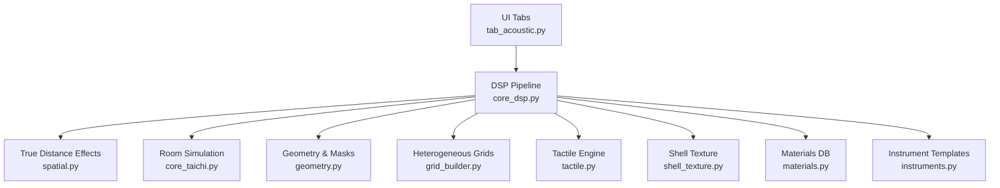
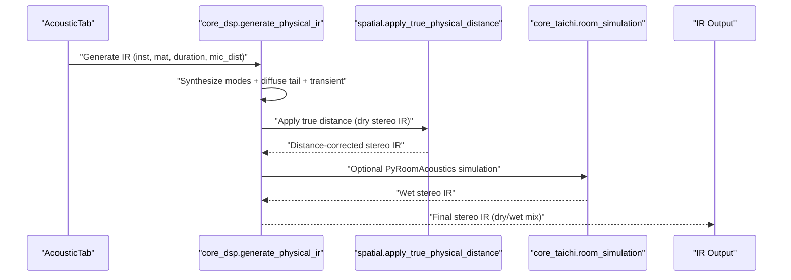
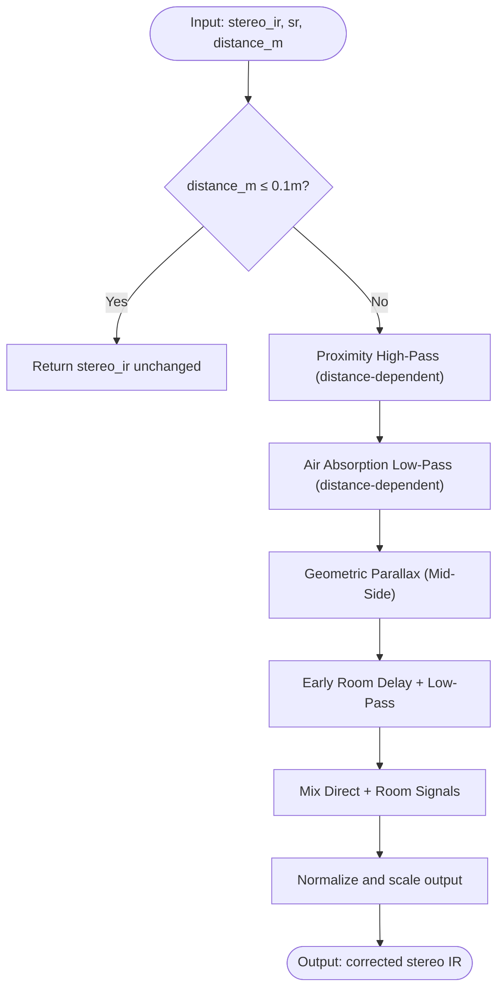
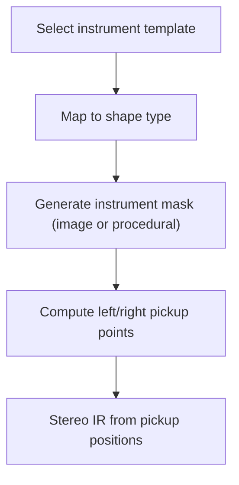
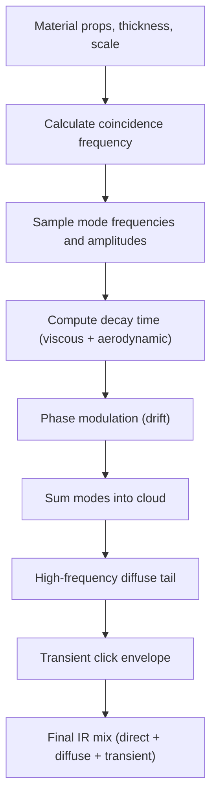
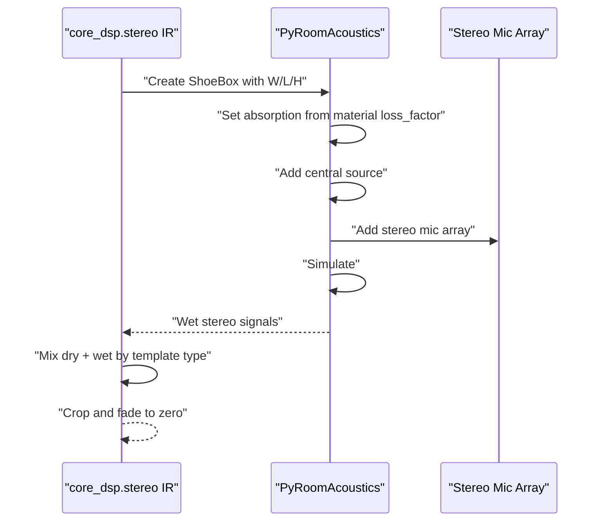
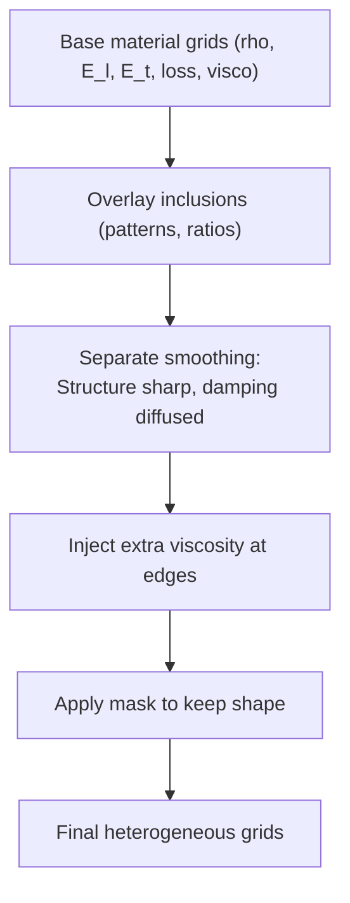
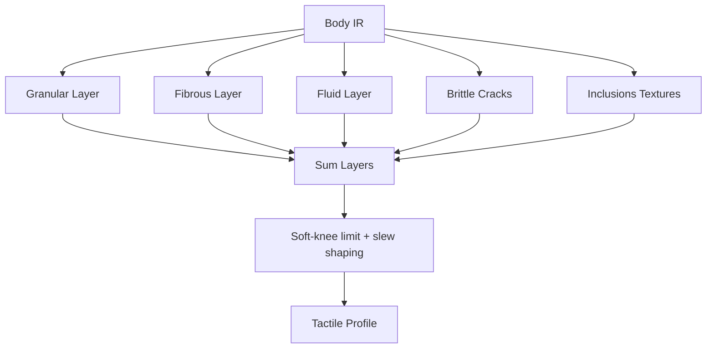
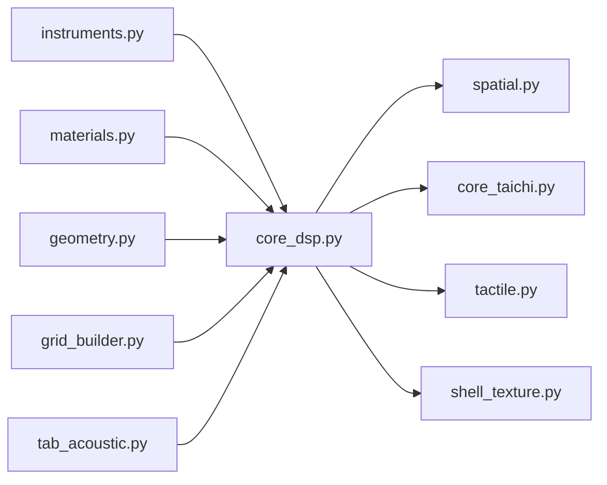

# Spatial Processing

<cite>
**Referenced Files in This Document**
- [spatial.py](file://engine/spatial.py)
- [core_dsp.py](file://engine/core_dsp.py)
- [geometry.py](file://engine/geometry.py)
- [grid_builder.py](file://engine/grid_builder.py)
- [tactile.py](file://engine/tactile.py)
- [shell_texture.py](file://engine/shell_texture.py)
- [core_taichi.py](file://engine/core_taichi.py)
- [tab_acoustic.py](file://ui/tab_acoustic.py)
- [gui.py](file://ui/gui.py)
- [main.py](file://main.py)
- [instruments.py](file://config/instruments.py)
- [materials.py](file://config/materials.py)
</cite>

## Table of Contents
1. [Introduction](#introduction)
2. [Project Structure](#project-structure)
3. [Core Components](#core-components)
4. [Architecture Overview](#architecture-overview)
5. [Detailed Component Analysis](#detailed-component-analysis)
6. [Dependency Analysis](#dependency-analysis)
7. [Performance Considerations](#performance-considerations)
8. [Troubleshooting Guide](#troubleshooting-guide)
9. [Conclusion](#conclusion)
10. [Appendices](#appendices)

## Introduction
This document describes the spatial audio processing systems in TroakarIR, focusing on true physical distance modeling, stereo imaging, acoustic space simulation, and room impulse response generation. It explains the mathematical models behind sound propagation in 3D space, proximity and air absorption filters, geometric stereo width narrowing, and the mixing of direct and early room signals. It also documents the integration with PyRoomAcoustics for realistic reverberant environments, performance considerations for real-time processing, and quality control measures for spatial audio fidelity.

## Project Structure
The spatial processing pipeline spans several modules:
- Geometry and mask generation define instrument shapes and pickup positions.
- DSP synthesis builds modal and diffuse tails and mixes them into stereo IRs.
- Spatial filtering applies true physical distance effects to dry stereo IRs.
- Room simulation integrates PyRoomAcoustics for shoebox reverberation.
- Tactile and shell texture engines add surface-dependent textures.
- UI orchestrates user controls and generation tasks.

**Diagram sources**
- [tab_acoustic.py:126-192](file://ui/tab_acoustic.py#L126-L192)
- [core_dsp.py:90-273](file://engine/core_dsp.py#L90-L273)
- [spatial.py:5-61](file://engine/spatial.py#L5-L61)
- [core_taichi.py:653-717](file://engine/core_taichi.py#L653-L717)
- [geometry.py:17-120](file://engine/geometry.py#L17-L120)
- [grid_builder.py:10-99](file://engine/grid_builder.py#L10-L99)
- [tactile.py:193-250](file://engine/tactile.py#L193-L250)
- [shell_texture.py:412-457](file://engine/shell_texture.py#L412-L457)
- [instruments.py:4-101](file://config/instruments.py#L4-L101)
- [materials.py:18-766](file://config/materials.py#L18-L766)

**Section sources**
- [main.py:23-76](file://main.py#L23-L76)
- [gui.py:8-46](file://ui/gui.py#L8-L46)
- [tab_acoustic.py:17-193](file://ui/tab_acoustic.py#L17-L193)

## Core Components
- True physical distance model: proximity effect, air absorption, stereo width narrowing, and early room blending.
- Modal and diffuse tail synthesis with radiation efficiency and loss modeling.
- Pickup position extraction for phase-accurate stereo imaging.
- Room impulse response generation via PyRoomAcoustics ShoeBox simulation.
- Heterogeneous material grids with viscosity smoothing at acoustic boundaries.
- Tactile and shell texture engines for surface-dependent textures.

**Section sources**
- [spatial.py:5-61](file://engine/spatial.py#L5-L61)
- [core_dsp.py:33-273](file://engine/core_dsp.py#L33-L273)
- [geometry.py:90-120](file://engine/geometry.py#L90-L120)
- [core_taichi.py:653-717](file://engine/core_taichi.py#L653-L717)
- [grid_builder.py:10-99](file://engine/grid_builder.py#L10-L99)
- [tactile.py:193-250](file://engine/tactile.py#L193-L250)
- [shell_texture.py:412-457](file://engine/shell_texture.py#L412-L457)

## Architecture Overview
The spatial processing architecture combines deterministic synthesis with probabilistic modal clouds and stochastic textures, then applies physical distance corrections and optional room simulation.

**Diagram sources**
- [tab_acoustic.py:126-192](file://ui/tab_acoustic.py#L126-L192)
- [core_dsp.py:90-273](file://engine/core_dsp.py#L90-L273)
- [spatial.py:5-61](file://engine/spatial.py#L5-L61)
- [core_taichi.py:653-717](file://engine/core_taichi.py#L653-L717)

## Detailed Component Analysis

### True Physical Distance Modeling
The function applies four stages:
1. Proximity effect (high-pass) for distances >1m.
2. Air absorption (low-pass) modeled as a distance-dependent cutoff.
3. Stereo width narrowing via geometric parallax (mid-side mixing).
4. Early room signal blending with distance-dependent weights and delays.

**Diagram sources**
- [spatial.py:5-61](file://engine/spatial.py#L5-L61)

**Section sources**
- [spatial.py:5-61](file://engine/spatial.py#L5-L61)

### Stereo Imaging and Pickup Geometry
Pickup points are derived from instrument templates to produce phase-accurate stereo pairs. The geometry module selects shapes and computes mask-based pickup locations, enabling realistic lateral placement.

**Diagram sources**
- [geometry.py:17-120](file://engine/geometry.py#L17-L120)
- [instruments.py:4-101](file://config/instruments.py#L4-L101)

**Section sources**
- [geometry.py:17-120](file://engine/geometry.py#L17-L120)
- [instruments.py:4-101](file://config/instruments.py#L4-L101)

### Modal Cloud Physics and Diffuse Tail Synthesis
The modal synthesis incorporates coincidence frequency, radiation efficiency, and viscous losses. It generates discrete modes with decay envelopes and phase modulation, plus a diffuse tail extending to high frequencies.

**Diagram sources**
- [core_dsp.py:33-273](file://engine/core_dsp.py#L33-L273)

**Section sources**
- [core_dsp.py:33-273](file://engine/core_dsp.py#L33-L273)

### Room Impulse Response Generation (PyRoomAcoustics)
The room simulation constructs a ShoeBox room with dimensions derived from instrument presets and material properties. A monaural source is placed centrally, and a stereo microphone array captures the wet signal. The dry and wet signals are mixed according to a wet ratio determined by template type.

**Diagram sources**
- [core_taichi.py:653-717](file://engine/core_taichi.py#L653-L717)

**Section sources**
- [core_taichi.py:653-717](file://engine/core_taichi.py#L653-L717)

### Heterogeneous Material Grids and Boundary Smoothing
Grid builder constructs heterogeneous grids from a base material and inclusions, applying spatial smoothing and injecting extra viscosity at acoustic boundaries to reduce spurious reflections.

**Diagram sources**
- [grid_builder.py:10-99](file://engine/grid_builder.py#L10-L99)

**Section sources**
- [grid_builder.py:10-99](file://engine/grid_builder.py#L10-L99)

### Tactile and Shell Texture Engines
These engines synthesize surface-dependent textures (granular, fibrous, fluid, brittle cracking) and combine them into a tactile profile. They include soft knee limiting and slew shaping to prevent digital artifacts.

**Diagram sources**
- [tactile.py:193-250](file://engine/tactile.py#L193-L250)
- [shell_texture.py:412-457](file://engine/shell_texture.py#L412-L457)

**Section sources**
- [tactile.py:193-250](file://engine/tactile.py#L193-L250)
- [shell_texture.py:412-457](file://engine/shell_texture.py#L412-L457)

### Implementation Details: apply_true_physical_distance
- Proximity effect: high-pass filter with distance-dependent cutoff.
- Air absorption: low-pass filter with distance-dependent cutoff.
- Stereo width narrowing: mid-side transform with distance-proportional width.
- Early room signal: delayed and low-pass filtered copy added with distance-dependent level.
- Normalization: peak normalization to a target RMS-like level.

Key references:
- [spatial.py:5-61](file://engine/spatial.py#L5-L61)

**Section sources**
- [spatial.py:5-61](file://engine/spatial.py#L5-L61)

### Multi-Speaker System Modeling
The room simulation uses a stereo microphone array positioned around the source to capture spatial cues. The wet signal is mixed with the dry IR according to template type (higher wet for “space” templates).

Key references:
- [core_taichi.py:653-717](file://engine/core_taichi.py#L653-L717)

**Section sources**
- [core_taichi.py:653-717](file://engine/core_taichi.py#L653-L717)

### Mathematical Models and Psychoacoustic Perception
- Proximity effect: high-pass filter to emulate near-field tilt reduction.
- Air absorption: distance-dependent low-pass to simulate atmospheric attenuation.
- Geometric stereo width: inverse-width scaling with distance to mimic perspective narrowing.
- Early room blending: distance-derived delay and level to approximate early reflection contribution.
- Radiation efficiency and loss: modal synthesis accounts for material damping and viscous effects.

Key references:
- [core_dsp.py:12-25](file://engine/core_dsp.py#L12-L25)
- [core_dsp.py:27-32](file://engine/core_dsp.py#L27-L32)
- [spatial.py:16-39](file://engine/spatial.py#L16-L39)

**Section sources**
- [core_dsp.py:12-32](file://engine/core_dsp.py#L12-L32)
- [spatial.py:16-39](file://engine/spatial.py#L16-L39)

## Dependency Analysis
The spatial processing pipeline depends on:
- Configurations for instruments and materials.
- Geometry and grid builders for shape and material distribution.
- DSP synthesis for modal and diffuse contributions.
- PyRoomAcoustics for room simulation.
- Tactile and shell texture engines for surface textures.

**Diagram sources**
- [instruments.py:4-101](file://config/instruments.py#L4-L101)
- [materials.py:18-766](file://config/materials.py#L18-L766)
- [geometry.py:17-120](file://engine/geometry.py#L17-L120)
- [grid_builder.py:10-99](file://engine/grid_builder.py#L10-L99)
- [core_dsp.py:90-273](file://engine/core_dsp.py#L90-L273)
- [spatial.py:5-61](file://engine/spatial.py#L5-L61)
- [core_taichi.py:653-717](file://engine/core_taichi.py#L653-L717)
- [tactile.py:193-250](file://engine/tactile.py#L193-L250)
- [shell_texture.py:412-457](file://engine/shell_texture.py#L412-L457)
- [tab_acoustic.py:126-192](file://ui/tab_acoustic.py#L126-L192)

**Section sources**
- [instruments.py:4-101](file://config/instruments.py#L4-L101)
- [materials.py:18-766](file://config/materials.py#L18-L766)
- [geometry.py:17-120](file://engine/geometry.py#L17-L120)
- [grid_builder.py:10-99](file://engine/grid_builder.py#L10-L99)
- [core_dsp.py:90-273](file://engine/core_dsp.py#L90-L273)
- [spatial.py:5-61](file://engine/spatial.py#L5-L61)
- [core_taichi.py:653-717](file://engine/core_taichi.py#L653-L717)
- [tactile.py:193-250](file://engine/tactile.py#L193-L250)
- [shell_texture.py:412-457](file://engine/shell_texture.py#L412-L457)
- [tab_acoustic.py:126-192](file://ui/tab_acoustic.py#L126-L192)

## Performance Considerations
- Modal synthesis: limit mode count and frequency range to balance realism and CPU usage.
- FFT convolution: cache and reuse modal IRs where applicable.
- Filtering: use efficient SOS filters and precompute coefficients.
- Room simulation: adjust max_order and sample rate to trade off accuracy and latency.
- Cropping and fades: detect silence envelopes to trim IR length and avoid clicks.
- Real-time constraints: consider downsampling or reducing resolution for interactive use.

[No sources needed since this section provides general guidance]

## Troubleshooting Guide
Common issues and remedies:
- Excessive noise or clicks: verify fade-in/out curves and silence cropping thresholds.
- Unnatural stereo width: adjust distance-dependent width scaling and ensure mid-side transforms are applied consistently.
- Room simulation mismatch: confirm source and mic positions relative to room dimensions and absorption values.
- Material artifacts: review heterogeneous grid smoothing and boundary viscosity injection.
- UI hangs during generation: ensure long-running tasks run in background threads and update status messages.

**Section sources**
- [tab_acoustic.py:149-192](file://ui/tab_acoustic.py#L149-L192)
- [core_dsp.py:254-273](file://engine/core_dsp.py#L254-L273)
- [spatial.py:54-61](file://engine/spatial.py#L54-L61)
- [core_taichi.py:699-717](file://engine/core_taichi.py#L699-L717)
- [grid_builder.py:63-87](file://engine/grid_builder.py#L63-L87)

## Conclusion
TroakarIR’s spatial processing combines physically grounded models—proximity, air absorption, geometric stereo narrowing, and early room blending—with robust modal synthesis and stochastic textures. Room simulation via PyRoomAcoustics adds realistic reverberation, while heterogeneous material grids and tactile engines enhance surface fidelity. The system balances realism and performance, with quality control mechanisms to ensure clean, artifact-free outputs suitable for spatial audio applications.

[No sources needed since this section summarizes without analyzing specific files]

## Appendices

### UI Integration and Controls
The acoustic tab exposes instrument selection, material selection, geometry scale, duration, microphone distance, and auto-crop toggles. Generation runs in a background thread and writes WAV files with automatic trimming.

**Section sources**
- [tab_acoustic.py:17-193](file://ui/tab_acoustic.py#L17-L193)
- [gui.py:8-46](file://ui/gui.py#L8-L46)
- [main.py:23-76](file://main.py#L23-L76)