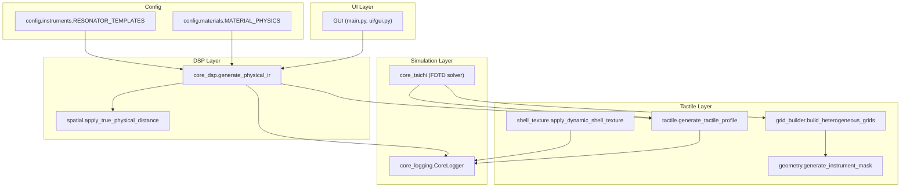
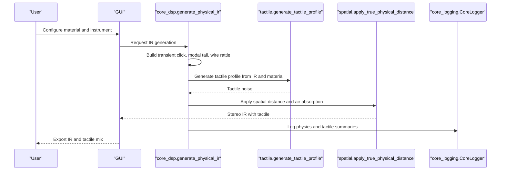
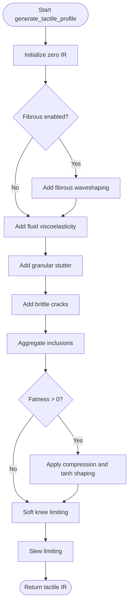
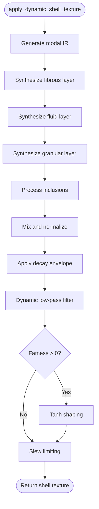
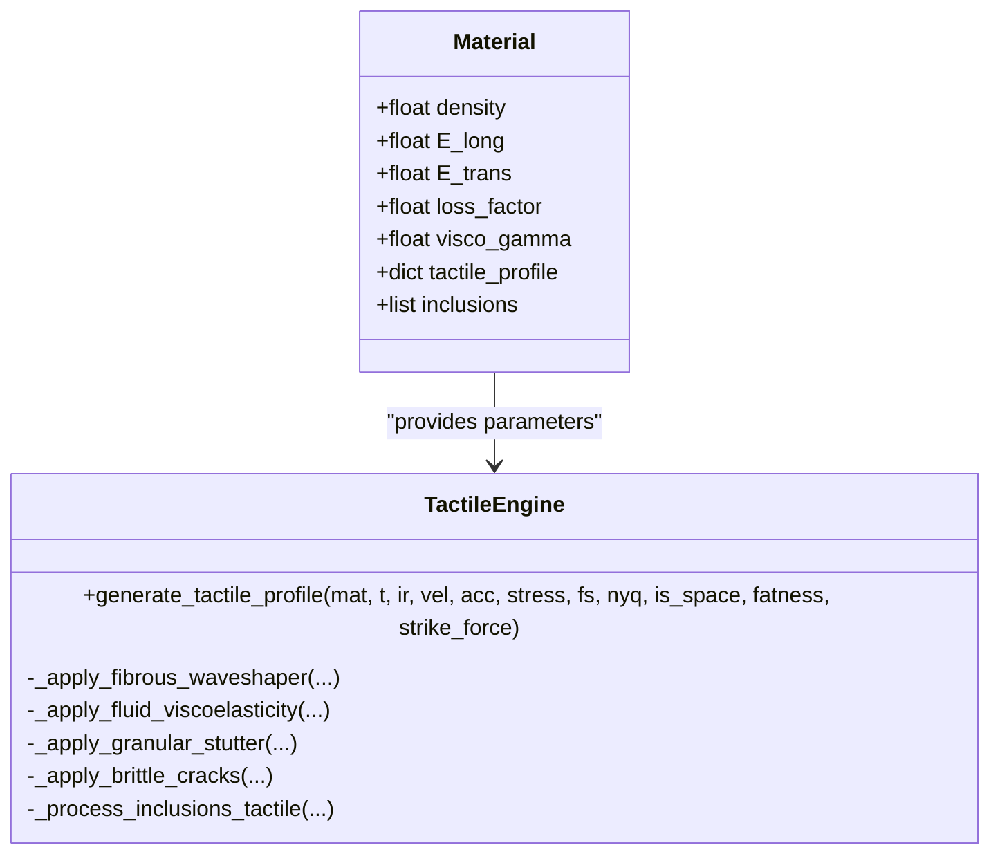
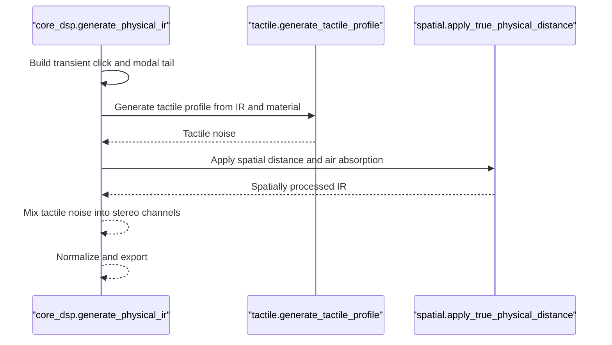
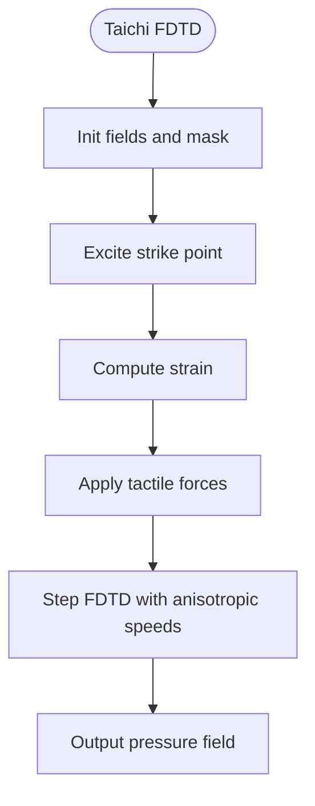
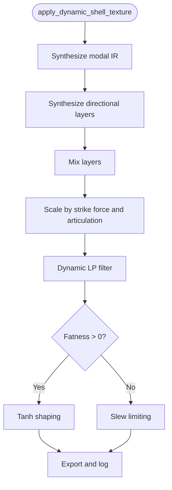
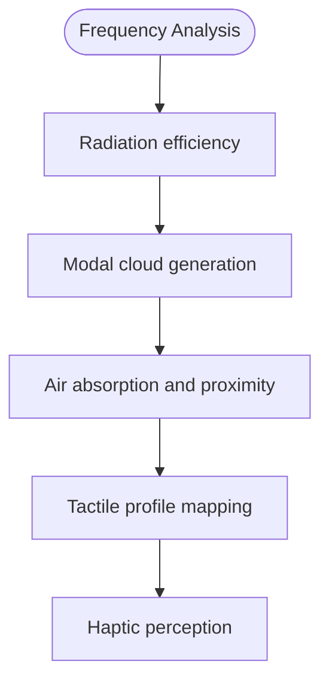
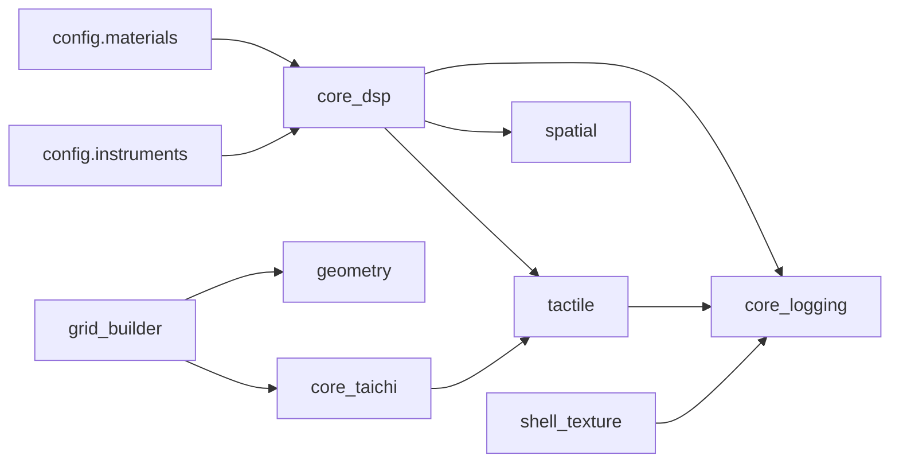

# Tactile and Haptic System

<cite>
**Referenced Files in This Document**
- [tactile.py](file://engine/tactile.py)
- [shell_texture.py](file://engine/shell_texture.py)
- [core_dsp.py](file://engine/core_dsp.py)
- [core_taichi.py](file://engine/core_taichi.py)
- [grid_builder.py](file://engine/grid_builder.py)
- [geometry.py](file://engine/geometry.py)
- [spatial.py](file://engine/spatial.py)
- [core_logging.py](file://engine/core_logging.py)
- [materials.py](file://config/materials.py)
- [instruments.py](file://config/instruments.py)
- [gui.py](file://ui/gui.py)
- [main.py](file://main.py)
</cite>

## Table of Contents
1. [Introduction](#introduction)
2. [Project Structure](#project-structure)
3. [Core Components](#core-components)
4. [Architecture Overview](#architecture-overview)
5. [Detailed Component Analysis](#detailed-component-analysis)
6. [Dependency Analysis](#dependency-analysis)
7. [Performance Considerations](#performance-considerations)
8. [Troubleshooting Guide](#troubleshooting-guide)
9. [Conclusion](#conclusion)
10. [Appendices](#appendices)

## Introduction
This document describes the tactile and haptic processing system in TroakarIR, focusing on how physical material properties are mapped into tactile sensations and how these sensations are integrated with audio impulse responses. It covers:
- Skin vibration modeling algorithms and tactile profile generation
- Touch-sound correlation mechanisms
- Material texture simulation and vibration pattern prediction
- Haptic feedback mapping techniques
- Integration between audio IR generation and tactile modeling
- Shell texture processing for surface property analysis and tactile impression quantification
- Biological basis for haptic perception, calibration procedures, and quality assessment methods

## Project Structure
The tactile and haptic system spans several modules:
- Tactile engine: generates tactile profiles from audio IRs and material properties
- Shell texture synthesis: creates directional tactile textures for surfaces
- DSP orchestration: builds full stereo IRs and integrates tactile signals
- Taichi FDTD solver: simulates wave propagation and applies tactile forces
- Geometry and grids: define instrument masks and heterogeneous material distributions
- Logging and UI: instrument physics logs and GUI integration

**Diagram sources**
- [main.py:23-76](file://main.py#L23-L76)
- [gui.py:8-46](file://ui/gui.py#L8-L46)
- [core_dsp.py:90-273](file://engine/core_dsp.py#L90-L273)
- [tactile.py:193-229](file://engine/tactile.py#L193-L229)
- [shell_texture.py:412-456](file://engine/shell_texture.py#L412-L456)
- [grid_builder.py:10-99](file://engine/grid_builder.py#L10-L99)
- [geometry.py:17-120](file://engine/geometry.py#L17-L120)
- [spatial.py:5-61](file://engine/spatial.py#L5-L61)
- [core_taichi.py:144-200](file://engine/core_taichi.py#L144-L200)
- [core_logging.py:38-203](file://engine/core_logging.py#L38-L203)
- [materials.py:18-766](file://config/materials.py#L18-L766)
- [instruments.py:4-101](file://config/instruments.py#L4-L101)

**Section sources**
- [main.py:23-76](file://main.py#L23-L76)
- [gui.py:8-46](file://ui/gui.py#L8-L46)
- [core_dsp.py:90-273](file://engine/core_dsp.py#L90-L273)

## Core Components
- Tactile Engine: synthesizes tactile noise from audio IRs and material parameters using fiber, fluid, granular, brittle, and inclusion layers. Includes soft knee limiting and slew limiting to prevent clipping.
- Shell Texture Synthesis: generates directional tactile textures for surfaces using modal synthesis, granular layers, fibrous layers, fluid layers, and inclusions.
- DSP Orchestration: builds full stereo impulse responses, adds transient clicks, diffuse tails, and tactile components, then spatially processes them.
- Taichi FDTD Solver: simulates wave propagation on heterogeneous grids and applies tactile forces based on strain and material properties.
- Geometry and Grid Builder: constructs instrument masks and heterogeneous material grids with anti-resonance smoothing.
- Materials and Instruments: provide physical parameters and templates for different instruments and materials.

**Section sources**
- [tactile.py:193-229](file://engine/tactile.py#L193-L229)
- [shell_texture.py:412-456](file://engine/shell_texture.py#L412-L456)
- [core_dsp.py:90-273](file://engine/core_dsp.py#L90-L273)
- [core_taichi.py:144-200](file://engine/core_taichi.py#L144-L200)
- [grid_builder.py:10-99](file://engine/grid_builder.py#L10-L99)
- [materials.py:18-766](file://config/materials.py#L18-L766)
- [instruments.py:4-101](file://config/instruments.py#L4-L101)

## Architecture Overview
The system integrates tactile modeling with acoustic IR generation:
- Audio IRs are generated by the DSP layer, incorporating transient clicks, modal tails, and optional wire rattle.
- Tactile profiles are generated from the IRs and material parameters and mixed into the stereo channels.
- Spatial processing adjusts for microphone distance and air absorption.
- Taichi FDTD simulations can be used to compute tactile forces on heterogeneous grids and feed back into tactile profiles.

**Diagram sources**
- [core_dsp.py:90-273](file://engine/core_dsp.py#L90-L273)
- [tactile.py:193-229](file://engine/tactile.py#L193-L229)
- [spatial.py:5-61](file://engine/spatial.py#L5-L61)
- [core_logging.py:133-186](file://engine/core_logging.py#L133-L186)

## Detailed Component Analysis

### Tactile Profile Generation
The tactile engine composes multiple layers:
- Fibrous waveshaping: models crackling and fibrous texture from velocity envelopes.
- Fluid viscoelasticity: models internal friction and noise modulation from velocity envelopes.
- Granular stutter: models particulate effects from acceleration envelopes.
- Brittle cracks: models microfractures from stress envelopes with bandpass filtering.
- Inclusions: aggregates contributions from embedded materials with density ratios.
- Fatness shaping: applies gentle compression and tanh shaping.
- Protection: soft knee limiting and slew limiting to avoid clipping.

**Diagram sources**
- [tactile.py:193-229](file://engine/tactile.py#L193-L229)
- [tactile.py:46-187](file://engine/tactile.py#L46-L187)

**Section sources**
- [tactile.py:193-229](file://engine/tactile.py#L193-L229)
- [tactile.py:46-187](file://engine/tactile.py#L46-L187)

### Shell Texture Processing
The shell texture module synthesizes directional tactile textures:
- Modal synthesis of plate vibrations with damping and viscoelasticity.
- Fibrous layer modeled as comb-filtered Brownian motion with tearing modulation.
- Fluid layer modeled as LFO-amplitude modulated noise.
- Granular layer modeled as temporally varying FM bursts with exponential envelopes.
- Inclusions modeled as speckled or vein-like distributions with band-limited noise.
- Dynamic scaling by strike force, fatness, and articulation.

**Diagram sources**
- [shell_texture.py:412-456](file://engine/shell_texture.py#L412-L456)
- [shell_texture.py:283-406](file://engine/shell_texture.py#L283-L406)

**Section sources**
- [shell_texture.py:412-456](file://engine/shell_texture.py#L412-L456)
- [shell_texture.py:283-406](file://engine/shell_texture.py#L283-L406)

### Haptic Feedback Mapping
Haptic mapping is achieved by correlating material parameters to tactile features:
- Fibrousness correlates to crackling and fibrous texture.
- Fluidity correlates to internal friction and fluctuating noise.
- Granularity correlates to particulate effects and grain rate.
- Brittleness correlates to microfracture events and bandpass-filtered impulses.
- Inclusions correlate to localized tactile features with density ratios.

**Diagram sources**
- [tactile.py:193-229](file://engine/tactile.py#L193-L229)
- [materials.py:18-766](file://config/materials.py#L18-L766)

**Section sources**
- [tactile.py:193-229](file://engine/tactile.py#L193-L229)
- [materials.py:18-766](file://config/materials.py#L18-L766)

### Integration Between Audio IR Generation and Tactile Modeling
The DSP orchestrator builds stereo IRs and integrates tactile components:
- Transient click, modal diffuse tail, and optional wire rattle.
- Tactile profile generation from the IR and material parameters.
- Mixing tactile noise into left/right channels with stereo balance.
- Spatial processing for realistic distance and air absorption.
- Fade-in/out and normalization.

**Diagram sources**
- [core_dsp.py:90-273](file://engine/core_dsp.py#L90-L273)
- [tactile.py:193-229](file://engine/tactile.py#L193-L229)
- [spatial.py:5-61](file://engine/spatial.py#L5-L61)

**Section sources**
- [core_dsp.py:90-273](file://engine/core_dsp.py#L90-L273)

### Taichi FDTD Simulation and Tactile Forces
The Taichi solver simulates wave propagation on heterogeneous grids and applies tactile forces:
- Initializes pressure fields and masks.
- Excites strike points with Gaussian impulses.
- Applies tactile forces based on strain and material parameters (granular, fluid, brittle, fibrous).
- Steps the FDTD solver with anisotropic speeds and viscoelastic damping.
- Loads heterogeneous grids (density, elastic moduli, loss, viscosity) and smooths boundaries.

**Diagram sources**
- [core_taichi.py:43-143](file://engine/core_taichi.py#L43-L143)
- [core_taichi.py:151-200](file://engine/core_taichi.py#L151-L200)
- [grid_builder.py:10-99](file://engine/grid_builder.py#L10-L99)

**Section sources**
- [core_taichi.py:43-143](file://engine/core_taichi.py#L43-L143)
- [core_taichi.py:151-200](file://engine/core_taichi.py#L151-L200)
- [grid_builder.py:10-99](file://engine/grid_builder.py#L10-L99)

### Shell Texture Processing for Surface Property Analysis
Surface property analysis and tactile impression quantification:
- Modal bank generation with stiffness, damping, and viscoelasticity.
- Directional layer synthesis (fibrous, fluid, granular).
- Inclusion pattern modeling (specks vs veins).
- Dynamic scaling by strike force and articulation.
- Logging of tactile summaries and inclusion collisions.

**Diagram sources**
- [shell_texture.py:412-456](file://engine/shell_texture.py#L412-L456)
- [shell_texture.py:283-406](file://engine/shell_texture.py#L283-L406)

**Section sources**
- [shell_texture.py:412-456](file://engine/shell_texture.py#L412-L456)
- [shell_texture.py:283-406](file://engine/shell_texture.py#L283-L406)

### Vibration Frequency Analysis and Haptic Perception
Vibration frequency analysis and haptic perception mapping:
- Frequency-dependent radiation efficiency and coincidence frequency calculation.
- Modal cloud generation with drift and phase modulation.
- Air absorption and proximity effect filters.
- Tactile profiles correlate to perceived roughness, stick-slip, and particle effects.

**Diagram sources**
- [core_dsp.py:12-88](file://engine/core_dsp.py#L12-L88)
- [spatial.py:5-61](file://engine/spatial.py#L5-L61)
- [tactile.py:46-187](file://engine/tactile.py#L46-L187)

**Section sources**
- [core_dsp.py:12-88](file://engine/core_dsp.py#L12-L88)
- [spatial.py:5-61](file://engine/spatial.py#L5-L61)
- [tactile.py:46-187](file://engine/tactile.py#L46-L187)

## Dependency Analysis
Key dependencies and relationships:
- Tactile engine depends on material parameters and IRs.
- DSP orchestrator depends on instrument templates and materials.
- Taichi solver depends on heterogeneous grids and geometry.
- Logging depends on CoreLogger for instrumentation.

**Diagram sources**
- [materials.py:18-766](file://config/materials.py#L18-L766)
- [instruments.py:4-101](file://config/instruments.py#L4-L101)
- [core_dsp.py:90-273](file://engine/core_dsp.py#L90-L273)
- [tactile.py:193-229](file://engine/tactile.py#L193-L229)
- [spatial.py:5-61](file://engine/spatial.py#L5-L61)
- [grid_builder.py:10-99](file://engine/grid_builder.py#L10-L99)
- [geometry.py:17-120](file://engine/geometry.py#L17-L120)
- [core_taichi.py:144-200](file://engine/core_taichi.py#L144-L200)
- [core_logging.py:38-203](file://engine/core_logging.py#L38-L203)
- [shell_texture.py:412-456](file://engine/shell_texture.py#L412-L456)

**Section sources**
- [materials.py:18-766](file://config/materials.py#L18-L766)
- [instruments.py:4-101](file://config/instruments.py#L4-L101)
- [core_dsp.py:90-273](file://engine/core_dsp.py#L90-L273)

## Performance Considerations
- Vectorized envelope followers and filters reduce CPU overhead.
- FFT-based convolution for modal synthesis scales well with modes.
- Taichi FDTD benefits from GPU acceleration; ensure adequate resolution limits.
- Logging buffers are ring-buffered and flushed periodically to minimize I/O impact.
- Dynamic low-pass filtering and slewing prevent clipping and improve stability.

[No sources needed since this section provides general guidance]

## Troubleshooting Guide
Common issues and resolutions:
- Clipping in tactile mixing: use soft knee limiting and slew limiting in the tactile engine.
- Excessive noise or artifacts: adjust strike force and fatness parameters; verify material tactile profiles.
- Inconsistent tactile impressions: verify inclusion density ratios and layer blending.
- Logging not appearing: check verbosity settings and log file paths.

**Section sources**
- [tactile.py:23-40](file://engine/tactile.py#L23-L40)
- [tactile.py:225-229](file://engine/tactile.py#L225-L229)
- [core_logging.py:112-131](file://engine/core_logging.py#L112-L131)

## Conclusion
TroakarIR’s tactile and haptic system integrates physical material models with audio IR generation and optional Taichi FDTD simulation. The tactile engine maps material parameters to perceptible tactile features, while shell texture synthesis provides directional surface textures. The DSP orchestrator blends these components into realistic stereo IRs with spatial processing. Logging enables instrumentation and quality assessment, and heterogeneous grids support advanced tactile force modeling.

[No sources needed since this section summarizes without analyzing specific files]

## Appendices

### Appendix A: Material Categories and Templates
- Material categories include wood, metal, bio, polymer, mineral, synthetic.
- Instrument templates define modal builders and transient characteristics.

**Section sources**
- [materials.py:9-16](file://config/materials.py#L9-L16)
- [instruments.py:4-101](file://config/instruments.py#L4-L101)

### Appendix B: Geometry and Mask Generation
- Masks are loaded from images or procedurally generated based on instrument templates.
- Strike and pickup points are computed for phase-accurate stereo capture.

**Section sources**
- [geometry.py:17-120](file://engine/geometry.py#L17-L120)

### Appendix C: Taichi Initialization and Field Management
- Taichi runtime initialization and field allocation for FDTD simulation.
- Heterogeneous grids are padded to maximum size and loaded into Taichi fields.

**Section sources**
- [core_taichi.py:14-21](file://engine/core_taichi.py#L14-L21)
- [core_taichi.py:144-149](file://engine/core_taichi.py#L144-L149)