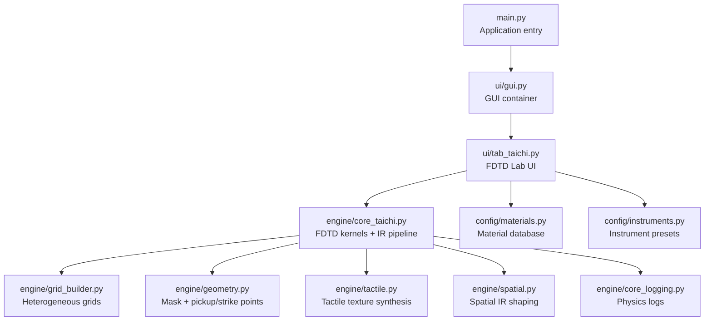
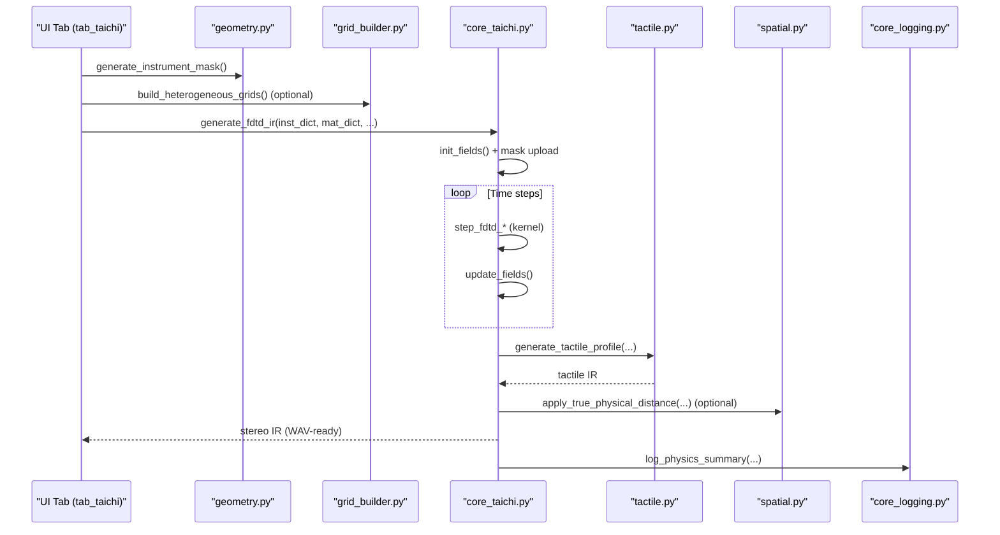
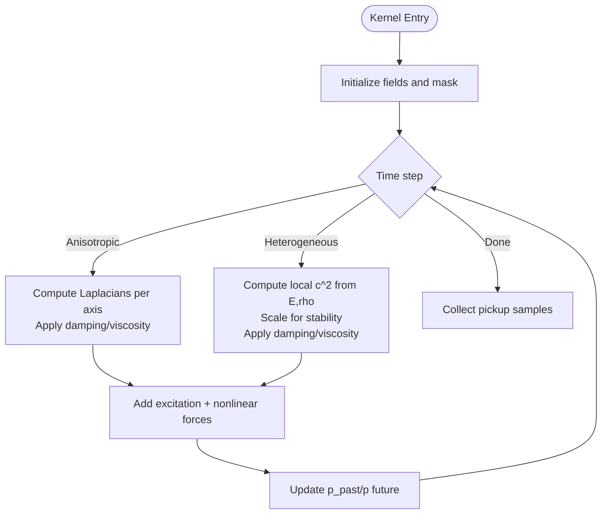
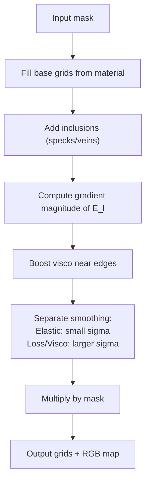
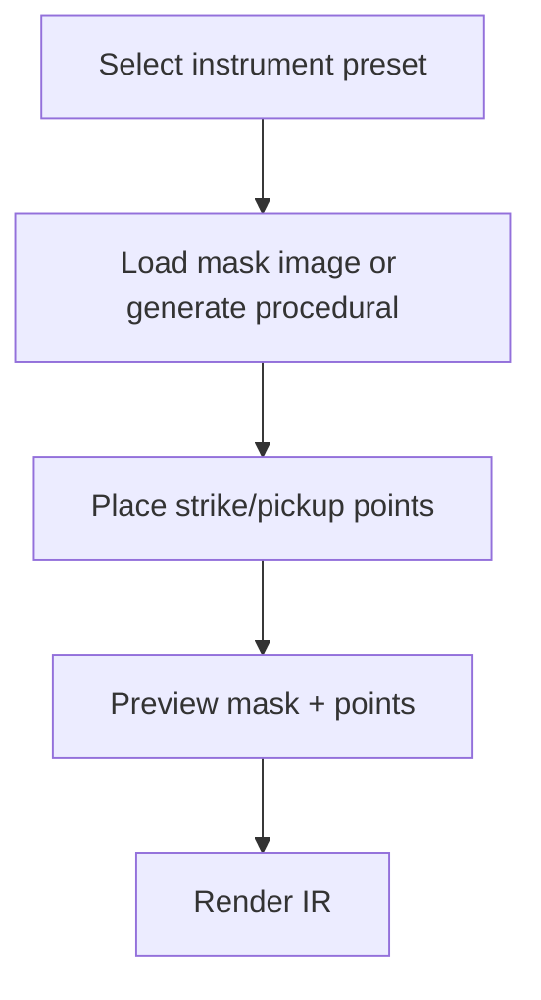
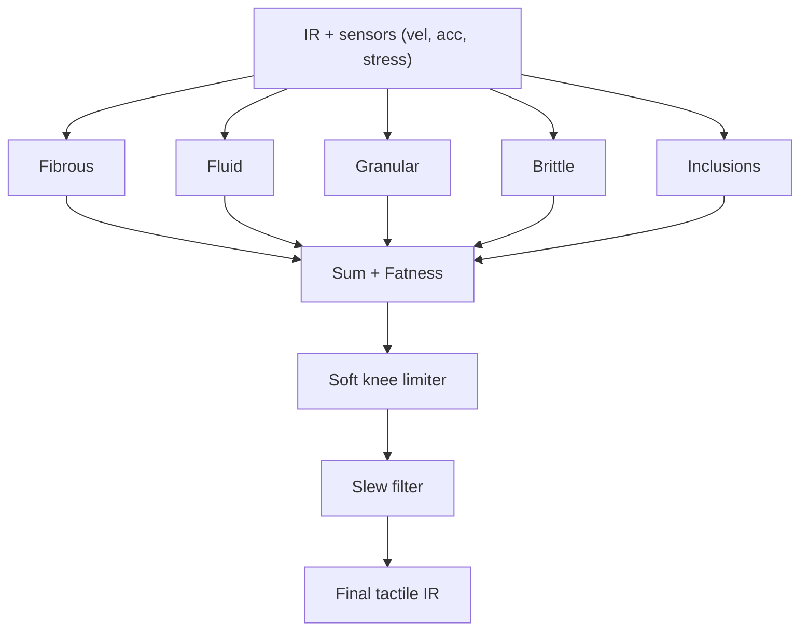
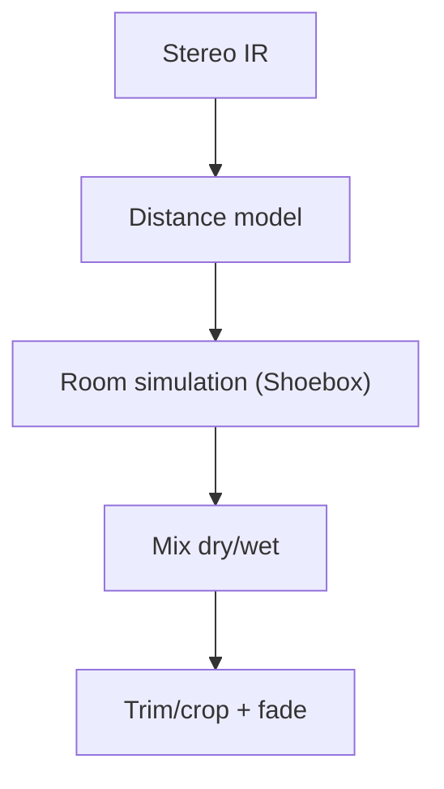
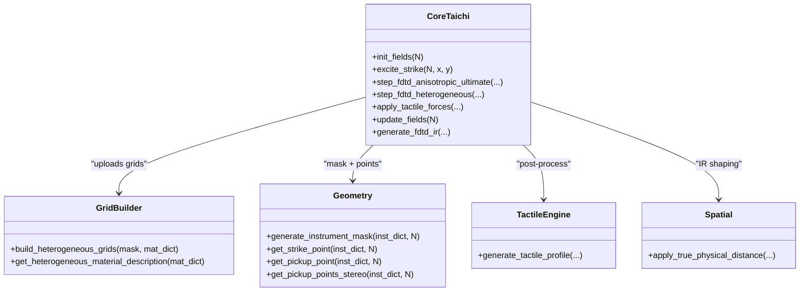
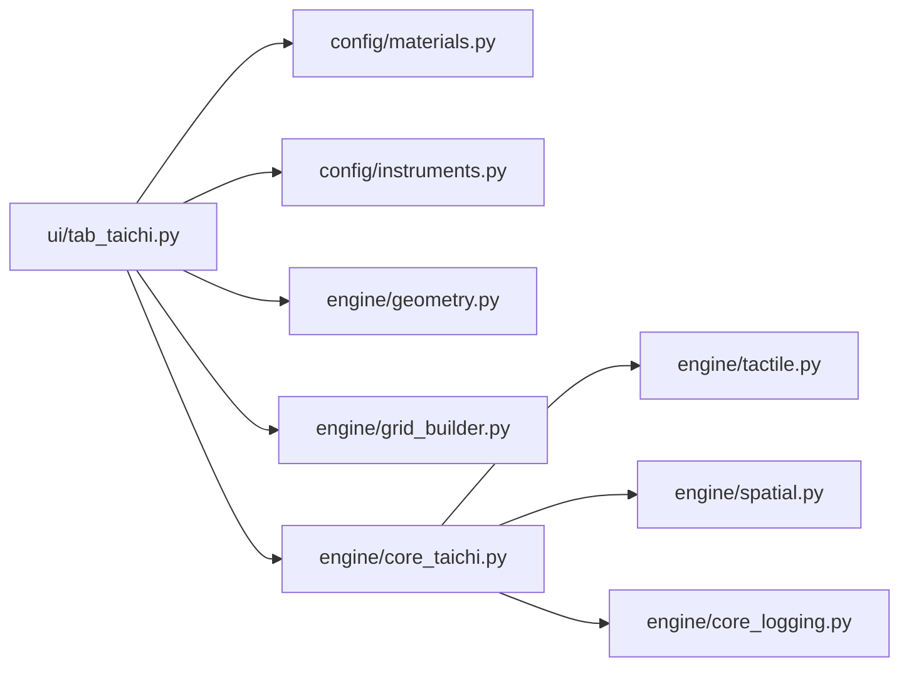

# Taichi FDTD Engine

<cite>
**Referenced Files in This Document**
- [main.py](file://main.py)
- [ui/gui.py](file://ui/gui.py)
- [ui/tab_taichi.py](file://ui/tab_taichi.py)
- [ui/README_tab_taichi.md](file://ui/README_tab_taichi.md)
- [engine/core_taichi.py](file://engine/core_taichi.py)
- [engine/grid_builder.py](file://engine/grid_builder.py)
- [engine/geometry.py](file://engine/geometry.py)
- [engine/tactile.py](file://engine/tactile.py)
- [engine/spatial.py](file://engine/spatial.py)
- [engine/core_logging.py](file://engine/core_logging.py)
- [config/materials.py](file://config/materials.py)
- [config/instruments.py](file://config/instruments.py)
</cite>

## Table of Contents
1. [Introduction](#introduction)
2. [Project Structure](#project-structure)
3. [Core Components](#core-components)
4. [Architecture Overview](#architecture-overview)
5. [Detailed Component Analysis](#detailed-component-analysis)
6. [Dependency Analysis](#dependency-analysis)
7. [Performance Considerations](#performance-considerations)
8. [Troubleshooting Guide](#troubleshooting-guide)
9. [Conclusion](#conclusion)
10. [Appendices](#appendices)

## Introduction
This document describes the Taichi-based finite-difference time-domain (FDTD) simulation engine powering impulse response (IR) synthesis for musical instruments and percussive objects. It explains GPU-accelerated wave propagation, grid construction, boundary conditions, heterogeneous material mapping, and the GUI-driven workflow. It also covers Taichi language usage patterns, tensor operations, parallel computation strategies, performance tuning, and practical guidance for debugging and artifact mitigation.

## Project Structure
The project is organized around a modular Python application with a Tkinter GUI and a physics engine built on Taichi. Key areas:
- UI: Notebook tabs for acoustic, percussion, and the FDTD lab.
- Engine: FDTD kernels, geometry/mask generation, heterogeneous grid building, tactile post-processing, and spatial effects.
- Config: Material database and instrument presets.
- Logging: Core instrumentation and runtime logs.

**Diagram sources**
- [main.py:23-76](file://main.py#L23-L76)
- [ui/gui.py:8-46](file://ui/gui.py#L8-L46)
- [ui/tab_taichi.py:38-743](file://ui/tab_taichi.py#L38-L743)
- [engine/core_taichi.py:1-717](file://engine/core_taichi.py#L1-L717)
- [engine/grid_builder.py:10-99](file://engine/grid_builder.py#L10-L99)
- [engine/geometry.py:17-120](file://engine/geometry.py#L17-L120)
- [engine/tactile.py:193-250](file://engine/tactile.py#L193-L250)
- [engine/spatial.py:5-61](file://engine/spatial.py#L5-L61)
- [engine/core_logging.py:38-203](file://engine/core_logging.py#L38-L203)
- [config/materials.py:18-766](file://config/materials.py#L18-L766)
- [config/instruments.py:3-279](file://config/instruments.py#L3-L279)

**Section sources**
- [main.py:23-76](file://main.py#L23-L76)
- [ui/gui.py:8-46](file://ui/gui.py#L8-L46)
- [ui/tab_taichi.py:38-743](file://ui/tab_taichi.py#L38-L743)

## Core Components
- Taichi FDTD kernels: Anisotropic and heterogeneous wave propagation with damping, viscosity, and nonlinear fracture.
- Geometry and mask generation: Procedural shapes and image-based masks for instrument outlines.
- Heterogeneous grid builder: Material blending and inclusion mapping with anti-resonance smoothing.
- Tactile synthesis: Fibrous, fluid, granular, brittle, and inclusion-based textures.
- Spatial IR shaping: Room simulation and distance modeling.
- Logging and diagnostics: Structured JSON/CSV logs for physics summaries and tactile events.

**Section sources**
- [engine/core_taichi.py:43-227](file://engine/core_taichi.py#L43-L227)
- [engine/geometry.py:17-88](file://engine/geometry.py#L17-L88)
- [engine/grid_builder.py:10-87](file://engine/grid_builder.py#L10-L87)
- [engine/tactile.py:193-250](file://engine/tactile.py#L193-L250)
- [engine/spatial.py:5-61](file://engine/spatial.py#L5-L61)
- [engine/core_logging.py:38-203](file://engine/core_logging.py#L38-L203)

## Architecture Overview
The FDTD pipeline runs inside a Taichi kernel, with precomputed masks and optional heterogeneous material grids. The UI orchestrates geometry, material selection, and rendering parameters, then invokes the core generator to produce stereo IRs with optional tactile textures and room simulation.

**Diagram sources**
- [ui/tab_taichi.py:622-742](file://ui/tab_taichi.py#L622-L742)
- [engine/geometry.py:17-88](file://engine/geometry.py#L17-L88)
- [engine/grid_builder.py:10-87](file://engine/grid_builder.py#L10-L87)
- [engine/core_taichi.py:266-717](file://engine/core_taichi.py#L266-L717)
- [engine/tactile.py:193-250](file://engine/tactile.py#L193-L250)
- [engine/spatial.py:5-61](file://engine/spatial.py#L5-L61)
- [engine/core_logging.py:133-138](file://engine/core_logging.py#L133-L138)

## Detailed Component Analysis

### Taichi FDTD Kernels and Wave Propagation
- Field initialization and boundary handling: Fields initialized to zero within the active N×N region; boundaries are set to zero to absorb reflections.
- Excitation modes:
  - Strike: localized Gaussian excitation near the strike point.
  - Friction: bow-like excitation modeled as a time-varying signal injected at the strike point.
- Wave equation variants:
  - Anisotropic ultimate: Separate speed-of-sound along x/y directions; optional yield-stress limiting and fracture noise.
  - Heterogeneous: Per-cell density, longitudinal/transverse elastic moduli, loss, and viscosity; automatic CFL scaling via substepping.
- Nonlinear effects:
  - Yield stress reduces stiffness locally; fracture noise adds squeak and grit.
  - Fluidity introduces sinusoidal forcing proportional to pressure.
- Tactile forces: Randomly applied strains near the strike point to simulate fibrous/granular/brittle/fluid textures.

**Diagram sources**
- [engine/core_taichi.py:43-227](file://engine/core_taichi.py#L43-L227)

**Section sources**
- [engine/core_taichi.py:43-227](file://engine/core_taichi.py#L43-L227)

### Grid Construction and Heterogeneous Materials
- Base grids: rho, E_long, E_trans, loss, visco filled with material defaults.
- Inclusions: Speckled or veined distributions with configurable density ratios; mapped onto the mask.
- Anti-resonance smoothing: Gradient magnitude of E_l highlights edges; extra viscosity is injected there to reduce acoustic mismatch.
- Final smoothing: Separate Gaussian smoothing for elastic parameters vs. loss/visco to preserve tactile contrast.
- Mask multiplication ensures grids are zero outside the instrument outline.

**Diagram sources**
- [engine/grid_builder.py:10-87](file://engine/grid_builder.py#L10-L87)

**Section sources**
- [engine/grid_builder.py:10-87](file://engine/grid_builder.py#L10-L87)

### Geometry and Point Placement
- Instrument mask generation:
  - Image-based masks from the masks directory if provided.
  - Fallback procedural shapes (circle, square, violin, guitar, bar, horn, hall).
- Strike and pickup placement:
  - Automatic defaults per template.
  - Interactive editing in the UI canvas; updates preview and optical mask.

**Diagram sources**
- [engine/geometry.py:17-88](file://engine/geometry.py#L17-L88)
- [ui/tab_taichi.py:350-436](file://ui/tab_taichi.py#L350-L436)

**Section sources**
- [engine/geometry.py:17-120](file://engine/geometry.py#L17-L120)
- [ui/tab_taichi.py:350-436](file://ui/tab_taichi.py#L350-L436)

### Tactile Texture Synthesis
- Four tactile generators:
  - Fibrous: waveshaping driven by velocity envelope; wood accent adds harmonic buzz.
  - Fluid: dynamic noise shaped by velocity envelope; separates low/high components.
  - Granular: gated high-frequency noise triggered by acceleration envelopes.
  - Brittle: sparse crack impulses based on stress thresholds; bandpassed.
  - Inclusions: virtual materials embedded in the host matrix contribute granular/fibrous.
- Fatness: amplitude boost with tanh soft limiting.
- Soft knee limiter and slew filtering prevent digital artifacts.

**Diagram sources**
- [engine/tactile.py:193-250](file://engine/tactile.py#L193-L250)

**Section sources**
- [engine/tactile.py:193-250](file://engine/tactile.py#L193-L250)

### Spatial IR Shaping and Room Simulation
- Optional physical distance model: proximity HP, air absorption LP, stereo width narrowing, and early room contribution.
- Room simulation via pyroomacoustics Shoebox with absorption and microphone arrays.

**Diagram sources**
- [engine/spatial.py:5-61](file://engine/spatial.py#L5-L61)
- [engine/core_taichi.py:653-698](file://engine/core_taichi.py#L653-L698)

**Section sources**
- [engine/spatial.py:5-61](file://engine/spatial.py#L5-L61)
- [engine/core_taichi.py:653-698](file://engine/core_taichi.py#L653-L698)

### Taichi Language Usage Patterns and Parallel Computation
- Field declarations and ND-range loops enable massive parallelism across grid points.
- Kernel decorators compile Python loops into GPU kernels.
- NumPy interop for mask uploads and visualization.
- Substepping to satisfy CFL stability with automatic M calculation.

**Diagram sources**
- [engine/core_taichi.py:43-227](file://engine/core_taichi.py#L43-L227)
- [engine/grid_builder.py:10-87](file://engine/grid_builder.py#L10-L87)
- [engine/geometry.py:17-120](file://engine/geometry.py#L17-L120)
- [engine/tactile.py:193-250](file://engine/tactile.py#L193-L250)
- [engine/spatial.py:5-61](file://engine/spatial.py#L5-L61)

**Section sources**
- [engine/core_taichi.py:43-227](file://engine/core_taichi.py#L43-L227)

## Dependency Analysis
- UI depends on configuration presets and engine modules.
- Engine modules are cohesive: geometry and grid_builder feed core_taichi; tactile and spatial post-process the IR.
- Logging is decoupled and thread-safe.

**Diagram sources**
- [ui/tab_taichi.py:38-743](file://ui/tab_taichi.py#L38-L743)
- [config/materials.py:18-766](file://config/materials.py#L18-L766)
- [config/instruments.py:3-279](file://config/instruments.py#L3-L279)
- [engine/geometry.py:17-120](file://engine/geometry.py#L17-L120)
- [engine/grid_builder.py:10-87](file://engine/grid_builder.py#L10-L87)
- [engine/core_taichi.py:266-717](file://engine/core_taichi.py#L266-L717)
- [engine/tactile.py:193-250](file://engine/tactile.py#L193-L250)
- [engine/spatial.py:5-61](file://engine/spatial.py#L5-L61)
- [engine/core_logging.py:38-203](file://engine/core_logging.py#L38-L203)

**Section sources**
- [ui/tab_taichi.py:38-743](file://ui/tab_taichi.py#L38-L743)
- [engine/core_taichi.py:266-717](file://engine/core_taichi.py#L266-L717)

## Performance Considerations
- Grid size and substepping:
  - N is clamped to a maximum buffer; internal substeps M are computed automatically to satisfy CFL stability.
  - Larger N increases compute cost; M scales proportionally.
- Memory footprint:
  - Fixed-size buffers for fields and masks; heterogeneous grids are padded to N_MAX.
- GPU utilization:
  - Taichi kernels process all grid points in parallel; ensure kernels are compiled once and reused.
  - Minimize CPU-GPU transfers; upload masks and grids once per run.
- Stability and damping:
  - Heterogeneous mode applies automatic scaling to keep c_sq_x/y within safe bounds.
  - Degradation parameters increase damping/visco gradually over time for realism.
- Visualization overhead:
  - GUI refresh occurs at a reduced rate; disable GUI for headless environments.

[No sources needed since this section provides general guidance]

## Troubleshooting Guide
- No sound or flat IR:
  - Verify mask is generated and non-empty; check strike/pickup positions.
  - Ensure material properties are valid (density, E_long/E_trans, loss_factor, visco_gamma).
- Unstable simulation or NaNs:
  - Reduce user_scale or increase base thickness; lower nonlinearity; decrease strike_force.
  - Confirm CFL substepping is enabled (M > 1); avoid excessively large grids.
- Excessive noise or digital artifacts:
  - Increase de-mud (resonance suppression) and enable soft knee limiting in tactile processing.
  - Reduce fatness and nonlinearity sliders.
- GUI freezes or slow rendering:
  - Disable GUI during batch runs; reduce render duration; lower grid size.
- Logging and diagnostics:
  - Enable core logging to inspect resolved physics and modal dispersion; review JSON/CSV logs.

**Section sources**
- [engine/core_taichi.py:323-332](file://engine/core_taichi.py#L323-L332)
- [engine/core_taichi.py:358-367](file://engine/core_taichi.py#L358-L367)
- [engine/core_logging.py:133-148](file://engine/core_logging.py#L133-L148)

## Conclusion
The Taichi FDTD engine provides a flexible, GPU-accelerated platform for simulating wave propagation in custom geometries with heterogeneous materials. The UI enables rapid experimentation with geometry, material blends, and tactile textures, while the core pipeline integrates room simulation and spatial IR shaping. Proper tuning of grid size, substepping, and material parameters yields high-quality IRs suitable for convolution reverb and tactile synthesis.

[No sources needed since this section summarizes without analyzing specific files]

## Appendices

### Practical Examples and Parameter Tuning
- Custom geometry definition:
  - Use image masks in the masks directory or rely on procedural templates.
  - Adjust scale to change size/thickness; edit strike/pickup points for tonal balance.
- Simulation parameter tuning:
  - Increase material detail boost for richer textures; adjust nonlinearity for fracture effects.
  - Use degradation to simulate aged or weathered surfaces.
  - Control strike force to vary transient dynamics.
- Visualization rendering:
  - Toggle GUI for real-time thermal view; export WAV for offline processing.

**Section sources**
- [ui/tab_taichi.py:622-742](file://ui/tab_taichi.py#L622-L742)
- [engine/geometry.py:17-88](file://engine/geometry.py#L17-L88)
- [engine/grid_builder.py:10-87](file://engine/grid_builder.py#L10-L87)

### API and Workflow References
- FDTD generation:
  - [engine/core_taichi.py:266-717](file://engine/core_taichi.py#L266-L717)
- Geometry and points:
  - [engine/geometry.py:17-120](file://engine/geometry.py#L17-L120)
- Heterogeneous grids:
  - [engine/grid_builder.py:10-87](file://engine/grid_builder.py#L10-L87)
- Tactile synthesis:
  - [engine/tactile.py:193-250](file://engine/tactile.py#L193-L250)
- Spatial IR shaping:
  - [engine/spatial.py:5-61](file://engine/spatial.py#L5-L61)
- Logging:
  - [engine/core_logging.py:133-148](file://engine/core_logging.py#L133-L148)