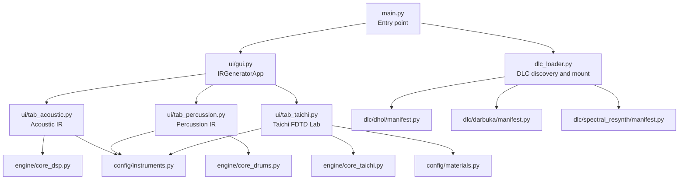
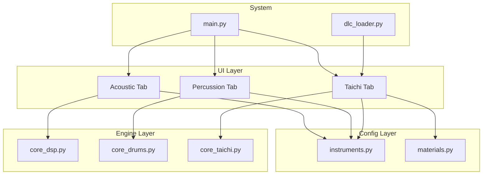
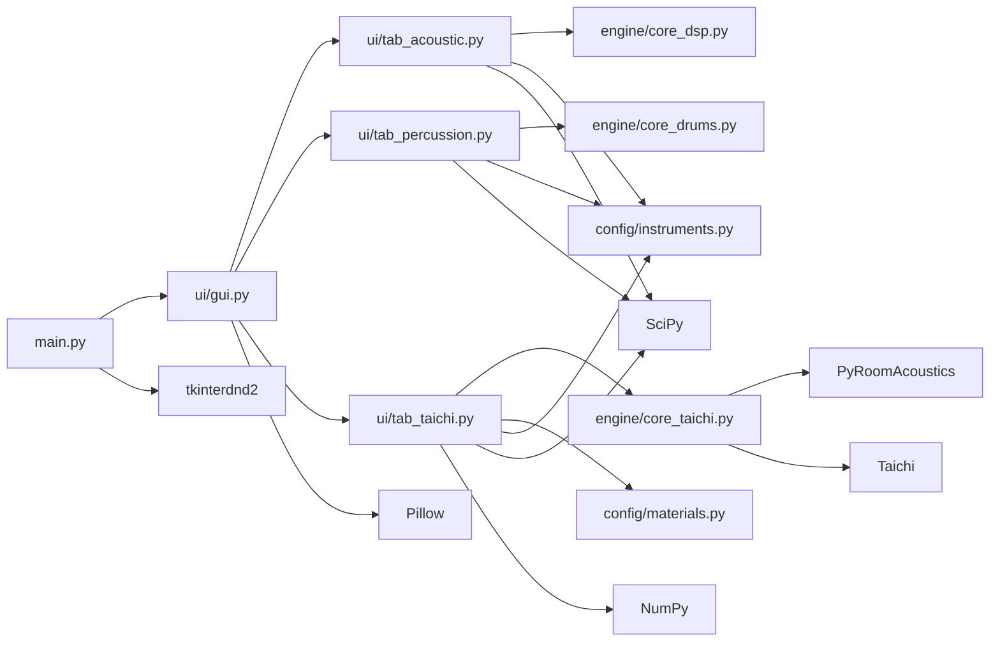

# Getting Started

<cite>
**Referenced Files in This Document**
- [README.md](file://README.md)
- [main.py](file://main.py)
- [dlc_loader.py](file://dlc_loader.py)
- [ui/gui.py](file://ui/gui.py)
- [ui/tab_acoustic.py](file://ui/tab_acoustic.py)
- [ui/tab_percussion.py](file://ui/tab_percussion.py)
- [ui/tab_taichi.py](file://ui/tab_taichi.py)
- [engine/core_taichi.py](file://engine/core_taichi.py)
- [engine/core_dsp.py](file://engine/core_dsp.py)
- [engine/core_drums.py](file://engine/core_drums.py)
- [config/instruments.py](file://config/instruments.py)
- [config/materials.py](file://config/materials.py)
- [dlc/dhol/manifest.py](file://dlc/dhol/manifest.py)
- [dlc/darbuka/manifest.py](file://dlc/darbuka/manifest.py)
- [dlc/spectral_resynth/manifest.py](file://dlc/spectral_resynth/manifest.py)
</cite>

## Table of Contents
1. [Introduction](#introduction)
2. [Project Structure](#project-structure)
3. [Core Components](#core-components)
4. [Architecture Overview](#architecture-overview)
5. [Detailed Component Analysis](#detailed-component-analysis)
6. [Dependency Analysis](#dependency-analysis)
7. [Performance Considerations](#performance-considerations)
8. [Troubleshooting Guide](#troubleshooting-guide)
9. [Conclusion](#conclusion)
10. [Appendices](#appendices)

## Introduction
TroakarIR is a physical modeling sound-design sandbox that generates impulse responses (IRs) for convolution reverb and audio applications. It offers three primary workflows:
- Acoustic IRs: Resonating plates, shells, and 3D spaces with realistic modal synthesis and spatial filtering.
- Percussive IRs: Drums, cymbals, and metallic instruments with mallet strikes, snares, and tactile textures.
- Taichi FDTD Lab: Realtime 2D Finite-Difference Time-Domain simulations on GPU/CPU with interactive material blending, heterogeneous grids, and optional room acoustics.

The application launches a Tkinter GUI with a tabbed interface. Plugins (DLCs) can be dynamically loaded and mounted into the main window.

## Project Structure
High-level layout of the repository:
- Root entrypoint initializes logging, theme, and loads DLC tabs.
- UI modules define the main window and three tabs: Acoustic, Percussion, and Taichi.
- Engines implement modal synthesis (DSP), drum modeling, and FDTD physics.
- Config modules define instrument presets and material databases.
- DLCs provide additional instrument toolsets that integrate at runtime.

**Diagram sources**
- [main.py:23-73](file://main.py#L23-L73)
- [ui/gui.py:8-38](file://ui/gui.py#L8-L38)
- [dlc_loader.py:9-62](file://dlc_loader.py#L9-L62)
- [dlc/dhol/manifest.py:1-9](file://dlc/dhol/manifest.py#L1-L9)
- [dlc/darbuka/manifest.py:1-9](file://dlc/darbuka/manifest.py#L1-L9)
- [dlc/spectral_resynth/manifest.py:1-8](file://dlc/spectral_resynth/manifest.py#L1-L8)
- [ui/tab_acoustic.py:17-22](file://ui/tab_acoustic.py#L17-L22)
- [ui/tab_percussion.py:17-22](file://ui/tab_percussion.py#L17-L22)
- [ui/tab_taichi.py:34-66](file://ui/tab_taichi.py#L34-L66)
- [engine/core_dsp.py:90-93](file://engine/core_dsp.py#L90-L93)
- [engine/core_drums.py:96-100](file://engine/core_drums.py#L96-L100)
- [engine/core_taichi.py:266-279](file://engine/core_taichi.py#L266-L279)
- [config/instruments.py:4-101](file://config/instruments.py#L4-L101)
- [config/materials.py:18-640](file://config/materials.py#L18-L640)

**Section sources**
- [main.py:23-73](file://main.py#L23-L73)
- [ui/gui.py:8-38](file://ui/gui.py#L8-L38)
- [dlc_loader.py:9-62](file://dlc_loader.py#L9-L62)

## Core Components
- Entry and lifecycle
  - Initializes logging, sets up the Tkinter root, applies a theme, constructs the main app, discovers and mounts DLC tabs, then starts the event loop.
- Main window and tabs
  - IRGeneratorApp builds a notebook with three tabs: Acoustic, Percussion, and Taichi.
- Tab behaviors
  - Acoustic: Select instrument and material, adjust geometry, duration, microphone distance, and autocrop; generates IRs and saves WAV files.
  - Percussion: Choose instrument category and materials, scale, duration, snare toggle, batch export; generates IRs and saves WAV files.
  - Taichi: Interactive 2D FDTD lab with material blending, heterogeneous grids, strike/pickup placement, stereo capture, and optional friction (bow) mode.
- Engines
  - DSP engine: Modal synthesis, radiation efficiency, and spatial mixing for acoustic IRs.
  - Drum engine: Mallet strikes, cymbal bloom, snares, and tactile profiles for percussive IRs.
  - Taichi engine: Anisotropic/heterogeneous FDTD solver with tactile effects, resonance suppression, and room convolution.

**Section sources**
- [main.py:23-73](file://main.py#L23-L73)
- [ui/gui.py:8-46](file://ui/gui.py#L8-L46)
- [ui/tab_acoustic.py:17-193](file://ui/tab_acoustic.py#L17-L193)
- [ui/tab_percussion.py:17-144](file://ui/tab_percussion.py#L17-L144)
- [ui/tab_taichi.py:34-735](file://ui/tab_taichi.py#L34-L735)
- [engine/core_dsp.py:90-273](file://engine/core_dsp.py#L90-L273)
- [engine/core_drums.py:96-249](file://engine/core_drums.py#L96-L249)
- [engine/core_taichi.py:266-717](file://engine/core_taichi.py#L266-L717)

## Architecture Overview
The application follows a modular architecture:
- UI layer: Tkinter-based tabs encapsulate controls and actions.
- Config layer: Presets and material definitions feed the engines.
- Engine layer: Specialized algorithms compute IRs from physical models.
- Loader layer: Discovers and mounts DLC plugins at runtime.

**Diagram sources**
- [main.py:23-73](file://main.py#L23-L73)
- [dlc_loader.py:9-62](file://dlc_loader.py#L9-L62)
- [ui/tab_acoustic.py:17-22](file://ui/tab_acoustic.py#L17-L22)
- [ui/tab_percussion.py:17-22](file://ui/tab_percussion.py#L17-L22)
- [ui/tab_taichi.py:34-66](file://ui/tab_taichi.py#L34-L66)
- [engine/core_dsp.py:90-93](file://engine/core_dsp.py#L90-L93)
- [engine/core_drums.py:96-100](file://engine/core_drums.py#L96-L100)
- [engine/core_taichi.py:266-279](file://engine/core_taichi.py#L266-L279)
- [config/instruments.py:4-101](file://config/instruments.py#L4-L101)
- [config/materials.py:18-640](file://config/materials.py#L18-L640)

## Detailed Component Analysis

### Installation and Setup
- Python requirement
  - Requires Python 3.9+ as indicated by the project badges and typical package compatibility.
- Dependencies
  - Install with pip using the packages listed in the project’s installation section.
- GPU acceleration
  - Taichi automatically selects CUDA or Vulkan when available; otherwise falls back to CPU. Having a compatible GPU is recommended for real-time FDTD.

Step-by-step installation checklist:
- Clone the repository.
- Create and activate a virtual environment (recommended).
- Install dependencies via pip.
- Run the application entrypoint.

Notes:
- On systems without a compatible GPU, Taichi will still run on CPU but expect slower performance for the Taichi tab.
- Ensure audio output devices are functioning; saving WAV files requires write permissions to the chosen location.

**Section sources**
- [README.md:34-52](file://README.md#L34-L52)

### Initial Launch and Main Window
- Launch
  - Execute the main entrypoint to start the application.
- Theme and window
  - The application sets a themed Tkinter style and opens a titled window.
- Tabs
  - Three tabs appear: Acoustic, Percussion, and Taichi. Additional DLC tabs are mounted dynamically if present.

Navigation tips:
- Use the notebook tabs to switch between workflows.
- Status bar at the bottom indicates current operation.

**Section sources**
- [main.py:23-73](file://main.py#L23-L73)
- [ui/gui.py:8-46](file://ui/gui.py#L8-L46)

### Acoustic IR Workflow (First Steps)
Goal: Generate a plate/shell/space IR with realistic modal behavior and spatial characteristics.

Quick steps:
1. Select an instrument preset (e.g., a drum shell, cymbal plate, or space).
2. Choose a material (e.g., wood, metal, polymer).
3. Adjust geometry scale to change size.
4. Set maximum tail duration.
5. Optionally set microphone distance (affects early reflections and air absorption).
6. Toggle autocrop to trim silence.
7. Click “Generate” to compute and save the IR.

What happens internally:
- The acoustic engine synthesizes modal components, transient click, and a diffuse tail.
- Optional tactile profile and sympathetic strings are mixed in.
- Low-cut filtering and optional room convolution are applied.
- The resulting stereo IR is normalized and saved as WAV.

**Section sources**
- [ui/tab_acoustic.py:17-193](file://ui/tab_acoustic.py#L17-L193)
- [engine/core_dsp.py:90-273](file://engine/core_dsp.py#L90-L273)

### Percussive IR Workflow (First Steps)
Goal: Generate drum/cymbal/metallic IRs with mallet strikes, optional snares, and tactile textures.

Quick steps:
1. Choose a percussion preset (e.g., kick drum, snare, tom, crash).
2. Select shell/head/wire materials.
3. Adjust size and duration.
4. Enable “Add wire rattle” for snare-like texture.
5. Optionally enable batch export to render all presets at once.
6. Click “Generate” to save IRs to a selected folder.

What happens internally:
- The drum engine simulates mallet strikes, cymbal bloom, and snares.
- Tactile profile and psychoacoustic distance effects are applied.
- Air absorption and early floor bounce are modeled.
- IRs are trimmed and normalized.

**Section sources**
- [ui/tab_percussion.py:17-144](file://ui/tab_percussion.py#L17-L144)
- [engine/core_drums.py:96-249](file://engine/core_drums.py#L96-L249)

### Taichi FDTD Lab (First Steps)
Goal: Interactively model 2D FDTD wave propagation with heterogeneous materials and capture IRs.

Quick steps:
1. Pick an instrument preset and material.
2. Adjust geometry scale, render length, and material detail boost.
3. Optionally enable nonlinearity, de-mud (resonance suppression), and strike force.
4. Place the mallet strike and pickups by clicking on the preview canvas (mono or true stereo).
5. Toggle “Alloy” to mix two materials and adjust the ratio.
6. Toggle “Gradient viscosity” to simulate depth-dependent damping.
7. Click “Generate” to run FDTD and save the IR.
8. Alternatively, click “Synthesize Friction Texture” to generate a bow-style texture.

What happens internally:
- The Taichi engine builds anisotropic or heterogeneous grids from masks and materials.
- Strike and pickup positions are sampled to produce stereo channels.
- Optional tactile forces emulate granular, fibrous, fluid, and brittle behaviors.
- Resonance suppression and room convolution refine the output.
- The GUI displays a live preview of the field during rendering.

**Section sources**
- [ui/tab_taichi.py:34-735](file://ui/tab_taichi.py#L34-L735)
- [engine/core_taichi.py:266-717](file://engine/core_taichi.py#L266-L717)

### Understanding Simulation Modes
- Acoustic mode
  - Modal synthesis with radiation efficiency and diffuse tails; suitable for plates, shells, and 3D spaces.
- Percussive mode
  - Mallet strikes, cymbal bloom, snares, and tactile textures; optimized for drums and metallic sounds.
- Taichi FDTD mode
  - Realtime 2D wave propagation with heterogeneous materials; supports interactive editing and optional friction.

**Section sources**
- [engine/core_dsp.py:90-273](file://engine/core_dsp.py#L90-L273)
- [engine/core_drums.py:96-249](file://engine/core_drums.py#L96-L249)
- [engine/core_taichi.py:266-717](file://engine/core_taichi.py#L266-L717)

### Parameter Adjustment Basics
- Geometry scale
  - Changes physical size; affects modal frequencies and spatial dimensions.
- Duration
  - Sets render length; longer durations increase computation time.
- Material detail boost
  - Enhances fine-scale material textures and scattering.
- Nonlinearity
  - Introduces brittle/fracture reactions and increased tactile granularity.
- De-mud
  - Suppresses strong resonances to reduce boominess.
- Force
  - Controls mallet pressure or bow friction intensity.
- Microphone distance
  - Affects early reflections and air absorption in acoustic mode.

**Section sources**
- [ui/tab_acoustic.py:47-124](file://ui/tab_acoustic.py#L47-L124)
- [ui/tab_percussion.py:57-66](file://ui/tab_percussion.py#L57-L66)
- [ui/tab_taichi.py:118-170](file://ui/tab_taichi.py#L118-L170)

### DLC Plugin Integration
- Discovery
  - The loader scans the dlc/ directory for manifests and dynamically imports plugin GUI classes.
- Mounting
  - Each DLC tab is added to the main notebook with a package icon label.
- Examples
  - Dhol, Darbuka, and Spectral Resynthesis are provided as examples.

**Section sources**
- [dlc_loader.py:9-62](file://dlc_loader.py#L9-L62)
- [dlc/dhol/manifest.py:1-9](file://dlc/dhol/manifest.py#L1-L9)
- [dlc/darbuka/manifest.py:1-9](file://dlc/darbuka/manifest.py#L1-L9)
- [dlc/spectral_resynth/manifest.py:1-8](file://dlc/spectral_resynth/manifest.py#L1-L8)

## Dependency Analysis
External libraries and their roles:
- NumPy: Numerical computations for signals and grids.
- SciPy: Signal processing (filters, FFT), interpolation.
- Taichi: GPU/CPU accelerated 2D FDTD solver.
- PyRoomAcoustics: Room impulse response generation for spatial mixing.
- Pillow: Image handling for previews and masks.
- tkinterdnd2: Drag-and-drop support for Tkinter.

**Diagram sources**
- [main.py:2-10](file://main.py#L2-L10)
- [ui/gui.py:1-7](file://ui/gui.py#L1-L7)
- [ui/tab_acoustic.py:1-16](file://ui/tab_acoustic.py#L1-L16)
- [ui/tab_percussion.py:1-16](file://ui/tab_percussion.py#L1-L16)
- [ui/tab_taichi.py:1-15](file://ui/tab_taichi.py#L1-L15)
- [engine/core_dsp.py:1-8](file://engine/core_dsp.py#L1-L8)
- [engine/core_drums.py:1-8](file://engine/core_drums.py#L1-L8)
- [engine/core_taichi.py:1-12](file://engine/core_taichi.py#L1-L12)

**Section sources**
- [main.py:2-10](file://main.py#L2-L10)
- [ui/tab_taichi.py:1-15](file://ui/tab_taichi.py#L1-L15)
- [engine/core_taichi.py:1-12](file://engine/core_taichi.py#L1-L12)

## Performance Considerations
- GPU acceleration
  - Taichi runs on CUDA/Vulkan when available; expect significant speedups compared to CPU-only.
- Render length and grid size
  - Longer durations and higher resolution grids increase computation time exponentially.
- Substepping stability
  - The Taichi engine automatically increases substeps to maintain numerical stability; larger grids require more substeps.
- Practical tips
  - Start with shorter durations and smaller scales; iterate to refine parameters.
  - Use de-mud and low-cut filters to reduce long tails when needed.
  - Batch export in percussion mode to generate multiple IRs efficiently.

[No sources needed since this section provides general guidance]

## Troubleshooting Guide
Common installation and runtime issues:
- Python version mismatch
  - Ensure Python 3.9+ is installed.
- Missing dependencies
  - Reinstall dependencies using the documented pip command.
- No GPU detected
  - Taichi falls back to CPU; expect slower performance. Install compatible drivers for CUDA/Vulkan if possible.
- GUI not appearing or hanging
  - Close the window and check logs; the application writes a debug log file.
- DLC mounting errors
  - Verify manifest presence and correct class names in the dlc/*/manifest.py files.
- Extremely long renders
  - Reduce duration or scale; lower grid size in Taichi mode.
- Audio clipping or loudness
  - Keep volume low during generation; the engines normalize outputs but extreme settings can still cause peaks.

**Section sources**
- [README.md:34-52](file://README.md#L34-L52)
- [main.py:24-31](file://main.py#L24-L31)
- [dlc_loader.py:34-61](file://dlc_loader.py#L34-L61)

## Conclusion
You are now ready to explore impulse response generation with TroakarIR. Start with the Acoustic tab for modal plates/spaces, the Percussion tab for drums and cymbals, and dive into the Taichi FDTD Lab for interactive 2D wave propagation. Use the presets and materials as starting points, then adjust parameters to match your sonic vision. Refer to the troubleshooting section if you encounter environment-specific issues.

[No sources needed since this section summarizes without analyzing specific files]

## Appendices

### Quick First-Run Checklist
- Install dependencies with pip.
- Launch the application.
- Try Acoustic → Wood plate → Short duration → Save WAV.
- Switch to Taichi → Alloy two materials → Place strike/pickups → Generate.

**Section sources**
- [README.md:34-52](file://README.md#L34-L52)
- [ui/tab_acoustic.py:126-193](file://ui/tab_acoustic.py#L126-L193)
- [ui/tab_taichi.py:614-735](file://ui/tab_taichi.py#L614-L735)