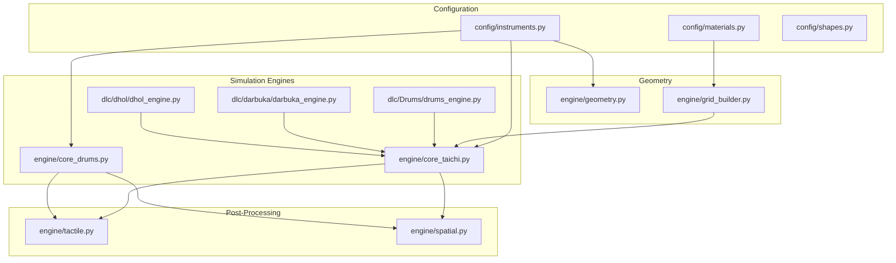
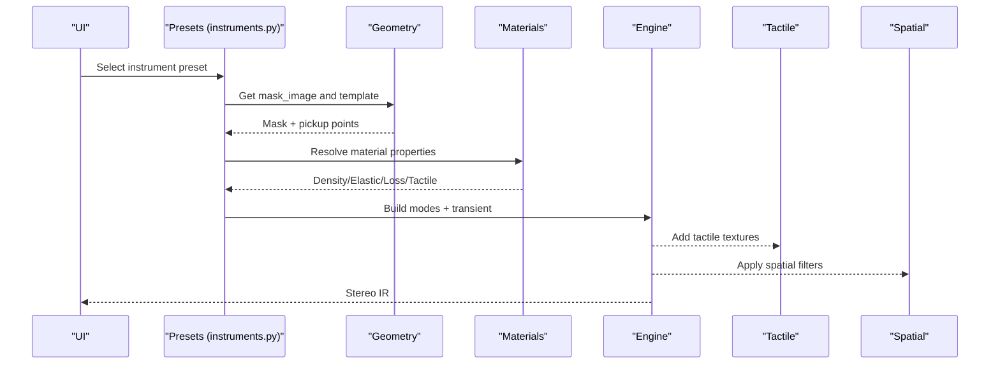
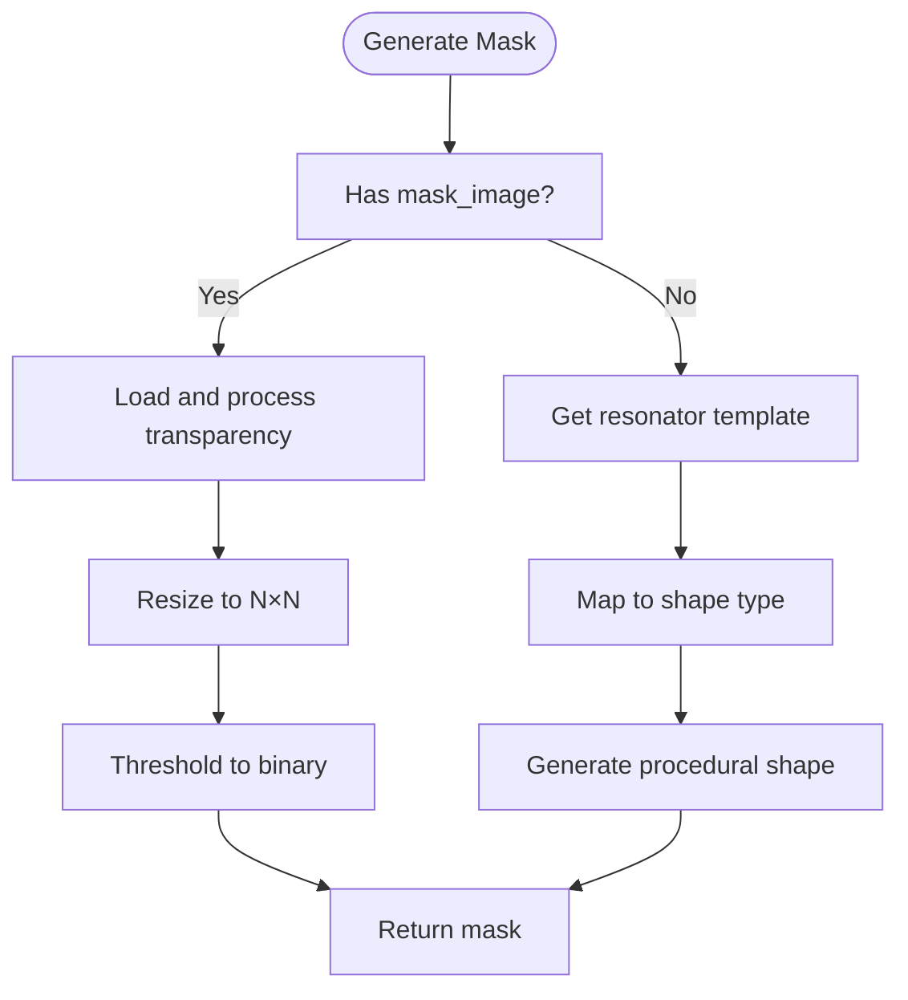
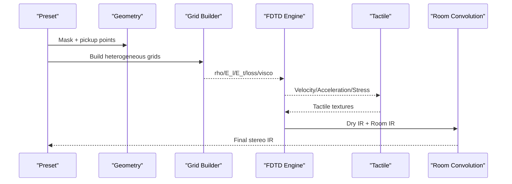
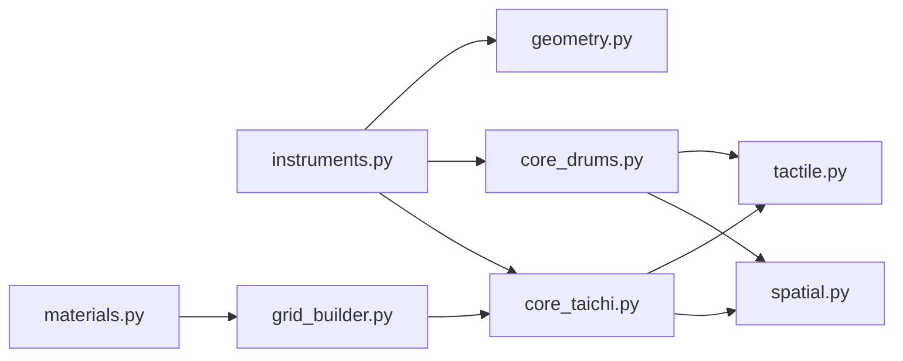

# Instrument Templates

<cite>
**Referenced Files in This Document**
- [config/instruments.py](file://config/instruments.py)
- [config/materials.py](file://config/materials.py)
- [config/shapes.py](file://config/shapes.py)
- [engine/geometry.py](file://engine/geometry.py)
- [engine/core_drums.py](file://engine/core_drums.py)
- [engine/core_taichi.py](file://engine/core_taichi.py)
- [engine/grid_builder.py](file://engine/grid_builder.py)
- [engine/spatial.py](file://engine/spatial.py)
- [engine/tactile.py](file://engine/tactile.py)
- [dlc/Drums/drums_engine.py](file://dlc/Drums/drums_engine.py)
- [dlc/darbuka/darbuka_engine.py](file://dlc/darbuka/darbuka_engine.py)
- [dlc/dhol/dhol_engine.py](file://dlc/dhol/dhol_engine.py)
- [ui/gui.py](file://ui/gui.py)
</cite>

## Table of Contents
1. [Introduction](#introduction)
2. [Project Structure](#project-structure)
3. [Core Components](#core-components)
4. [Architecture Overview](#architecture-overview)
5. [Detailed Component Analysis](#detailed-component-analysis)
6. [Dependency Analysis](#dependency-analysis)
7. [Performance Considerations](#performance-considerations)
8. [Troubleshooting Guide](#troubleshooting-guide)
9. [Conclusion](#conclusion)
10. [Appendices](#appendices)

## Introduction
This document describes the instrument template architecture used by TroakarIR for modeling acoustic instruments and resonators. It explains how instrument presets combine geometric shape definitions, modal parameter configurations, and material properties to produce realistic impulse responses (IRs). The guide covers drum shells, cymbals, and other acoustic instruments, detailing how geometry influences resonance characteristics, how templates integrate with the core simulation engines, and how to create and tune custom instrument models.

## Project Structure
The instrument template system spans configuration, geometry, materials, and simulation engines:
- Configuration defines instrument categories, presets, and modal templates.
- Geometry resolves instrument masks and pickup locations from templates.
- Materials define physical properties and tactile profiles.
- Simulation engines generate IRs using either analytical modal synthesis or FDTD.

**Diagram sources**
- [config/instruments.py:1-279](file://config/instruments.py#L1-L279)
- [engine/geometry.py:1-120](file://engine/geometry.py#L1-L120)
- [engine/grid_builder.py:1-99](file://engine/grid_builder.py#L1-L99)
- [engine/core_taichi.py:1-717](file://engine/core_taichi.py#L1-L717)
- [engine/core_drums.py:1-249](file://engine/core_drums.py#L1-L249)
- [engine/tactile.py:1-250](file://engine/tactile.py#L1-L250)
- [engine/spatial.py:1-61](file://engine/spatial.py#L1-L61)
- [dlc/Drums/drums_engine.py:1-983](file://dlc/Drums/drums_engine.py#L1-L983)
- [dlc/darbuka/darbuka_engine.py:1-677](file://dlc/darbuka/darbuka_engine.py#L1-L677)
- [dlc/dhol/dhol_engine.py:1-1753](file://dlc/dhol/dhol_engine.py#L1-L1753)

**Section sources**
- [config/instruments.py:1-279](file://config/instruments.py#L1-L279)
- [engine/geometry.py:1-120](file://engine/geometry.py#L1-L120)
- [engine/grid_builder.py:1-99](file://engine/grid_builder.py#L1-L99)
- [engine/core_taichi.py:1-717](file://engine/core_taichi.py#L1-L717)
- [engine/core_drums.py:1-249](file://engine/core_drums.py#L1-L249)
- [engine/tactile.py:1-250](file://engine/tactile.py#L1-L250)
- [engine/spatial.py:1-61](file://engine/spatial.py#L1-L61)
- [dlc/Drums/drums_engine.py:1-983](file://dlc/Drums/drums_engine.py#L1-L983)
- [dlc/darbuka/darbuka_engine.py:1-677](file://dlc/darbuka/darbuka_engine.py#L1-L677)
- [dlc/dhol/dhol_engine.py:1-1753](file://dlc/dhol/dhol_engine.py#L1-L1753)

## Core Components
- Resonator templates: Define modal families and transient characteristics per instrument type.
- Instrument presets: Provide category, geometry mask, modal parameters, and simulation settings.
- Material database: Supplies density, elastic moduli, loss factors, and tactile profiles.
- Geometry engine: Generates instrument masks and placement of strike/pickup points.
- Simulation engines: Modal synthesis for plates and drums, FDTD for complex bodies.

Key responsibilities:
- Template selection maps instrument type to modal builder and transient model.
- Presets supply f0, ratios, and geometry parameters; materials supply physical constants.
- Geometry resolves procedural or image-based masks and sensor positions.
- Engines compute IRs, add tactile textures, and simulate spatial effects.

**Section sources**
- [config/instruments.py:1-279](file://config/instruments.py#L1-L279)
- [engine/geometry.py:1-120](file://engine/geometry.py#L1-L120)
- [engine/core_drums.py:1-249](file://engine/core_drums.py#L1-L249)
- [engine/core_taichi.py:1-717](file://engine/core_taichi.py#L1-L717)

## Architecture Overview
The template-driven pipeline connects presets to geometry and materials, then to simulation engines and post-processing.

**Diagram sources**
- [config/instruments.py:1-279](file://config/instruments.py#L1-L279)
- [engine/geometry.py:1-120](file://engine/geometry.py#L1-L120)
- [engine/core_drums.py:1-249](file://engine/core_drums.py#L1-L249)
- [engine/core_taichi.py:1-717](file://engine/core_taichi.py#L1-L717)
- [engine/tactile.py:1-250](file://engine/tactile.py#L1-L250)
- [engine/spatial.py:1-61](file://engine/spatial.py#L1-L61)

## Detailed Component Analysis

### Resonator Templates and Modal Parameter Configurations
Resonator templates encode modal families and transient behavior:
- Drum shells: Air cavity + membrane modes with dynamic pitch drop.
- Cymbal plates: Higher harmonic richness with bloom onset and phase modulation.
- Flat-braced soundboards: Coupled modes with Helmholtz-like air modes.
- Tuned bars: Strong fundamental with harmonic ratios.
- Stretched membranes: Near-isotropic modes with anisotropy scaling.
- Woodwind bells: Dominant formants with amplitude envelopes.
- Isotropic plates: Broad frequency coverage with anisotropy.
- Spaces: 3D room IRs via room impulse response.

Each template includes:
- Name, default material, transient click factor, Helmholtz flag, and space flag.
- A modes_builder lambda receiving instrument parameters, scale, and anisotropy factor.
- Optional base_size for 3D spaces.

Examples of template usage:
- Drum shell template builds f0-driven modes with anisotropy scaling and optional Helmholtz air mode.
- Cymbal plate template emphasizes higher modes with exponential decay and bloom onset.
- Flat braced template uses brace frequencies A0, T1, T2, T3 to define coupled modes.

**Section sources**
- [config/instruments.py:1-101](file://config/instruments.py#L1-L101)

### Instrument Presets: Geometry, Parameters, and Simulation Settings
Presets define:
- Category and human-readable name.
- Resonator template reference.
- Mask image filename for geometry generation.
- Size and depth parameters (size_m, body_depth).
- Low-cut and bridge hill filters.
- Fundamental frequency f0 and harmonic ratios (e.g., ratio_harmonic_1, ratio_harmonic_2).
- Sympathetic string frequencies.
- Special settings like snare rattle and saturation.

Categories include drums, cymbals, metallic, special, lab testing, and spaces. Presets are organized for quick selection and tuning.

**Section sources**
- [config/instruments.py:103-279](file://config/instruments.py#L103-L279)

### Geometric Shape Definitions and Mask Generation
Geometry resolution:
- Shape type mapping: selects procedural shape for mask generation.
- Image-based masks: loads PNG/SVG transparency and converts to binary.
- Fallback procedural shapes: circle, violin, guitar, bar, horn, hall, square.
- Strike and pickup point placement varies by template to optimize modal capture.

**Diagram sources**
- [engine/geometry.py:17-88](file://engine/geometry.py#L17-L88)

**Section sources**
- [engine/geometry.py:1-120](file://engine/geometry.py#L1-L120)

### Materials and Heterogeneous Properties
Material database supplies:
- Density, longitudinal/transverse elastic moduli, Poisson’s ratio.
- Loss factor and viscoelastic gamma.
- Base thickness and tactile profile (fibrousness, fluidity, granularity, brittleness).
- Optional inclusions with density ratios and patterns (specks, veins).

Material blending:
- Linear interpolation of base properties.
- Interpolation of tactile profiles.
- Aggregation of inclusion effects with adjusted intensities.

Grid building:
- Builds heterogeneous grids from mask and material properties.
- Adds anti-resonance viscoelasticity at edges.
- Applies Gaussian smoothing to mass/stiffness vs. damping/viscosity.

**Section sources**
- [config/materials.py:1-766](file://config/materials.py#L1-L766)
- [engine/grid_builder.py:1-99](file://engine/grid_builder.py#L1-L99)

### Simulation Engines and IR Generation
Two primary engines:
- Modal synthesis for drums and plates: computes modal decay, transient click shaping, optional snare rattle, tactile layer, and psychoacoustic filtering.
- FDTD engine for complex bodies: supports heterogeneous grids, nonlinear effects, tactile forces, and room convolution.

Drum engine highlights:
- Computes scale factor from target vs. default material speed of sound.
- Uses anisotropy factor to adjust higher modes.
- Applies dynamic pitch drop for kick drums and bloom onset for cymbals.
- Mixes modal IR with material transient and tactile texture.

FDTD engine highlights:
- Auto-CFL substepping for stability.
- Supports heterogeneous material grids and nonlinear yielding.
- Records velocity/acceleration/stress sensors for tactile synthesis.
- Applies room convolution and demud suppression.

**Diagram sources**
- [engine/core_taichi.py:266-717](file://engine/core_taichi.py#L266-L717)
- [engine/grid_builder.py:1-99](file://engine/grid_builder.py#L1-L99)
- [engine/tactile.py:193-229](file://engine/tactile.py#L193-L229)

**Section sources**
- [engine/core_drums.py:96-249](file://engine/core_drums.py#L96-L249)
- [engine/core_taichi.py:266-717](file://engine/core_taichi.py#L266-L717)
- [engine/tactile.py:193-229](file://engine/tactile.py#L193-L229)

### Relationship Between Geometry and Impulse Responses
- Mask shape determines which modes are excited and how energy propagates.
- Strike and pickup positions influence perceived brightness and localization.
- Body depth affects modal coupling and spatial spread (especially for drums and spaces).
- Heterogeneous materials alter modal dispersion and tactile texture.

Practical effects:
- Circle/cylinder shapes emphasize radial modes and higher harmonics (cymbals).
- Flat bracing increases mid-bass coupling (soundboards).
- Kick drum depth increases air-cavity coupling and low-end sustain.
- Space presets scale room dimensions with base_size and body_depth.

**Section sources**
- [engine/geometry.py:1-120](file://engine/geometry.py#L1-L120)
- [config/instruments.py:149-279](file://config/instruments.py#L149-L279)

### Examples of Existing Instrument Templates
- Drum shells: Kick/snare/tom presets with f0, low-cut, bridge-hill, and body depth tuned for attack and sustain.
- Cymbals: Crash/ride/hat presets with thin-body depth and high f0 for shimmer.
- Metallic: Gong/cowbell/triangle/woodblock/tuning fork with tuned bar ratios.
- Special: Tibetan bowl, steel drum, and others with sympathetic strings.
- Spaces: Cathedral and cistern with base_size and body_depth controlling reverberation.

These presets demonstrate how modal parameters (f0, ratios) and geometry (size_m, body_depth) map to distinct timbres.

**Section sources**
- [config/instruments.py:149-279](file://config/instruments.py#L149-L279)

### Step-by-Step Instructions for Creating Custom Instrument Models
1. Choose a base template:
   - Use drum_shell for membranophones, cymbal_plate for thin plates, tuned_bar for stiff rods, flat_braced for soundboards, isotropic_plate for broad coverage, or space_* for 3D rooms.
2. Define modal parameters:
   - Set f0 and harmonic ratios (if applicable).
   - Configure sympathetically excited strings.
3. Set geometry:
   - Provide mask_image for precise shape or rely on fallback shape matching the template.
   - Adjust size_m and body_depth to control scale and modal coupling.
4. Tune filters:
   - Set low_cut and bridge_hill to sculpt the spectrum.
5. Select material:
   - Pick a default material or blend materials for composite properties.
   - Adjust tactile profile for desired texture.
6. Validate with geometry:
   - Confirm mask matches intended shape and placement of strike/pickup points.
7. Simulate and iterate:
   - Run modal or FDTD IR generation.
   - Post-process with tactile and spatial filters.
8. Export and test:
   - Normalize and export stereo IR.
   - Evaluate timbre, localization, and tactile feel.

**Section sources**
- [config/instruments.py:1-279](file://config/instruments.py#L1-L279)
- [engine/geometry.py:1-120](file://engine/geometry.py#L1-L120)
- [engine/core_drums.py:96-249](file://engine/core_drums.py#L96-L249)
- [engine/core_taichi.py:266-717](file://engine/core_taichi.py#L266-L717)

### Integration Between Templates and Simulation Engines
- Presets select a template and supply parameters (f0, ratios, depths).
- Geometry resolves mask and sensor positions.
- Materials feed heterogeneous grids for FDTD or modal parameters for analytical synthesis.
- Engines compute IRs, add tactile textures, and simulate spatial propagation.
- Spatial engine applies distance-dependent filtering and comb delays.

**Section sources**
- [config/instruments.py:1-279](file://config/instruments.py#L1-L279)
- [engine/geometry.py:1-120](file://engine/geometry.py#L1-L120)
- [engine/core_taichi.py:266-717](file://engine/core_taichi.py#L266-L717)
- [engine/core_drums.py:96-249](file://engine/core_drums.py#L96-L249)
- [engine/spatial.py:1-61](file://engine/spatial.py#L1-L61)

### Parameter Tuning Guidelines
- f0 controls fundamental pitch; scale adjusts relative to default material.
- Anisotropy factor modifies overtone balance for plates and bars.
- Body depth:
  - Increases air-cavity coupling for drums and spaces.
  - Thinner shells enhance shimmer (cymbals).
- Low-cut and bridge-hill:
  - Low-cut removes rumble; bridge-hill boosts mids/bright area.
- Transient click:
  - Controls initial click strength for drums; minimal for cymbals.
- Sympathetic strings:
  - Add subtle ring modulation and diffusion.
- Tactile profile:
  - Fibrousness adds wood-like crunch; granularity adds gritty stutters; brittleness adds micro-cracks; fluidity adds viscous noise.

**Section sources**
- [config/instruments.py:1-279](file://config/instruments.py#L1-L279)
- [engine/core_drums.py:1-249](file://engine/core_drums.py#L1-L249)
- [engine/core_taichi.py:1-717](file://engine/core_taichi.py#L1-L717)

### Quality Assessment Criteria for Instrument Models
- Timbral accuracy: Does the IR reproduce target tonal balance?
- Localization: Are strike and pickup positions consistent with intended imaging?
- Stability: No artifacts, clicks, or numerical blow-ups.
- Spatial realism: Distance-dependent filtering and early reflections match expectations.
- Tactile fidelity: Texture aligns with material tactile profile.
- Modality clarity: Target modes are prominent; unwanted resonances suppressed.

**Section sources**
- [engine/spatial.py:1-61](file://engine/spatial.py#L1-L61)
- [engine/tactile.py:1-250](file://engine/tactile.py#L1-L250)
- [engine/core_taichi.py:653-717](file://engine/core_taichi.py#L653-L717)

## Dependency Analysis
Template dependencies and coupling:
- Instruments presets depend on geometry and materials.
- Geometry depends on instrument template mapping.
- Engines depend on resolved materials and geometry.
- Tactile and spatial post-processors depend on engine outputs.

**Diagram sources**
- [config/instruments.py:1-279](file://config/instruments.py#L1-L279)
- [engine/geometry.py:1-120](file://engine/geometry.py#L1-L120)
- [engine/grid_builder.py:1-99](file://engine/grid_builder.py#L1-L99)
- [engine/core_taichi.py:1-717](file://engine/core_taichi.py#L1-L717)
- [engine/core_drums.py:1-249](file://engine/core_drums.py#L1-L249)
- [engine/tactile.py:1-250](file://engine/tactile.py#L1-L250)
- [engine/spatial.py:1-61](file://engine/spatial.py#L1-L61)

**Section sources**
- [config/instruments.py:1-279](file://config/instruments.py#L1-L279)
- [engine/geometry.py:1-120](file://engine/geometry.py#L1-L120)
- [engine/grid_builder.py:1-99](file://engine/grid_builder.py#L1-L99)
- [engine/core_taichi.py:1-717](file://engine/core_taichi.py#L1-L717)
- [engine/core_drums.py:1-249](file://engine/core_drums.py#L1-L249)
- [engine/tactile.py:1-250](file://engine/tactile.py#L1-L250)
- [engine/spatial.py:1-61](file://engine/spatial.py#L1-L61)

## Performance Considerations
- FDTD stability: Auto-substepping ensures CFL stability; larger grids increase computational cost.
- Heterogeneous grids: Smoothing reduces spurious reflections at material boundaries.
- Modal synthesis: Fewer modes reduce CPU load; cymbals require more modes for shimmer.
- Room convolution: Larger rooms and higher orders increase latency and memory.
- Tactile synthesis: Vectorized envelope followers and soft-knee limiting maintain audio quality while adding texture.

[No sources needed since this section provides general guidance]

## Troubleshooting Guide
Common issues and resolutions:
- Clicks or artifacts:
  - Use declick utilities and adaptive slew limiting in engines.
  - Reduce nonlinear yielding thresholds or noise amplitudes.
- Unstable simulations:
  - Increase N_grid or enable auto-substepping; check CFL limits.
- Weak low-end:
  - Increase body_depth for drums/spaces; adjust low-cut filter.
- Harsh cymbals:
  - Lower transient click; reduce bloom onset; adjust loss factors.
- Poor localization:
  - Recalculate strike/pickup points; verify mask alignment.

**Section sources**
- [engine/core_taichi.py:585-627](file://engine/core_taichi.py#L585-L627)
- [engine/core_drums.py:1-249](file://engine/core_drums.py#L1-L249)
- [engine/tactile.py:221-229](file://engine/tactile.py#L221-L229)

## Conclusion
TroakarIR’s instrument template system cleanly separates geometry, materials, and modal synthesis from simulation engines. By selecting appropriate templates, tuning modal parameters, and leveraging heterogeneous material grids, users can create accurate and expressive IRs for drums, cymbals, and other acoustic instruments. The modular architecture enables rapid iteration and high-quality results suitable for both studio and immersive applications.

[No sources needed since this section summarizes without analyzing specific files]

## Appendices

### Appendix A: Template-to-Shape Mapping
- bowed_coupled → violin
- flat_braced → guitar
- drum_shell, stretched_membrane, cymbal_plate → circle
- tuned_bar, metal_bar → bar
- woodwind_bell → horn
- space_* → hall
- default → square

**Section sources**
- [engine/geometry.py:8-15](file://engine/geometry.py#L8-L15)

### Appendix B: Example Preset Categories
- Drums: kick_drum, snare_drum, toms
- Cymbals: crash_cymbal, ride_cymbal, hi_hat
- Metallic: gong, cowbell, triangle, woodblock, tuning_fork
- Special: Tibetan bowl, steel drum
- Lab: perfect lab pad

**Section sources**
- [config/instruments.py:149-279](file://config/instruments.py#L149-L279)

### Appendix C: UI Integration
The application exposes tabs for acoustic, percussion, and Taichi FDTD laboratory workflows, enabling interactive exploration of templates and parameters.

**Section sources**
- [ui/gui.py:1-46](file://ui/gui.py#L1-L46)