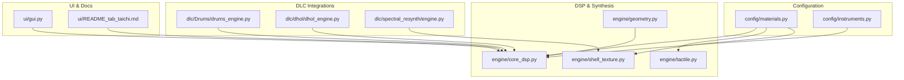
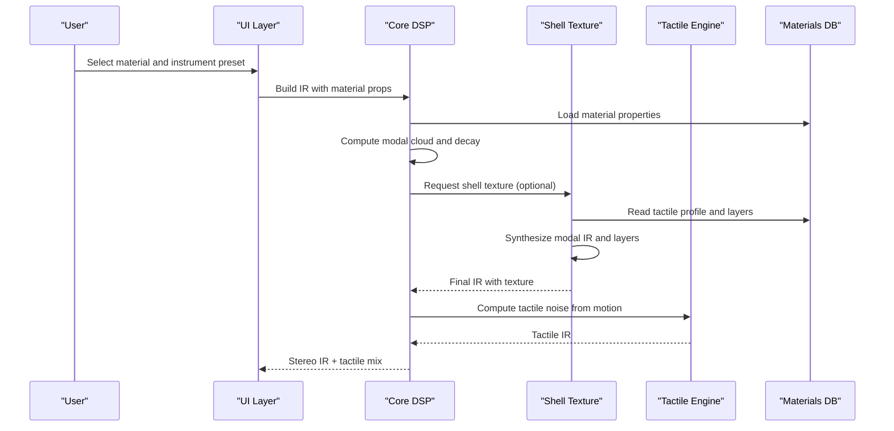
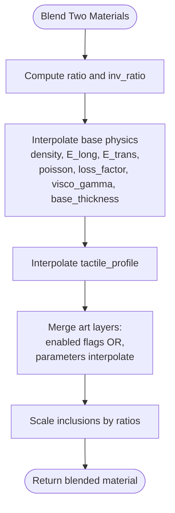
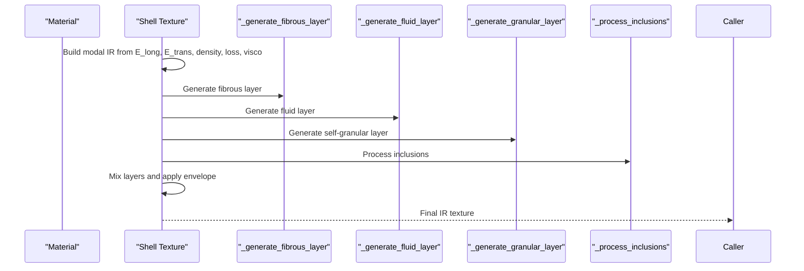
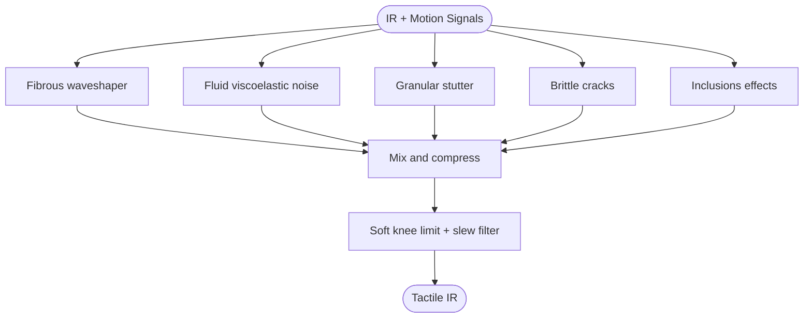
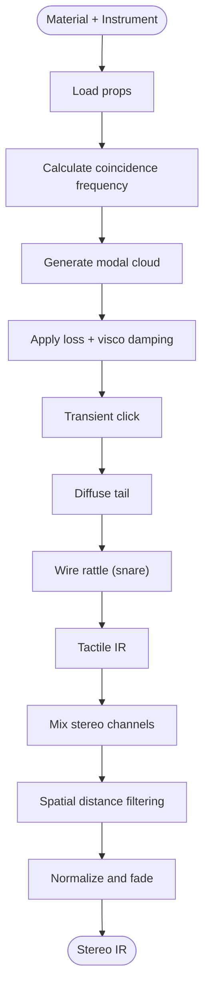
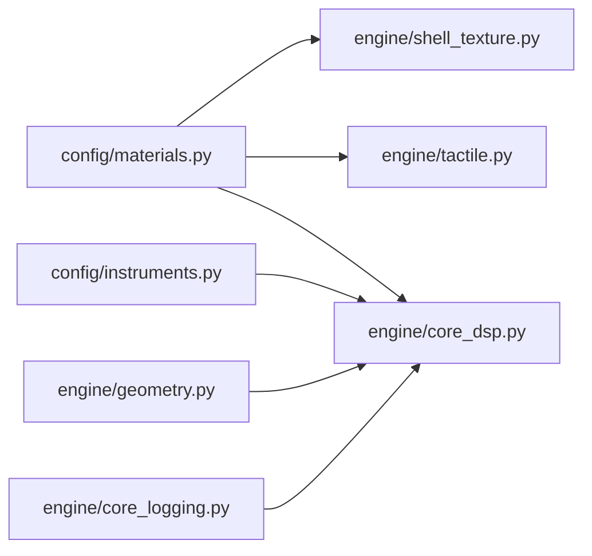

# Material System

<cite>
**Referenced Files in This Document**
- [materials.py](file://config/materials.py)
- [shell_texture.py](file://engine/shell_texture.py)
- [tactile.py](file://engine/tactile.py)
- [core_dsp.py](file://engine/core_dsp.py)
- [geometry.py](file://engine/geometry.py)
- [instruments.py](file://config/instruments.py)
- [README_tab_taichi.md](file://ui/README_tab_taichi.md)
- [core_logging.py](file://engine/core_logging.py)
- [drums_engine.py](file://dlc/Drums/drums_engine.py)
- [dhol_engine.py](file://dlc/dhol/dhol_engine.py)
- [engine.py](file://dlc/spectral_resynth/engine.py)
</cite>

## Table of Contents
1. [Introduction](#introduction)
2. [Project Structure](#project-structure)
3. [Core Components](#core-components)
4. [Architecture Overview](#architecture-overview)
5. [Detailed Component Analysis](#detailed-component-analysis)
6. [Dependency Analysis](#dependency-analysis)
7. [Performance Considerations](#performance-considerations)
8. [Troubleshooting Guide](#troubleshooting-guide)
9. [Conclusion](#conclusion)
10. [Appendices](#appendices)

## Introduction
This document describes the comprehensive material system used by TroakarIR to model physical materials and synthesize realistic impulse responses and tactile textures. It covers the 70+ materials defined in the configuration, their elastic properties, density values, loss factors, and acoustic characteristics. It explains units, measurement standards, interpolation mechanisms for material blending, and the shell texture generation pipeline for tactile profile computation and skin vibration modeling. Practical examples demonstrate material selection for different applications, property modification techniques, and custom material creation workflows. Finally, it addresses material categorization, acoustic behavior prediction, and the relationship between material properties and resulting impulse responses.

## Project Structure
The material system spans several modules:
- Configuration: Materials database and instrument templates
- DSP and synthesis: Modal synthesis, physical modeling, and tactile rendering
- Geometry: Mask generation and pickup positions
- UI and documentation: Tabs and explanatory content

**Diagram sources**
- [materials.py:1-766](file://config/materials.py#L1-L766)
- [shell_texture.py:1-457](file://engine/shell_texture.py#L1-L457)
- [tactile.py:1-250](file://engine/tactile.py#L1-L250)
- [core_dsp.py:1-273](file://engine/core_dsp.py#L1-L273)
- [geometry.py:1-120](file://engine/geometry.py#L1-L120)
- [instruments.py:1-279](file://config/instruments.py#L1-L279)
- [README_tab_taichi.md:31-53](file://ui/README_tab_taichi.md#L31-L53)
- [drums_engine.py:36-67](file://dlc/Drums/drums_engine.py#L36-L67)
- [dhol_engine.py:30-1039](file://dlc/dhol/dhol_engine.py#L30-L1039)
- [engine.py:75-110](file://dlc/spectral_resynth/engine.py#L75-L110)

**Section sources**
- [materials.py:1-766](file://config/materials.py#L1-L766)
- [instruments.py:1-279](file://config/instruments.py#L1-L279)

## Core Components
- Materials database: Defines 70+ materials with elastic properties (longitudinal/transverse moduli), density, Poisson’s ratio, loss factor, viscoelastic gamma, base thickness, tactile profile, granular/fibrous/fluid layers, and inclusions.
- Blending function: Interpolates two materials physically and merges art-layer parameters and heterogeneous inclusions.
- Shell texture synthesis: Generates modal IRs, applies dynamic layers (fibrous, fluid, granular), processes inclusions, and renders tactile textures.
- Tactile engine: Computes skin vibration effects from strain rate, acceleration, and stress using material-aware generators.
- Core DSP: Computes modal clouds, radiation efficiency, coincidence frequency, and builds physical IRs with transient click, diffuse tail, and sympathetic strings.
- Geometry: Provides instrument masks and pickup positions for spatial rendering.

**Section sources**
- [materials.py:642-766](file://config/materials.py#L642-L766)
- [shell_texture.py:283-406](file://engine/shell_texture.py#L283-L406)
- [tactile.py:193-229](file://engine/tactile.py#L193-L229)
- [core_dsp.py:33-88](file://engine/core_dsp.py#L33-L88)
- [geometry.py:17-120](file://engine/geometry.py#L17-L120)

## Architecture Overview
The material system integrates configuration-driven physics with synthesis engines to produce both far-field impulse responses and near-field tactile textures.

**Diagram sources**
- [core_dsp.py:90-273](file://engine/core_dsp.py#L90-L273)
- [shell_texture.py:412-456](file://engine/shell_texture.py#L412-L456)
- [tactile.py:193-229](file://engine/tactile.py#L193-L229)
- [materials.py:18-640](file://config/materials.py#L18-L640)

## Detailed Component Analysis

### Materials Database and Units
- Elastic properties:
  - Longitudinal modulus E_long (GPa)
  - Transverse modulus E_trans (GPa)
  - Poisson’s ratio (dimensionless)
- Density density (g/cm³)
- Loss factor loss_factor (dimensionless)
- Viscoelastic gamma visco_gamma (Pa·s)
- Base thickness base_thickness (m)
- Tactile profile: fibrousness, fluidity, granularity, brittleness (0–1)
- Art layers:
  - Granular: enabled, intensity, particle_count, density, freq_range, duration_range, env_power, exponential_rise
  - Fibrous: enabled, intensity, tension, tear_freq
  - Fluid: enabled, intensity, lfo_freq_range
- Inclusions: list of dicts with material key, density_ratio, pattern ("specks" or "veins"), and optional overrides for tactile/granular/fluid

Units and standards:
- E_long/E_trans: GPa; density: g/cm³; thickness: m; frequencies in Hz; durations in seconds.
- Loss factor and visco_gamma define energy dissipation; higher values imply faster decay.
- Tactile profile controls perceived texture during skin vibration modeling.

Practical examples:
- Steel: high E_long/E_trans, low loss_factor, minimal tactile features.
- Rusty iron: increased loss_factor and visco_gamma, granular enabled for rust particles.
- Animal skin: fibrous and fluid enabled for tactile friction and viscosity.
- Carbon fiber: high E_long, low density, minimal loss_factor.

**Section sources**
- [materials.py:18-640](file://config/materials.py#L18-L640)

### Material Blending Mechanism
The blend_materials function creates a physical alloy of two materials:
- Linear interpolation of base physics: density, E_long, E_trans, poisson, loss_factor, visco_gamma, base_thickness.
- Interpolation of tactile_profile keys: fibrousness, fluidity, granularity, brittleness.
- Art-layer interpolation:
  - Enabled flags: if either material enables a layer, the blended material enables it.
  - Parameter interpolation: numeric values interpolate linearly; lists interpolate element-wise; fallback selects the non-empty value if types mismatch.
- Inclusions:
  - Retain and scale densities by blending ratios.
  - Filter out negligible density_ratios (< 0.001).

**Diagram sources**
- [materials.py:642-766](file://config/materials.py#L642-L766)

**Section sources**
- [materials.py:642-766](file://config/materials.py#L642-L766)

### Shell Texture Generation (Modal Synthesis + Art Layers)
The shell texture engine synthesizes a modal IR and adds directional tactile layers:
- Modal IR: generates modes based on E_long, E_trans, density, and base_thickness; applies viscoelastic damping and fluidity modulation.
- Exciter: optional transient tear burst for fibrous materials.
- Filters: LP cutoff based on E_long; FFT convolution with modal IR.
- Art layers:
  - Fibrous: comb-filtered noise modulated by attack derivative and tension.
  - Fluid: LFO-modulated noise filtered by HP/BP filters.
  - Granular: controlled stochastic grains with envelope follower and FM noise.
  - Inclusions: virtual materials processed as specks or veins.
- Final mixing and soft limiting; optional export to WAV.

**Diagram sources**
- [shell_texture.py:283-406](file://engine/shell_texture.py#L283-L406)
- [shell_texture.py:127-215](file://engine/shell_texture.py#L127-L215)
- [shell_texture.py:217-277](file://engine/shell_texture.py#L217-L277)

**Section sources**
- [shell_texture.py:283-406](file://engine/shell_texture.py#L283-L406)
- [shell_texture.py:127-215](file://engine/shell_texture.py#L127-L215)
- [shell_texture.py:217-277](file://engine/shell_texture.py#L217-L277)

### Tactile Skin Vibration Modeling
The tactile engine computes skin vibration from motion signals:
- Fibrous waveshaper: modulates click by strain rate envelope with wood-specific buzz.
- Fluid viscoelasticity: dynamic noise shaped by velocity envelope.
- Granular stutter: gated high-frequency noise triggered by acceleration.
- Brittle cracks: sparse bandpassed impulses based on stress thresholds.
- Inclusions: additive granular and fibrous effects scaled by density_ratio.
- Fatness: optional tube-squeezing compression.
- Soft knee limiting and slew filtering prevent digital artifacts.

**Diagram sources**
- [tactile.py:193-229](file://engine/tactile.py#L193-L229)
- [tactile.py:46-155](file://engine/tactile.py#L46-L155)

**Section sources**
- [tactile.py:193-229](file://engine/tactile.py#L193-L229)
- [tactile.py:46-155](file://engine/tactile.py#L46-L155)

### Core DSP and Impulse Response Prediction
The core DSP module:
- Computes coincidence frequency and radiation efficiency for plates.
- Builds modal clouds with drift and phase modulation.
- Applies loss_factor and visco_gamma to compute decay times.
- Adds transient click, diffuse tail, and optional wire rattle.
- Integrates tactile IR and applies spatial distance filtering.

**Diagram sources**
- [core_dsp.py:33-88](file://engine/core_dsp.py#L33-L88)
- [core_dsp.py:90-273](file://engine/core_dsp.py#L90-L273)

**Section sources**
- [core_dsp.py:33-88](file://engine/core_dsp.py#L33-L88)
- [core_dsp.py:90-273](file://engine/core_dsp.py#L90-L273)

### Geometry and Pickup Positions
- Generates instrument masks from images or procedural shapes.
- Determines strike and pickup points for spatial stereo rendering.

**Section sources**
- [geometry.py:17-120](file://engine/geometry.py#L17-L120)

### Practical Examples and Workflows

#### Material Selection for Applications
- Wood shells (drum shells): choose dense woods with moderate loss_factor for balanced tone and sustain.
- Membranes (cymbals/membranes): high E_long/E_trans, low density, minimal loss_factor for bright, long-lasting tones.
- Bio materials (animal skin): enable fibrous and fluid layers for tactile friction and viscosity.
- Metals (steel, titanium): high E_long, low loss_factor for metallic, long-resonant sounds.
- Polymers (carbon fiber, mylar): tailored visco_gamma and anisotropy for synthetic textures.

#### Property Modification Techniques
- Adjust base_thickness to change modal density and fundamental pitch.
- Increase loss_factor for faster decay; increase visco_gamma for frequency-dependent damping.
- Modify tactile_profile to emphasize fibrousness/fluidity/granularity/brittleness.
- Enable/disable art layers selectively and tune intensity parameters.

#### Custom Material Creation Workflow
- Define a new material dictionary with required keys: category, name, density, E_long, E_trans, poisson, loss_factor, visco_gamma, base_thickness, tactile_profile, granular/fibrous/fluid, inclusions.
- Optionally add inclusions with material keys and density_ratio.
- Use blend_materials to combine existing materials and iterate toward desired acoustic/tactile balance.
- Validate with core_dsp predictions and shell_texture outputs.

**Section sources**
- [materials.py:18-640](file://config/materials.py#L18-L640)
- [materials.py:642-766](file://config/materials.py#L642-L766)
- [README_tab_taichi.md:31-53](file://ui/README_tab_taichi.md#L31-L53)

### Relationship Between Properties and Impulse Responses
- Speed of sound c = sqrt(E/ρ) determines modal frequencies; higher E or lower ρ raises pitch.
- Density affects inertia and amplitude; higher density lowers amplitude and increases damping perception.
- Loss factor and visco_gamma control decay; higher values shorten high-frequency sustain.
- Thickness influences fundamental modes; thinner materials resonate higher.
- Geometry shapes modal distributions; size sets base frequency and harmonic spacing.

**Section sources**
- [README_tab_taichi.md:31-53](file://ui/README_tab_taichi.md#L31-L53)
- [core_dsp.py:12-25](file://engine/core_dsp.py#L12-L25)
- [core_dsp.py:27-32](file://engine/core_dsp.py#L27-L32)

## Dependency Analysis
- Materials database is consumed by shell_texture, tactile, and core_dsp modules.
- Instruments configuration defines default materials and modal builders for each template.
- Geometry provides masks and pickup positions used by spatial processing.
- Logging utilities expose modal dispersion and energy decay estimates for diagnostics.

**Diagram sources**
- [materials.py:18-640](file://config/materials.py#L18-L640)
- [shell_texture.py:283-406](file://engine/shell_texture.py#L283-L406)
- [tactile.py:193-229](file://engine/tactile.py#L193-L229)
- [core_dsp.py:90-273](file://engine/core_dsp.py#L90-L273)
- [instruments.py:1-279](file://config/instruments.py#L1-L279)
- [geometry.py:17-120](file://engine/geometry.py#L17-L120)
- [core_logging.py:159-179](file://engine/core_logging.py#L159-L179)

**Section sources**
- [materials.py:18-640](file://config/materials.py#L18-L640)
- [instruments.py:1-279](file://config/instruments.py#L1-L279)
- [core_logging.py:159-179](file://engine/core_logging.py#L159-L179)

## Performance Considerations
- Modal synthesis: limit max modes and frequency ranges to reduce computational load.
- FFT convolution: ensure IR length aligns with audio buffer sizes for efficient processing.
- Art layers: adjust intensity and sampling parameters to balance quality and CPU usage.
- Tactile processing: use soft knee limiting and slew filtering to avoid expensive post-processing.
- Caching: shell texture generation caches results by material JSON to avoid recomputation.

[No sources needed since this section provides general guidance]

## Troubleshooting Guide
- Unexpected decay: verify loss_factor and visco_gamma; check modal dispersion estimates.
- Excessive noise or artifacts: reduce layer intensities, apply soft knee limiting, and verify envelope follower parameters.
- Inconsistent tactile behavior: confirm tactile_profile values and ensure motion signals are normalized.
- Inclusion artifacts: adjust density_ratio thresholds and verify inclusion material keys.

**Section sources**
- [core_logging.py:159-179](file://engine/core_logging.py#L159-L179)
- [tactile.py:23-40](file://engine/tactile.py#L23-L40)

## Conclusion
TroakarIR’s material system provides a robust, physics-informed framework for modeling acoustic and tactile properties across 70+ materials. Through precise interpolation, modal synthesis, and directional tactile layers, it enables predictable acoustic behavior and rich skin vibration textures. The system supports practical workflows for material selection, property tuning, and custom creation, with clear relationships between material parameters and resulting impulse responses.

[No sources needed since this section summarizes without analyzing specific files]

## Appendices

### Material Categories and Examples
- Wood: spruce, cedar, rosewood, maple, ebony, apricot, sacred sycamore
- Metal: steel, aluminum, titanium, meteoric iron, pewter, pure gold, lead shielding, depleted uranium
- Bio: animal_skin, fish_skin, catgut_membrane, birch_bark_membrane, chitin, cortical_bone, enamel, ancient_vellum, goat_skin_heavy, snake_skin, silk_lacquered
- Polymer: carbon_fiber, mylar_standard, mylar, kevlar_snare_head, chitin_plated
- Mineral: ice, terracotta, solid_basalt, pyrite, imperial_porphyry, cinnabar_ore, diamond_lattice, arsenic_crystal, fulgurite_silica, lapis_lazuli, petrified_wood
- Alloy: taenite_alloy (reference template)

**Section sources**
- [materials.py:9-16](file://config/materials.py#L9-L16)
- [materials.py:18-640](file://config/materials.py#L18-L640)

### Inclusion Patterns and Effects
- Specks: distributed small-scale inclusions affecting granular and fibrous textures.
- Veins: linear inclusions modeled as band-pass filtered noise envelopes.

**Section sources**
- [shell_texture.py:217-277](file://engine/shell_texture.py#L217-L277)
- [drums_engine.py:36-67](file://dlc/Drums/drums_engine.py#L36-L67)
- [dhol_engine.py:30-1039](file://dlc/dhol/dhol_engine.py#L30-L1039)