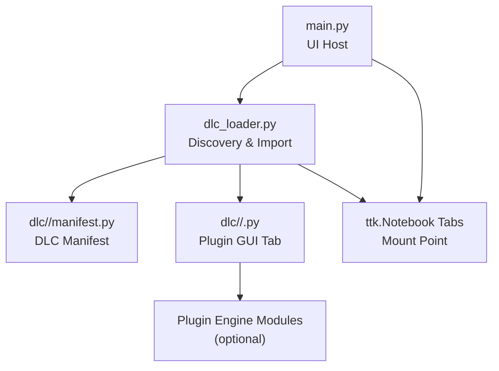
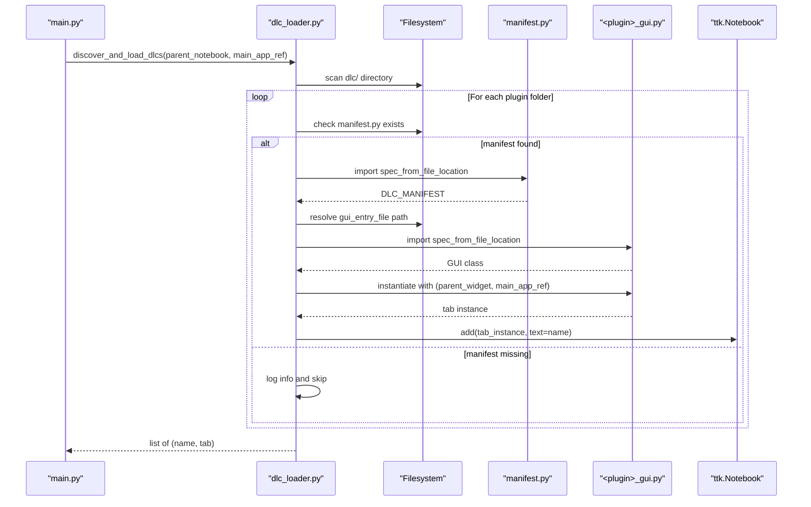
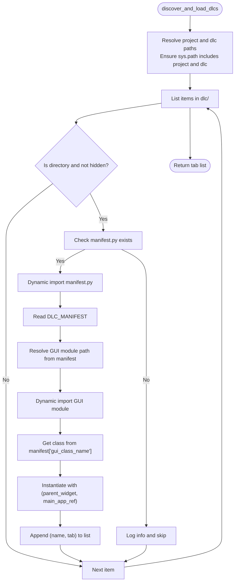
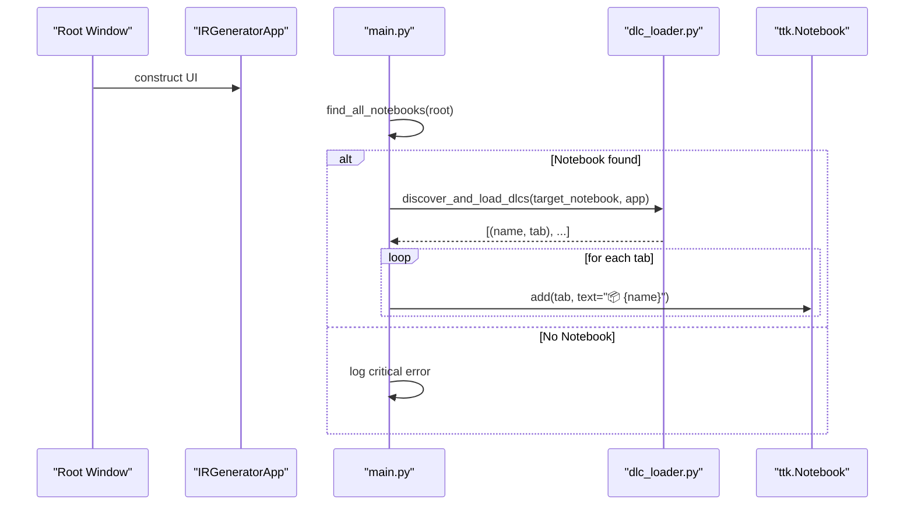
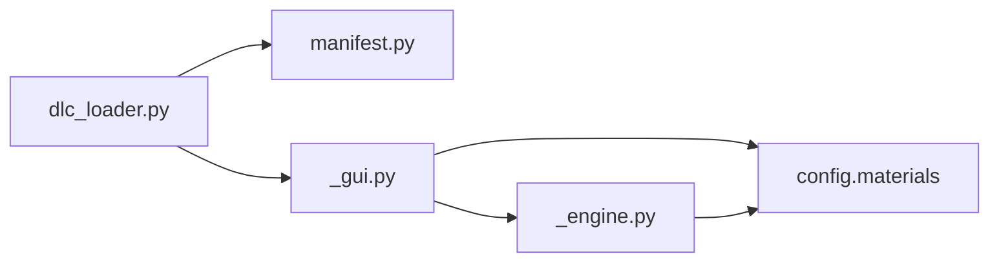

# DLC Loader and Discovery

<cite>
**Referenced Files in This Document**
- [dlc_loader.py](file://dlc_loader.py)
- [main.py](file://main.py)
- [Drums manifest](file://dlc/Drums/manifest.py)
- [Darbuka manifest](file://dlc/darbuka/manifest.py)
- [Dhol manifest](file://dlc/dhol/manifest.py)
- [Spectral Resynth manifest](file://dlc/spectral_resynth/manifest.py)
- [Drums GUI](file://dlc/Drums/drums_gui.py)
- [Darbuka GUI](file://dlc/darbuka/darbuka_gui.py)
- [Dhol GUI](file://dlc/dhol/dhol_gui.py)
- [Spectral Resynth GUI](file://dlc/spectral_resynth/gui.py)
- [Drums Engine](file://dlc/Drums/drums_engine.py)
- [Darbuka Engine](file://dlc/darbuka/darbuka_engine.py)
- [Dhol Engine](file://dlc/dhol/dhol_engine.py)
- [Spectral Resynth Engine](file://dlc/spectral_resynth/engine.py)
</cite>

## Table of Contents
1. [Introduction](#introduction)
2. [Project Structure](#project-structure)
3. [Core Components](#core-components)
4. [Architecture Overview](#architecture-overview)
5. [Detailed Component Analysis](#detailed-component-analysis)
6. [Dependency Analysis](#dependency-analysis)
7. [Performance Considerations](#performance-considerations)
8. [Troubleshooting Guide](#troubleshooting-guide)
9. [Conclusion](#conclusion)

## Introduction
This document explains the DLC loader system used by TroakarIR to dynamically discover and load third-party plugins from the dlc/ directory. It covers the manifest-based loading mechanism, directory scanning process, module import strategy, plugin lifecycle, error handling, logging, and troubleshooting guidance. The system enables developers to package new physical modeling engines and GUI tabs as separate DLCs that integrate seamlessly into the main application via a shared interface contract defined by each plugin’s manifest and GUI class.

## Project Structure
The DLC system centers around:
- A loader script that scans the dlc/ directory and imports plugin manifests and GUI modules.
- A set of DLC packages under dlc/<plugin>/ containing a manifest.py and GUI module.
- Optional engine modules per plugin that implement the physical simulation logic.
- The main application that hosts the UI and mounts discovered DLC tabs into a notebook.

**Diagram sources**
- [main.py:44-66](file://main.py#L44-L66)
- [dlc_loader.py:9-62](file://dlc_loader.py#L9-L62)

**Section sources**
- [main.py:1-76](file://main.py#L1-76)
- [dlc_loader.py:1-62](file://dlc_loader.py#L1-L62)

## Core Components
- DLC Loader: Discovers DLC directories, validates presence of manifest.py, imports the manifest, locates the GUI module, imports it, instantiates the GUI class with the parent widget and main app reference, and returns a list of (tab_name, tab_instance) tuples.
- Manifest: A Python dictionary named DLC_MANIFEST that defines the plugin’s metadata and runtime entry points (GUI module filename and class name).
- Plugin GUI: A Tkinter-based tab class that inherits from a notebook or frame, constructed with parent_widget and main_app_ref.
- Optional Engines: Per-plugin simulation engines that are imported by the GUI modules to perform synthesis or processing.

Key behaviors:
- Directory scanning ignores hidden or special directories.
- Dynamic imports use importlib.util.spec_from_file_location to avoid relying on sys.path ordering.
- Logging uses a dedicated logger with INFO/ERROR levels for discovery and import events.

**Section sources**
- [dlc_loader.py:9-62](file://dlc_loader.py#L9-L62)
- [Drums manifest:1-8](file://dlc/Drums/manifest.py#L1-L8)
- [Darbuka manifest:1-9](file://dlc/darbuka/manifest.py#L1-L9)
- [Dhol manifest:1-9](file://dlc/dhol/manifest.py#L1-L9)
- [Spectral Resynth manifest:1-8](file://dlc/spectral_resynth/manifest.py#L1-L8)

## Architecture Overview
The loader orchestrates discovery and instantiation of DLC tabs. The main application finds a ttk.Notebook and mounts each loaded tab into it.

**Diagram sources**
- [main.py:44-66](file://main.py#L44-L66)
- [dlc_loader.py:9-62](file://dlc_loader.py#L9-L62)

## Detailed Component Analysis

### DLC Loader Algorithm
The loader performs:
- Path setup: resolves absolute paths for project root and dlc/, ensures project root is at the front of sys.path, and adds dlc/ to sys.path.
- Directory iteration: lists items under dlc/, filters directories that do not start with "__".
- Manifest validation: checks for manifest.py; if present, imports it dynamically and reads DLC_MANIFEST.
- GUI import: constructs the GUI module path from manifest["gui_entry_file"], ensures the plugin directory is in sys.path, and imports the GUI module dynamically.
- Instance creation: retrieves the class name from manifest["gui_class_name"] and instantiates it with (parent_widget, main_app_ref).
- Error handling: wraps the entire process in a try/except block and logs exceptions with exc_info enabled.

**Diagram sources**
- [dlc_loader.py:9-62](file://dlc_loader.py#L9-L62)

**Section sources**
- [dlc_loader.py:9-62](file://dlc_loader.py#L9-L62)

### Manifest-Based Loading Contract
Each plugin must provide a manifest.py exporting a dictionary named DLC_MANIFEST with:
- name: Human-readable plugin name
- version: Semantic version string
- author: Author or organization
- description: Short description
- gui_entry_file: Name of the GUI module file (without path)
- gui_class_name: Fully qualified class name exported by the GUI module

Examples:
- Drums: gui_entry_file="drums_gui.py", gui_class_name="DrumsDLCFrame"
- Darbuka: gui_entry_file="darbuka_gui.py", gui_class_name="DarbukaDLCFrame"
- Dhol: gui_entry_file="dhol_gui.py", gui_class_name="DholDLCFrame"
- Spectral Resynth: gui_entry_file="gui.py", gui_class_name="SpectralResynthTab"

**Section sources**
- [Drums manifest:1-8](file://dlc/Drums/manifest.py#L1-L8)
- [Darbuka manifest:1-9](file://dlc/darbuka/manifest.py#L1-L9)
- [Dhol manifest:1-9](file://dlc/dhol/manifest.py#L1-L9)
- [Spectral Resynth manifest:1-8](file://dlc/spectral_resynth/manifest.py#L1-L8)

### Plugin GUI Interface
Each plugin’s GUI module must define a class that:
- Accepts (parent_widget, main_app_ref) in its constructor
- Exposes a usable interface for rendering and processing
- Integrates with the host application’s UI framework (Tkinter/ttk)

Examples:
- DrumsDLCFrame: ttk.Notebook subclass hosting two tabs (Builder and Physics)
- DarbukaDLCFrame: ttk.Notebook subclass hosting Engine and Packer tabs
- DholDLCFrame: ttk.Notebook subclass hosting Engine and Packer tabs
- SpectralResynthTab: ttk.Frame implementing drag-and-drop file handling and batch processing

These classes are instantiated by the loader using the class name specified in the manifest.

**Section sources**
- [Drums GUI:14-30](file://dlc/Drums/drums_gui.py#L14-L30)
- [Darbuka GUI:161-173](file://dlc/darbuka/darbuka_gui.py#L161-L173)
- [Dhol GUI:16-28](file://dlc/dhol/dhol_gui.py#L16-L28)
- [Spectral Resynth GUI:10-17](file://dlc/spectral_resynth/gui.py#L10-L17)

### Engine Modules and Optional Integration
Plugins may include optional engine modules that implement synthesis or processing logic:
- Drums engine: FDTD-based drum synthesis with material blending, tactile profiles, and convolution IRs
- Darbuka engine: FDTD-based cube drum synthesis with articulations and shell IRs
- Dhol engine: Coupled-membrane FDTD synthesis with advanced shell textures and room convolution
- Spectral Resynth engine: Hybrid material blending with MSAE texture generation and tactile profile synthesis

These engines are imported by the GUI modules and invoked during rendering or processing tasks.

**Section sources**
- [Drums Engine:745-983](file://dlc/Drums/drums_engine.py#L745-L983)
- [Darbuka Engine:372-677](file://dlc/darbuka/darbuka_engine.py#L372-L677)
- [Dhol Engine:1170-1753](file://dlc/dhol/dhol_engine.py#L1170-L1753)
- [Spectral Resynth Engine:75-157](file://dlc/spectral_resynth/engine.py#L75-L157)

### Main Application Integration
The main application:
- Initializes logging and creates the primary UI
- Scans the widget tree to locate a ttk.Notebook
- Calls discover_and_load_dlcs with the found notebook and main app reference
- Iterates over returned (name, tab) pairs and mounts each tab into the notebook

**Diagram sources**
- [main.py:8-71](file://main.py#L8-L71)

**Section sources**
- [main.py:23-71](file://main.py#L23-L71)

## Dependency Analysis
The loader depends on:
- Filesystem layout and presence of manifest.py
- Correctly formatted manifest entries (gui_entry_file, gui_class_name)
- Accessible GUI module path resolution
- Availability of required engine modules (when used by GUI)

Potential coupling points:
- Loader relies on dynamic import paths derived from manifest entries
- GUI classes depend on the main app reference and parent widget
- Engines depend on shared physics/material definitions and optional libraries

**Diagram sources**
- [dlc_loader.py:34-56](file://dlc_loader.py#L34-L56)
- [Drums GUI:9-10](file://dlc/Drums/drums_gui.py#L9-L10)
- [Darbuka GUI:12-13](file://dlc/darbuka/darbuka_gui.py#L12-L13)
- [Dhol GUI:9-12](file://dlc/dhol/dhol_gui.py#L9-L12)
- [Spectral Resynth Engine:23-56](file://dlc/spectral_resynth/engine.py#L23-L56)

**Section sources**
- [dlc_loader.py:34-56](file://dlc_loader.py#L34-L56)
- [Drums GUI:9-10](file://dlc/Drums/drums_gui.py#L9-L10)
- [Darbuka GUI:12-13](file://dlc/darbuka/darbuka_gui.py#L12-L13)
- [Dhol GUI:9-12](file://dlc/dhol/dhol_gui.py#L9-L12)
- [Spectral Resynth Engine:23-56](file://dlc/spectral_resynth/engine.py#L23-L56)

## Performance Considerations
- Dynamic imports occur per plugin and may incur overhead; consider lazy-loading engines until needed.
- GUI rendering can be intensive; ensure long-running tasks use callbacks to update progress and avoid blocking the UI thread.
- FDTD simulations rely on GPU acceleration when available; the engines initialize Taichi accordingly and fall back to CPU if needed.
- Batch processing should leverage multiprocessing or threading cautiously to avoid contention with GUI updates.

## Troubleshooting Guide
Common issues and resolutions:
- Missing dlc/ directory
  - The loader creates the directory automatically and logs an informational message. Ensure the directory exists and contains properly structured plugin folders.
  - Section sources
    - [dlc_loader.py:18-21](file://dlc_loader.py#L18-L21)

- manifest.py not found or unreadable
  - The loader skips the plugin and logs an error. Verify the manifest file exists and exports DLC_MANIFEST with correct keys.
  - Section sources
    - [dlc_loader.py:33-41](file://dlc_loader.py#L33-L41)

- Incorrect gui_entry_file or gui_class_name
  - The loader attempts to import the GUI module and retrieve the class by name. Ensure the file name matches and the class is exported at module level.
  - Section sources
    - [dlc_loader.py:44-56](file://dlc_loader.py#L44-L56)

- Module import errors inside GUI or engines
  - The loader catches exceptions and logs them with stack traces. Inspect the troakar_debug.log for detailed error messages.
  - Section sources
    - [dlc_loader.py:59-61](file://dlc_loader.py#L59-L61)

- No ttk.Notebook found by main application
  - The main application searches recursively and via attributes for a Notebook. If none is found, mounting fails. Ensure the UI contains a Notebook or adjust the search logic.
  - Section sources
    - [main.py:8-71](file://main.py#L8-L71)

- Engine initialization failures (e.g., Taichi)
  - Engines initialize Taichi and fall back to CPU if GPU is unavailable. Check logs for initialization messages and verify hardware/driver availability.
  - Section sources
    - [Drums Engine:84-98](file://dlc/Drums/drums_engine.py#L84-L98)
    - [Darbuka Engine:69-79](file://dlc/darbuka/darbuka_engine.py#L69-L79)
    - [Dhol Engine:92-115](file://dlc/dhol/dhol_engine.py#L92-L115)

- Spectral Resynth import chain failures
  - The engine attempts multiple import paths for materials and engine modules. If all fail, it raises a critical ImportError. Ensure config.materials and engine modules are accessible from the expected locations.
  - Section sources
    - [Spectral Resynth Engine:22-69](file://dlc/spectral_resynth/engine.py#L22-L69)

## Conclusion
The DLC loader system provides a robust, manifest-driven mechanism for discovering and integrating third-party plugins into the TroakarIR application. By adhering to the manifest contract and exposing a compatible GUI class, developers can extend the platform with new synthesis engines and user interfaces. Proper error handling, logging, and path management ensure reliable operation across diverse environments.