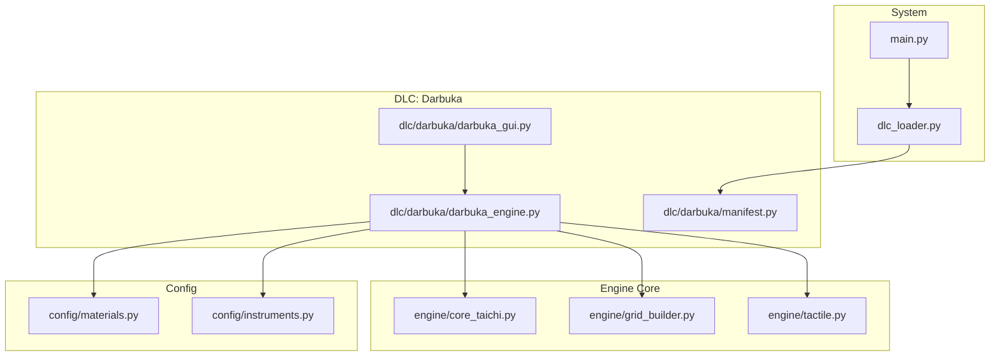
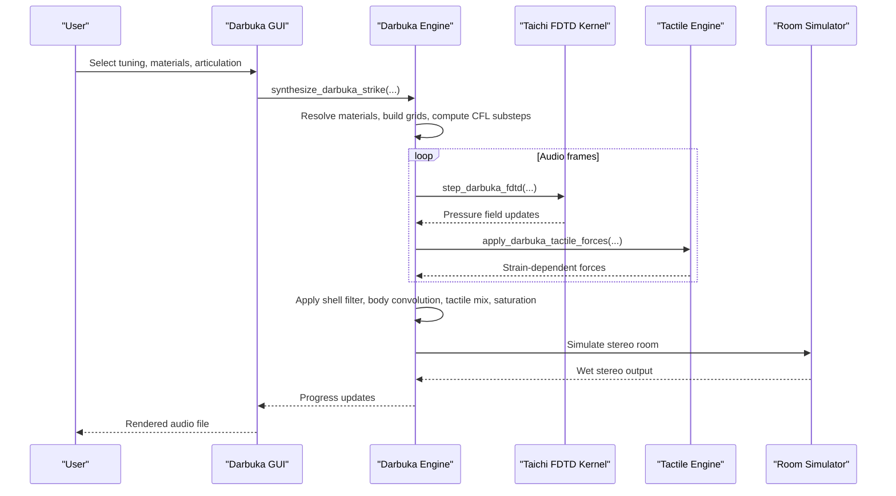
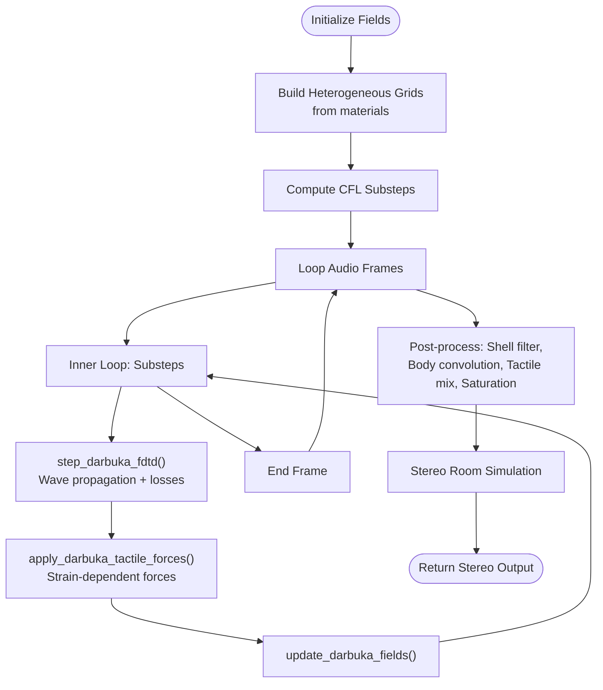
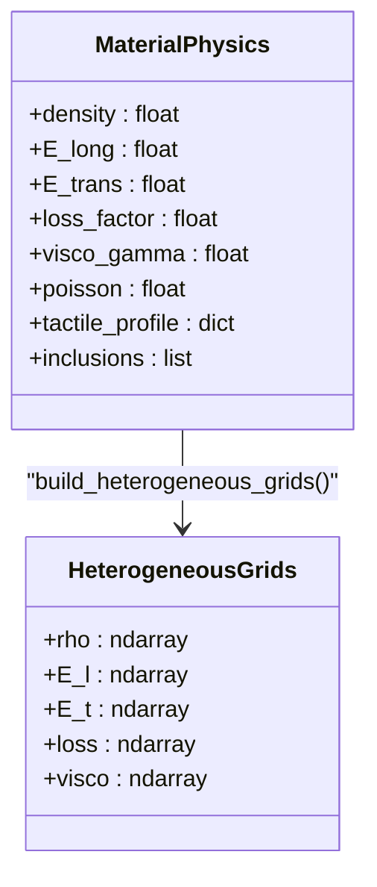
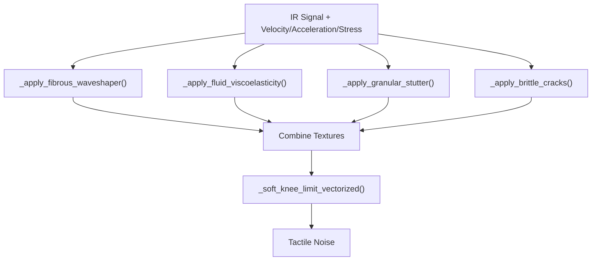
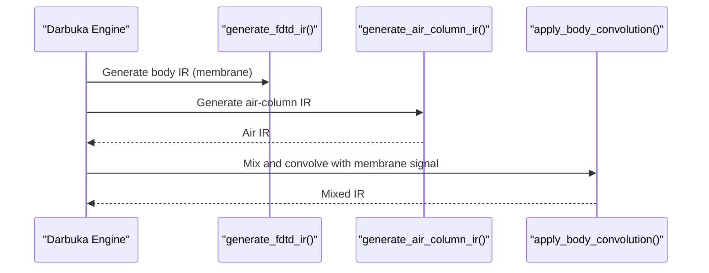
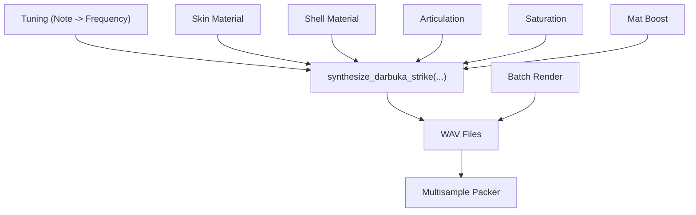
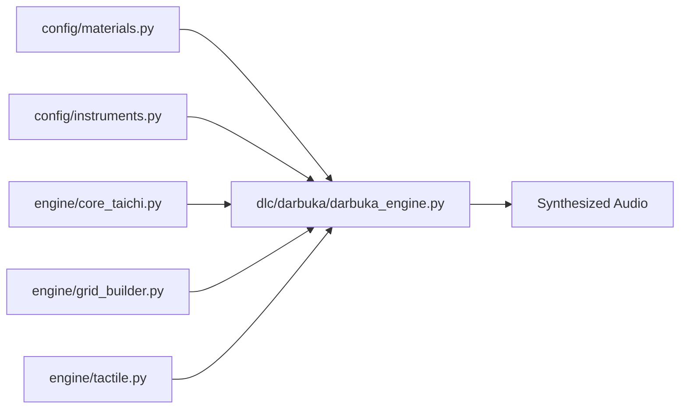

# Darbuka DLC Implementation

<cite>
**Referenced Files in This Document**
- [darbuka_engine.py](file://dlc/darbuka/darbuka_engine.py)
- [darbuka_gui.py](file://dlc/darbuka/darbuka_gui.py)
- [manifest.py](file://dlc/darbuka/manifest.py)
- [core_taichi.py](file://engine/core_taichi.py)
- [grid_builder.py](file://engine/grid_builder.py)
- [tactile.py](file://engine/tactile.py)
- [materials.py](file://config/materials.py)
- [instruments.py](file://config/instruments.py)
- [dlc_loader.py](file://dlc_loader.py)
- [main.py](file://main.py)
</cite>

## Table of Contents
1. [Introduction](#introduction)
2. [Project Structure](#project-structure)
3. [Core Components](#core-components)
4. [Architecture Overview](#architecture-overview)
5. [Detailed Component Analysis](#detailed-component-analysis)
6. [Dependency Analysis](#dependency-analysis)
7. [Performance Considerations](#performance-considerations)
8. [Troubleshooting Guide](#troubleshooting-guide)
9. [Conclusion](#conclusion)

## Introduction
The Darbuka DLC plugin implements a physically-based simulation of Middle Eastern goblet-shaped percussion instruments using finite-difference time-domain (FDTD) modeling. This documentation explains the engine implementation covering the unique acoustic properties of goblet-shaped resonators, clay vessel acoustics, and finger-rim interaction modeling. It documents the GUI controls for neck length, body diameter, clay composition parameters, and playing technique simulation, along with cultural significance and traditional playing methods. Guidance is provided for achieving realistic articulation and timbral variations within world music production workflows.

## Project Structure
The Darbuka DLC resides under the dlc/darbuka/ directory and integrates with the broader TroakarIR engine. The key components include:
- Engine: FDTD simulation, material blending, tactile generation, and impulse response synthesis
- GUI: Parameter controls, batch rendering, and multisample packing
- Configuration: Material database, instrument presets, and templates
- Loader: Dynamic discovery and mounting of DLC tabs

**Diagram sources**
- [darbuka_engine.py:1-677](file://dlc/darbuka/darbuka_engine.py#L1-L677)
- [darbuka_gui.py:1-427](file://dlc/darbuka/darbuka_gui.py#L1-L427)
- [manifest.py:1-9](file://dlc/darbuka/manifest.py#L1-L9)
- [core_taichi.py:1-717](file://engine/core_taichi.py#L1-L717)
- [grid_builder.py:1-99](file://engine/grid_builder.py#L1-L99)
- [tactile.py:1-250](file://engine/tactile.py#L1-L250)
- [materials.py:1-766](file://config/materials.py#L1-L766)
- [instruments.py:1-279](file://config/instruments.py#L1-L279)
- [dlc_loader.py:1-62](file://dlc_loader.py#L1-L62)
- [main.py:1-76](file://main.py#L1-L76)

**Section sources**
- [dlc_loader.py:9-62](file://dlc_loader.py#L9-L62)
- [main.py:23-76](file://main.py#L23-L76)

## Core Components
- FDTD Simulation: Implements a circular membrane with heterogenous material grids, substepping for stability, and dynamic boundary conditions.
- Material System: Supports material blending, inclusions, and tactile profiles for realistic texture generation.
- Tactile Engine: Generates fibrous, fluid, granular, and brittle textures based on physical strain/velocity/acceleration signals.
- Impulse Response Synthesis: Builds body IRs using FDTD and air-column IRs, then convolves with the membrane signal.
- GUI Controls: Tuning, material selection, saturation, tactile enhancement, and articulation selection with batch rendering and multisample packing.

**Section sources**
- [darbuka_engine.py:16-677](file://dlc/darbuka/darbuka_engine.py#L16-L677)
- [materials.py:18-766](file://config/materials.py#L18-L766)
- [tactile.py:46-229](file://engine/tactile.py#L46-L229)
- [grid_builder.py:10-99](file://engine/grid_builder.py#L10-L99)

## Architecture Overview
The Darbuka engine composes several layers:
- Parameter Resolution: Converts musical notes to frequencies, resolves material properties, and builds heterogeneous grids.
- FDTD Dynamics: Updates pressure fields with anisotropic wave speeds, damping, and viscosity, applying strike excitation and tactile forces.
- Post-Processing: Applies shell filtering, body convolution, tactile mixing, saturation, and stereo room simulation.
- GUI Integration: Provides tuning, material selection, articulation, and batch rendering with progress feedback.

**Diagram sources**
- [darbuka_engine.py:372-677](file://dlc/darbuka/darbuka_engine.py#L372-L677)
- [core_taichi.py:44-234](file://engine/core_taichi.py#L44-L234)
- [tactile.py:63-82](file://engine/tactile.py#L63-L82)

## Detailed Component Analysis

### FDTD Simulation and Acoustic Modeling
The core FDTD kernel evolves a circular membrane with:
- Anisotropic wave speeds derived from material properties
- Dynamic damping and viscosity fields
- Strike excitation with tailored envelopes per articulation
- Tactile forces based on strain rate and material profiles

Key implementation highlights:
- Field initialization and statistics computation
- Substepping for CFL stability
- Dynamic boundary damping for slap/mute articulations
- Air-cavity coupling for Helmholtz-like resonance

**Diagram sources**
- [darbuka_engine.py:95-194](file://dlc/darbuka/darbuka_engine.py#L95-L194)
- [darbuka_engine.py:599-622](file://dlc/darbuka/darbuka_engine.py#L599-L622)

**Section sources**
- [darbuka_engine.py:95-194](file://dlc/darbuka/darbuka_engine.py#L95-L194)
- [darbuka_engine.py:599-622](file://dlc/darbuka/darbuka_engine.py#L599-L622)

### Material System and Composition
The material system blends base materials and inclusions to create heterogeneous grids:
- Effective property calculation considering inclusions and ratios
- Gaussian smoothing of density/E-long/E-trans for realistic gradients
- Anti-resonance edge smoothing via gradient magnitude injection

**Diagram sources**
- [materials.py:18-766](file://config/materials.py#L18-L766)
- [grid_builder.py:10-87](file://engine/grid_builder.py#L10-L87)

**Section sources**
- [materials.py:18-766](file://config/materials.py#L18-L766)
- [grid_builder.py:10-87](file://engine/grid_builder.py#L10-L87)

### Tactile Texture Generation
The tactile engine generates realistic textures by analyzing strain/velocity/acceleration signals:
- Fibrous waveshaping for wood-like crackling
- Fluid viscoelasticity for viscous friction
- Granular stutter for particulate effects
- Brittle cracking for fracture events

**Diagram sources**
- [tactile.py:46-156](file://engine/tactile.py#L46-L156)
- [tactile.py:193-229](file://engine/tactile.py#L193-L229)

**Section sources**
- [tactile.py:46-156](file://engine/tactile.py#L46-L156)
- [tactile.py:193-229](file://engine/tactile.py#L193-L229)

### Impulse Response Synthesis and Body Convolution
The engine synthesizes a body IR by combining:
- FDTD-generated membrane IR with a filtered air-column IR
- Mixed IR normalized and convolved with the membrane signal
- High-pass filtering and fade shaping for realism

**Diagram sources**
- [darbuka_engine.py:310-369](file://dlc/darbuka/darbuka_engine.py#L310-L369)
- [darbuka_engine.py:286-308](file://dlc/darbuka/darbuka_engine.py#L286-L308)

**Section sources**
- [darbuka_engine.py:310-369](file://dlc/darbuka/darbuka_engine.py#L310-L369)
- [darbuka_engine.py:286-308](file://dlc/darbuka/darbuka_engine.py#L286-L308)

### GUI Controls and Workflow
The GUI provides:
- Tuning selection (musical note to target frequency)
- Material selection for skin and shell
- Articulation selection (doum, tek, ka, slap, roll, mute)
- Post-processing controls (tape saturation, tactile sand/grit)
- Batch rendering with velocity layers and round-robin
- Multisample packer for distribution

**Diagram sources**
- [darbuka_gui.py:200-310](file://dlc/darbuka/darbuka_gui.py#L200-L310)
- [darbuka_gui.py:324-421](file://dlc/darbuka/darbuka_gui.py#L324-L421)
- [darbuka_gui.py:21-158](file://dlc/darbuka/darbuka_gui.py#L21-L158)

**Section sources**
- [darbuka_gui.py:200-310](file://dlc/darbuka/darbuka_gui.py#L200-L310)
- [darbuka_gui.py:324-421](file://dlc/darbuka/darbuka_gui.py#L324-L421)
- [darbuka_gui.py:21-158](file://dlc/darbuka/darbuka_gui.py#L21-L158)

## Dependency Analysis
The Darbuka engine depends on:
- Material database for physics and tactile profiles
- Instrument presets for shell IR generation
- Core Taichi engine for FDTD kernels and room simulation
- Grid builder for heterogeneous material maps
- Tactile engine for texture synthesis

**Diagram sources**
- [materials.py:18-766](file://config/materials.py#L18-L766)
- [instruments.py:264-275](file://config/instruments.py#L264-L275)
- [core_taichi.py:266-717](file://engine/core_taichi.py#L266-L717)
- [grid_builder.py:10-87](file://engine/grid_builder.py#L10-L87)
- [tactile.py:193-229](file://engine/tactile.py#L193-L229)
- [darbuka_engine.py:372-677](file://dlc/darbuka/darbuka_engine.py#L372-L677)

**Section sources**
- [darbuka_engine.py:12-14](file://dlc/darbuka/darbuka_engine.py#L12-L14)
- [instruments.py:264-275](file://config/instruments.py#L264-L275)

## Performance Considerations
- GPU acceleration: Taichi initializes GPU when available; falls back to CPU otherwise
- Substepping: Automatic CFL substepping scales with grid size and wave speed
- Memory limits: Maximum grid size constrained to prevent overflow
- Early termination: Simulation stops when energy drops below thresholds
- Convolution efficiency: Body IRs are precomputed and cached by effective material properties

[No sources needed since this section provides general guidance]

## Troubleshooting Guide
Common issues and resolutions:
- GPU initialization failures: The engine attempts GPU initialization and falls back to CPU silently
- Unstable simulations: Early termination occurs on NaN/Inf detection; reduce strike force or adjust materials
- Silent output: Auto-stop triggers when strain energy is negligible; increase duration or strike force
- GUI rendering stalls: Ensure progress callbacks are invoked; verify Taichi GUI availability

**Section sources**
- [darbuka_engine.py:69-79](file://dlc/darbuka/darbuka_engine.py#L69-L79)
- [darbuka_engine.py:583-586](file://dlc/darbuka/darbuka_engine.py#L583-L586)
- [darbuka_engine.py:575-578](file://dlc/darbuka/darbuka_engine.py#L575-L578)

## Conclusion
The Darbuka DLC provides a comprehensive physically-based model of goblet-shaped percussion instruments. By combining FDTD dynamics, heterogeneous material grids, tactile texture synthesis, and realistic post-processing, it enables authentic reproduction of traditional playing techniques and cultural timbral characteristics. The GUI offers flexible controls for tuning, material composition, and articulation, while the multisample packer streamlines integration into world music production workflows.