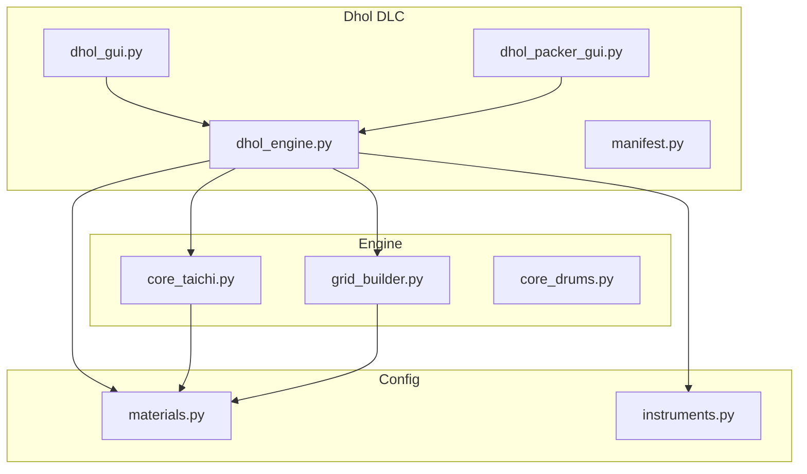
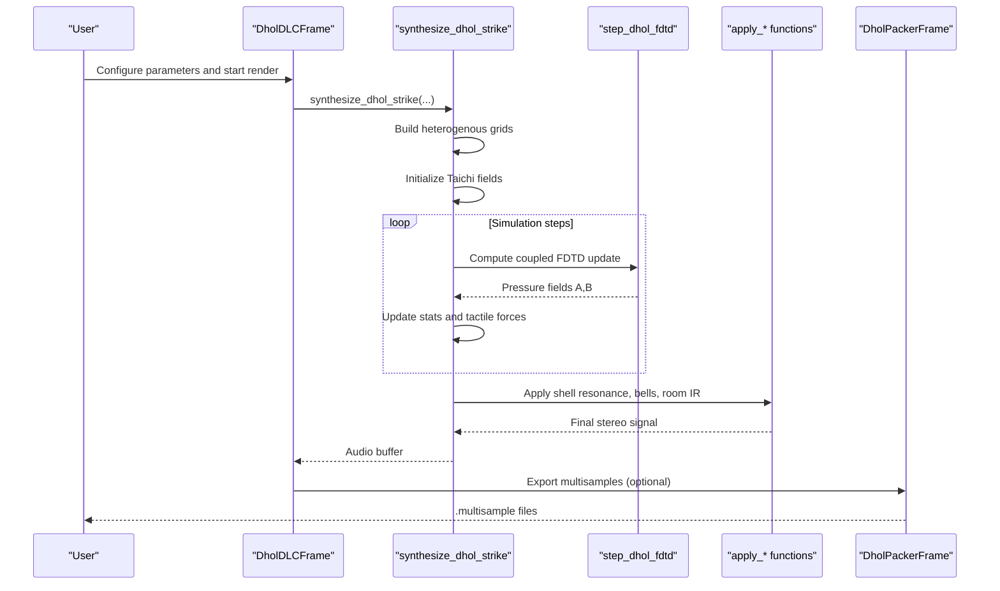
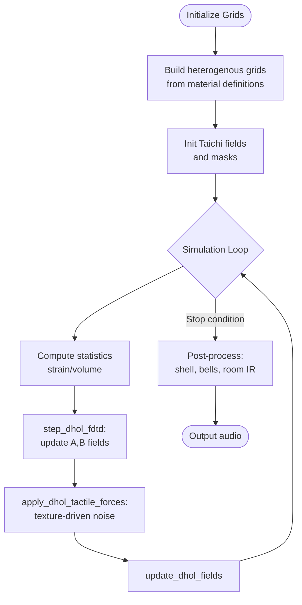
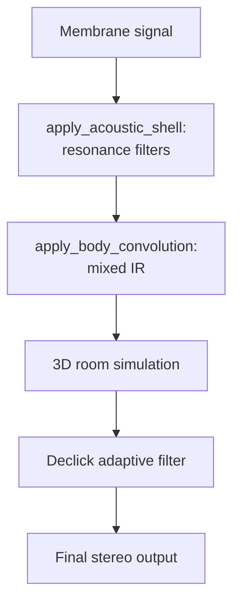
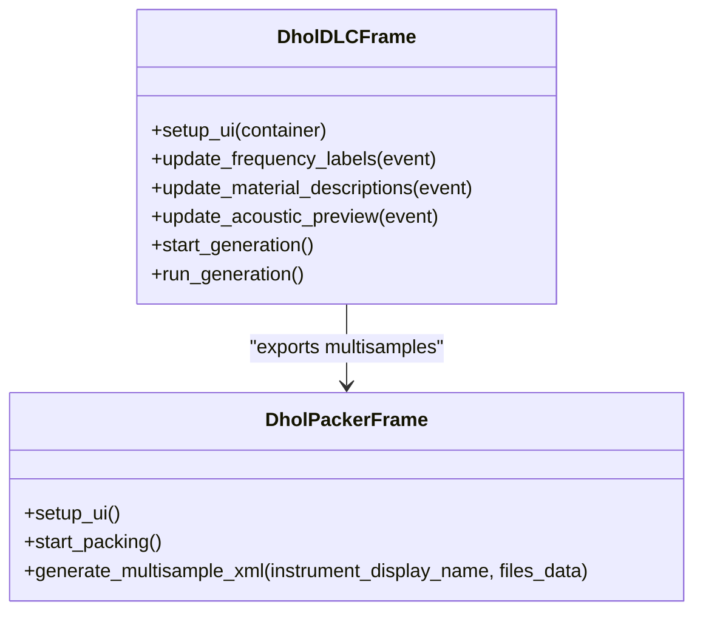
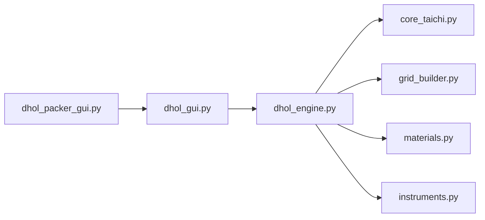

# Dhol DLC Implementation

<cite>
**Referenced Files in This Document**
- [dhol_engine.py](file://dlc/dhol/dhol_engine.py)
- [dhol_gui.py](file://dlc/dhol/dhol_gui.py)
- [dhol_packer_gui.py](file://dlc/dhol/dhol_packer_gui.py)
- [manifest.py](file://dlc/dhol/manifest.py)
- [materials.py](file://config/materials.py)
- [instruments.py](file://config/instruments.py)
- [grid_builder.py](file://engine/grid_builder.py)
- [core_taichi.py](file://engine/core_taichi.py)
- [core_drums.py](file://engine/core_drums.py)
</cite>

## Table of Contents
1. [Introduction](#introduction)
2. [Project Structure](#project-structure)
3. [Core Components](#core-components)
4. [Architecture Overview](#architecture-overview)
5. [Detailed Component Analysis](#detailed-component-analysis)
6. [Dependency Analysis](#dependency-analysis)
7. [Performance Considerations](#performance-considerations)
8. [Troubleshooting Guide](#troubleshooting-guide)
9. [Conclusion](#conclusion)

## Introduction
This document describes the Dhol DLC plugin implementation for the TroakarIR engine, focusing on the Indo-Pacific percussion instrument simulation of the Kavkazski Dhol (Caucasian dhol). It covers the physics-based two-membrane coupled FDTD engine, rope tension and skin interaction modeling, GUI components for real-time synthesis and batch export, cultural and acoustic characteristics, parameter ranges for authentic sound reproduction, and performance optimization strategies for real-time simulation and batch processing.

## Project Structure
The Dhol DLC resides under the dlc/dhol package and integrates with shared engine modules and configuration databases. Key elements include:
- Physics engine: coupled FDTD solver with heterogenous material grids
- Acoustic post-processing: shell resonance, internal bells, room convolution
- GUI: interactive synthesis interface and multisample packer
- Materials database: extensive heterogeneous material definitions with tactile profiles
- Instrument presets: drum shell templates and modal parameters

**Diagram sources**
- [dhol_engine.py:1-1753](file://dlc/dhol/dhol_engine.py#L1-L1753)
- [dhol_gui.py:1-747](file://dlc/dhol/dhol_gui.py#L1-L747)
- [dhol_packer_gui.py:1-241](file://dlc/dhol/dhol_packer_gui.py#L1-L241)
- [manifest.py:1-9](file://dlc/dhol/manifest.py#L1-L9)
- [core_taichi.py:1-717](file://engine/core_taichi.py#L1-L717)
- [grid_builder.py:1-99](file://engine/grid_builder.py#L1-L99)
- [core_drums.py:1-249](file://engine/core_drums.py#L1-L249)
- [materials.py:1-766](file://config/materials.py#L1-L766)
- [instruments.py:1-279](file://config/instruments.py#L1-L279)

**Section sources**
- [manifest.py:1-9](file://dlc/dhol/manifest.py#L1-L9)

## Core Components
- Coupled FDTD Engine: Two-membrane simulation with air-coupled dynamics, heterogenous material grids, and tactile forces
- Acoustic Post-Processing: Shell resonance filters, internal bells, room convolution, and body damping
- GUI: Real-time synthesis controls, acoustic preview, and batch rendering
- Packer: Multisample generator for Bitwig with velocity layers and round-robin support
- Materials System: Comprehensive heterogeneous materials with tactile profiles and inclusions
- Instrument Templates: Drum shell modes and modal parameters for realistic resonance

**Section sources**
- [dhol_engine.py:1-1753](file://dlc/dhol/dhol_engine.py#L1-L1753)
- [dhol_gui.py:1-747](file://dlc/dhol/dhol_gui.py#L1-L747)
- [dhol_packer_gui.py:1-241](file://dlc/dhol/dhol_packer_gui.py#L1-L241)
- [materials.py:1-766](file://config/materials.py#L1-L766)
- [instruments.py:1-279](file://config/instruments.py#L1-L279)
- [grid_builder.py:1-99](file://engine/grid_builder.py#L1-L99)
- [core_taichi.py:1-717](file://engine/core_taichi.py#L1-L717)

## Architecture Overview
The Dhol engine couples two pressure fields (membranes A and B) separated by an internal air volume. Material heterogeneity is modeled via grids of density, elastic moduli, loss, and viscosity. Air coupling introduces acoustic feedback between membranes, while tactile forces simulate skin texture effects. Post-processing applies shell resonance, optional internal bells, and room convolution. The GUI orchestrates synthesis, previews acoustic compatibility, and exports multisamples.

**Diagram sources**
- [dhol_gui.py:587-747](file://dlc/dhol/dhol_gui.py#L587-L747)
- [dhol_engine.py:944-1599](file://dlc/dhol/dhol_engine.py#L944-L1599)
- [dhol_packer_gui.py:167-241](file://dlc/dhol/dhol_packer_gui.py#L167-L241)

## Detailed Component Analysis

### Coupled FDTD Physics Engine
The engine simulates two membranes (A and B) with:
- Local wave speeds derived from heterogenous material grids
- Air coupling through delayed acoustic volumes
- Dynamic bending stiffness modulation via strain accumulation
- Heterogeneous loss and viscosity mapped per pixel
- Tactile forces for granular, fibrous, fluid, and brittle textures

Key implementation highlights:
- Effective material blending and inclusion mixing for realistic textures
- CFL-adaptive substepping for stability
- Ring modulation and body damping for expressive control
- Declicking and envelope shaping for clean transients

**Diagram sources**
- [dhol_engine.py:143-1599](file://dlc/dhol/dhol_engine.py#L143-L1599)
- [grid_builder.py:10-99](file://engine/grid_builder.py#L10-L99)

**Section sources**
- [dhol_engine.py:17-1599](file://dlc/dhol/dhol_engine.py#L17-L1599)
- [grid_builder.py:10-99](file://engine/grid_builder.py#L10-L99)

### Acoustic Post-Processing and Shell Resonance
The engine applies:
- Shell resonance filters tuned to material sound speed and target pitch
- Optional internal bells with RR-indexed stochastic generation
- Room impulse response via pyroomacoustics
- Body damping ADSR envelope for controlled decay
- Declicking filters to remove artifacts

**Diagram sources**
- [dhol_engine.py:336-768](file://dlc/dhol/dhol_engine.py#L336-L768)

**Section sources**
- [dhol_engine.py:336-768](file://dlc/dhol/dhol_engine.py#L336-L768)

### GUI Components
The Dhol GUI provides:
- Left panel: Tuning (two membranes), material selection, acoustic preview
- Right panel: Rendering controls, export settings, console logs
- Real-time visualization: live FDTD field display during synthesis
- Batch rendering: velocity layers, round-robin, and articulation selection
- Packer: Bitwig multisample generation with velocity ranges and RR logic

**Diagram sources**
- [dhol_gui.py:16-747](file://dlc/dhol/dhol_gui.py#L16-L747)
- [dhol_packer_gui.py:13-241](file://dlc/dhol/dhol_packer_gui.py#L13-L241)

**Section sources**
- [dhol_gui.py:16-747](file://dlc/dhol/dhol_gui.py#L16-L747)
- [dhol_packer_gui.py:13-241](file://dlc/dhol/dhol_packer_gui.py#L13-L241)

### Materials and Cultural Acoustics
The materials database defines heterogeneous materials with tactile profiles and inclusions:
- Skin materials (e.g., animal_skin) for membrane textures
- Shell materials (e.g., walnut) for resonator bodies
- Inclusions (e.g., sea_salt_crystal) to simulate porosity and scattering
- Tactile attributes: fibrousness, fluidity, granularity, brittleness

These properties directly influence:
- Sound speed and resonance tuning
- Energy dissipation and decay
- Surface friction and texture effects
- Internal bell generation and shell IR

**Section sources**
- [materials.py:18-766](file://config/materials.py#L18-L766)
- [dhol_engine.py:17-77](file://dlc/dhol/dhol_engine.py#L17-L77)

### Regional Playing Techniques and Parameter Ranges
Articulations supported include:
- open_bass, duum, mute, tek_A, tek_B, chapa, kopal, tchipot, clap_tek, bass_slide, wood_click

Each articulation adjusts:
- Contact time and strike radius
- Target membrane and pickup mix
- Loss and viscosity multipliers
- Ring modulation and body damping
- Specialized transients (finger snap, slap, slide, click)

Parameter ranges and defaults are exposed in the GUI sliders for saturation, detail boost, tactile strength, snap brightness, shell attack/sustain, ring modulation, and body damping.

**Section sources**
- [dhol_engine.py:1078-1398](file://dlc/dhol/dhol_engine.py#L1078-L1398)
- [dhol_gui.py:118-335](file://dlc/dhol/dhol_gui.py#L118-L335)

## Dependency Analysis
The Dhol engine depends on:
- Taichi for GPU-accelerated FDTD computation
- NumPy/SciPy for signal processing and filtering
- PyRoomAcoustics for 3D room impulse responses
- Grid builder for heterogenous material maps
- Shared engine modules for tactile and spatial processing

**Diagram sources**
- [dhol_engine.py:1-16](file://dlc/dhol/dhol_engine.py#L1-L16)
- [core_taichi.py:1-13](file://engine/core_taichi.py#L1-L13)
- [grid_builder.py:1-13](file://engine/grid_builder.py#L1-L13)
- [materials.py:1-8](file://config/materials.py#L1-L8)
- [instruments.py:1-3](file://config/instruments.py#L1-L3)
- [dhol_gui.py:1-14](file://dlc/dhol/dhol_gui.py#L1-L14)
- [dhol_packer_gui.py:1-11](file://dlc/dhol/dhol_packer_gui.py#L1-L11)

**Section sources**
- [dhol_engine.py:1-16](file://dlc/dhol/dhol_engine.py#L1-L16)
- [core_taichi.py:1-13](file://engine/core_taichi.py#L1-L13)
- [grid_builder.py:1-13](file://engine/grid_builder.py#L1-L13)
- [materials.py:1-8](file://config/materials.py#L1-L8)
- [instruments.py:1-3](file://config/instruments.py#L1-L3)
- [dhol_gui.py:1-14](file://dlc/dhol/dhol_gui.py#L1-L14)
- [dhol_packer_gui.py:1-11](file://dlc/dhol/dhol_packer_gui.py#L1-L11)

## Performance Considerations
- GPU initialization and fallback: automatic CUDA/Vulkan selection with CPU fallback
- CFL-adaptive substepping: dynamically increases substeps to maintain stability
- Field-based visualization: optional live display with early termination on minimal energy
- Memory footprint: fixed-size buffers up to 512x512 with padding to max
- Declicking: adaptive slewing to reduce artifacts in high-frequency regions
- Batch rendering: configurable velocity layers and round-robin to optimize disk I/O
- IR caching: cached body impulse responses keyed by material hash and articulation

Optimization tips:
- Prefer smaller grid sizes for real-time previews; increase for higher fidelity
- Use autotune shell to improve consonance and reduce dissonance artifacts
- Limit RR count and velocity layers for faster batch export
- Disable GUI during batch rendering to avoid overhead

**Section sources**
- [dhol_engine.py:92-115](file://dlc/dhol/dhol_engine.py#L92-L115)
- [dhol_engine.py:1001-1010](file://dlc/dhol/dhol_engine.py#L1001-L1010)
- [dhol_engine.py:1410-1458](file://dlc/dhol/dhol_engine.py#L1410-L1458)
- [dhol_engine.py:1213-1227](file://dlc/dhol/dhol_engine.py#L1213-L1227)
- [dhol_gui.py:587-747](file://dlc/dhol/dhol_gui.py#L587-L747)

## Troubleshooting Guide
Common issues and resolutions:
- No GPU detected: engine falls back to CPU; expect lower performance
- GUI not displaying: ensure DISPLAY environment is set or disable GUI for headless operation
- Silent output: verify strike force and articulation parameters; check body damping and mute settings
- Dissonance/bi-section conflicts: use autotune shell to align shell modes with target pitch
- Excessive noise/aliasing: reduce grid size or enable declicking; adjust saturation and ring modulation
- Slow batch export: reduce velocity layers and RR count; pre-cache IRs by keeping sessions consistent

**Section sources**
- [dhol_engine.py:92-115](file://dlc/dhol/dhol_engine.py#L92-L115)
- [dhol_engine.py:1410-1458](file://dlc/dhol/dhol_engine.py#L1410-L1458)
- [dhol_gui.py:587-747](file://dlc/dhol/dhol_gui.py#L587-L747)

## Conclusion
The Dhol DLC provides a physically grounded, regionally inspired percussion simulation through coupled FDTD mechanics, heterogenous material modeling, and expressive post-processing. Its GUI enables real-time exploration and batch export of multisamples tailored for Bitwig, while the materials system supports rich tactile and acoustic textures. By leveraging GPU acceleration, adaptive substepping, and targeted post-processing, the engine achieves both authenticity and performance across interactive and offline workflows.