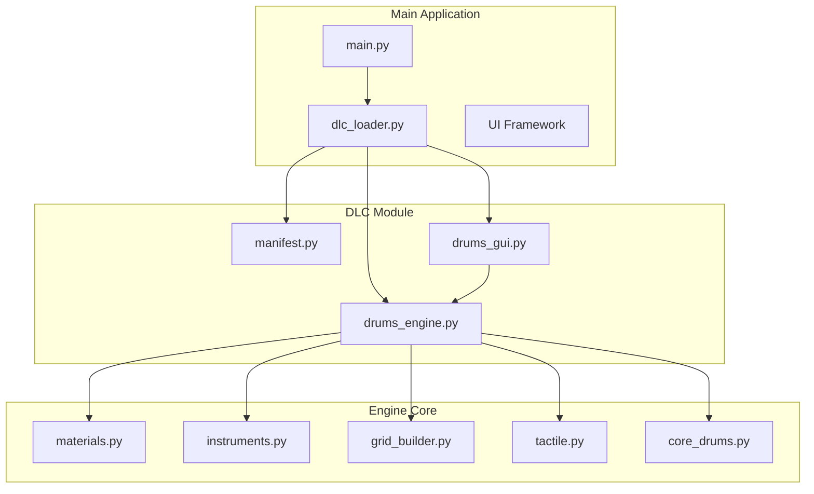
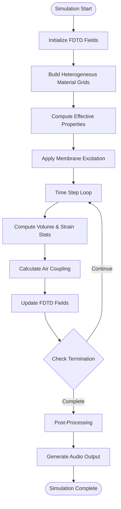
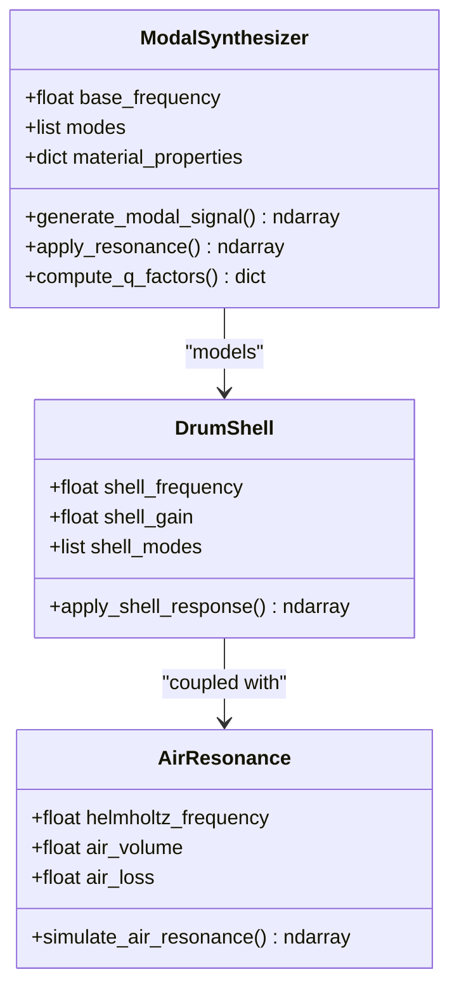
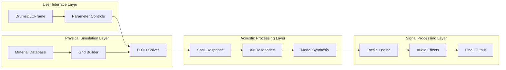
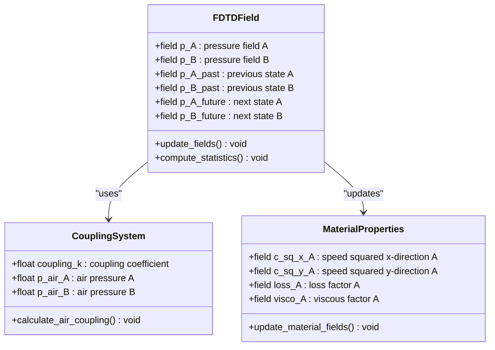
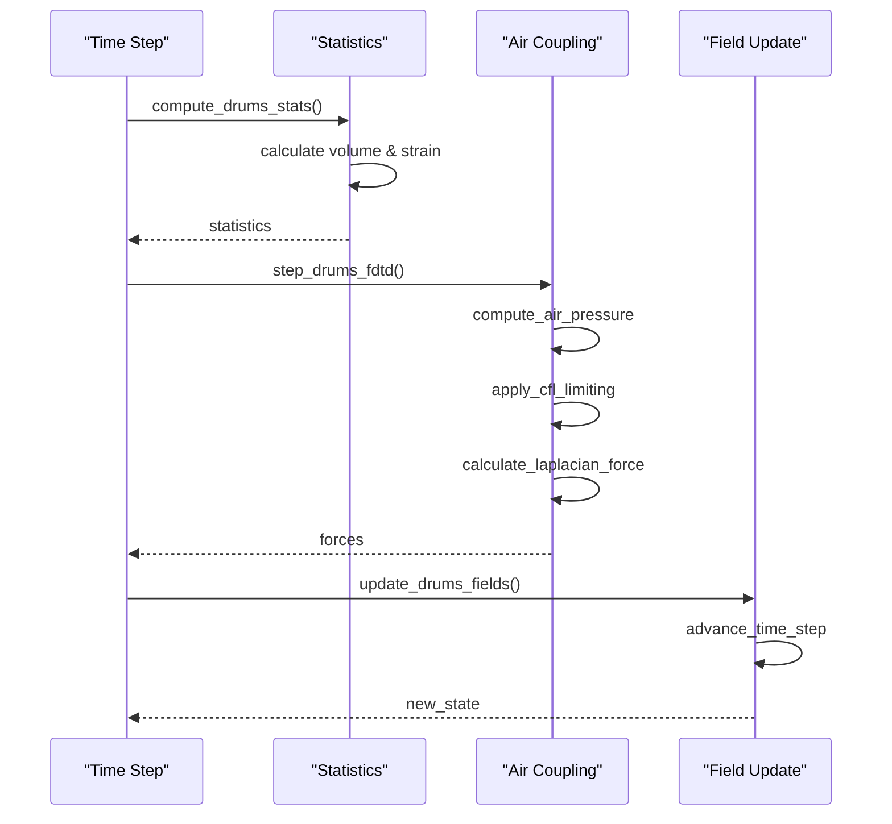
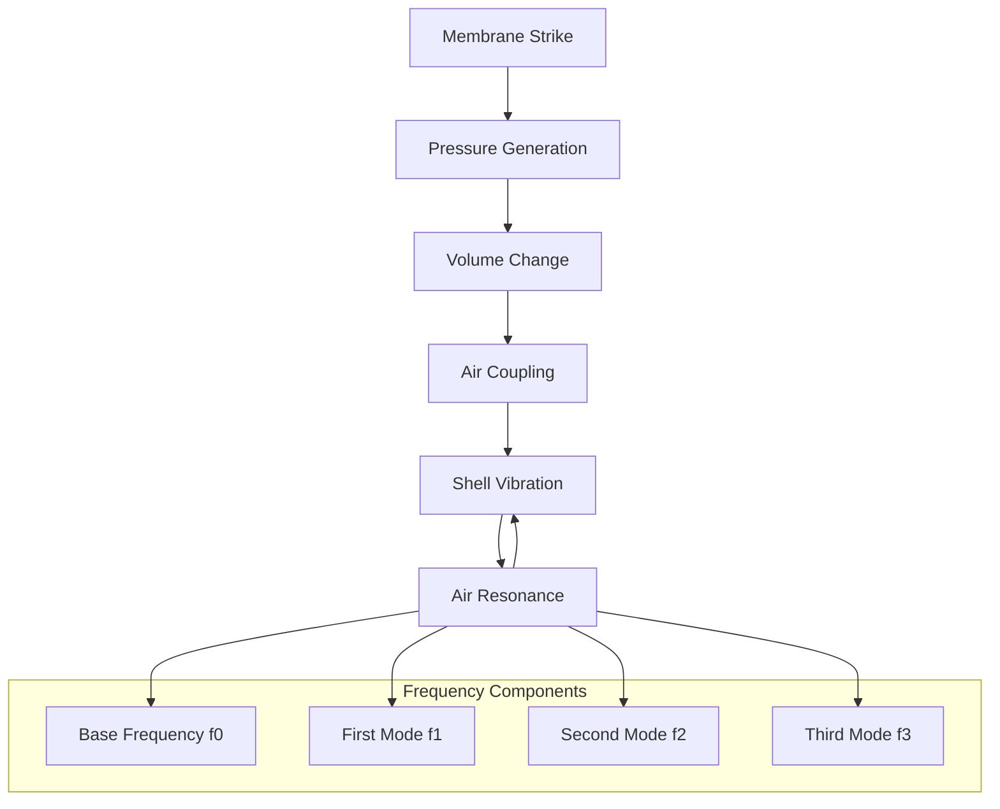
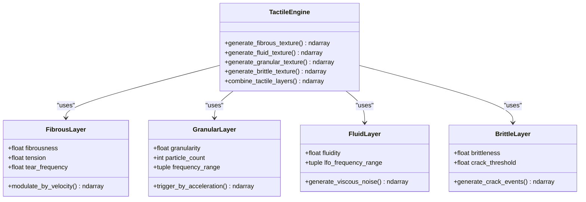
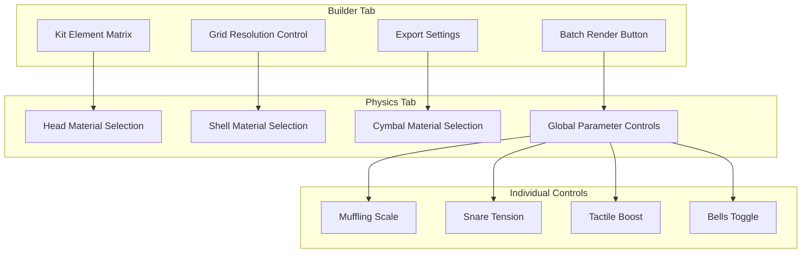
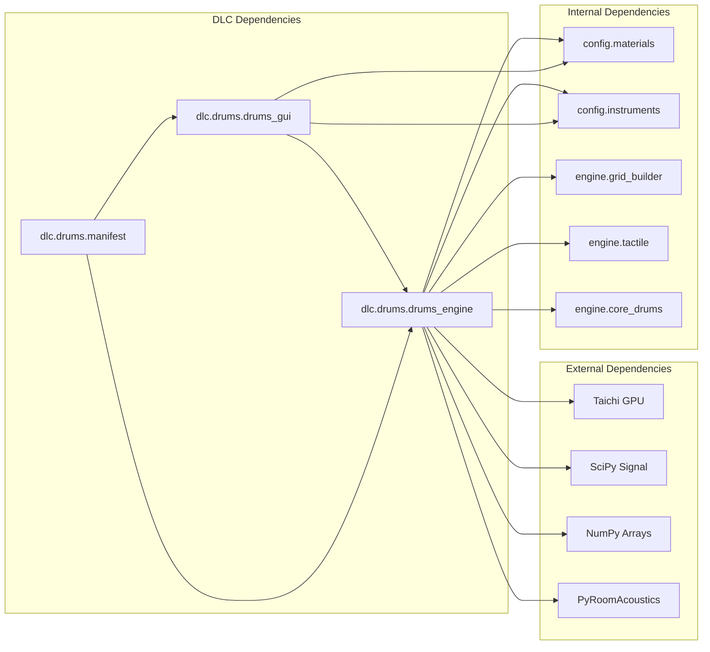

# Drum DLC Implementation

<cite>
**Referenced Files in This Document**
- [drums_engine.py](file://dlc/Drums/drums_engine.py)
- [drums_gui.py](file://dlc/Drums/drums_gui.py)
- [manifest.py](file://dlc/Drums/manifest.py)
- [core_drums.py](file://engine/core_drums.py)
- [grid_builder.py](file://engine/grid_builder.py)
- [tactile.py](file://engine/tactile.py)
- [materials.py](file://config/materials.py)
- [instruments.py](file://config/instruments.py)
- [main.py](file://main.py)
- [dlc_loader.py](file://dlc_loader.py)
- [tab_percussion.py](file://ui/tab_percussion.py)
</cite>

## Table of Contents
1. [Introduction](#introduction)
2. [Project Structure](#project-structure)
3. [Core Components](#core-components)
4. [Architecture Overview](#architecture-overview)
5. [Detailed Component Analysis](#detailed-component-analysis)
6. [Dependency Analysis](#dependency-analysis)
7. [Performance Considerations](#performance-considerations)
8. [Troubleshooting Guide](#troubleshooting-guide)
9. [Conclusion](#conclusion)

## Introduction

The Drum DLC plugin implements a comprehensive physical modeling system for acoustic drum simulation using Finite-Difference Time-Domain (FDTD) methods. This implementation provides realistic drum shell physics, membrane vibration modeling, and acoustic coupling between drum heads and shells with sophisticated air resonance calculations and modal synthesis approaches.

The system combines advanced computational physics with intuitive user controls, enabling musicians and sound designers to create authentic drum sounds through parameter-driven physical simulation. The implementation supports multiple drum types including bass drums, toms, snare drums, and cymbals, each with specialized modeling approaches.

## Project Structure

The Drum DLC follows a modular architecture that integrates seamlessly with the main TroakarIR application:

**Diagram sources**
- [main.py:23-76](file://main.py#L23-L76)
- [dlc_loader.py:9-62](file://dlc_loader.py#L9-L62)
- [manifest.py:1-8](file://manifest.py#L1-L8)

**Section sources**
- [main.py:1-76](file://main.py#L1-L76)
- [dlc_loader.py:1-62](file://dlc_loader.py#L1-L62)
- [manifest.py:1-8](file://manifest.py#L1-L8)

## Core Components

### FDTD Physics Engine

The heart of the drum simulation lies in the finite-difference time-domain implementation that solves wave equations on a 2D grid:

**Diagram sources**
- [drums_engine.py:844-983](file://dlc/Drums/drums_engine.py#L844-L983)

The FDTD solver operates on two coupled membrane surfaces with sophisticated boundary conditions and material property interpolation. The implementation uses Taichi for GPU-accelerated computation, enabling real-time interactive simulation.

### Material Property System

The system employs a comprehensive material database with over 60 predefined materials, each characterized by:

- **Density and Elastic Properties**: Mass density, longitudinal and transverse elastic moduli
- **Loss Characteristics**: Material damping factors and viscoelastic parameters  
- **Tactile Profiles**: Four-dimensional tactile response model (fibrousness, fluidity, granularity, brittleness)
- **Inclusions**: Heterogeneous material structures with customizable patterns

**Section sources**
- [drums_engine.py:12-67](file://dlc/Drums/drums_engine.py#L12-L67)
- [materials.py:18-766](file://config/materials.py#L18-L766)

### Modal Synthesis Engine

Beyond the FDTD simulation, the system incorporates modal synthesis for efficient acoustic modeling:

**Diagram sources**
- [drums_engine.py:279-362](file://dlc/Drums/drums_engine.py#L279-L362)
- [core_drums.py:96-248](file://engine/core_drums.py#L96-L248)

**Section sources**
- [drums_engine.py:279-362](file://dlc/Drums/drums_engine.py#L279-L362)
- [core_drums.py:96-248](file://engine/core_drums.py#L96-L248)

## Architecture Overview

The Drum DLC implements a hybrid simulation architecture combining physical modeling with digital signal processing:

**Diagram sources**
- [drums_gui.py:15-334](file://dlc/Drums/drums_gui.py#L15-L334)
- [drums_engine.py:745-983](file://dlc/Drums/drums_engine.py#L745-L983)

The architecture supports real-time parameter adjustment while maintaining computational efficiency through GPU acceleration and optimized numerical methods.

**Section sources**
- [drums_gui.py:15-334](file://dlc/Drums/drums_gui.py#L15-L334)
- [drums_engine.py:745-983](file://dlc/Drums/drums_engine.py#L745-L983)

## Detailed Component Analysis

### FDTD Drum Simulation

The finite-difference time-domain implementation solves the wave equation for drum membrane vibration:

#### Field Management System

**Diagram sources**
- [drums_engine.py:103-126](file://dlc/Drums/drums_engine.py#L103-L126)
- [drums_engine.py:157-244](file://dlc/Drums/drums_engine.py#L157-L244)

#### Time Integration Method

The simulation uses a leapfrog finite-difference scheme with CFL stability condition enforcement:

**Diagram sources**
- [drums_engine.py:157-244](file://dlc/Drums/drums_engine.py#L157-L244)
- [drums_engine.py:272-277](file://dlc/Drums/drums_engine.py#L272-L277)

**Section sources**
- [drums_engine.py:103-126](file://dlc/Drums/drums_engine.py#L103-L126)
- [drums_engine.py:157-244](file://dlc/Drums/drums_engine.py#L157-L244)
- [drums_engine.py:272-277](file://dlc/Drums/drums_engine.py#L272-L277)

### Acoustic Coupling System

The shell-air coupling mechanism creates realistic acoustic feedback between the vibrating membrane and the enclosed air:

#### Helmholtz Resonance Model

**Diagram sources**
- [drums_engine.py:279-362](file://dlc/Drums/drums_engine.py#L279-L362)

The system implements multiple resonance frequencies with drum-type-specific scaling factors and dynamic Q-factor calculation based on material properties and strike force.

**Section sources**
- [drums_engine.py:279-362](file://dlc/Drums/drums_engine.py#L279-L362)

### Tactile Texture Generation

The tactile engine generates physically-based surface textures that enhance the haptic experience:

#### Multi-Scale Texture Synthesis

**Diagram sources**
- [tactile.py:46-229](file://engine/tactile.py#L46-L229)

**Section sources**
- [tactile.py:46-229](file://engine/tactile.py#L46-L229)

### GUI Integration Pattern

The Drum DLC implements a dual-tab interface pattern that provides both batch rendering capabilities and individual parameter control:

#### Parameter Control System

**Diagram sources**
- [drums_gui.py:32-334](file://dlc/Drums/drums_gui.py#L32-L334)

**Section sources**
- [drums_gui.py:32-334](file://dlc/Drums/drums_gui.py#L32-L334)

## Dependency Analysis

The Drum DLC maintains loose coupling with the main application through a well-defined plugin architecture:

**Diagram sources**
- [drums_engine.py:1-11](file://dlc/Drums/drums_engine.py#L1-L11)
- [drums_gui.py:1-12](file://dlc/Drums/drums_gui.py#L1-L12)
- [manifest.py:1-8](file://dlc/Drums/manifest.py#L1-L8)

**Section sources**
- [drums_engine.py:1-11](file://dlc/Drums/drums_engine.py#L1-L11)
- [drums_gui.py:1-12](file://dlc/Drums/drums_gui.py#L1-L12)
- [manifest.py:1-8](file://dlc/Drums/manifest.py#L1-L8)

## Performance Considerations

### Computational Efficiency

The FDTD implementation achieves real-time performance through several optimization strategies:

- **GPU Acceleration**: Taichi backend enables parallel computation across thousands of grid points
- **Adaptive Grid Resolution**: Dynamic grid sizing based on simulation requirements
- **CFL Stability Optimization**: Automatic timestep limiting prevents numerical instability
- **Early Termination Detection**: Simulation stops when energy falls below threshold

### Memory Management

The system employs efficient memory allocation patterns:

- **Field Reuse**: Pre-allocated field arrays minimize runtime allocations
- **Boundary Condition Optimization**: Edge effects computed only where needed
- **Progressive Loading**: Large datasets loaded incrementally during batch processing

### Parameter Tuning Guidelines

For optimal performance and quality:

- **Grid Resolution**: Start with 256×256 for interactive use, increase to 512×512 for studio-quality
- **Material Selection**: Choose materials with similar densities for complex simulations
- **Strike Force**: Adjust based on desired dynamic range and realism requirements
- **Damping Coefficients**: Balance between realism and computational efficiency

## Troubleshooting Guide

### Common Issues and Solutions

#### Simulation Instability
- **Symptoms**: Unphysical oscillations or explosion of values
- **Causes**: Excessive grid resolution or improper material properties
- **Solutions**: Reduce grid size, adjust material damping, verify CFL conditions

#### Poor Audio Quality
- **Symptoms**: Digital artifacts or unrealistic timbre
- **Causes**: Insufficient grid resolution or inadequate filtering
- **Solutions**: Increase grid resolution, apply proper low-pass filtering, adjust material parameters

#### Memory Limitations
- **Symptoms**: Out-of-memory errors during simulation
- **Causes**: Excessive grid size or long simulation duration
- **Solutions**: Reduce grid resolution, shorten simulation time, optimize material properties

### Debugging Tools

The system provides comprehensive logging and progress monitoring:

- **Real-time Progress Updates**: Visual feedback during batch processing
- **Error Reporting**: Detailed error messages with stack traces
- **Performance Metrics**: Timing information for optimization
- **Abort Capability**: Graceful termination with partial results preservation

**Section sources**
- [drums_gui.py:157-228](file://dlc/Drums/drums_gui.py#L157-L228)
- [drums_engine.py:864-877](file://dlc/Drums/drums_engine.py#L864-L877)

## Conclusion

The Drum DLC implementation represents a sophisticated fusion of physical modeling principles and practical audio engineering. The system successfully bridges the gap between scientific accuracy and musical usability through:

- **Advanced Physics Simulation**: Realistic FDTD modeling of drum shell dynamics
- **Comprehensive Material Database**: Extensive collection of acoustic materials with tactile properties
- **Intuitive User Interface**: Dual-tab design enabling both batch processing and individual parameter control
- **Efficient Implementation**: Optimized algorithms ensuring real-time performance
- **Extensible Architecture**: Plugin-based design facilitating future enhancements

The implementation serves as a foundation for high-fidelity drum sound synthesis while maintaining accessibility for musicians and sound designers. The modular architecture ensures maintainability and extensibility for future development.