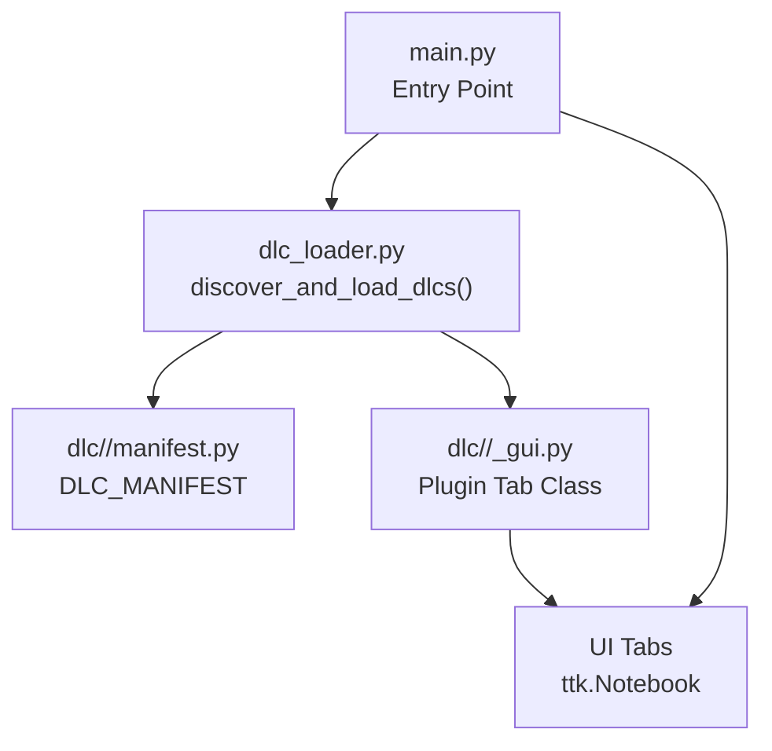
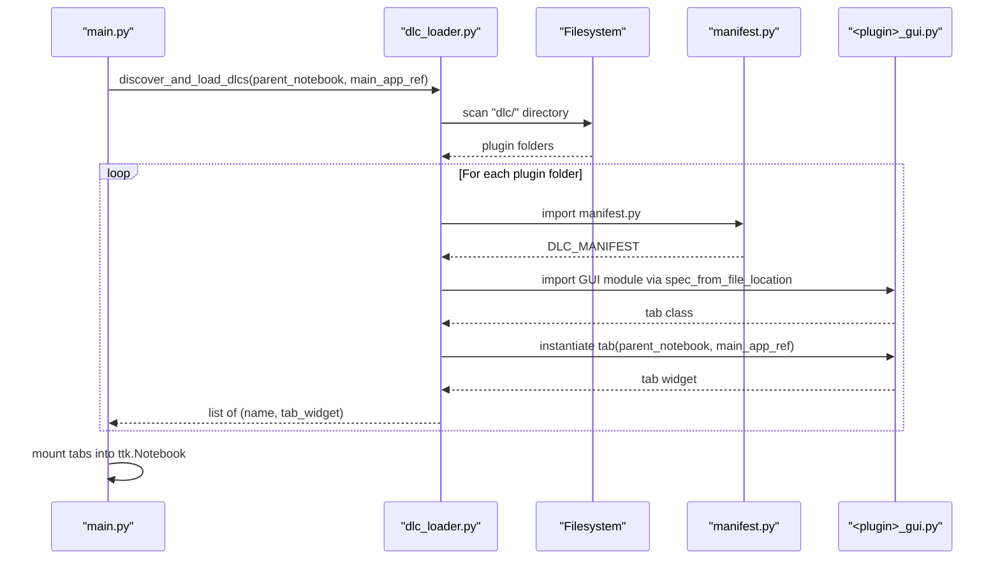
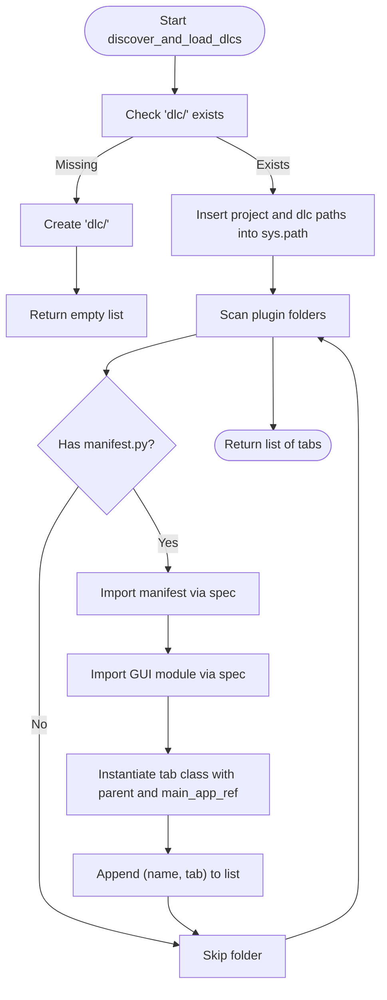
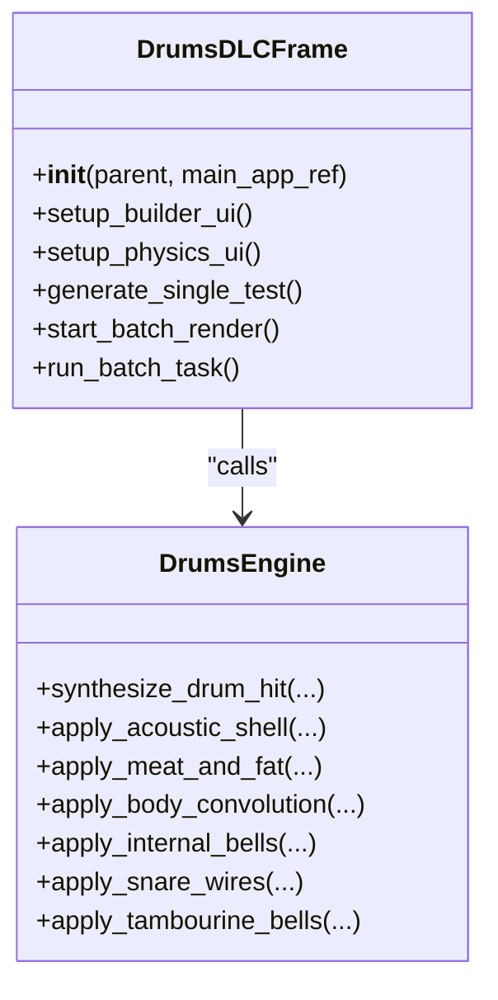
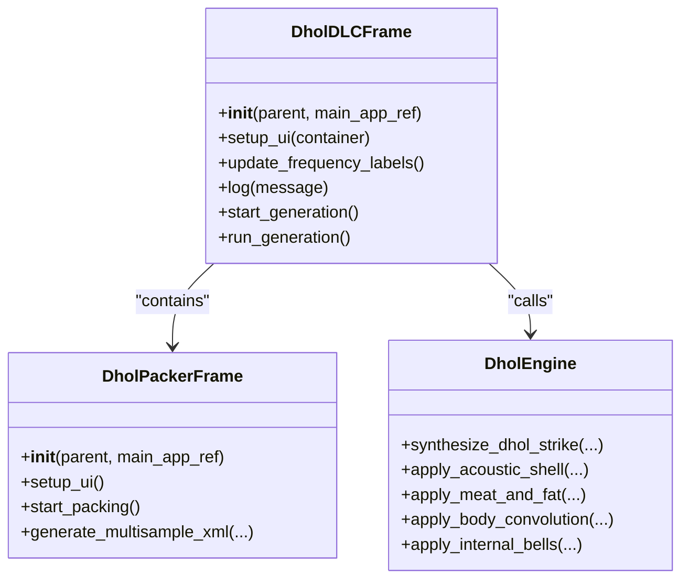
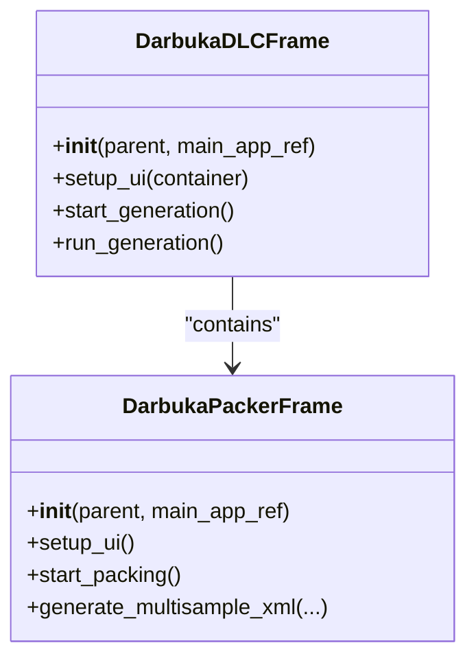
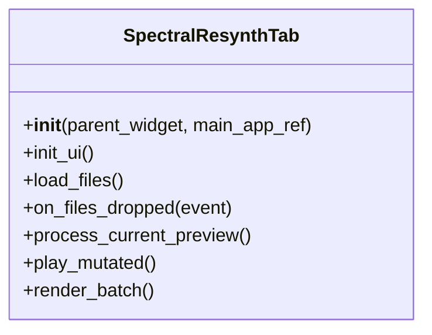
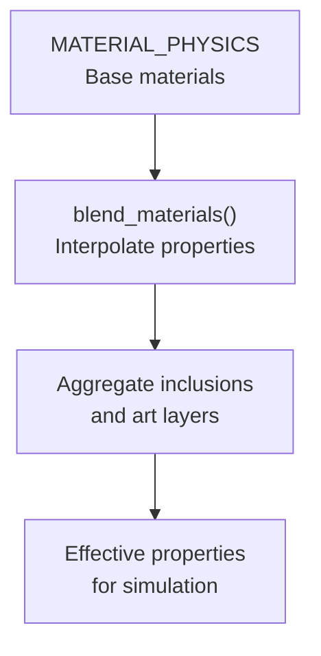
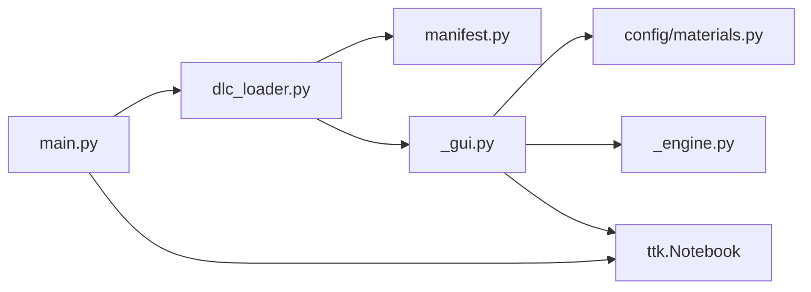

# Plugin System (DLC)

<cite>
**Referenced Files in This Document**
- [dlc_loader.py](file://dlc_loader.py)
- [main.py](file://main.py)
- [Drums manifest](file://dlc/Drums/manifest.py)
- [Drums GUI](file://dlc/Drums/drums_gui.py)
- [Drums engine](file://dlc/Drums/drums_engine.py)
- [Dhol manifest](file://dlc/dhol/manifest.py)
- [Dhol GUI](file://dlc/dhol/dhol_gui.py)
- [Dhol engine](file://dlc/dhol/dhol_engine.py)
- [Dhol packer GUI](file://dlc/dhol/dhol_packer_gui.py)
- [Darbuka manifest](file://dlc/darbuka/manifest.py)
- [Darbuka GUI](file://dlc/darbuka/darbuka_gui.py)
- [Darbuka engine](file://dlc/darbuka/darbuka_engine.py)
- [Spectral Resynth manifest](file://dlc/spectral_resynth/manifest.py)
- [Spectral Resynth GUI](file://dlc/spectral_resynth/gui.py)
- [Materials config](file://config/materials.py)
</cite>

## Table of Contents
1. [Introduction](#introduction)
2. [Project Structure](#project-structure)
3. [Core Components](#core-components)
4. [Architecture Overview](#architecture-overview)
5. [Detailed Component Analysis](#detailed-component-analysis)
6. [Dependency Analysis](#dependency-analysis)
7. [Performance Considerations](#performance-considerations)
8. [Troubleshooting Guide](#troubleshooting-guide)
9. [Conclusion](#conclusion)
10. [Appendices](#appendices)

## Introduction
This document describes the Dynamic Loadable Content (DLC) plugin system used by TroakarIR. It explains how plugins are discovered and loaded at runtime, how the main application integrates plugin tabs into its interface, and how developers can create new plugins. It also documents the existing DLC implementations (Drums, Dhol, Darbuka, Spectral Resynthesis), their contributions to the simulation system, and provides step-by-step guidance for building, packaging, and distributing plugins.

## Project Structure
The plugin system centers around a dedicated directory containing plugin packages, each with a manifest, a GUI module, and an optional engine module. The loader scans this directory, imports plugin manifests, and dynamically loads GUI modules to create tabbed UI components that are mounted into the main application’s notebook.

**Diagram sources**
- [main.py:23-73](file://main.py#L23-L73)
- [dlc_loader.py:9-61](file://dlc_loader.py#L9-L61)

**Section sources**
- [main.py:1-76](file://main.py#L1-L76)
- [dlc_loader.py:1-62](file://dlc_loader.py#L1-L62)

## Core Components
- Manifest-driven discovery: Each plugin package contains a manifest file exporting a dictionary with metadata and GUI entry points.
- Dynamic loader: Scans the DLC directory, imports manifests, and dynamically imports GUI modules to instantiate plugin tabs.
- Main app integration: The loader returns plugin tabs that the main application mounts into a notebook widget.
- Materials integration: Plugins rely on a shared materials database for physical property blending and tactile profiles.

Key responsibilities:
- Discovery and import: [dlc_loader.py:9-61](file://dlc_loader.py#L9-L61)
- Mounting into UI: [main.py:44-71](file://main.py#L44-L71)
- Materials database: [config/materials.py:18-640](file://config/materials.py#L18-L640)

**Section sources**
- [dlc_loader.py:9-61](file://dlc_loader.py#L9-L61)
- [main.py:23-73](file://main.py#L23-L73)
- [config/materials.py:18-640](file://config/materials.py#L18-L640)

## Architecture Overview
The plugin architecture follows a manifest-first, dynamic-import model. The loader enumerates plugin folders, validates the presence of a manifest, imports the manifest, resolves the GUI module path, imports the GUI module, and instantiates the plugin’s tab class. The main application finds the target notebook and appends plugin tabs to it.

**Diagram sources**
- [dlc_loader.py:9-61](file://dlc_loader.py#L9-L61)
- [main.py:44-66](file://main.py#L44-L66)

## Detailed Component Analysis

### Manifest-Based Plugin Loading
- Location: Each plugin folder contains a manifest file exporting a single dictionary named DLC_MANIFEST.
- Required keys: name, version, author, description, gui_entry_file, gui_class_name.
- Example manifests:
  - Drums: [dlc/Drums/manifest.py:1-8](file://dlc/Drums/manifest.py#L1-L8)
  - Dhol: [dlc/dhol/manifest.py:1-9](file://dlc/dhol/manifest.py#L1-L9)
  - Darbuka: [dlc/darbuka/manifest.py:1-9](file://dlc/darbuka/manifest.py#L1-L9)
  - Spectral Resynthesis: [dlc/spectral_resynth/manifest.py:1-8](file://dlc/spectral_resynth/manifest.py#L1-L8)

Dynamic loading steps:
- Import manifest via importlib.util.spec_from_file_location.
- Extract metadata and GUI entry file/class name.
- Insert plugin path into sys.path and import GUI module.
- Instantiate the tab class with parent and main app references.

**Section sources**
- [dlc_loader.py:34-56](file://dlc_loader.py#L34-L56)
- [Drums manifest:1-8](file://dlc/Drums/manifest.py#L1-L8)
- [Dhol manifest:1-9](file://dlc/dhol/manifest.py#L1-L9)
- [Darbuka manifest:1-9](file://dlc/darbuka/manifest.py#L1-L9)
- [Spectral Resynth manifest:1-8](file://dlc/spectral_resynth/manifest.py#L1-L8)

### Plugin Discovery and Integration Flow
- Discovery: The loader scans the dlc/ directory, skipping hidden or special folders, and checks for manifest presence.
- Path management: Ensures project and plugin directories are in sys.path to enable imports.
- Error handling: Exceptions during import or instantiation are caught and logged; the loader continues with other plugins.

Integration into the main app:
- The main application locates the ttk.Notebook in its UI tree.
- Calls the loader and mounts returned tabs into the notebook.

**Diagram sources**
- [dlc_loader.py:9-61](file://dlc_loader.py#L9-L61)

**Section sources**
- [dlc_loader.py:9-61](file://dlc_loader.py#L9-L61)
- [main.py:44-66](file://main.py#L44-L66)

### Drums DLC
- Purpose: Acoustic drum modeling with batch rendering and material customization.
- GUI: [dlc/Drums/drums_gui.py:14-333](file://dlc/Drums/drums_gui.py#L14-L333)
- Engine: [dlc/Drums/drums_engine.py:745-983](file://dlc/Drums/drums_engine.py#L745-L983)
- Materials: Uses shared material database for heads, shells, and cymbals.
- Features:
  - Drum kit builder with grid resolution control.
  - Material selection and physics tweaking (damping, snare tension, tactile boost).
  - Batch rendering with velocity layers and round robin.
  - Real-time progress and abort support.
  - Export to WAV files.

**Diagram sources**
- [Drums GUI:14-333](file://dlc/Drums/drums_gui.py#L14-L333)
- [Drums engine:745-983](file://dlc/Drums/drums_engine.py#L745-L983)

**Section sources**
- [Drums GUI:14-333](file://dlc/Drums/drums_gui.py#L14-L333)
- [Drums engine:745-983](file://dlc/Drums/drums_engine.py#L745-L983)
- [Drums manifest:1-8](file://dlc/Drums/manifest.py#L1-L8)

### Dhol DLC
- Purpose: Two-membrane coupled FDTD modeling of the Caucasian dhol with internal bells and multisample packing.
- GUI: [dlc/dhol/dhol_gui.py:15-746](file://dlc/dhol/dhol_gui.py#L15-L746)
- Engine: [dlc/dhol/dhol_engine.py:1750-1753](file://dlc/dhol/dhol_engine.py#L1750-L1753)
- Packer: [dlc/dhol/dhol_packer_gui.py:13-241](file://dlc/dhol/dhol_packer_gui.py#L13-L241)
- Features:
  - Tuning controls for two membranes (Doum/Tek).
  - Material selection for skin and shell.
  - Physics sliders for saturation, tactile, snap, shell attack/sustain, ring modulation, damping.
  - Internal bells with material and mix control.
  - Batch rendering with velocity layers and round robins.
  - Export to WAV and Bitwig-compatible multisamples.

**Diagram sources**
- [Dhol GUI:15-746](file://dlc/dhol/dhol_gui.py#L15-L746)
- [Dhol packer GUI:13-241](file://dlc/dhol/dhol_packer_gui.py#L13-L241)
- [Dhol engine:1750-1753](file://dlc/dhol/dhol_engine.py#L1750-L1753)

**Section sources**
- [Dhol GUI:15-746](file://dlc/dhol/dhol_gui.py#L15-L746)
- [Dhol packer GUI:13-241](file://dlc/dhol/dhol_packer_gui.py#L13-L241)
- [Dhol engine:1750-1753](file://dlc/dhol/dhol_engine.py#L1750-L1753)
- [Dhol manifest:1-9](file://dlc/dhol/manifest.py#L1-L9)

### Darbuka DLC
- Purpose: Cuboid drum modeling with material blending and multisample packing.
- GUI: [dlc/darbuka/darbuka_gui.py:161-426](file://dlc/darbuka/darbuka_gui.py#L161-L426)
- Engine: [dlc/darbuka/darbuka_engine.py:1-200](file://dlc/darbuka/darbuka_engine.py#L1-L200)
- Packer: [dlc/darbuka/darbuka_gui.py:20-157](file://dlc/darbuka/darbuka_gui.py#L20-L157)
- Features:
  - Tuning and material selection for skin and shell.
  - Physics sliders for saturation and tactile sand/grit.
  - Batch rendering with velocity layers and round robins.
  - Built-in multisample packer for Bitwig.

**Diagram sources**
- [Darbuka GUI:161-426](file://dlc/darbuka/darbuka_gui.py#L161-L426)
- [Darbuka GUI:20-157](file://dlc/darbuka/darbuka_gui.py#L20-L157)

**Section sources**
- [Darbuka GUI:161-426](file://dlc/darbuka/darbuka_gui.py#L161-L426)
- [Darbuka manifest:1-9](file://dlc/darbuka/manifest.py#L1-L9)

### Spectral Resynthesis DLC
- Purpose: Spectral decomposition and hybrid material synthesis with batch processing.
- GUI: [dlc/spectral_resynth/gui.py:10-180](file://dlc/spectral_resynth/gui.py#L10-L180)
- Engine: [dlc/spectral_resynth/engine.py:1-200](file://dlc/spectral_resynth/engine.py#L1-L200)
- Features:
  - Drag-and-drop file loading.
  - Material blending UI with ratios and modes.
  - Preview and batch processing with mixing and tactile controls.

**Diagram sources**
- [Spectral Resynth GUI:10-180](file://dlc/spectral_resynth/gui.py#L10-L180)

**Section sources**
- [Spectral Resynth GUI:10-180](file://dlc/spectral_resynth/gui.py#L10-L180)
- [Spectral Resynth manifest:1-8](file://dlc/spectral_resynth/manifest.py#L1-L8)

### Materials Integration
Plugins rely on a shared materials database to configure physical properties and tactile profiles. The database supports:
- Category-based organization (wood, metal, bio, polymer, mineral, synthetic).
- Effective property calculation with inclusions and tactile profiles.
- Blending two materials into a new alloy-like composition.

**Diagram sources**
- [Materials config:18-640](file://config/materials.py#L18-L640)

**Section sources**
- [Materials config:18-640](file://config/materials.py#L18-L640)

## Dependency Analysis
- Loader depends on:
  - Python importlib for dynamic module loading.
  - Tkinter notebook for UI mounting.
  - Logging for diagnostics.
- Plugins depend on:
  - Shared materials database.
  - Engine modules for simulation logic.
  - Taichi GPU/CPU acceleration where applicable.

**Diagram sources**
- [dlc_loader.py:9-61](file://dlc_loader.py#L9-L61)
- [main.py:44-66](file://main.py#L44-L66)
- [Drums engine:1-20](file://dlc/Drums/drums_engine.py#L1-L20)
- [Dhol engine:1-20](file://dlc/dhol/dhol_engine.py#L1-L20)
- [Darbuka engine:1-20](file://dlc/darbuka/darbuka_engine.py#L1-L20)
- [Materials config:18-640](file://config/materials.py#L18-L640)

**Section sources**
- [dlc_loader.py:9-61](file://dlc_loader.py#L9-L61)
- [main.py:44-66](file://main.py#L44-L66)
- [Drums engine:1-20](file://dlc/Drums/drums_engine.py#L1-L20)
- [Dhol engine:1-20](file://dlc/dhol/dhol_engine.py#L1-L20)
- [Darbuka engine:1-20](file://dlc/darbuka/darbuka_engine.py#L1-L20)
- [Materials config:18-640](file://config/materials.py#L18-L640)

## Performance Considerations
- GPU acceleration: Engines initialize Taichi on GPU with fallback to CPU if unavailable.
- Grid sizing: Plugins expose grid resolution controls to balance quality and speed.
- Declicking: Engines apply adaptive declicking filters to reduce artifacts.
- Batch rendering: Progress reporting and abort support prevent long-running tasks from blocking the UI.

[No sources needed since this section provides general guidance]

## Troubleshooting Guide
Common issues and resolutions:
- Missing dlc/ directory: The loader creates it automatically; ensure write permissions.
- Import errors: Verify manifest.py exports DLC_MANIFEST and that gui_entry_file matches the actual GUI module.
- GUI class not found: Ensure gui_class_name matches the exported tab class in the GUI module.
- Materials not found: Confirm material names exist in MATERIAL_PHYSICS; blending handles missing keys gracefully.
- No notebook found: The main app searches recursively for ttk.Notebook; ensure the UI is fully constructed before calling the loader.

**Section sources**
- [dlc_loader.py:18-21](file://dlc_loader.py#L18-L21)
- [dlc_loader.py:59-61](file://dlc_loader.py#L59-L61)
- [main.py:44-71](file://main.py#L44-L71)

## Conclusion
The DLC system enables modular extension of the TroakarIR simulation platform. By adhering to the manifest contract and implementing a compatible GUI class, developers can deliver new percussion and synthesis engines that integrate seamlessly into the main application. Existing plugins demonstrate robust workflows for material-driven modeling, batch rendering, and distribution-ready multisample packaging.

[No sources needed since this section summarizes without analyzing specific files]

## Appendices

### Creating a New Plugin (Step-by-Step)
1. Create a new folder under dlc/, e.g., dlc/my_plugin/.
2. Write a manifest.py exporting DLC_MANIFEST with:
   - name, version, author, description
   - gui_entry_file pointing to your GUI module
   - gui_class_name matching your tab class
3. Implement your GUI module with a tab class inheriting from a suitable Tk widget (e.g., ttk.Frame or ttk.Notebook) and accept (parent, main_app_ref) in __init__.
4. Optionally implement an engine module for simulation logic.
5. Test locally by launching main.py; the loader will detect and mount your plugin tab.
6. Package for distribution by copying your plugin folder into another user’s dlc/ directory.

**Section sources**
- [dlc_loader.py:34-56](file://dlc_loader.py#L34-L56)
- [Drums manifest:1-8](file://dlc/Drums/manifest.py#L1-L8)
- [Dhol manifest:1-9](file://dlc/dhol/manifest.py#L1-L9)
- [Darbuka manifest:1-9](file://dlc/darbuka/manifest.py#L1-L9)
- [Spectral Resynth manifest:1-8](file://dlc/spectral_resynth/manifest.py#L1-L8)

### Packaging and Distribution Strategies
- Single-folder delivery: Distribute the plugin folder as-is; users place it under dlc/.
- Multisample export: Use built-in packers (e.g., Dhol/Darbuka) to produce Bitwig-compatible .multisample archives.
- Versioning: Use manifest.version to manage updates; loader logs detected versions.

**Section sources**
- [Dhol packer GUI:167-241](file://dlc/dhol/dhol_packer_gui.py#L167-L241)
- [Darbuka GUI:84-157](file://dlc/darbuka/darbuka_gui.py#L84-L157)

### Compatibility Considerations
- Python path: Ensure plugin directories are importable; the loader inserts them into sys.path.
- GUI framework: Plugins must use Tkinter and follow the tab class contract.
- Materials: Rely on MATERIAL_PHYSICS keys; unknown keys are handled by blending logic.
- Acceleration: Engines initialize Taichi; plugins should handle fallbacks gracefully.

**Section sources**
- [dlc_loader.py:23-27](file://dlc_loader.py#L23-L27)
- [main.py:44-66](file://main.py#L44-L66)
- [Materials config:642-766](file://config/materials.py#L642-L766)