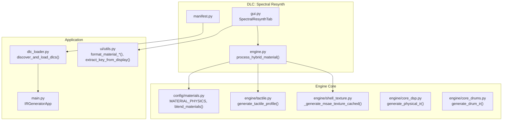
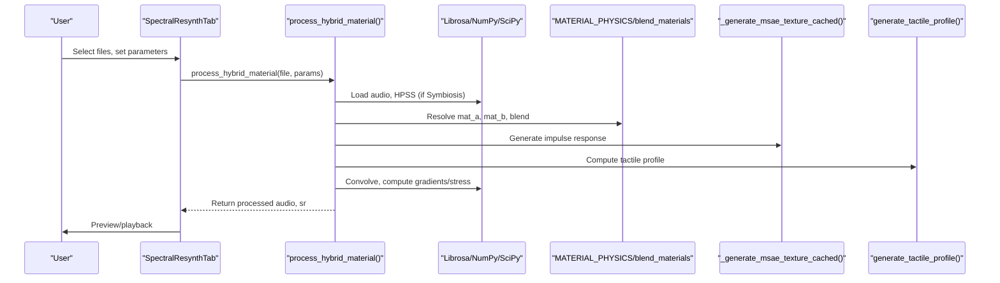
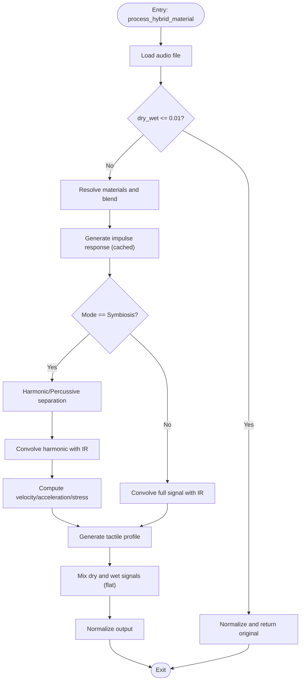
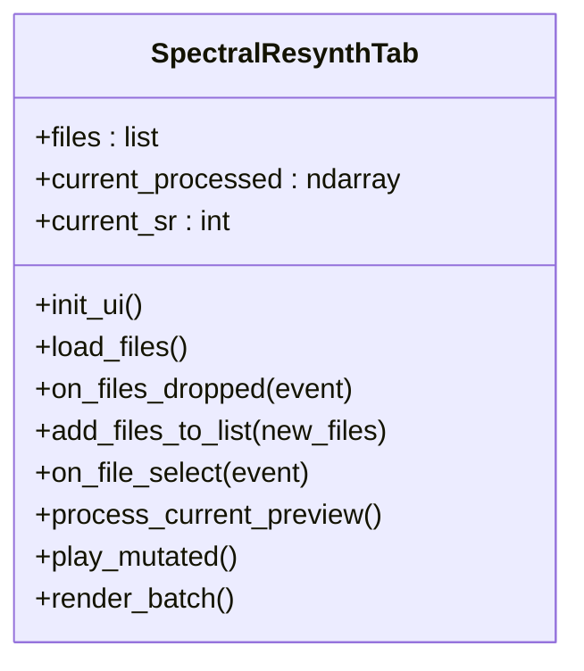
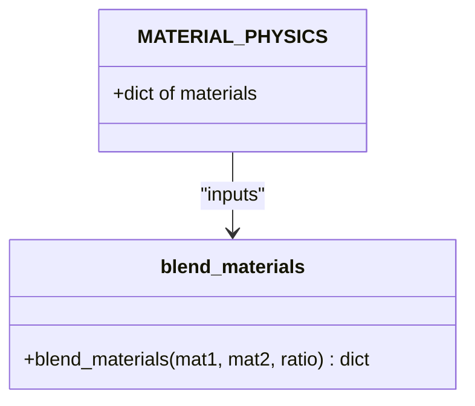
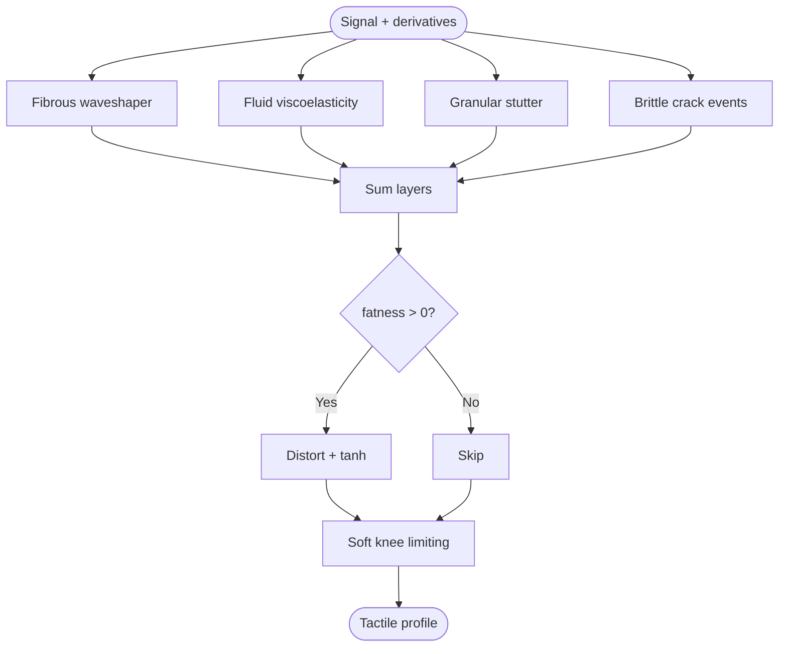
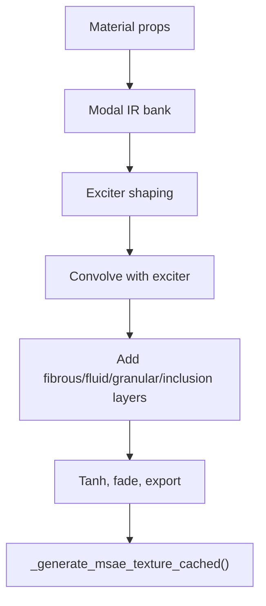
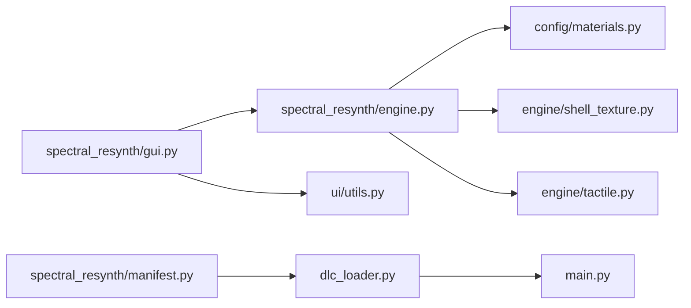

# Spectral Resynthesis DLC

<cite>
**Referenced Files in This Document**
- [engine.py](file://dlc/spectral_resynth/engine.py)
- [gui.py](file://dlc/spectral_resynth/gui.py)
- [manifest.py](file://dlc/spectral_resynth/manifest.py)
- [materials.py](file://config/materials.py)
- [tactile.py](file://engine/tactile.py)
- [shell_texture.py](file://engine/shell_texture.py)
- [core_dsp.py](file://engine/core_dsp.py)
- [core_drums.py](file://engine/core_drums.py)
- [dlc_loader.py](file://dlc_loader.py)
- [main.py](file://main.py)
- [utils.py](file://ui/utils.py)
</cite>

## Table of Contents
1. [Introduction](#introduction)
2. [Project Structure](#project-structure)
3. [Core Components](#core-components)
4. [Architecture Overview](#architecture-overview)
5. [Detailed Component Analysis](#detailed-component-analysis)
6. [Dependency Analysis](#dependency-analysis)
7. [Performance Considerations](#performance-considerations)
8. [Troubleshooting Guide](#troubleshooting-guide)
9. [Conclusion](#conclusion)
10. [Appendices](#appendices)

## Introduction
The Spectral Resynthesis DLC extends the Troakar Lab Engine with advanced audio processing and resynthesis techniques centered around hybrid material synthesis and spectral-domain manipulation. It enables users to transform input audio samples by blending acoustic material properties, applying physical impulse responses, and integrating tactile textures derived from material physics. The system supports real-time preview and batch processing, with a GUI tailored for parameter control across material blending, mode selection, and dynamic mixing.

## Project Structure
The Spectral Resynthesis DLC resides under the dlc/spectral_resynth directory and integrates with the broader engine via shared material definitions, tactile generation, and impulse response synthesis. The loader dynamically discovers and mounts DLC tabs into the main application’s notebook interface.

**Diagram sources**
- [gui.py:11-181](file://dlc/spectral_resynth/gui.py#L11-L181)
- [engine.py:75-157](file://dlc/spectral_resynth/engine.py#L75-L157)
- [manifest.py:1-8](file://dlc/spectral_resynth/manifest.py#L1-L8)
- [materials.py:18-766](file://config/materials.py#L18-L766)
- [tactile.py:193-229](file://engine/tactile.py#L193-L229)
- [shell_texture.py:283-406](file://engine/shell_texture.py#L283-L406)
- [core_dsp.py:90-273](file://engine/core_dsp.py#L90-L273)
- [core_drums.py:96-249](file://engine/core_drums.py#L96-L249)
- [dlc_loader.py:9-62](file://dlc_loader.py#L9-L62)
- [main.py:23-76](file://main.py#L23-L76)
- [utils.py:16-32](file://ui/utils.py#L16-L32)

**Section sources**
- [manifest.py:1-8](file://dlc/spectral_resynth/manifest.py#L1-L8)
- [dlc_loader.py:9-62](file://dlc_loader.py#L9-L62)
- [main.py:23-76](file://main.py#L23-L76)

## Core Components
- SpectralResynthTab (GUI): Provides drag-and-drop file loading, parameter controls for material blending, mode selection, and real-time playback/mixing. It orchestrates preview rendering and batch processing.
- process_hybrid_material (Engine): Implements the core resynthesis pipeline: loads audio, blends materials, generates impulse responses, applies HPSS-based separation for symbiotic mode, computes tactile textures, and mixes dry/wet output.
- Material System: Centralized material database and blending logic enabling interpolation of acoustic properties and tactile profiles.
- Tactile Engine: Generates physically-inspired textures (fibrous, fluid, granular, brittle) from material properties and dynamic signals.
- Shell Texture Engine: Produces modal impulse responses and directional tactile layers for material-based IR synthesis.

Key responsibilities:
- Parameter control: Material A/B, blend ratio, mode (Symbiosis vs Exciter), strike force, fatness, dry/wet mix.
- Real-time preview: Live playback of transformed audio with immediate feedback.
- Batch processing: Automated rendering to disk with consistent naming and directory organization.

**Section sources**
- [gui.py:11-181](file://dlc/spectral_resynth/gui.py#L11-L181)
- [engine.py:75-157](file://dlc/spectral_resynth/engine.py#L75-L157)
- [materials.py:642-766](file://config/materials.py#L642-L766)
- [tactile.py:193-229](file://engine/tactile.py#L193-L229)
- [shell_texture.py:283-406](file://engine/shell_texture.py#L283-L406)

## Architecture Overview
The system follows a modular pipeline:
- GUI collects user parameters and triggers processing.
- Engine loads audio, resolves materials, synthesizes IRs, and convolves/resynthesizes the signal.
- Tactile engine augments the IR with material-aware textures.
- Output is mixed according to dry/wet balance and normalized.

**Diagram sources**
- [gui.py:144-161](file://dlc/spectral_resynth/gui.py#L144-L161)
- [engine.py:75-138](file://dlc/spectral_resynth/engine.py#L75-L138)
- [materials.py:642-766](file://config/materials.py#L642-L766)
- [shell_texture.py:283-406](file://engine/shell_texture.py#L283-L406)
- [tactile.py:193-229](file://engine/tactile.py#L193-L229)

## Detailed Component Analysis

### Engine Pipeline: process_hybrid_material
The engine function performs:
- Audio loading and dry/wet bypass handling.
- Material blending to produce composite acoustic properties.
- Impulse response synthesis via cached modal textures.
- Mode-specific processing:
  - Symbiosis: Harmonic/percussive separation, body resonance convolution, tactile noise generation from percussive dynamics.
  - Exciter: Full-signal convolution with IR and tactile profile.
- Dynamic tactile synthesis using velocity/acceleration/stress derived from the signal.
- Flat-mix dry/wet blending and normalization.

**Diagram sources**
- [engine.py:75-138](file://dlc/spectral_resynth/engine.py#L75-L138)

**Section sources**
- [engine.py:75-138](file://dlc/spectral_resynth/engine.py#L75-L138)

### GUI Controls and Interaction
The GUI organizes controls into logical groups:
- File Management: Drag-and-drop list, single-file selection, batch render.
- Material Selection: Two-material blend with slider; displays formatted material names and keys.
- Mode Selection: Radio buttons for Symbiosis and Exciter modes.
- Tactile Controls: Strike force, fatness, and flat-mix dry/wet.
- Preview: Apply, play, stop controls with live playback.

**Diagram sources**
- [gui.py:11-181](file://dlc/spectral_resynth/gui.py#L11-L181)

**Section sources**
- [gui.py:11-181](file://dlc/spectral_resynth/gui.py#L11-L181)
- [utils.py:16-32](file://ui/utils.py#L16-L32)

### Material System and Blending
The material system defines acoustic and tactile properties for hundreds of materials. The blend function interpolates core properties and composes art-layer parameters and inclusions.

**Diagram sources**
- [materials.py:18-766](file://config/materials.py#L18-L766)
- [materials.py:642-766](file://config/materials.py#L642-L766)

**Section sources**
- [materials.py:18-766](file://config/materials.py#L18-L766)
- [materials.py:642-766](file://config/materials.py#L642-L766)

### Tactile Engine Integration
The tactile engine produces textures from material properties and dynamic signals:
- Fibrous waveshaping, fluid viscoelasticity, granular stutter, brittle crack events.
- Inclusion-aware processing for secondary materials embedded in the primary.
- Optional fatness distortion and soft limiting to prevent clipping.

**Diagram sources**
- [tactile.py:46-229](file://engine/tactile.py#L46-L229)

**Section sources**
- [tactile.py:46-229](file://engine/tactile.py#L46-L229)

### Impulse Response Synthesis
Impulse responses are generated from material properties using modal synthesis and directional layers. The cache avoids recomputation across runs.

**Diagram sources**
- [shell_texture.py:283-406](file://engine/shell_texture.py#L283-L406)

**Section sources**
- [shell_texture.py:283-406](file://engine/shell_texture.py#L283-L406)

## Dependency Analysis
The Spectral Resynthesis DLC depends on:
- Shared material definitions and blending logic.
- Tactile engine for dynamic texture generation.
- Modal IR synthesis for material-based impulse responses.
- UI utilities for material display and extraction.
- Loader and main application for mounting the tab into the notebook.

**Diagram sources**
- [gui.py:9](file://dlc/spectral_resynth/gui.py#L9)
- [engine.py:17-69](file://dlc/spectral_resynth/engine.py#L17-L69)
- [manifest.py:6-8](file://dlc/spectral_resynth/manifest.py#L6-L8)
- [dlc_loader.py:43-56](file://dlc_loader.py#L43-L56)
- [main.py:61-64](file://main.py#L61-L64)
- [utils.py:6](file://ui/utils.py#L6)

**Section sources**
- [engine.py:17-69](file://dlc/spectral_resynth/engine.py#L17-L69)
- [dlc_loader.py:43-56](file://dlc_loader.py#L43-L56)
- [main.py:61-64](file://main.py#L61-L64)

## Performance Considerations
- Caching: Modal IR synthesis is cached to avoid repeated computation.
- Memory: Large FFT-based convolutions can be memory-intensive; ensure sufficient RAM for long files.
- Real-time preview: Keep preview durations short; disable unnecessary filters for responsiveness.
- Batch processing: Use appropriate dry/wet ratios to reduce post-processing needs.
- Normalization: Automatic gain normalization prevents clipping but can reduce headroom; adjust upstream if needed.

## Troubleshooting Guide
Common issues and resolutions:
- Missing materials or engines: The engine validates imports and raises explicit errors if core modules are not found. Verify material and shell texture module paths.
- No notebook found: The loader requires a visible ttk.Notebook in the main window; ensure the main application initializes the notebook before loading DLC tabs.
- No preview audio: Confirm audio device availability and that the preview thread is not blocked by long-running operations.

**Section sources**
- [engine.py:58-69](file://dlc/spectral_resynth/engine.py#L58-L69)
- [dlc_loader.py:55-71](file://dlc_loader.py#L55-L71)

## Conclusion
The Spectral Resynthesis DLC provides a powerful framework for transforming audio through material-driven synthesis and tactile texturing. Its modular design integrates seamlessly with the broader engine, offering both interactive previews and automated batch workflows. By combining spectral-domain manipulation with physical modeling and tactile synthesis, it enables creative sound design, pitch-related transformations, and expressive timbral reshaping.

## Appendices

### Practical Applications
- Sound Design: Transform percussion hits into resonant bodies or vice versa using material blends and modes.
- Pitch Correction: Use Symbiosis mode to emphasize harmonic content and align tonal centers.
- Creative Manipulation: Apply high strike force and fatness for saturated, analog-style textures; adjust dry/wet to balance original content with synthesized material coloration.

### Mathematical Foundations
- Spectral Analysis: Short-time Fourier Transform (STFT) underpins HPSS separation and phase-sensitive processing.
- Phase Manipulation: Derivatives of the signal approximate velocity/acceleration, informing tactile synthesis.
- Convolution: IR synthesis and body resonance are realized via linear convolution in the time domain.
- Modal Synthesis: Resonant frequencies and damping derive from material stiffness and density.