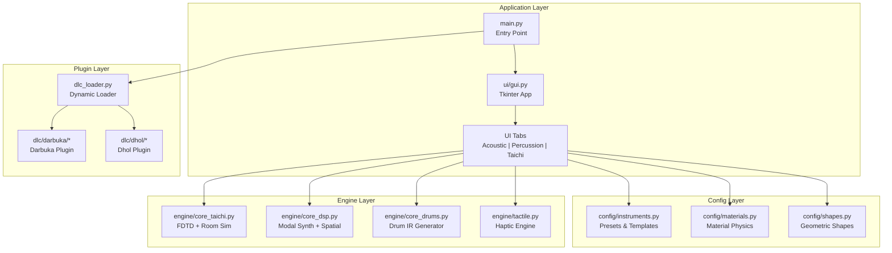
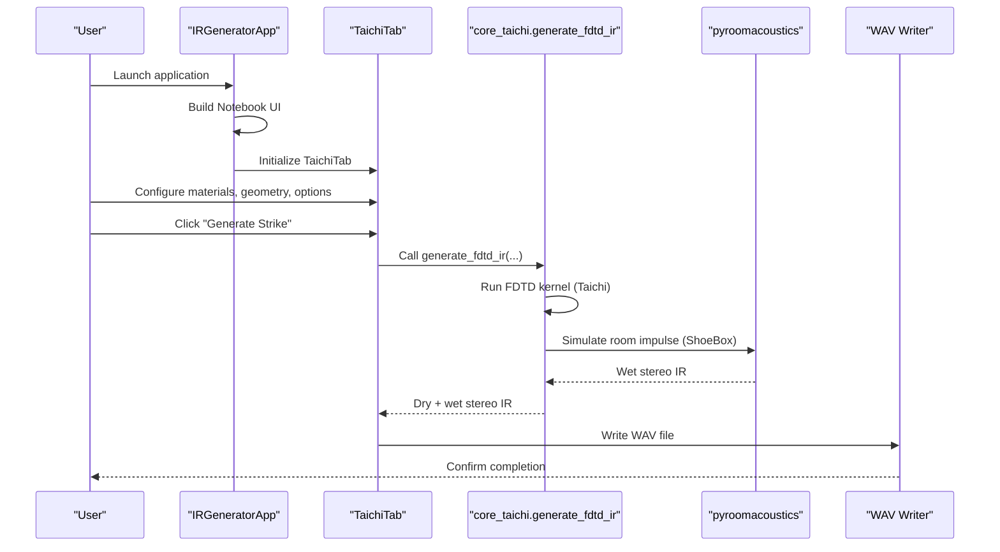
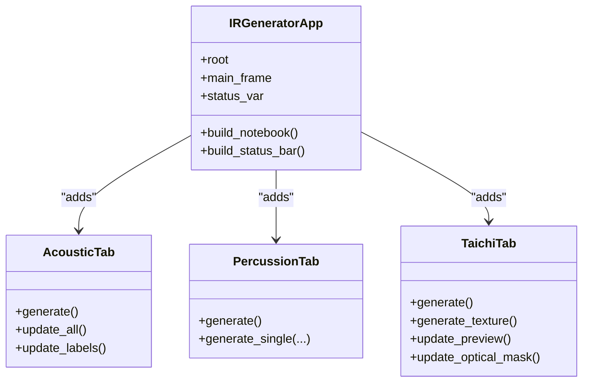
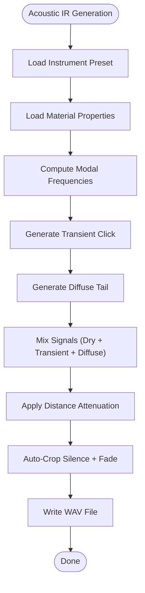
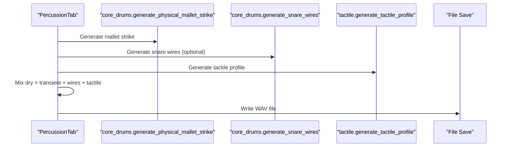
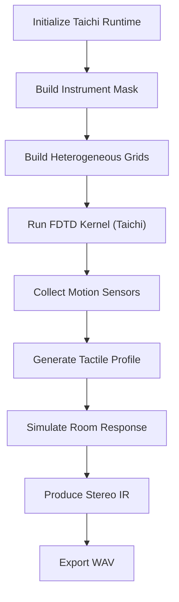
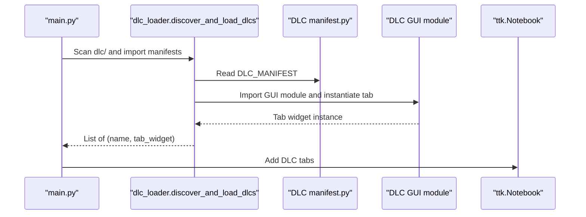
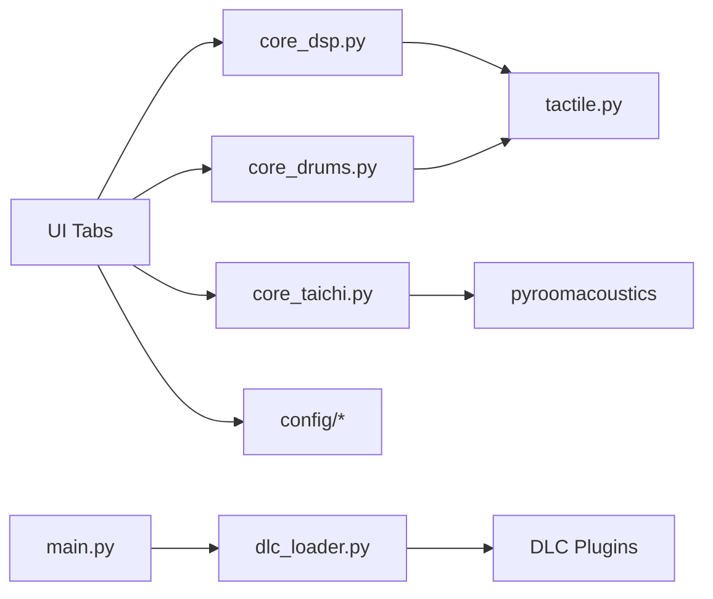

# Project Overview

<cite>
**Referenced Files in This Document**
- [main.py](file://main.py)
- [dlc_loader.py](file://dlc_loader.py)
- [engine/core_taichi.py](file://engine/core_taichi.py)
- [engine/tactile.py](file://engine/tactile.py)
- [engine/core_dsp.py](file://engine/core_dsp.py)
- [engine/core_drums.py](file://engine/core_drums.py)
- [ui/gui.py](file://ui/gui.py)
- [ui/tab_acoustic.py](file://ui/tab_acoustic.py)
- [ui/tab_percussion.py](file://ui/tab_percussion.py)
- [ui/tab_taichi.py](file://ui/tab_taichi.py)
- [config/instruments.py](file://config/instruments.py)
- [config/materials.py](file://config/materials.py)
- [config/shapes.py](file://config/shapes.py)
- [dlc/darbuka/manifest.py](file://dlc/darbuka/manifest.py)
- [dlc/dhol/manifest.py](file://dlc/dhol/manifest.py)
</cite>

## Table of Contents
1. [Introduction](#introduction)
2. [Project Structure](#project-structure)
3. [Core Components](#core-components)
4. [Architecture Overview](#architecture-overview)
5. [Detailed Component Analysis](#detailed-component-analysis)
6. [Dependency Analysis](#dependency-analysis)
7. [Performance Considerations](#performance-considerations)
8. [Troubleshooting Guide](#troubleshooting-guide)
9. [Conclusion](#conclusion)

## Introduction
TroakarIR is a desktop application designed to generate physical modeling impulse responses (IRs) for acoustic and percussion instruments. It targets sound designers, audio engineers, and researchers who require precise, physically grounded simulations of instrument acoustics and haptic textures. The system combines modal synthesis, finite-difference time-domain (FDTD) wave simulation, and haptic texture synthesis to produce realistic IRs suitable for convolution reverb, physical modeling, and tactile audio applications.

Key capabilities:
- Modal synthesis for acoustic bodies and spaces
- 2D FDTD simulation with GPU acceleration via Taichi
- Haptic processing for tactile textures derived from physical motion sensors
- Modular plugin architecture enabling extensible instrument families
- Comprehensive GUI built with Tkinter and themed widgets

## Project Structure
The project follows a layered architecture:
- Application entry and UI orchestration
- Configurable instrument and material databases
- Physics engines for modal synthesis, drum modeling, and FDTD
- Haptic engine for tactile texture generation
- Plugin loader for dynamic DLC tabs

**Diagram sources**
- [main.py:23-76](file://main.py#L23-L76)
- [ui/gui.py:8-46](file://ui/gui.py#L8-L46)
- [engine/core_taichi.py:266-717](file://engine/core_taichi.py#L266-L717)
- [engine/core_dsp.py:90-200](file://engine/core_dsp.py#L90-L200)
- [engine/core_drums.py:96-200](file://engine/core_drums.py#L96-L200)
- [engine/tactile.py:193-250](file://engine/tactile.py#L193-L250)
- [dlc_loader.py:9-62](file://dlc_loader.py#L9-L62)

**Section sources**
- [main.py:1-76](file://main.py#L1-L76)
- [ui/gui.py:1-46](file://ui/gui.py#L1-L46)
- [dlc_loader.py:1-62](file://dlc_loader.py#L1-L62)

## Core Components
- Desktop application: Python + Tkinter GUI with themed widgets and drag-and-drop support
- Physics engines:
  - Modal synthesis for acoustic bodies and spaces
  - 2D FDTD solver with GPU acceleration via Taichi kernels
  - Haptic engine generating tactile textures from motion sensors
- Config system: instrument presets, material databases, and geometric templates
- Plugin architecture: dynamic loading of DLC tabs with manifest-driven discovery

Practical examples:
- Generate a concert hall IR with modal synthesis and room acoustics
- Render a drum IR with tailored membrane and shell materials
- Produce a haptic-rich bow sound using FDTD with tactile forces

**Section sources**
- [ui/tab_acoustic.py:17-193](file://ui/tab_acoustic.py#L17-L193)
- [ui/tab_percussion.py:17-144](file://ui/tab_percussion.py#L17-L144)
- [ui/tab_taichi.py:34-735](file://ui/tab_taichi.py#L34-L735)
- [engine/core_taichi.py:266-717](file://engine/core_taichi.py#L266-L717)
- [engine/tactile.py:193-250](file://engine/tactile.py#L193-L250)

## Architecture Overview
The application initializes a Tkinter window, builds the main notebook interface, discovers and mounts DLC tabs dynamically, and routes user actions to specialized engines. The Taichi-based FDTD engine simulates wave propagation on a 2D grid, while modal engines synthesize discrete modes and diffuse tails. The tactile engine transforms motion sensors into perceptual textures.

**Diagram sources**
- [main.py:23-76](file://main.py#L23-L76)
- [ui/gui.py:8-46](file://ui/gui.py#L8-L46)
- [ui/tab_taichi.py:614-672](file://ui/tab_taichi.py#L614-L672)
- [engine/core_taichi.py:266-717](file://engine/core_taichi.py#L266-L717)

## Detailed Component Analysis

### Desktop Application and UI
The application entry point creates a themed Tkinter window, instantiates the main application class, logs startup, and attempts to mount DLC tabs into the primary notebook. The main app composes three core tabs: acoustic modal synthesis, percussion modeling, and the Taichi FDTD lab.

**Diagram sources**
- [ui/gui.py:8-46](file://ui/gui.py#L8-L46)
- [ui/tab_acoustic.py:17-193](file://ui/tab_acoustic.py#L17-L193)
- [ui/tab_percussion.py:17-144](file://ui/tab_percussion.py#L17-L144)
- [ui/tab_taichi.py:34-735](file://ui/tab_taichi.py#L34-L735)

**Section sources**
- [main.py:23-76](file://main.py#L23-L76)
- [ui/gui.py:8-46](file://ui/gui.py#L8-L46)

### Modal Synthesis and Acoustic IR Generation
The acoustic tab orchestrates modal synthesis for acoustic bodies and spaces. It computes resonance frequencies, applies radiation efficiency, and blends transient clicks with diffuse tails. The process supports automatic cropping and fades to trim silence.

**Diagram sources**
- [ui/tab_acoustic.py:126-193](file://ui/tab_acoustic.py#L126-L193)
- [engine/core_dsp.py:90-200](file://engine/core_dsp.py#L90-L200)

**Section sources**
- [ui/tab_acoustic.py:17-193](file://ui/tab_acoustic.py#L17-L193)
- [engine/core_dsp.py:90-200](file://engine/core_dsp.py#L90-L200)

### Drum Modeling and Percussion IR Generation
The percussion tab generates IRs for drums and cymbals, incorporating material-specific mallet strikes, optional snare wire rattles, and tactile textures. It supports batch rendering across presets and dynamic scaling of parameters.

**Diagram sources**
- [ui/tab_percussion.py:80-144](file://ui/tab_percussion.py#L80-L144)
- [engine/core_drums.py:10-200](file://engine/core_drums.py#L10-L200)
- [engine/tactile.py:193-250](file://engine/tactile.py#L193-L250)

**Section sources**
- [ui/tab_percussion.py:17-144](file://ui/tab_percussion.py#L17-L144)
- [engine/core_drums.py:96-200](file://engine/core_drums.py#L96-L200)

### Taichi FDTD Simulation and Haptic Processing
The Taichi tab provides interactive FDTD simulation with GPU acceleration. Users can place strike and pickup points, adjust material detail boost, nonlinearity, and de-mud parameters, and render either a struck or bowed texture. The engine computes CFL-stable substeps, applies heterogeneous material grids, and integrates tactile forces derived from motion sensors.

**Diagram sources**
- [ui/tab_taichi.py:429-478](file://ui/tab_taichi.py#L429-L478)
- [engine/core_taichi.py:447-521](file://engine/core_taichi.py#L447-L521)
- [engine/tactile.py:193-250](file://engine/tactile.py#L193-L250)

**Section sources**
- [ui/tab_taichi.py:34-735](file://ui/tab_taichi.py#L34-L735)
- [engine/core_taichi.py:266-717](file://engine/core_taichi.py#L266-L717)

### Modular Plugin Architecture
The plugin loader scans the dlc/ directory, imports manifests, and dynamically constructs tab widgets. Each DLC defines its own GUI class and entry file, enabling independent development and distribution.

**Diagram sources**
- [main.py:44-71](file://main.py#L44-L71)
- [dlc_loader.py:9-62](file://dlc_loader.py#L9-L62)
- [dlc/darbuka/manifest.py:2-9](file://dlc/darbuka/manifest.py#L2-L9)
- [dlc/dhol/manifest.py:2-9](file://dlc/dhol/manifest.py#L2-L9)

**Section sources**
- [dlc_loader.py:1-62](file://dlc_loader.py#L1-L62)
- [main.py:1-76](file://main.py#L1-L76)

## Dependency Analysis
The system exhibits clear separation of concerns:
- UI depends on engine modules and config databases
- Engines depend on shared tactile and spatial utilities
- Plugins depend on the loader and manifest protocol
- Taichi engine depends on pyroomacoustics for room simulation

**Diagram sources**
- [ui/tab_acoustic.py:14-15](file://ui/tab_acoustic.py#L14-L15)
- [ui/tab_percussion.py:14-15](file://ui/tab_percussion.py#L14-L15)
- [ui/tab_taichi.py:12-14](file://ui/tab_taichi.py#L12-L14)
- [engine/core_taichi.py:4-5](file://engine/core_taichi.py#L4-L5)
- [engine/core_dsp.py:6-8](file://engine/core_dsp.py#L6-L8)
- [engine/core_drums.py:6-8](file://engine/core_drums.py#L6-L8)
- [main.py:6](file://main.py#L6)
- [dlc_loader.py:4-5](file://dlc_loader.py#L4-L5)

**Section sources**
- [ui/tab_acoustic.py:12-15](file://ui/tab_acoustic.py#L12-L15)
- [ui/tab_percussion.py:12-15](file://ui/tab_percussion.py#L12-L15)
- [ui/tab_taichi.py:12-14](file://ui/tab_taichi.py#L12-L14)
- [engine/core_taichi.py:1-13](file://engine/core_taichi.py#L1-L13)
- [engine/core_dsp.py:1-11](file://engine/core_dsp.py#L1-L11)
- [engine/core_drums.py:1-9](file://engine/core_drums.py#L1-L9)
- [main.py:1-7](file://main.py#L1-L7)
- [dlc_loader.py:1-6](file://dlc_loader.py#L1-L6)

## Performance Considerations
- GPU acceleration: Taichi kernels enable efficient 2D FDTD updates on the GPU
- Substepping: Automatic CFL-compliant substeps reduce instability and improve accuracy
- Memory management: Fixed-size buffers with padding and early termination minimize overhead
- Modal synthesis: Efficient summation of damped sinusoids with precomputed modes
- Haptic processing: Vectorized envelope followers and filters avoid per-sample loops

## Troubleshooting Guide
Common issues and resolutions:
- Taichi initialization failures: Verify GPU drivers and Taichi runtime availability
- Missing DLC tabs: Ensure dlc/ directory exists and manifests are properly formatted
- Silent exports: Enable auto-crop or manually increase render duration
- Slow renders: Reduce grid resolution or disable nonlinearity/de-mud options

**Section sources**
- [main.py:34-35](file://main.py#L34-L35)
- [dlc_loader.py:18-21](file://dlc_loader.py#L18-L21)
- [ui/tab_acoustic.py:153-182](file://ui/tab_acoustic.py#L153-L182)
- [ui/tab_taichi.py:648-671](file://ui/tab_taichi.py#L648-L671)

## Conclusion
TroakarIR delivers a powerful, modular platform for generating physically grounded impulse responses with modal synthesis, FDTD simulation, and haptic processing. Its Tkinter-based GUI, comprehensive configuration system, and plugin architecture make it accessible to sound designers while providing advanced controls for researchers and developers.