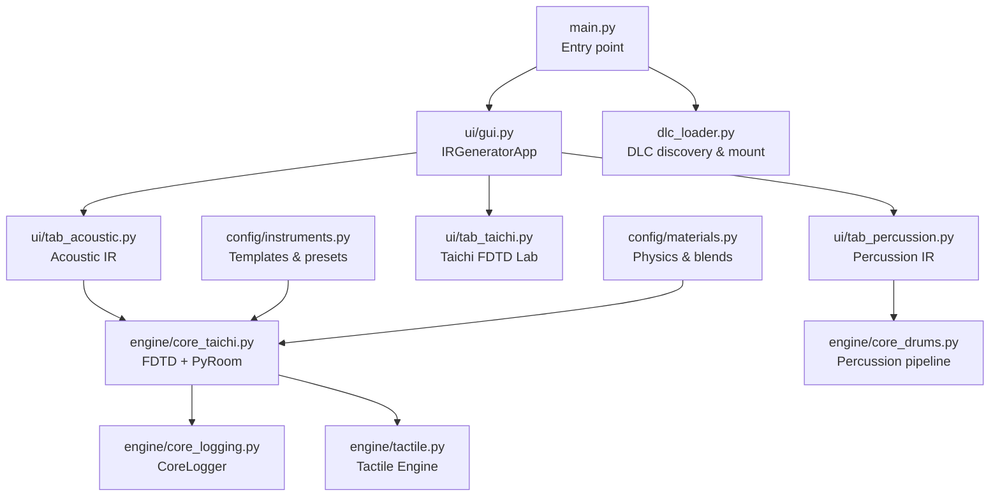
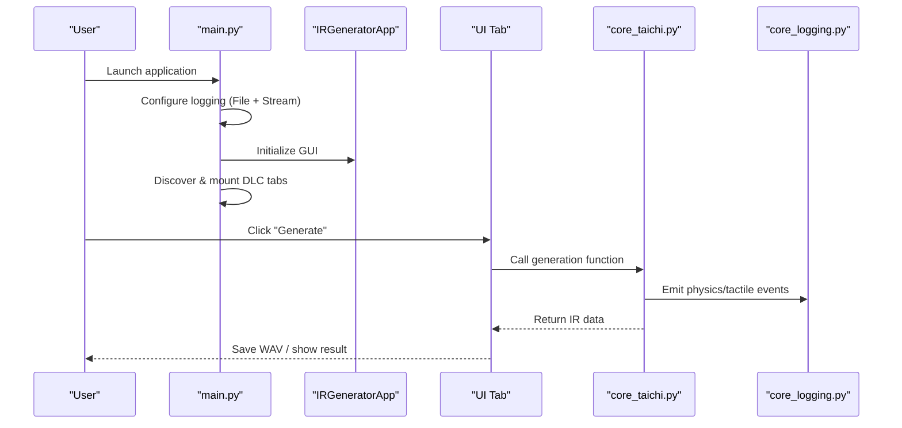
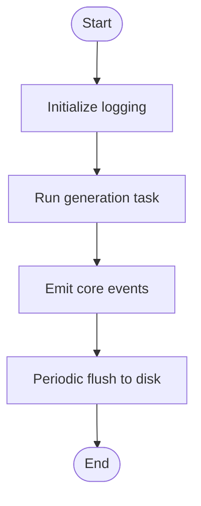
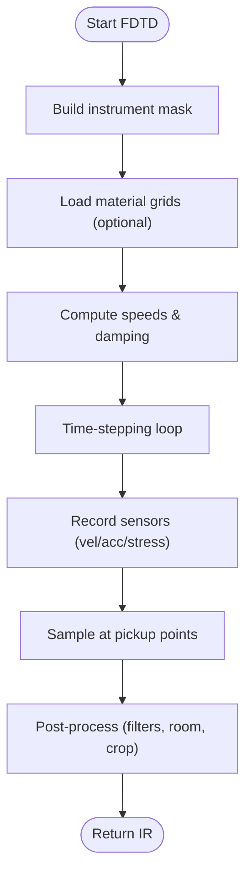
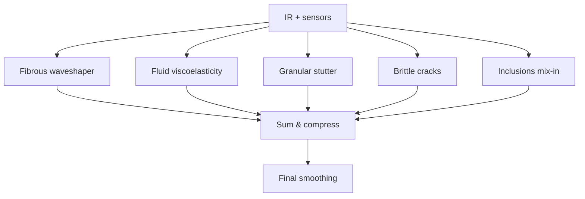
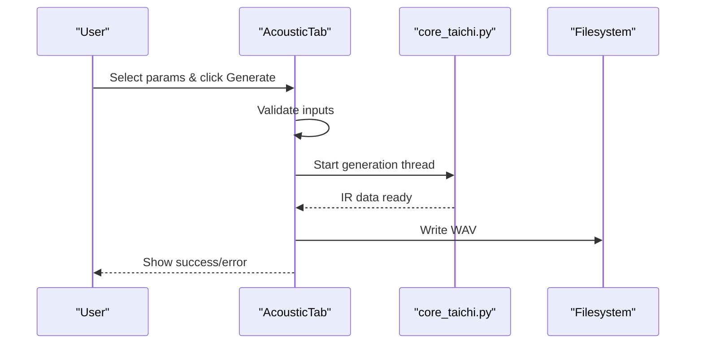

# Troubleshooting and FAQ

<cite>
**Referenced Files in This Document**
- [main.py](file://main.py)
- [dlc_loader.py](file://dlc_loader.py)
- [core_taichi.py](file://engine/core_taichi.py)
- [core_logging.py](file://engine/core_logging.py)
- [gui.py](file://ui/gui.py)
- [tab_acoustic.py](file://ui/tab_acoustic.py)
- [tab_percussion.py](file://ui/tab_percussion.py)
- [tactile.py](file://engine/tactile.py)
- [instruments.py](file://config/instruments.py)
- [materials.py](file://config/materials.py)
- [README.md](file://README.md)
- [README_tab_taichi.md](file://ui/README_tab_taichi.md)
</cite>

## Table of Contents
1. [Introduction](#introduction)
2. [Project Structure](#project-structure)
3. [Core Components](#core-components)
4. [Architecture Overview](#architecture-overview)
5. [Detailed Component Analysis](#detailed-component-analysis)
6. [Dependency Analysis](#dependency-analysis)
7. [Performance Considerations](#performance-considerations)
8. [Troubleshooting Guide](#troubleshooting-guide)
9. [Conclusion](#conclusion)
10. [Appendices](#appendices)

## Introduction
This document provides a comprehensive Troubleshooting and FAQ guide for TroakarIR. It focuses on diagnosing and resolving installation issues, dependency conflicts, system compatibility, performance bottlenecks (GPU/CPU, memory, simulation speed), and user workflow problems. It also explains how to interpret logs, use the built-in diagnostic features, and offers practical step-by-step resolutions.

## Project Structure
TroakarIR is a Python desktop application with a modular architecture:
- Entry point initializes logging, GUI, and dynamically loads DLC tabs.
- UI tabs orchestrate generation tasks and report status.
- Engine modules implement Taichi-based FDTD simulations, tactile modeling, and logging.
- Config modules define instrument templates and material physics.
- DLCs extend functionality via dynamic loading.

**Diagram sources**
- [main.py:23-76](file://main.py#L23-L76)
- [gui.py:8-46](file://ui/gui.py#L8-L46)
- [tab_acoustic.py:126-193](file://ui/tab_acoustic.py#L126-L193)
- [tab_percussion.py:80-144](file://ui/tab_percussion.py#L80-L144)
- [core_taichi.py:266-717](file://engine/core_taichi.py#L266-L717)
- [core_logging.py:38-203](file://engine/core_logging.py#L38-L203)
- [tactile.py:193-250](file://engine/tactile.py#L193-L250)
- [instruments.py:4-101](file://config/instruments.py#L4-L101)
- [materials.py:642-640](file://config/materials.py#L642-L640)
- [dlc_loader.py:9-62](file://dlc_loader.py#L9-L62)

**Section sources**
- [main.py:23-76](file://main.py#L23-L76)
- [gui.py:8-46](file://ui/gui.py#L8-L46)
- [dlc_loader.py:9-62](file://dlc_loader.py#L9-L62)

## Core Components
- Logging and diagnostics
  - Application-wide logging to file and console.
  - Core instrumentation logger for physics events and tactile profiles.
- Taichi-based FDTD engine
  - GPU-accelerated 2D wave propagation with optional visualization.
  - Substepping for numerical stability and heterogeneous material grids.
- Tactile Engine
  - Fibrous, fluid, granular, brittle, and inclusion-driven textures.
- UI Tabs
  - Acoustic IR generator with auto-crop and status reporting.
  - Percussion IR generator with batch export and material selection.
- Configurations
  - Instrument templates and presets.
  - Material database with physical properties and tactile profiles.

**Section sources**
- [core_logging.py:38-203](file://engine/core_logging.py#L38-L203)
- [core_taichi.py:266-717](file://engine/core_taichi.py#L266-L717)
- [tactile.py:193-250](file://engine/tactile.py#L193-L250)
- [tab_acoustic.py:126-193](file://ui/tab_acoustic.py#L126-L193)
- [tab_percussion.py:80-144](file://ui/tab_percussion.py#L80-L144)
- [instruments.py:4-101](file://config/instruments.py#L4-L101)
- [materials.py:642-640](file://config/materials.py#L642-L640)

## Architecture Overview
The runtime flow begins at the entry point, which sets up logging, creates the main window, mounts DLC tabs, and starts the GUI loop. Generation tasks are executed in background threads from the UI tabs, invoking engine functions that rely on Taichi for GPU computation and PyRoomAcoustics for room impulse responses.

**Diagram sources**
- [main.py:23-76](file://main.py#L23-L76)
- [gui.py:8-46](file://ui/gui.py#L8-L46)
- [tab_acoustic.py:126-193](file://ui/tab_acoustic.py#L126-L193)
- [tab_percussion.py:80-144](file://ui/tab_percussion.py#L80-L144)
- [core_taichi.py:266-717](file://engine/core_taichi.py#L266-L717)
- [core_logging.py:38-203](file://engine/core_logging.py#L38-L203)

## Detailed Component Analysis

### Logging and Diagnostics
- Application logs
  - Logs are written to a debug file and the console with timestamps and severity.
  - Useful for diagnosing startup failures, DLC mounting issues, and generation errors.
- Core instrumentation logs
  - JSONL and CSV outputs for physics events, modal dispersion, energy decay, and tactile summaries.
  - Controlled by environment variables for verbosity, format, and base path.

**Diagram sources**
- [main.py:24-31](file://main.py#L24-L31)
- [core_logging.py:61-87](file://engine/core_logging.py#L61-L87)

**Section sources**
- [main.py:24-31](file://main.py#L24-L31)
- [core_logging.py:38-203](file://engine/core_logging.py#L38-L203)

### Taichi FDTD Engine
Key capabilities and controls:
- Grid size scaling and automatic substepping for numerical stability.
- Heterogeneous material grids and per-point physics.
- Strike/pickup points, friction/noise modes, and optional visualization.
- Room impulse response via PyRoomAcoustics.

Common pitfalls:
- Excessive nonlinearity or yield stress thresholds causing instability.
- Very large grid sizes or long durations increasing memory/CPU/GPU usage.
- Improperly configured pickup points leading to weak or noisy signals.

**Diagram sources**
- [core_taichi.py:266-717](file://engine/core_taichi.py#L266-L717)

**Section sources**
- [core_taichi.py:266-717](file://engine/core_taichi.py#L266-L717)
- [README_tab_taichi.md:1-119](file://ui/README_tab_taichi.md#L1-L119)

### Tactile Engine
- Generates fibrous, fluid, granular, brittle, and inclusion-driven textures.
- Applies soft-knee limiting and slewing to prevent clipping.
- Integrates with IR generation to enrich tactile content.

**Diagram sources**
- [tactile.py:193-250](file://engine/tactile.py#L193-L250)

**Section sources**
- [tactile.py:193-250](file://engine/tactile.py#L193-L250)

### UI Tabs and Workflows
- Acoustic tab
  - Auto-crop removes silent tails; thread-based generation prevents UI blocking.
  - Errors surfaced via message boxes and logged.
- Percussion tab
  - Batch export across presets; configurable materials and duration.

**Diagram sources**
- [tab_acoustic.py:126-193](file://ui/tab_acoustic.py#L126-L193)
- [core_taichi.py:266-717](file://engine/core_taichi.py#L266-L717)

**Section sources**
- [tab_acoustic.py:126-193](file://ui/tab_acoustic.py#L126-L193)
- [tab_percussion.py:80-144](file://ui/tab_percussion.py#L80-L144)

## Dependency Analysis
- Python packages
  - numpy, scipy, pyroomacoustics, taichi, Pillow, tkinterdnd2.
- GPU acceleration
  - Taichi automatically selects CUDA/Vulkan; fallback to CPU is supported.
- Environment variables
  - Control CoreLogger verbosity, format, and output path.

Potential conflicts:
- Multiple Python environments or incompatible package versions.
- Missing or incompatible GPU drivers for Taichi.
- Conflicting audio device drivers affecting playback.

**Section sources**
- [README.md:34-52](file://README.md#L34-L52)
- [core_logging.py:15-17](file://engine/core_logging.py#L15-L17)

## Performance Considerations
- GPU/CPU utilization
  - Taichi offloads FDTD computations; ensure drivers are current.
  - Large grid sizes and long durations increase compute time and memory.
- Memory limits
  - FDTD buffers grow with grid size; reduce N_grid or duration to fit RAM.
- Simulation speed
  - Automatic substepping increases steps per audio sample; adjust duration and grid size accordingly.
- Stability
  - High nonlinearity/yield stress can cause oscillations; tune parameters down.

[No sources needed since this section provides general guidance]

## Troubleshooting Guide

### Installation and Setup
Symptoms
- Application fails to start or crashes immediately.
- Cannot import modules or missing dependencies.

Resolution steps
1. Verify Python 3.9+ is installed and active in your environment.
2. Install required packages as listed in the project’s setup instructions.
3. If GPU acceleration is unavailable, confirm CPU fallback works; otherwise, install compatible drivers for CUDA/Vulkan.
4. Reboot after installing GPU drivers to ensure detection.

Verification
- Run the application entry point and check for startup messages in the debug log.

**Section sources**
- [README.md:34-52](file://README.md#L34-L52)
- [main.py:24-31](file://main.py#L24-L31)

### Dependency Conflicts
Symptoms
- Import errors for taichi, numpy, scipy, pyroomacoustics, or tkinterdnd2.
- Runtime errors indicating incompatible versions.

Resolution steps
1. Create a fresh virtual environment and install dependencies.
2. Pin versions to those tested with the project if necessary.
3. Avoid mixing system and user site-packages; use isolated environments.
4. If using conda, ensure compatible channels and avoid mixing conda-forge with pip-installed packages.

**Section sources**
- [README.md:44-47](file://README.md#L44-L47)

### System Compatibility Issues
Symptoms
- No GPU detected; extremely slow generation.
- Application runs but GUI appears unresponsive.

Resolution steps
1. Confirm GPU drivers are installed and up to date.
2. Ensure Taichi supports your platform (CUDA/Vulkan); if not, expect CPU-only performance.
3. Close other GPU-intensive applications to free VRAM/CPU cycles.
4. Reduce grid size and duration to fit available memory.

**Section sources**
- [README.md:36-37](file://README.md#L36-L37)
- [core_taichi.py:282-332](file://engine/core_taichi.py#L282-L332)

### GPU Driver Issues
Symptoms
- Crashes during rendering or after starting visualization.
- “No suitable GPU backend” errors.

Resolution steps
1. Update graphics drivers to the latest stable version.
2. Try switching between CUDA and Vulkan backends if supported.
3. Disable visualization (headless mode) to isolate whether the issue is GPU or rendering.

**Section sources**
- [core_taichi.py:277-279](file://engine/core_taichi.py#L277-L279)

### Memory Limitations
Symptoms
- Out-of-memory errors or extreme slowdowns.
- Generation halts mid-process.

Resolution steps
1. Lower the grid size parameter.
2. Shorten the IR duration.
3. Disable visualization to reduce memory overhead.
4. Close other memory-heavy applications.

**Section sources**
- [core_taichi.py:277-279](file://engine/core_taichi.py#L277-L279)

### Slow Simulation Times
Symptoms
- Long render times for single IR.
- UI becomes sluggish.

Resolution steps
1. Reduce N_grid and/or duration.
2. Disable visualization.
3. Simplify material heterogeneity or remove nonlinearity.
4. Use lower sample rates only if acceptable for your workflow.

**Section sources**
- [core_taichi.py:277-279](file://engine/core_taichi.py#L277-L279)

### Debugging Strategies
- Enable verbose logging
  - Adjust CoreLogger verbosity via environment variables to capture detailed physics events.
- Inspect generated logs
  - Review the JSONL/CSV logs for modal dispersion, energy decay, and tactile summaries.
- Reproduce with minimal parameters
  - Start with small grid size, short duration, and basic materials to isolate issues.
- Capture the debug log
  - The application writes a debug log file; attach it to support requests.

**Section sources**
- [core_logging.py:15-17](file://engine/core_logging.py#L15-L17)
- [main.py:24-31](file://main.py#L24-L31)

### Error Message Interpretation
- “Mounting DLC tabs failed”
  - Indicates the DLC directory is missing or manifests are invalid; verify folder structure and manifest entries.
- “Notebook not found”
  - The main window lacks a tabbed container; ensure the UI initialization completes before attempting to mount tabs.
- “Generation failed”
  - The generation thread raised an exception; check the debug log for stack traces and module-specific hints.

**Section sources**
- [main.py:65-71](file://main.py#L65-L71)
- [dlc_loader.py:59-61](file://dlc_loader.py#L59-L61)
- [tab_acoustic.py:187-190](file://ui/tab_acoustic.py#L187-L190)

### Common User Errors and Misconfiguration
- Wrong parameter combinations
  - Extremely high nonlinearity or yield stress thresholds can destabilize simulations.
  - Excessive “demud_db” may overly suppress resonances; adjust conservatively.
- Incorrect pickup points
  - Place pickups away from nodes or antinodes to avoid weak signals.
- Auto-crop removing too much
  - If the tail is cut too aggressively, increase duration or disable auto-crop.

**Section sources**
- [core_taichi.py:371-386](file://engine/core_taichi.py#L371-L386)
- [core_taichi.py:594-651](file://engine/core_taichi.py#L594-L651)
- [tab_acoustic.py:153-182](file://ui/tab_acoustic.py#L153-L182)

### Workflow Problems
- DLC tabs not appearing
  - Ensure the DLC directory exists and manifests are valid; the loader will create the directory if missing.
- Batch export issues
  - Verify target directory permissions and available disk space.

**Section sources**
- [dlc_loader.py:18-21](file://dlc_loader.py#L18-L21)
- [dlc_loader.py:34-57](file://dlc_loader.py#L34-L57)
- [tab_percussion.py:90-94](file://ui/tab_percussion.py#L90-L94)

### Frequently Asked Questions

Q: What are the system requirements?
- Python 3.9+ recommended.
- GPU recommended for Taichi acceleration; CPU fallback available.
- Sufficient RAM for chosen grid size and duration.

Q: What file formats are supported for export?
- WAV export for IRs; batch export for percussion.

Q: Are there export limitations?
- Export is WAV 32-bit float at 44.1 kHz; no native multisample packing in core.

Q: Can I integrate with external DAWs/samplers?
- Use the provided multisample packer scripts to convert batches into sampler-ready patches.

Q: How do I report bugs?
- Attach the debug log and describe your environment and reproduction steps.

**Section sources**
- [README.md:34-52](file://README.md#L34-L52)
- [tab_acoustic.py:134-137](file://ui/tab_acoustic.py#L134-L137)
- [tab_percussion.py:90-94](file://ui/tab_percussion.py#L90-L94)

## Conclusion
By leveraging the built-in logging, validating dependencies, tuning simulation parameters, and following the step-by-step resolutions above, most issues with TroakarIR can be quickly diagnosed and resolved. For persistent problems, collect the debug log and environment details to aid support.

[No sources needed since this section summarizes without analyzing specific files]

## Appendices

### Quick Checklist
- Installed required packages.
- GPU drivers updated.
- Used minimal parameters to reproduce.
- Verified debug log location and content.
- Checked DLC directory and manifests.

**Section sources**
- [README.md:34-52](file://README.md#L34-L52)
- [dlc_loader.py:18-21](file://dlc_loader.py#L18-L21)
- [main.py:24-31](file://main.py#L24-L31)