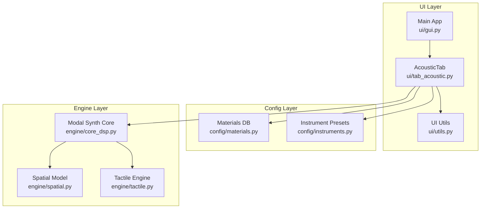
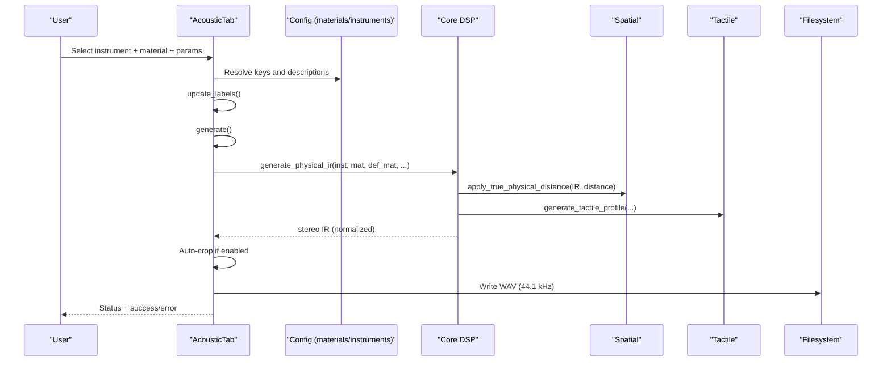
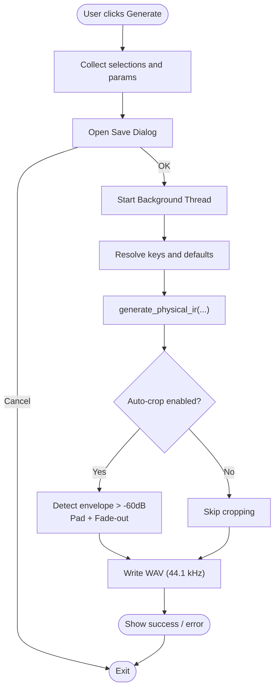
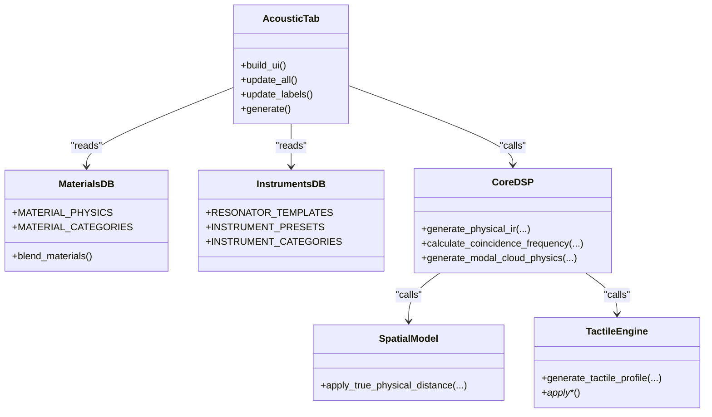
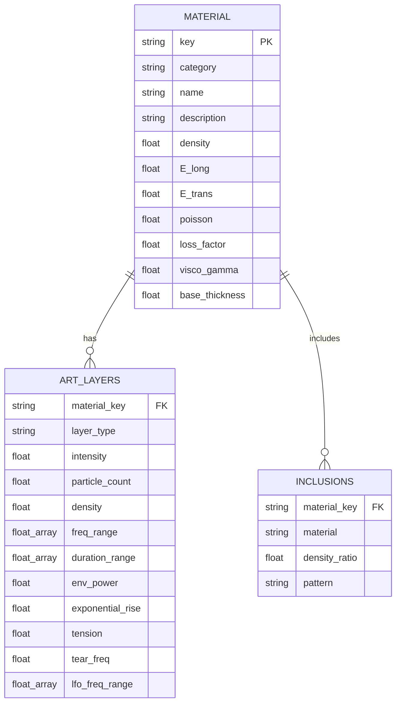
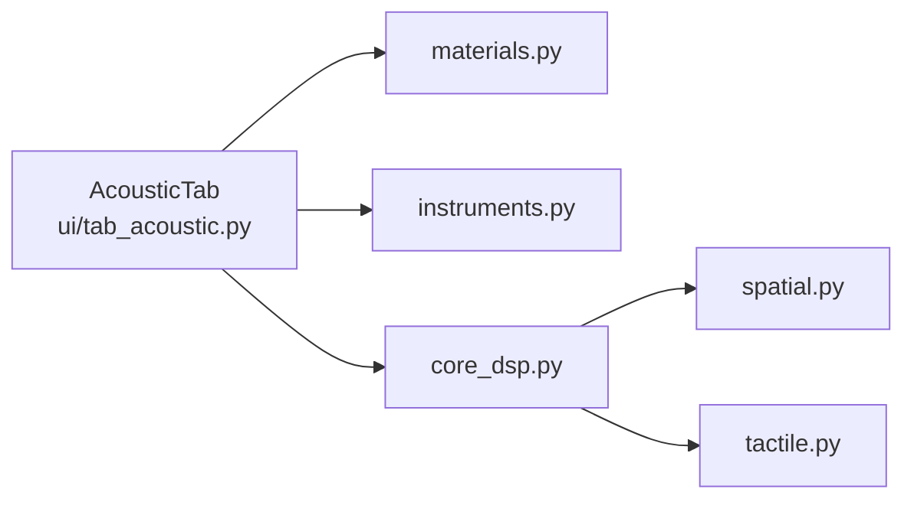

# Acoustic Tab

<cite>
**Referenced Files in This Document**
- [tab_acoustic.py](file://ui/tab_acoustic.py)
- [materials.py](file://config/materials.py)
- [instruments.py](file://config/instruments.py)
- [core_dsp.py](file://engine/core_dsp.py)
- [spatial.py](file://engine/spatial.py)
- [tactile.py](file://engine/tactile.py)
- [utils.py](file://ui/utils.py)
- [gui.py](file://ui/gui.py)
</cite>

## Table of Contents
1. [Introduction](#introduction)
2. [Project Structure](#project-structure)
3. [Core Components](#core-components)
4. [Architecture Overview](#architecture-overview)
5. [Detailed Component Analysis](#detailed-component-analysis)
6. [Dependency Analysis](#dependency-analysis)
7. [Performance Considerations](#performance-considerations)
8. [Troubleshooting Guide](#troubleshooting-guide)
9. [Conclusion](#conclusion)
10. [Appendices](#appendices)

## Introduction
The Acoustic tab provides a modal synthesis interface for exploring acoustic impulse responses (IRs) generated from physical models. It enables users to select instrument templates and materials, adjust geometric scaling, sustain tail length, microphone distance, and toggle automatic cropping. The system generates stereo IRs with spatial processing and tactile textures, exporting WAV files while offering a live preview workflow through status updates and a threaded generation process.

## Project Structure
The Acoustic tab is part of a modular GUI application with dedicated configuration and engine modules:
- UI layer: tab_acoustic.py defines the tab UI, parameter controls, and generation workflow
- Config layer: materials.py and instruments.py define material physics and instrument presets/templates
- Engine layer: core_dsp.py synthesizes modal IRs, spatial.py applies distance effects, tactile.py adds texture layers
- Utilities: utils.py provides category building and key extraction helpers

**Diagram sources**
- [tab_acoustic.py:17-77](file://ui/tab_acoustic.py#L17-L77)
- [materials.py:18-640](file://config/materials.py#L18-L640)
- [instruments.py:4-101](file://config/instruments.py#L4-L101)
- [core_dsp.py:90-273](file://engine/core_dsp.py#L90-L273)
- [spatial.py:5-61](file://engine/spatial.py#L5-L61)
- [tactile.py:193-229](file://engine/tactile.py#L193-L229)
- [utils.py:2-32](file://ui/utils.py#L2-L32)
- [gui.py:27-37](file://ui/gui.py#L27-L37)

**Section sources**
- [tab_acoustic.py:17-77](file://ui/tab_acoustic.py#L17-L77)
- [gui.py:27-37](file://ui/gui.py#L27-L37)

## Core Components
- Parameter controls:
  - Instrument template selector with category grouping
  - Material selector with category grouping
  - Geometry/scale slider (0.3–3.0x)
  - Sustain/max-tail duration slider (0.1–5.0s)
  - Microphone distance slider (0.0–40.0m)
  - Auto-crop checkbox
  - Generate button
- Real-time preview and export:
  - Threaded generation with status updates
  - Auto-crop removes silent tails below -60dB with 50ms padding and 10ms fade-out
  - WAV export at 44.1 kHz, normalized to a safe level
- Visualization:
  - Live labels update on parameter changes
  - Descriptive labels show instrument and material descriptions
- Material database integration:
  - Rich material properties (density, elastic moduli, Poisson ratio, loss factors, viscoelasticity)
  - Category-based grouping and blending utilities
- Interactive controls:
  - Comboboxes populate from categorized dictionaries
  - Key extraction from display strings for robust lookup

**Section sources**
- [tab_acoustic.py:24-124](file://ui/tab_acoustic.py#L24-L124)
- [tab_acoustic.py:126-192](file://ui/tab_acoustic.py#L126-L192)
- [materials.py:9-16](file://config/materials.py#L9-L16)
- [materials.py:18-640](file://config/materials.py#L18-L640)
- [instruments.py:4-101](file://config/instruments.py#L4-L101)
- [utils.py:2-32](file://ui/utils.py#L2-L32)

## Architecture Overview
The Acoustic tab orchestrates a pipeline from user selections to exported IRs:
- UI collects selections and parameters
- Engine builds modal clouds, transient clicks, and diffuse tails
- Spatial model applies distance-dependent filtering and mixing
- Tactile engine adds material-aware textures
- Export writes WAV with optional auto-crop

**Diagram sources**
- [tab_acoustic.py:126-192](file://ui/tab_acoustic.py#L126-L192)
- [core_dsp.py:90-273](file://engine/core_dsp.py#L90-L273)
- [spatial.py:5-61](file://engine/spatial.py#L5-L61)
- [tactile.py:193-229](file://engine/tactile.py#L193-L229)

## Detailed Component Analysis

### AcousticTab UI and Controls
- Instrument and material selectors:
  - Populate from categorized dictionaries built from config modules
  - Display format: “Name [key]”
  - Description labels show preset and material descriptions
- Sliders and toggles:
  - Scale: affects plate thickness or room volume depending on template type
  - Duration: sets maximum tail length for modal synthesis
  - Mic distance: controls spatial processing (dry vs. distance model)
  - Auto-crop: removes silent tails below -60dB with padding and fade
- Generation workflow:
  - Opens save dialog, starts background thread
  - Calls core IR generator, applies optional auto-crop, writes WAV
  - Updates status label and shows message box

**Diagram sources**
- [tab_acoustic.py:126-192](file://ui/tab_acoustic.py#L126-L192)

**Section sources**
- [tab_acoustic.py:24-124](file://ui/tab_acoustic.py#L24-L124)
- [tab_acoustic.py:126-192](file://ui/tab_acoustic.py#L126-L192)
- [utils.py:2-32](file://ui/utils.py#L2-L32)

### Modal Synthesis and IR Generation
- Template-driven synthesis:
  - Instruments define mode builders and transient click parameters
  - Templates include drum shells, plates, membranes, bars, woodwind bells, isotropic plates, and 3D spaces
- Physical IR generation:
  - Computes coincidence frequency and radiation efficiency
  - Builds modal clouds with drift modulation and exponential decay
  - Adds transient click envelopes and optional wire rattle
  - Mixes primary IR, diffuse tail, transient click, tactile profile, and sympathetic strings
  - Applies low/high-pass filters and normalizes output
- Spatial processing:
  - Distance model adjusts proximity HP, air absorption LP, stereo width, and early room reflections
- Tactile textures:
  - Fibrous waveshaping, fluid viscoelasticity, granular stutter, brittle cracks, and inclusion effects
  - Soft knee limiting and slew filtering prevent clipping

**Diagram sources**
- [tab_acoustic.py:17-77](file://ui/tab_acoustic.py#L17-L77)
- [materials.py:18-640](file://config/materials.py#L18-L640)
- [instruments.py:4-101](file://config/instruments.py#L4-L101)
- [core_dsp.py:90-273](file://engine/core_dsp.py#L90-L273)
- [spatial.py:5-61](file://engine/spatial.py#L5-L61)
- [tactile.py:193-229](file://engine/tactile.py#L193-L229)

**Section sources**
- [core_dsp.py:90-273](file://engine/core_dsp.py#L90-L273)
- [spatial.py:5-61](file://engine/spatial.py#L5-L61)
- [tactile.py:193-229](file://engine/tactile.py#L193-L229)

### Material Database Integration
- Categories:
  - Wood, metal, bio, polymer, mineral, synthetic
- Physics fields:
  - Density, longitudinal/transverse elastic modulus, Poisson ratio
  - Loss factor, viscoelastic gamma, base thickness
  - Granular/fibrous/fluid art-layer parameters
  - Tactile profile (fibrousness, fluidity, granularity, brittleness)
  - Inclusions with density ratios and granular parameters
- Blending:
  - Linear interpolation of base properties
  - Interpolation of art-layer parameters with fallbacks
  - Aggregation of heterogeneous inclusions with scaled densities

**Diagram sources**
- [materials.py:18-640](file://config/materials.py#L18-L640)

**Section sources**
- [materials.py:9-16](file://config/materials.py#L9-L16)
- [materials.py:18-640](file://config/materials.py#L18-L640)

### Instrument Presets and Templates
- Resonator templates define:
  - Transient click strength, Helmholtz presence, space flag, and mode builders
  - Base sizes for 3D spaces
- Instrument presets:
  - Provide low-cut, bridge hill EQ center, fundamental frequencies, and harmonic ratios
  - Include sympathetic string tunings and body depths/sizes
- Category grouping:
  - Strings/bowed, strings/plucked, wind horns, spaces 3D, industrial anomalies, lab testing

**Section sources**
- [instruments.py:4-101](file://config/instruments.py#L4-L101)
- [instruments.py:177-279](file://config/instruments.py#L177-L279)

### Spatial Effects and Tactile Textures
- Spatial model:
  - Proximity HP, air absorption LP, stereo width narrowing, early room signal mixing
- Tactile engine:
  - Fibrous waveshaping, fluid viscoelasticity, granular stutter, brittle crack events
  - Inclusion-specific textures
  - Soft-knee limiting and slew filtering for safe output

**Section sources**
- [spatial.py:5-61](file://engine/spatial.py#L5-L61)
- [tactile.py:193-229](file://engine/tactile.py#L193-L229)

## Dependency Analysis
- UI depends on:
  - Config modules for data-driven combobox population and descriptions
  - Engine modules for synthesis and post-processing
- Engine depends on:
  - Config for template definitions and material properties
  - SciPy for filtering and numerical routines
- Coupling:
  - Low coupling between UI and engine via function calls
  - Strong cohesion within engine modules around synthesis, spatial, and tactile tasks

**Diagram sources**
- [tab_acoustic.py:12-15](file://ui/tab_acoustic.py#L12-L15)
- [core_dsp.py:6-8](file://engine/core_dsp.py#L6-L8)
- [materials.py:18-640](file://config/materials.py#L18-L640)
- [instruments.py:4-101](file://config/instruments.py#L4-L101)

**Section sources**
- [tab_acoustic.py:12-15](file://ui/tab_acoustic.py#L12-L15)
- [core_dsp.py:6-8](file://engine/core_dsp.py#L6-L8)

## Performance Considerations
- Modal synthesis:
  - Number of modes and frequency ranges impact CPU usage; limits are set in modal cloud generators
- Filtering and normalization:
  - Butterworth filters and normalization steps are lightweight
- Spatial processing:
  - Distance-dependent filtering and early reflection delays add minimal overhead
- Export:
  - WAV writing is I/O bound; auto-crop reduces file size and improves workflow
- Threading:
  - Generation runs in a background thread to keep UI responsive

[No sources needed since this section provides general guidance]

## Troubleshooting Guide
- Generation fails:
  - Check template availability and material keys
  - Verify numeric ranges for sliders (scale, duration, mic distance)
  - Review status messages and error dialogs
- Unexpected IR characteristics:
  - Adjust scale to change thickness or room size
  - Modify sustain duration to alter tail length
  - Change microphone distance to alter spatial coloration
  - Toggle auto-crop to preserve or trim silent regions
- Material selection issues:
  - Ensure the selected material exists in the database
  - Use the categorized combobox to browse and select reliably

**Section sources**
- [tab_acoustic.py:126-192](file://ui/tab_acoustic.py#L126-L192)

## Conclusion
The Acoustic tab offers a powerful, data-driven interface for modal synthesis and material exploration. By combining instrument templates, rich material databases, and physically grounded synthesis, it enables precise control over IR characteristics. The spatial and tactile engines add realistic depth, while the export pipeline ensures practical usability.

[No sources needed since this section summarizes without analyzing specific files]

## Appendices

### Workflow Examples
- Generate an impulse response:
  - Choose an instrument template and material
  - Adjust scale, sustain duration, and microphone distance
  - Click Generate and save the WAV file
- Compare materials:
  - Keep instrument and scale constant
  - Iterate through materials and listen/compare IRs
- Batch processing:
  - Use auto-crop to trim silence
  - Export multiple IRs with consistent naming conventions

[No sources needed since this section provides general guidance]

### Parameter-to-IR Relationship Summary
- Scale:
  - Affects plate thickness or room volume; influences modal density and decay
- Sustain duration:
  - Controls maximum tail length; increases perceived reverberance
- Microphone distance:
  - Changes proximity HP, air absorption, stereo width, and early reflections
- Auto-crop:
  - Removes silent tails below -60dB with padding and fade-out for clean exports

[No sources needed since this section provides general guidance]