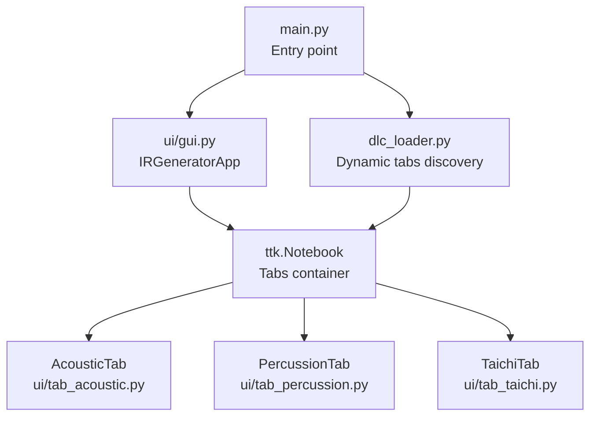
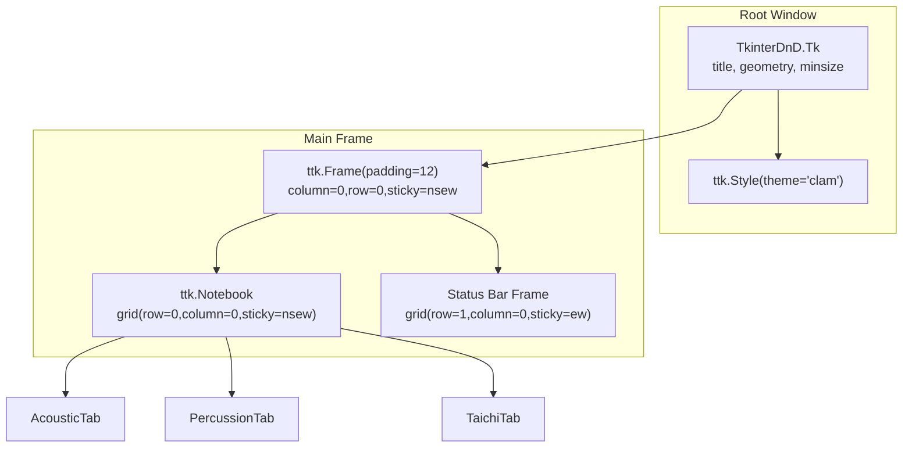
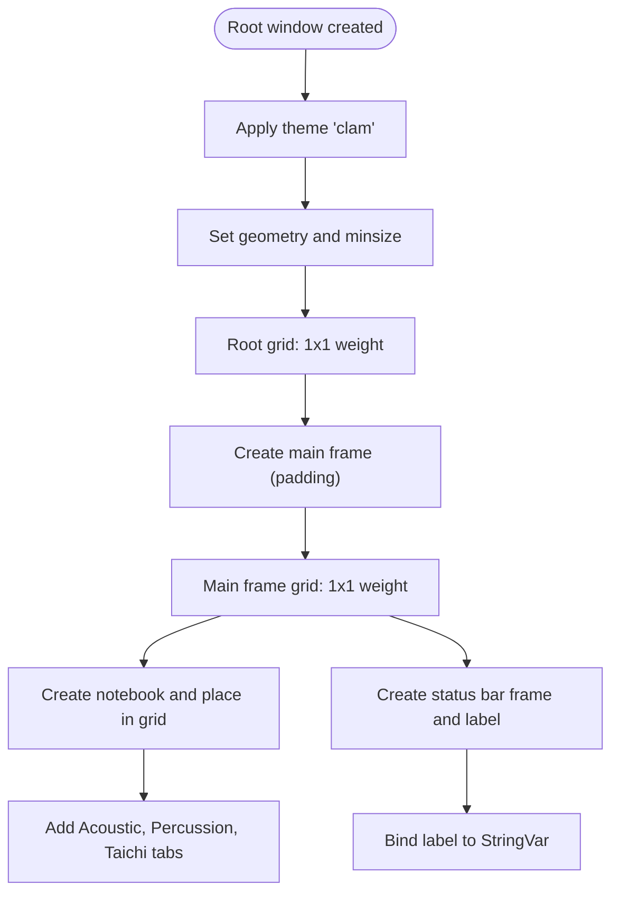
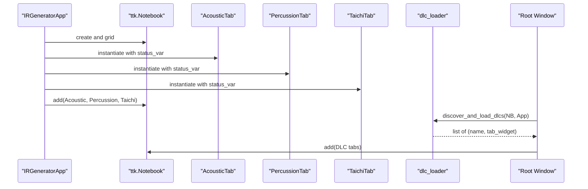
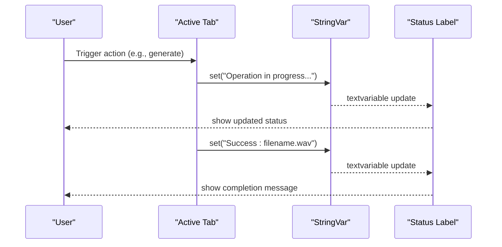
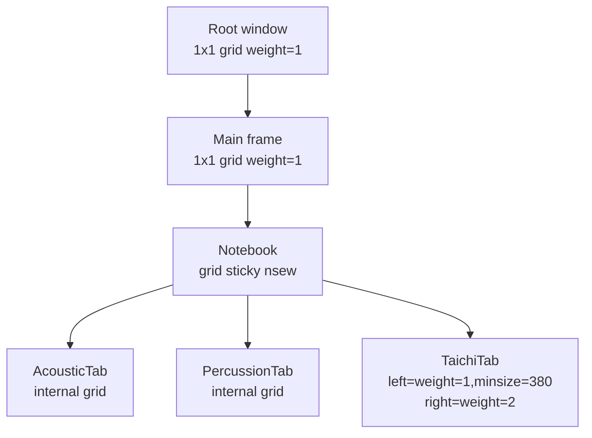
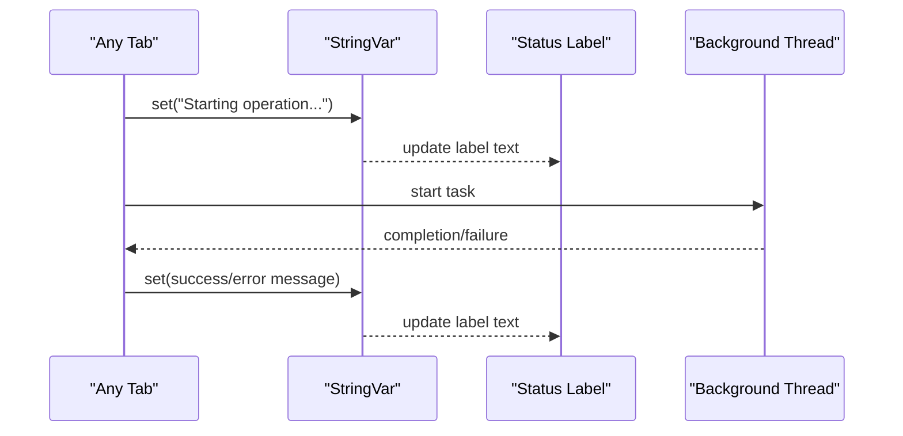
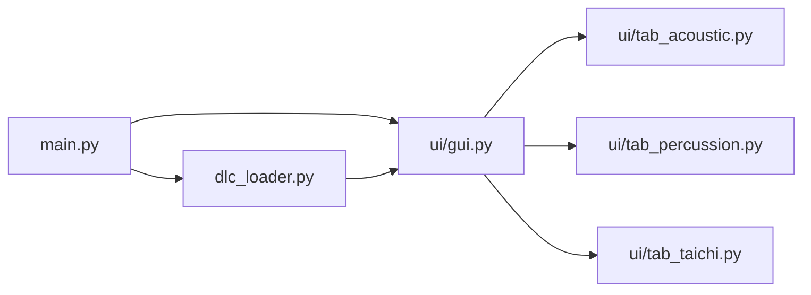

# Main Window Layout

<cite>
**Referenced Files in This Document**
- [main.py](file://main.py)
- [ui/gui.py](file://ui/gui.py)
- [ui/tab_acoustic.py](file://ui/tab_acoustic.py)
- [ui/tab_percussion.py](file://ui/tab_percussion.py)
- [ui/tab_taichi.py](file://ui/tab_taichi.py)
- [dlc_loader.py](file://dlc_loader.py)
</cite>

## Table of Contents
1. [Introduction](#introduction)
2. [Project Structure](#project-structure)
3. [Core Components](#core-components)
4. [Architecture Overview](#architecture-overview)
5. [Detailed Component Analysis](#detailed-component-analysis)
6. [Dependency Analysis](#dependency-analysis)
7. [Performance Considerations](#performance-considerations)
8. [Troubleshooting Guide](#troubleshooting-guide)
9. [Conclusion](#conclusion)

## Introduction
This document explains the main application window layout and structure built with Tkinter. It covers window sizing and positioning, minimum size constraints, responsive layout configuration, the main frame organization, grid system setup, and the notebook widget initialization. It also documents the status bar implementation, variable binding, and real-time status updates. Finally, it describes how the main window coordinates with tab components and handles resize events.

## Project Structure
The main application entry point initializes the root window, applies a theme, constructs the primary UI via a dedicated class, discovers and mounts dynamic DLC tabs into the same notebook, and starts the event loop.

**Diagram sources**
- [main.py:23-73](file://main.py#L23-L73)
- [ui/gui.py:8-45](file://ui/gui.py#L8-L45)
- [dlc_loader.py:9-61](file://dlc_loader.py#L9-L61)

**Section sources**
- [main.py:23-73](file://main.py#L23-L73)
- [ui/gui.py:8-45](file://ui/gui.py#L8-L45)
- [dlc_loader.py:9-61](file://dlc_loader.py#L9-L61)

## Core Components
- Root window and theme: The root window is created with a drag-and-drop wrapper and themed using a modern theme. The window title is set early during startup.
- Application controller: The IRGeneratorApp class encapsulates the main window’s layout, grid configuration, and status bar.
- Notebook tabs: Three core tabs are added to the notebook: Acoustic, Percussion, and Taichi FDTD Laboratory.
- Status bar: A persistent label bound to a Tk StringVar displays real-time status messages.

Key behaviors:
- Window sizing and constraints: Fixed initial geometry and enforced minimum size.
- Responsive layout: Grid weights and sticky options ensure the main frame and notebook expand to fill available space.
- Dynamic DLC mounting: After the UI is built, the application scans for a notebook and mounts additional tabs from DLC packages.

**Section sources**
- [main.py:34-42](file://main.py#L34-L42)
- [ui/gui.py:9-26](file://ui/gui.py#L9-L26)
- [ui/gui.py:27-37](file://ui/gui.py#L27-L37)
- [ui/gui.py:39-45](file://ui/gui.py#L39-L45)

## Architecture Overview
The main window orchestrates a single-notebook layout with three primary tabs. The status bar resides below the notebook and reflects the current operation across tabs. Dynamic DLC tabs are discovered and appended to the same notebook.

**Diagram sources**
- [main.py:34-42](file://main.py#L34-L42)
- [ui/gui.py:18-25](file://ui/gui.py#L18-L25)
- [ui/gui.py:27-37](file://ui/gui.py#L27-L37)
- [ui/gui.py:39-45](file://ui/gui.py#L39-L45)

## Detailed Component Analysis

### Main Window Initialization and Layout
- Window creation and theme: The root window is instantiated with a drag-and-drop wrapper, titled appropriately, and themed using a modern style.
- Geometry and constraints: Initial geometry is set, and a minimum size is enforced to ensure usability across different screen sizes.
- Grid configuration: The root window uses a single-cell grid with weight 1 in both directions so the main frame expands to fill the window.
- Main frame: A padded frame is placed at row 0, column 0 and configured to expand with the window.
- Notebook: The notebook occupies the top portion of the main frame and is configured to expand with the frame.
- Status bar: A bottom frame holds a label bound to a shared StringVar for real-time updates.

**Diagram sources**
- [main.py:34-42](file://main.py#L34-L42)
- [ui/gui.py:11-13](file://ui/gui.py#L11-L13)
- [ui/gui.py:15-21](file://ui/gui.py#L15-L21)
- [ui/gui.py:18-25](file://ui/gui.py#L18-L25)
- [ui/gui.py:27-37](file://ui/gui.py#L27-L37)
- [ui/gui.py:39-45](file://ui/gui.py#L39-L45)

**Section sources**
- [main.py:34-42](file://main.py#L34-L42)
- [ui/gui.py:11-13](file://ui/gui.py#L11-L13)
- [ui/gui.py:15-21](file://ui/gui.py#L15-L21)
- [ui/gui.py:18-25](file://ui/gui.py#L18-L25)
- [ui/gui.py:27-37](file://ui/gui.py#L27-L37)
- [ui/gui.py:39-45](file://ui/gui.py#L39-L45)

### Notebook Widget Initialization and Tab Coordination
- Notebook construction: The notebook is created inside the main frame and configured to expand with the frame.
- Tab addition: Three tabs are added with localized titles. Each tab receives the shared status variable for coordinated status updates.
- Dynamic DLC integration: After the UI is built, the application scans the widget tree for a notebook and mounts additional tabs from DLC packages.

**Diagram sources**
- [ui/gui.py:27-37](file://ui/gui.py#L27-L37)
- [dlc_loader.py:9-61](file://dlc_loader.py#L9-L61)
- [main.py:46-71](file://main.py#L46-L71)

**Section sources**
- [ui/gui.py:27-37](file://ui/gui.py#L27-L37)
- [dlc_loader.py:9-61](file://dlc_loader.py#L9-L61)
- [main.py:46-71](file://main.py#L46-L71)

### Status Bar Implementation and Real-Time Updates
- Variable binding: A Tk StringVar is created and passed to each tab constructor. The status bar label is bound to this variable.
- Real-time updates: Tabs update the shared StringVar to reflect current operations (e.g., “Calculating 3D acoustic equations…”).
- Visual presentation: The status label is styled with a small font and gray color to de-emphasize it while keeping it readable.

**Diagram sources**
- [ui/gui.py:23](file://ui/gui.py#L23)
- [ui/gui.py:44](file://ui/gui.py#L44)
- [ui/tab_acoustic.py:142](file://ui/tab_acoustic.py#L142)
- [ui/tab_percussion.py:97](file://ui/tab_percussion.py#L97)
- [ui/tab_taichi.py:631](file://ui/tab_taichi.py#L631)

**Section sources**
- [ui/gui.py:23](file://ui/gui.py#L23)
- [ui/gui.py:44](file://ui/gui.py#L44)
- [ui/tab_acoustic.py:142](file://ui/tab_acoustic.py#L142)
- [ui/tab_percussion.py:97](file://ui/tab_percussion.py#L97)
- [ui/tab_taichi.py:631](file://ui/tab_taichi.py#L631)

### Responsive Layout Configuration and Resize Behavior
- Root-level responsiveness: The root window is configured with equal weight in both directions, allowing the main frame to expand to fill the window.
- Main frame responsiveness: The main frame itself is a single-cell grid with weight 1 in both directions, ensuring the notebook fills available space.
- Notebook responsiveness: The notebook is placed in the main frame with sticky expansion, so it grows/shrinks with the window.
- Tab-level responsiveness: Individual tabs configure their internal grids with weights and sticky options to adapt to resizing. For example, the Taichi tab defines column weights and minimum sizes for left/right panels.

**Diagram sources**
- [ui/gui.py:15-21](file://ui/gui.py#L15-L21)
- [ui/gui.py:18-25](file://ui/gui.py#L18-L25)
- [ui/gui.py:27-37](file://ui/gui.py#L27-L37)
- [ui/tab_taichi.py:60-63](file://ui/tab_taichi.py#L60-L63)

**Section sources**
- [ui/gui.py:15-21](file://ui/gui.py#L15-L21)
- [ui/gui.py:18-25](file://ui/gui.py#L18-L25)
- [ui/gui.py:27-37](file://ui/gui.py#L27-L37)
- [ui/tab_taichi.py:60-63](file://ui/tab_taichi.py#L60-L63)

### Window Title, Geometry Settings, and Scaling
- Window title: The root window title is set at startup.
- Geometry: The window is initialized with a fixed size, ensuring a consistent starting layout.
- Minimum size: A minimum width and height are enforced to prevent the window from becoming unusable when resized too small.
- UI scaling: While the main window does not apply explicit global scaling transforms, individual tabs adjust their internal layouts and labels dynamically based on user inputs (e.g., sliders). The notebook and frames use sticky and weight configurations to distribute space proportionally.

**Section sources**
- [main.py:36](file://main.py#L36)
- [ui/gui.py:11-13](file://ui/gui.py#L11-L13)
- [ui/gui.py:15-21](file://ui/gui.py#L15-L21)

### How the Main Window Coordinates With Tab Components
- Shared status variable: All tabs receive the same StringVar, enabling centralized status reporting.
- Event-driven updates: Tabs update the status variable during long-running tasks (e.g., file dialogs, background threads) and upon completion or failure.
- Background tasks: Long-running operations are executed in separate threads to keep the UI responsive, with status updates posted back to the UI thread.

**Diagram sources**
- [ui/gui.py:23](file://ui/gui.py#L23)
- [ui/gui.py:44](file://ui/gui.py#L44)
- [ui/tab_acoustic.py:149-192](file://ui/tab_acoustic.py#L149-L192)
- [ui/tab_percussion.py:99-114](file://ui/tab_percussion.py#L99-L114)
- [ui/tab_taichi.py:647-671](file://ui/tab_taichi.py#L647-L671)

**Section sources**
- [ui/gui.py:23](file://ui/gui.py#L23)
- [ui/gui.py:44](file://ui/gui.py#L44)
- [ui/tab_acoustic.py:149-192](file://ui/tab_acoustic.py#L149-L192)
- [ui/tab_percussion.py:99-114](file://ui/tab_percussion.py#L99-L114)
- [ui/tab_taichi.py:647-671](file://ui/tab_taichi.py#L647-L671)

## Dependency Analysis
The main window depends on the UI controller class, which in turn depends on the tab classes. The main entry point also integrates with the DLC loader to mount additional tabs into the same notebook.

**Diagram sources**
- [main.py:23-73](file://main.py#L23-L73)
- [ui/gui.py:8-45](file://ui/gui.py#L8-L45)
- [dlc_loader.py:9-61](file://dlc_loader.py#L9-L61)

**Section sources**
- [main.py:23-73](file://main.py#L23-L73)
- [ui/gui.py:8-45](file://ui/gui.py#L8-L45)
- [dlc_loader.py:9-61](file://dlc_loader.py#L9-L61)

## Performance Considerations
- Avoid blocking the UI thread: Long-running operations (e.g., audio synthesis) are executed in background threads, with status updates posted back to the UI thread.
- Efficient status updates: Using a single StringVar minimizes redundant widget updates and reduces redraw overhead.
- Grid weights: Properly configured weights ensure minimal layout recalculation during resizes.

[No sources needed since this section provides general guidance]

## Troubleshooting Guide
- No notebook found: If the application fails to locate a notebook after building the UI, it logs a critical error and cannot mount DLC tabs. Verify that the notebook is created and added to the main frame before attempting to load DLCs.
- Status not updating: Ensure tabs consistently update the shared StringVar and that the label is bound to the same variable instance.
- Resizing artifacts: Confirm that the main frame and notebook are configured with sticky expansion and that tab-level grids use appropriate weights.

**Section sources**
- [main.py:46-71](file://main.py#L46-L71)
- [ui/gui.py:23](file://ui/gui.py#L23)
- [ui/gui.py:44](file://ui/gui.py#L44)

## Conclusion
The main window establishes a robust, responsive Tkinter layout centered around a single notebook containing three core tabs and a shared status bar. The design enforces sensible window sizing, uses grid weights for adaptive resizing, and coordinates tab interactions through a shared status variable. Dynamic DLC integration further extends the notebook with additional tabs, maintaining a consistent user experience across all components.