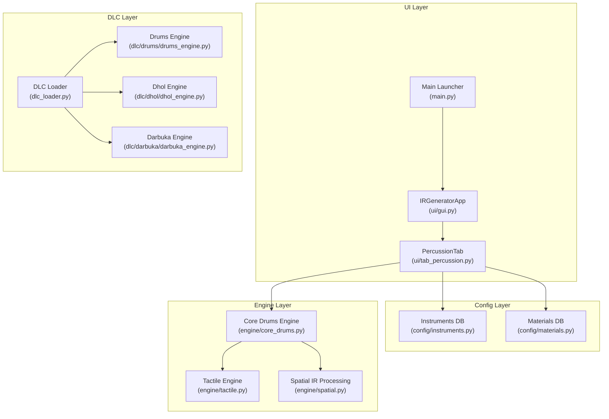
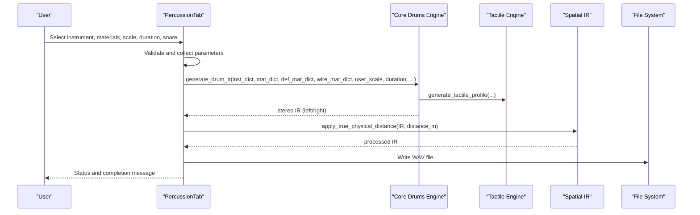
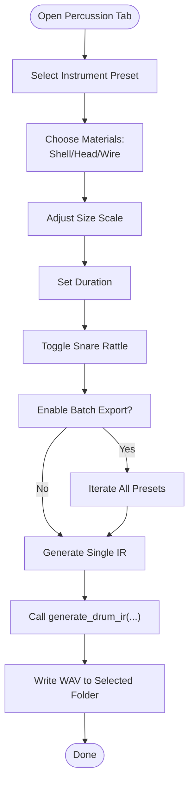
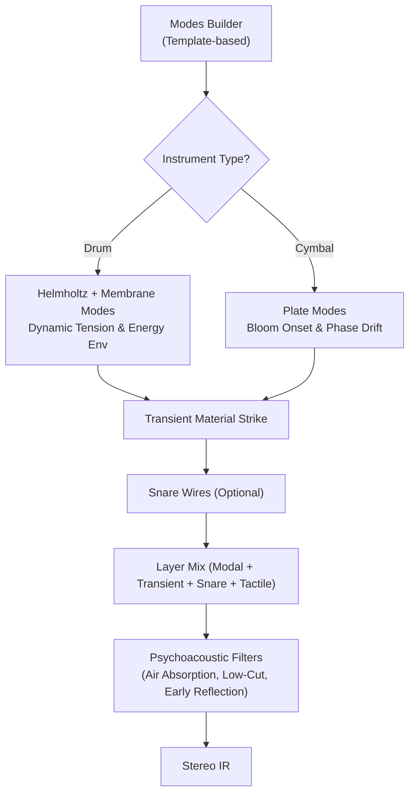
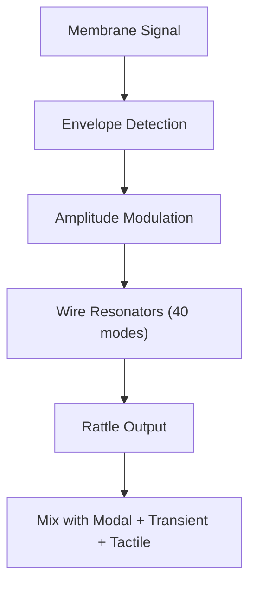
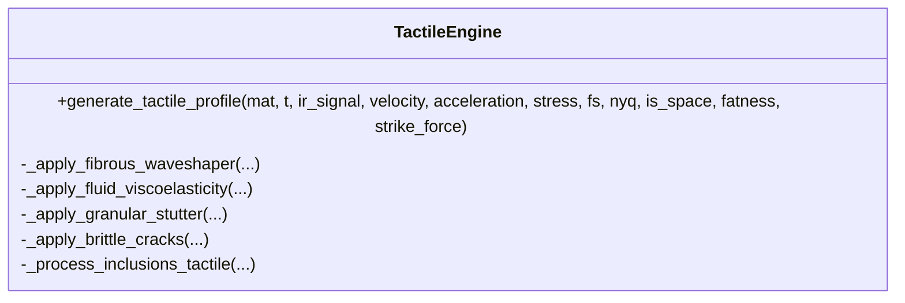
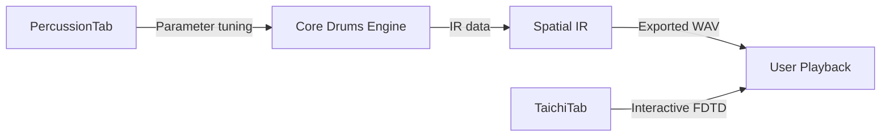
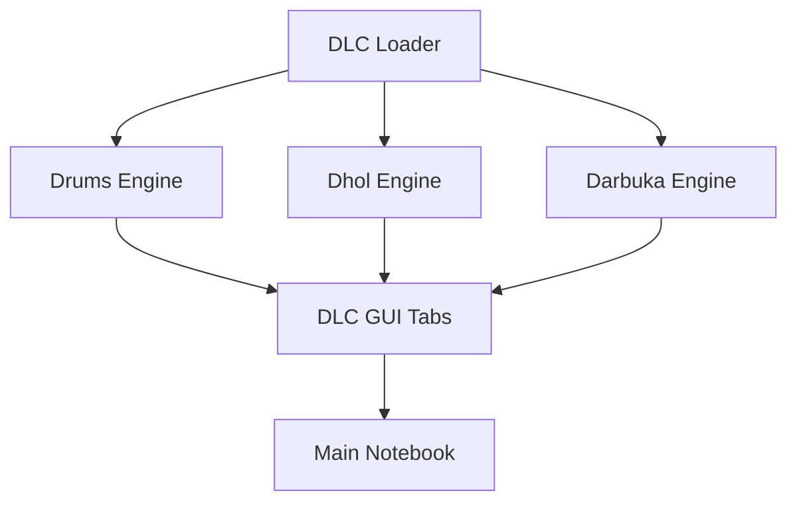
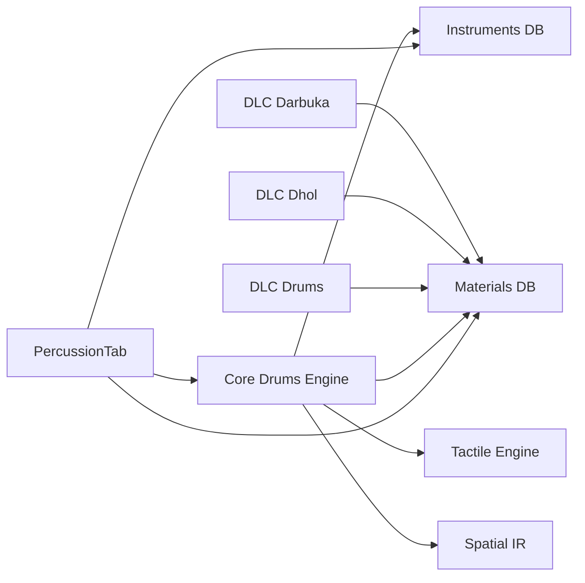

# Percussion Tab

<cite>
**Referenced Files in This Document**
- [ui/tab_percussion.py](file://ui/tab_percussion.py)
- [engine/core_drums.py](file://engine/core_drums.py)
- [engine/tactile.py](file://engine/tactile.py)
- [engine/spatial.py](file://engine/spatial.py)
- [config/instruments.py](file://config/instruments.py)
- [config/materials.py](file://config/materials.py)
- [dlc/drums/drums_engine.py](file://dlc/drums/drums_engine.py)
- [dlc/dhol/dhol_engine.py](file://dlc/dhol/dhol_engine.py)
- [dlc/darbuka/darbuka_engine.py](file://dlc/darbuka/darbuka_engine.py)
- [dlc_loader.py](file://dlc_loader.py)
- [ui/gui.py](file://ui/gui.py)
- [main.py](file://main.py)
</cite>

## Table of Contents
1. [Introduction](#introduction)
2. [Project Structure](#project-structure)
3. [Core Components](#core-components)
4. [Architecture Overview](#architecture-overview)
5. [Detailed Component Analysis](#detailed-component-analysis)
6. [Dependency Analysis](#dependency-analysis)
7. [Performance Considerations](#performance-considerations)
8. [Troubleshooting Guide](#troubleshooting-guide)
9. [Conclusion](#conclusion)
10. [Appendices](#appendices)

## Introduction
This document describes the Percussion tab interface for generating physical percussion impulse responses (IRs) and exploring tactile profiles. It covers drum shell dynamics, cymbal physics, and snare rattle simulation controls, along with instrument-specific parameters, articulation settings, and texture generation options. It also explains the real-time audio feedback system, visualization components for wave propagation and vibration patterns, and performance optimization features. Finally, it documents the integration with DLC plugins for different instrument types (drums, dhol, darbuka) and provides practical examples for setting up simulations, adjusting physical parameters, and exporting processed audio.

## Project Structure
The percussion pipeline spans UI controls, configuration databases, and engine modules:
- UI layer: a dedicated tab exposes controls for instrument selection, materials, scaling, duration, and export.
- Config layer: instrument presets and material databases define templates and physical properties.
- Engine layer: core percussion synthesis, tactile profile generation, and spatial processing.
- DLC layer: plugin integrations for specialized instruments (drums, dhol, darbuka) with their own engines and GUIs.

**Diagram sources**
- [ui/tab_percussion.py:17-144](file://ui/tab_percussion.py#L17-L144)
- [engine/core_drums.py:96-248](file://engine/core_drums.py#L96-L248)
- [engine/tactile.py:193-229](file://engine/tactile.py#L193-L229)
- [engine/spatial.py:5-61](file://engine/spatial.py#L5-L61)
- [config/instruments.py:103-175](file://config/instruments.py#L103-L175)
- [config/materials.py:18-640](file://config/materials.py#L18-L640)
- [dlc/drums/drums_engine.py:1-983](file://dlc/drums/drums_engine.py#L1-L983)
- [dlc/dhol/dhol_engine.py:1-1753](file://dlc/dhol/dhol_engine.py#L1-L1753)
- [dlc/darbuka/darbuka_engine.py:1-677](file://dlc/darbuka/darbuka_engine.py#L1-L677)
- [dlc_loader.py:9-62](file://dlc_loader.py#L9-L62)
- [ui/gui.py:8-46](file://ui/gui.py#L8-L46)
- [main.py:23-76](file://main.py#L23-L76)

**Section sources**
- [ui/gui.py:27-46](file://ui/gui.py#L27-L46)
- [main.py:44-76](file://main.py#L44-L76)
- [dlc_loader.py:9-62](file://dlc_loader.py#L9-L62)

## Core Components
- PercussionTab: Provides instrument selection, material choices, scale, duration, snare toggle, batch export, and generation button. It orchestrates the generation process and writes WAV files.
- Core Drums Engine: Implements modal shell/cymbal synthesis, transient modeling, snare wire simulation, tactile profile mixing, psychoacoustic corrections, and auto-trim.
- Tactile Engine: Generates tactile noise from material properties and kinematic signals, with soft knee limiting and slew shaping.
- Spatial IR Processing: Applies true physical distance effects (proximity, air absorption, stereo width, early room).
- Instrument and Material Databases: Define instrument templates (drum shells, cymbals, tuned bars) and material physics (density, elastic modulus, loss factors, tactile profiles).
- DLC Engines: Specialized engines for drums, dhol, and darbuka with their own parameter sets and visualization hooks.

**Section sources**
- [ui/tab_percussion.py:17-144](file://ui/tab_percussion.py#L17-L144)
- [engine/core_drums.py:96-248](file://engine/core_drums.py#L96-L248)
- [engine/tactile.py:193-229](file://engine/tactile.py#L193-L229)
- [engine/spatial.py:5-61](file://engine/spatial.py#L5-L61)
- [config/instruments.py:103-175](file://config/instruments.py#L103-L175)
- [config/materials.py:18-640](file://config/materials.py#L18-L640)

## Architecture Overview
The Percussion tab routes user selections to the core synthesis engine, which produces a stereo IR. The engine blends modal shell/cymbal components, transient material response, optional snare wires, and tactile noise. Optional spatial processing simulates microphone distance and room early reflections. Export writes WAV files.

**Diagram sources**
- [ui/tab_percussion.py:80-142](file://ui/tab_percussion.py#L80-L142)
- [engine/core_drums.py:96-248](file://engine/core_drums.py#L96-L248)
- [engine/tactile.py:193-229](file://engine/tactile.py#L193-L229)
- [engine/spatial.py:5-61](file://engine/spatial.py#L5-L61)

## Detailed Component Analysis

### PercussionTab Controls and Workflow
- Instrument selection: Chooses from categorized percussion presets (drums, cymbals, metallic, special).
- Materials: Three material selectors:
  - Shell/head material (membrane/skin)
  - Head/shell material (membrane/skin)
  - Wire/mallet material (snare wires)
- Size scale: Scales the instrument’s geometric size affecting modal frequencies.
- Duration: Sets the IR length for modal decay capture.
- Snare toggle: Enables snare wire simulation.
- Batch export: Processes all percussion presets to WAV files.
- Generation: Executes synthesis, writes WAV, and updates status.

**Diagram sources**
- [ui/tab_percussion.py:24-142](file://ui/tab_percussion.py#L24-L142)

**Section sources**
- [ui/tab_percussion.py:17-144](file://ui/tab_percussion.py#L17-L144)
- [config/instruments.py:103-175](file://config/instruments.py#L103-L175)
- [config/materials.py:18-640](file://config/materials.py#L18-L640)

### Drum Shell Dynamics and Cymbal Physics
- Modal synthesis:
  - Drum shells: Helmholtz air resonance plus membrane modes with dynamic tension (pitch drop) and energy envelope.
  - Cymbals: Plate modes with “bloom” onset delay and phase drift modulation.
- Transient modeling:
  - Mallet strike transient with chaos-induced phase noise and amplitude limiting for cymbals.
  - Kick-style transient for drums with exponential envelope shaping.
- Air column and room effects:
  - Low-pass air absorption with distance.
  - Early reflection comb filter for floor bounce.
- Psychoacoustic shaping:
  - Low-cut filtering by instrument category.
  - Auto-trim to remove silence and align transients.
  - Fade-in/out and micro-attack shaping.

**Diagram sources**
- [engine/core_drums.py:125-248](file://engine/core_drums.py#L125-L248)
- [config/instruments.py:13-101](file://config/instruments.py#L13-L101)

**Section sources**
- [engine/core_drums.py:10-248](file://engine/core_drums.py#L10-L248)
- [config/instruments.py:13-101](file://config/instruments.py#L13-L101)

### Snare Rattle Simulation
- Snare wires modeled as 40 weakly coupled oscillators with amplitude modulation by membrane envelope.
- Strength controlled by a snare_rattle parameter toggled via UI checkbox.
- Mixed into the final IR with tactile profile and stereo panning.

**Diagram sources**
- [engine/core_drums.py:68-94](file://engine/core_drums.py#L68-L94)

**Section sources**
- [engine/core_drums.py:68-94](file://engine/core_drums.py#L68-L94)
- [ui/tab_percussion.py:65-66](file://ui/tab_percussion.py#L65-L66)

### Tactile Profile Generation and Texture
- Tactile engine synthesizes texture from material properties and kinematics:
  - Fibrous whisper (strain rate shaping)
  - Fluid viscoelasticity (velocity envelope)
  - Granular stutter (acceleration gating)
  - Brittle cracks (stress-triggered bandpass impulses)
  - Inclusions (virtualized from composite materials)
- Output is limiter-protected and slew-filtered to avoid digital artifacts.

**Diagram sources**
- [engine/tactile.py:193-229](file://engine/tactile.py#L193-L229)

**Section sources**
- [engine/tactile.py:10-229](file://engine/tactile.py#L10-L229)
- [config/materials.py:18-640](file://config/materials.py#L18-L640)

### Real-time Audio Feedback and Visualization
- Taichi FDTD Lab tab provides interactive wave propagation visualization and material property blending, complementing the percussion tab’s parameter exploration.
- The percussion tab itself focuses on parameter-driven synthesis and export; visualization is primarily available in the Taichi tab.

**Diagram sources**
- [ui/tab_percussion.py:80-142](file://ui/tab_percussion.py#L80-L142)
- [engine/core_drums.py:96-248](file://engine/core_drums.py#L96-L248)
- [engine/spatial.py:5-61](file://engine/spatial.py#L5-L61)
- [ui/tab_taichi.py:38-743](file://ui/tab_taichi.py#L38-L743)

**Section sources**
- [ui/tab_taichi.py:38-743](file://ui/tab_taichi.py#L38-L743)

### DLC Plugin Integration (Drums, Dhol, Darbuka)
- The system dynamically discovers DLC folders and mounts their GUI tabs into the main notebook.
- Each DLC provides its own engine with specialized parameters and rendering logic:
  - Drums: shell tuning, meat/fat saturation, internal bells, body convolution, room simulation.
  - Dhol: dual-membrane FDTD, articulations (tek, chapa, clap_tek, etc.), body damping, tactile forces.
  - Darbuka: single-membrane FDTD, articulations (doum, tek, ka, slap, roll), metallic shell model, body IR convolution.

**Diagram sources**
- [dlc_loader.py:9-62](file://dlc_loader.py#L9-L62)
- [dlc/drums/drums_engine.py:1-983](file://dlc/drums/drums_engine.py#L1-L983)
- [dlc/dhol/dhol_engine.py:1-1753](file://dlc/dhol/dhol_engine.py#L1-L1753)
- [dlc/darbuka/darbuka_engine.py:1-677](file://dlc/darbuka/darbuka_engine.py#L1-L677)
- [main.py:55-71](file://main.py#L55-L71)

**Section sources**
- [dlc_loader.py:9-62](file://dlc_loader.py#L9-L62)
- [dlc/drums/drums_engine.py:1-983](file://dlc/drums/drums_engine.py#L1-L983)
- [dlc/dhol/dhol_engine.py:1-1753](file://dlc/dhol/dhol_engine.py#L1-L1753)
- [dlc/darbuka/darbuka_engine.py:1-677](file://dlc/darbuka/darbuka_engine.py#L1-L677)
- [main.py:55-71](file://main.py#L55-L71)

## Dependency Analysis
- UI depends on configuration databases for presets and materials.
- Core engine depends on configuration templates and material physics.
- Tactile engine depends on material tactile profiles and kinematic signals.
- Spatial processing depends on microphone distance and sample rate.
- DLC engines depend on shared material and geometry utilities.

**Diagram sources**
- [ui/tab_percussion.py:12-15](file://ui/tab_percussion.py#L12-L15)
- [engine/core_drums.py:6-8](file://engine/core_drums.py#L6-L8)
- [engine/tactile.py:1-4](file://engine/tactile.py#L1-L4)
- [engine/spatial.py:1-3](file://engine/spatial.py#L1-L3)
- [config/instruments.py:103-175](file://config/instruments.py#L103-L175)
- [config/materials.py:18-640](file://config/materials.py#L18-L640)
- [dlc/drums/drums_engine.py:1-11](file://dlc/drums/drums_engine.py#L1-L11)
- [dlc/dhol/dhol_engine.py:1-15](file://dlc/dhol/dhol_engine.py#L1-L15)
- [dlc/darbuka/darbuka_engine.py:1-14](file://dlc/darbuka/darbuka_engine.py#L1-L14)

**Section sources**
- [ui/tab_percussion.py:12-15](file://ui/tab_percussion.py#L12-L15)
- [engine/core_drums.py:6-8](file://engine/core_drums.py#L6-L8)
- [engine/tactile.py:1-4](file://engine/tactile.py#L1-L4)
- [engine/spatial.py:1-3](file://engine/spatial.py#L1-L3)
- [config/instruments.py:103-175](file://config/instruments.py#L103-L175)
- [config/materials.py:18-640](file://config/materials.py#L18-L640)

## Performance Considerations
- Modal truncation and Nyquist clipping prevent aliasing and stabilize synthesis.
- Auto-trim removes silence and aligns transients for compact IRs.
- Soft knee limiting and slew filters protect against digital artifacts in layered tactile textures.
- Batch export runs in a background thread to keep the UI responsive.
- DLC engines leverage GPU acceleration via Taichi where available.

[No sources needed since this section provides general guidance]

## Troubleshooting Guide
- No folder selected during export: The process logs a warning and aborts gracefully.
- Generation failure: Errors are logged with exception info, status updated, and an error dialog shown.
- Silent or clipped output: Verify low-cut filters and auto-trim behavior; adjust duration and scale.
- Excessive noise or clicks: Reduce snare rattle amount, check material loss factors, and enable declicking steps in specialized engines.

**Section sources**
- [ui/tab_percussion.py:95-114](file://ui/tab_percussion.py#L95-L114)

## Conclusion
The Percussion tab offers a streamlined interface to explore physical percussion synthesis through modal shell/cymbal modeling, transient material strikes, optional snare rattle, and tactile texture generation. With spatial processing and batch export, it enables rapid iteration and high-quality IR production. The DLC plugin system extends capabilities to specialized instruments with their own parameter spaces and rendering logic.

[No sources needed since this section summarizes without analyzing specific files]

## Appendices

### Practical Examples

- Setting up a basic kick drum IR:
  - Select instrument preset “kick_drum”
  - Choose head material “animal_skin”, shell material “spruce”, wire material “steel”
  - Adjust size scale to desired diameter, set duration to capture decay
  - Enable snare toggle if simulating a headless kick
  - Click “Generate” and select export folder

- Adjusting cymbal brightness and bloom:
  - Select “crash_cymbal” or “ride_cymbal”
  - Increase size scale moderately to emphasize higher modes
  - Reduce duration slightly to tighten attack
  - Keep snare toggle off for pure cymbal sound

- Adding tactile texture:
  - Choose materials with tactile profiles (e.g., “walnut”, “pomor_bog_pine”)
  - Increase “fatness” parameter in the Taichi tab for richer surface texture
  - Export and compare with and without tactile enhancement

- Exporting processed audio:
  - After generation, the tab writes a WAV file to the chosen directory
  - Use the exported IR in convolution reverb or IR player for playback and mixing

**Section sources**
- [ui/tab_percussion.py:80-142](file://ui/tab_percussion.py#L80-L142)
- [config/instruments.py:112-175](file://config/instruments.py#L112-L175)
- [config/materials.py:18-640](file://config/materials.py#L18-L640)
- [engine/spatial.py:5-61](file://engine/spatial.py#L5-L61)

### Relationship Between Parameters and Tactile Profiles
- Material tactile_profile keys (fibrousness, fluidity, granularity, brittleness) directly influence the tactile engine’s output.
- Higher fibrousness increases whisper-like texture from deformation.
- Higher fluidity adds viscous noise from velocity envelopes.
- Higher granularity introduces grainy stutter from acceleration gating.
- Higher brittleness generates crackling impulses from stress thresholds.
- Composite materials with inclusions blend these textures proportionally.

**Section sources**
- [engine/tactile.py:193-229](file://engine/tactile.py#L193-L229)
- [config/materials.py:18-640](file://config/materials.py#L18-L640)