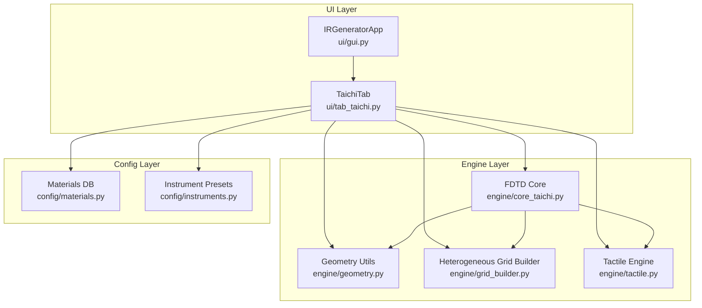
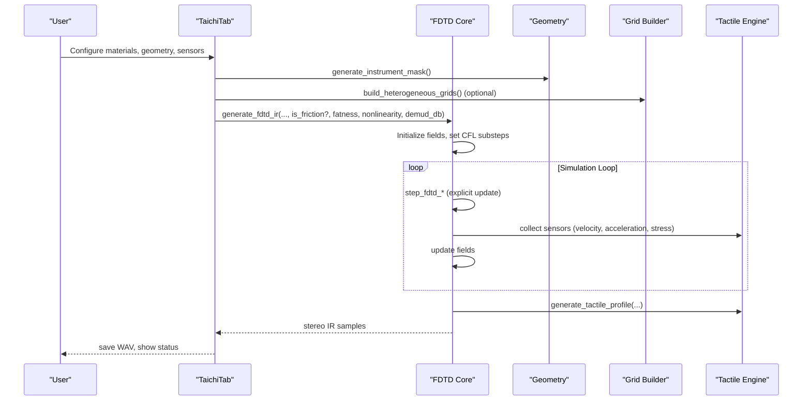
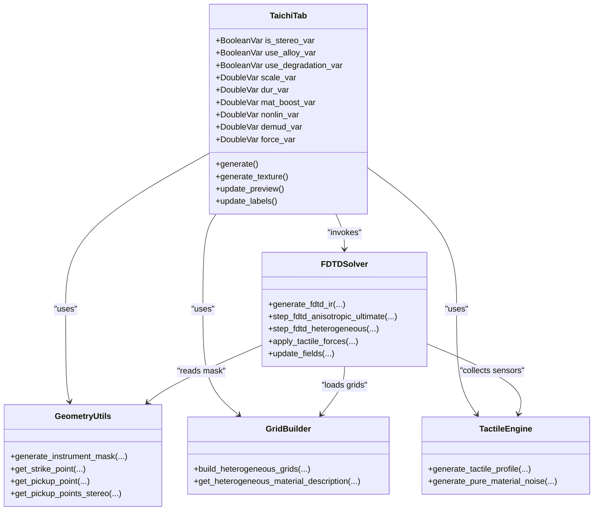
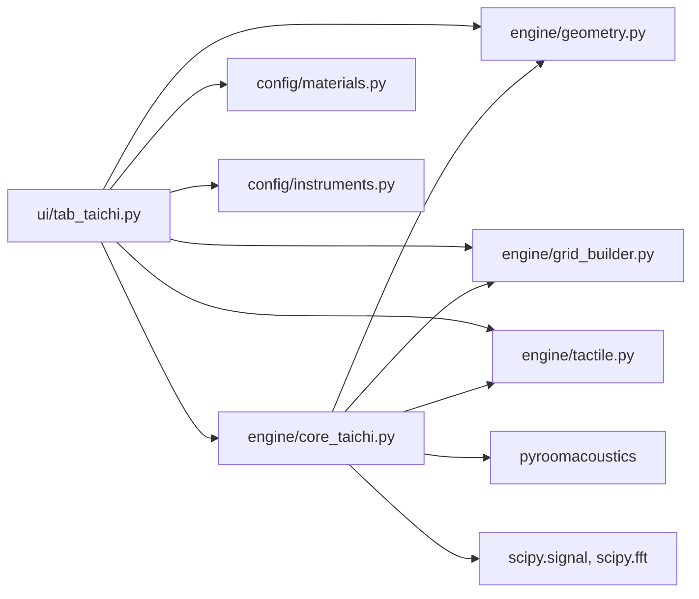

# Taichi FDTD Lab Tab

<cite>
**Referenced Files in This Document**
- [tab_taichi.py](file://ui/tab_taichi.py)
- [core_taichi.py](file://engine/core_taichi.py)
- [grid_builder.py](file://engine/grid_builder.py)
- [geometry.py](file://engine/geometry.py)
- [materials.py](file://config/materials.py)
- [instruments.py](file://config/instruments.py)
- [tactile.py](file://engine/tactile.py)
- [gui.py](file://ui/gui.py)
- [README_tab_taichi.md](file://ui/README_tab_taichi.md)
</cite>

## Table of Contents
1. [Introduction](#introduction)
2. [Project Structure](#project-structure)
3. [Core Components](#core-components)
4. [Architecture Overview](#architecture-overview)
5. [Detailed Component Analysis](#detailed-component-analysis)
6. [Dependency Analysis](#dependency-analysis)
7. [Performance Considerations](#performance-considerations)
8. [Troubleshooting Guide](#troubleshooting-guide)
9. [Conclusion](#conclusion)
10. [Appendices](#appendices)

## Introduction
The Taichi FDTD Lab Tab provides a GPU-accelerated interactive environment for simulating 2D wave propagation in heterogeneous materials and musical instrument geometries. It integrates the Taichi compute backend to solve finite-difference time-domain (FDTD) equations, enabling real-time visualization of acoustic pressure fields while users configure material properties, geometry, boundary conditions, and excitation modes. The tab offers two primary workflows:
- Strike mode: impulse-driven transient response (hammer strikes, mallet impacts)
- Friction mode: bow-like sustained texture synthesis (friction-induced noise)

Users can draw custom strike and pickup locations, adjust material blends and heterogeneity, control nonlinearity and tactile textures, and export resulting stereo impulse responses for convolution reverb and tactile rendering.

## Project Structure
The Taichi FDTD Lab is implemented as a dedicated tab within the main application notebook. The UI tab orchestrates user interactions, previews geometry and material distributions, and delegates computation to the Taichi-based engine.

**Diagram sources**
- [gui.py:1-46](file://ui/gui.py#L1-L46)
- [tab_taichi.py:1-743](file://ui/tab_taichi.py#L1-L743)
- [core_taichi.py:1-717](file://engine/core_taichi.py#L1-L717)
- [geometry.py:1-120](file://engine/geometry.py#L1-L120)
- [grid_builder.py:1-99](file://engine/grid_builder.py#L1-L99)
- [tactile.py:1-250](file://engine/tactile.py#L1-L250)
- [materials.py:1-766](file://config/materials.py#L1-L766)
- [instruments.py:1-279](file://config/instruments.py#L1-L279)

**Section sources**
- [gui.py:1-46](file://ui/gui.py#L1-L46)
- [tab_taichi.py:1-743](file://ui/tab_taichi.py#L1-L743)

## Core Components
- TaichiTab: The main UI controller managing widgets, preview canvases, and orchestration of FDTD runs.
- FDTD Core: GPU-accelerated solver implementing explicit FDTD updates, heterogeneous material support, and optional nonlinear effects.
- Geometry Utilities: Generates instrument masks and default strike/pickup positions based on presets.
- Heterogeneous Grid Builder: Produces spatially varying material fields (density, elastic moduli, loss, viscosity) with anti-resonance smoothing.
- Tactile Engine: Adds physically motivated tactile textures (fibrous, fluid, granular, brittle) derived from internal FDTD sensors.
- Materials and Instrument Databases: Provide physical properties and preset configurations for diverse materials and instrument templates.

Key capabilities:
- Real-time thermal-style visualization during simulation
- Interactive geometry and sensor placement
- Material blending and heterogeneous inclusion modeling
- Nonlinear fracture reactions and tactile textures
- De-mud resonance suppression and room simulation

**Section sources**
- [tab_taichi.py:38-743](file://ui/tab_taichi.py#L38-L743)
- [core_taichi.py:266-717](file://engine/core_taichi.py#L266-L717)
- [geometry.py:17-120](file://engine/geometry.py#L17-L120)
- [grid_builder.py:10-99](file://engine/grid_builder.py#L10-L99)
- [tactile.py:193-250](file://engine/tactile.py#L193-L250)
- [materials.py:18-766](file://config/materials.py#L18-L766)
- [instruments.py:4-279](file://config/instruments.py#L4-L279)

## Architecture Overview
The Taichi FDTD Lab follows a layered architecture:
- UI layer handles user input, preview rendering, and dispatches jobs to the engine.
- Engine layer encapsulates the FDTD solver, geometry processing, heterogeneous grid construction, and tactile post-processing.
- Config layer supplies material and instrument metadata.

**Diagram sources**
- [tab_taichi.py:622-742](file://ui/tab_taichi.py#L622-L742)
- [core_taichi.py:266-717](file://engine/core_taichi.py#L266-L717)
- [geometry.py:17-120](file://engine/geometry.py#L17-L120)
- [grid_builder.py:10-99](file://engine/grid_builder.py#L10-L99)
- [tactile.py:193-250](file://engine/tactile.py#L193-L250)

## Detailed Component Analysis

### TaichiTab: UI Controls and Preview
Responsibilities:
- Build and manage the left panel sliders and right panel canvases.
- Dynamically update preview images for geometry mask and optical heterogeneity map.
- Control experiment options: True stereo, material alloying, gradient viscosity (degradation), nonlinearity, and material detail boost.
- Trigger strike and friction simulations and handle file saving.

Preview pipeline:
- Geometry mask generation and optional custom strike/pickup placement.
- Heterogeneous grid building and RGB visualization of material distribution.
- Real-time thermal-style visualization during simulation via Taichi GUI.

User actions:
- Adjust scale, duration, material detail boost, nonlinearity, de-mud level, and strike force.
- Toggle True Stereo and material blending options.
- Drag sensors on the preview canvas to set strike and pickup positions.

**Section sources**
- [tab_taichi.py:38-743](file://ui/tab_taichi.py#L38-L743)

### FDTD Core: GPU-Accelerated Wave Propagation
Key features:
- Explicit FDTD solvers for isotropic/anisotropic plates and heterogeneous grids.
- Automatic substepping to satisfy CFL stability with adaptive steps per audio sample.
- Sensor-based tactile synthesis using velocity, acceleration, and stress tensors computed from the field.
- Optional nonlinear fracture reactions and viscous yielding thresholds.
- De-mud suppression via spectral peak detection and targeted filtering.
- Room simulation via pyroomacoustics shoebox model.

Physics and numerics:
- Field arrays initialized to zero and updated via stencil-based Laplacian operators.
- Boundary damping and viscosity terms stabilize the solution.
- Optional friction excitation introduces realistic bow-like noise modulation.

Visualization:
- Thermal-style RGB compositing of normalized pressure field overlaid with strike and pickup markers.
- Progress bar overlay indicating simulation completion.

**Section sources**
- [core_taichi.py:43-234](file://engine/core_taichi.py#L43-L234)
- [core_taichi.py:266-717](file://engine/core_taichi.py#L266-L717)

### Geometry Utilities: Mask Generation and Sensor Placement
- generate_instrument_mask: Loads mask images or falls back to procedural shapes based on instrument template type.
- get_strike_point/get_pickup_point/get_pickup_points_stereo: Provide sensible defaults for excitation and pickup locations depending on instrument geometry.

**Section sources**
- [geometry.py:17-120](file://engine/geometry.py#L17-L120)

### Heterogeneous Grid Builder: Material Fields and Anti-Resonance Smoothing
- Builds spatially varying fields for density, longitudinal/transverse elastic moduli, loss, and viscosity.
- Supports inclusions with speck or vein patterns, color-coded for visualization.
- Applies anti-resonance smoothing by injecting controlled viscosity at elastic discontinuities.

**Section sources**
- [grid_builder.py:10-99](file://engine/grid_builder.py#L10-L99)

### Tactile Engine: Physically Motivated Textures
- Fibrous waveshaping, fluid viscoelasticity, granular stutter, and brittle crack emissions.
- Inclusion-aware processing to simulate microstructures.
- Fatness parameter and soft knee limiting to prevent clipping and preserve texture.

**Section sources**
- [tactile.py:46-229](file://engine/tactile.py#L46-L229)

### Materials and Instrument Presets
- Rich database of materials with density, elastic moduli, Poisson ratio, loss factor, viscosity gamma, tactile profiles, and inclusion definitions.
- Instrument presets define geometry templates, mask images, and modal parameters (A0, f0, sympathetic strings, etc.).

**Section sources**
- [materials.py:18-766](file://config/materials.py#L18-L766)
- [instruments.py:4-279](file://config/instruments.py#L4-L279)

## Architecture Overview

**Diagram sources**
- [tab_taichi.py:38-743](file://ui/tab_taichi.py#L38-L743)
- [core_taichi.py:266-717](file://engine/core_taichi.py#L266-L717)
- [geometry.py:17-120](file://engine/geometry.py#L17-L120)
- [grid_builder.py:10-99](file://engine/grid_builder.py#L10-L99)
- [tactile.py:193-250](file://engine/tactile.py#L193-L250)

## Detailed Component Analysis

### Simulation Controls and Parameters
- Grid resolution: Flexible N_grid selection up to a maximum buffer size; automatic CFL substepping scales velocities accordingly.
- Time stepping: Substepping M per audio sample to maintain stability with higher grid resolutions.
- Material detail boost: Amplifies tactile textures and micro-features.
- Nonlinearity: Enables fracture reactions and increased brittleness/granularity.
- De-mud: Spectral suppression targeting dominant resonances to reduce boomy low-frequency buildup.
- Strike force: Scales amplitude of excitation signals.

Boundary conditions:
- Free-field at instrument edges; absorbing boundaries at grid edges.
- Optional heterogeneous grids introduce anti-resonance smoothing at material interfaces.

Real-time visualization:
- Thermal-style pressure field overlay with red strike marker and yellow/purple pickup markers.
- Progress indicator during simulation.

**Section sources**
- [core_taichi.py:282-332](file://engine/core_taichi.py#L282-L332)
- [core_taichi.py:447-521](file://engine/core_taichi.py#L447-L521)
- [tab_taichi.py:437-486](file://ui/tab_taichi.py#L437-L486)

### Material Properties and Blending
- Base materials define density, E_long/E_trans, Poisson ratio, loss_factor, visco_gamma, base_thickness, and tactile profiles.
- blend_materials interpolates scalar properties and merges inclusion lists and tactile profiles.
- Heterogeneous grids are constructed from base material plus inclusions with speck/vein patterns.

**Section sources**
- [materials.py:18-766](file://config/materials.py#L18-L766)
- [grid_builder.py:10-99](file://engine/grid_builder.py#L10-L99)

### Custom Geometry Drawing Tools
- Interactive canvas allows dragging to place strike and pickup points.
- Stereo mode enables separate left/right pickups for phase-accurate binaural cues.
- Preview displays green instrument mask and overlays sensor markers.

**Section sources**
- [tab_taichi.py:222-235](file://ui/tab_taichi.py#L222-L235)
- [tab_taichi.py:333-344](file://ui/tab_taichi.py#L333-L344)
- [tab_taichi.py:350-436](file://ui/tab_taichi.py#L350-L436)

### Practical Examples

- Setting up a strike simulation:
  - Choose instrument preset and material.
  - Adjust geometry scale to change fundamental pitch and decay length.
  - Place strike near rim for bright attack; near center for deeper tone.
  - Enable True Stereo and position pickups for desired stereo width.
  - Run “Generate Strike IR” and save WAV.

- Configuring boundary conditions:
  - Use heterogeneous grids to model composite materials with anti-resonance smoothing.
  - Increase nonlinearity for fracture reactions; adjust de-mud to tame low-end boom.

- Interpreting simulation results:
  - Observe thermal-style visualization to confirm wavefronts and reflections.
  - Export stereo IR and listen for balance between direct and reverberant components.
  - Apply room simulation and compare with and without de-mud.

**Section sources**
- [tab_taichi.py:622-742](file://ui/tab_taichi.py#L622-L742)
- [core_taichi.py:653-717](file://engine/core_taichi.py#L653-L717)

## Dependency Analysis

**Diagram sources**
- [tab_taichi.py:10-14](file://ui/tab_taichi.py#L10-L14)
- [core_taichi.py:4-8](file://engine/core_taichi.py#L4-L8)

**Section sources**
- [tab_taichi.py:10-14](file://ui/tab_taichi.py#L10-L14)
- [core_taichi.py:4-8](file://engine/core_taichi.py#L4-L8)

## Performance Considerations
- GPU acceleration: Taichi kernels execute on GPU; ensure compatible drivers and runtime initialization.
- Grid sizing: Larger N_grid increases fidelity but requires more memory and substeps; use automatic CFL substepping.
- Substepping: M steps per audio sample improve stability for fine grids; monitor CPU/GPU utilization.
- Heterogeneous grids: Anti-resonance smoothing reduces numerical artifacts but adds computation; tune sigma values carefully.
- Visualization: Real-time GUI updates occur at reduced frame rate; disable GUI for headless batch processing.
- Memory: Max buffer size bounds arrays; avoid exceeding N_MAX to prevent overflow.

[No sources needed since this section provides general guidance]

## Troubleshooting Guide
- Taichi initialization failures: Verify runtime availability and driver compatibility; the module attempts to initialize if not ready.
- No sound output: Check that generated IR is saved and not all-zero; ensure demud_db is not suppressing all energy.
- GUI window not appearing: Disable GUI for headless environments or ensure display is available.
- Excessive low-end boom: Increase de-mud_db or reduce nonlinearity; verify material loss_factor and base_thickness.
- Clipping or distortion: Reduce strike_force or material detail boost; apply soft knee limiting in tactile post-processing.

**Section sources**
- [core_taichi.py:14-21](file://engine/core_taichi.py#L14-L21)
- [core_taichi.py:525-592](file://engine/core_taichi.py#L525-L592)

## Conclusion
The Taichi FDTD Lab Tab delivers a powerful, interactive platform for exploring 2D wave propagation in heterogeneous materials. Through precise control of geometry, material properties, and excitation modes—combined with real-time visualization and tactile synthesis—it enables rapid prototyping of instrument IRs and textured friction sounds. By leveraging GPU acceleration and robust numerical stability measures, it balances realism with responsiveness for creative and research applications.

[No sources needed since this section summarizes without analyzing specific files]

## Appendices

### API and Parameter Reference

- Simulation entry points:
  - generate_fdtd_ir: Main function to produce stereo IR with optional friction excitation, heterogeneous grids, and post-processing.
  - generate_tactile_profile: Synthesize tactile textures from internal sensors.

- Geometry helpers:
  - generate_instrument_mask: Load or generate instrument mask.
  - get_strike_point/get_pickup_point/get_pickup_points_stereo: Default sensor positions.

- Material blending:
  - blend_materials: Interpolate two materials with inclusion merging.

- Visualization:
  - Thermal-style RGB compositing overlays markers for strike and pickups.

**Section sources**
- [core_taichi.py:266-717](file://engine/core_taichi.py#L266-L717)
- [geometry.py:17-120](file://engine/geometry.py#L17-L120)
- [materials.py:642-766](file://config/materials.py#L642-L766)
- [tactile.py:193-250](file://engine/tactile.py#L193-L250)