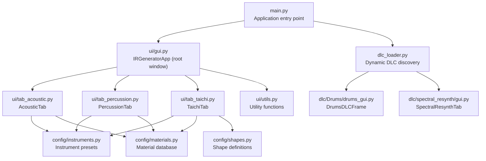
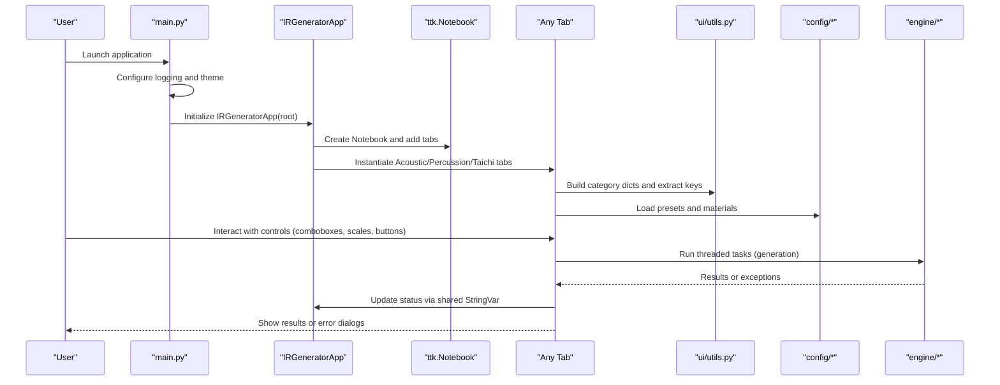
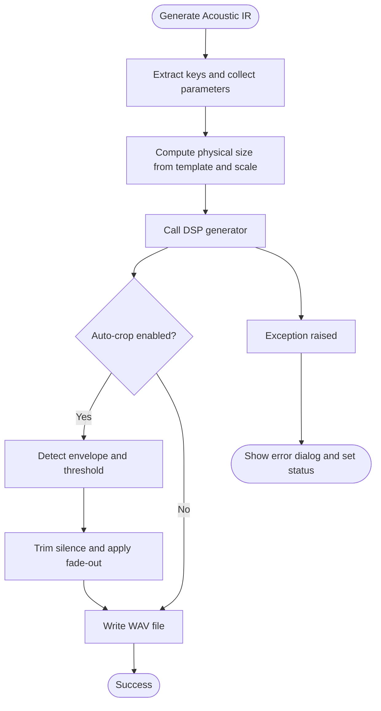
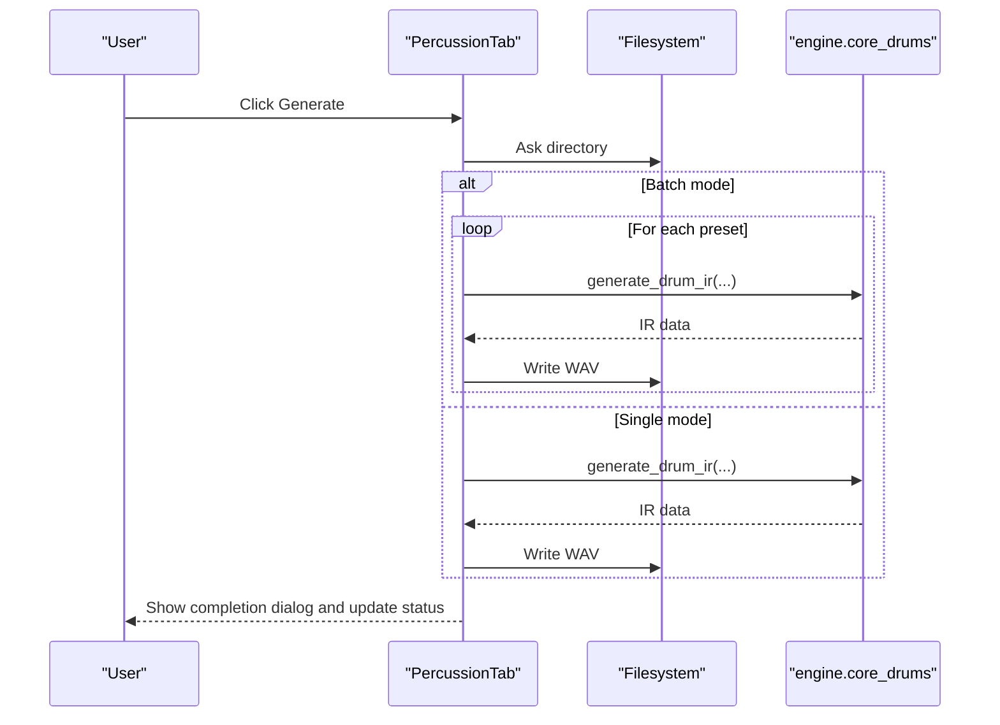
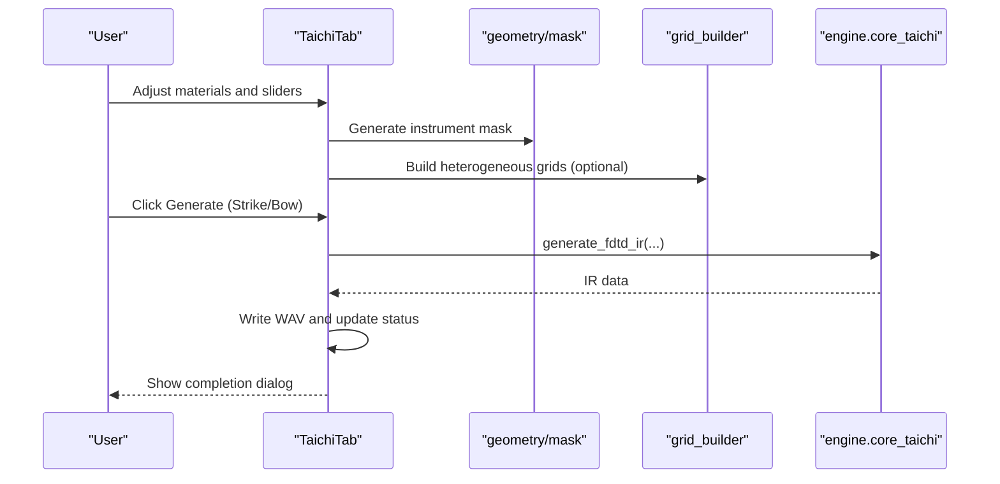
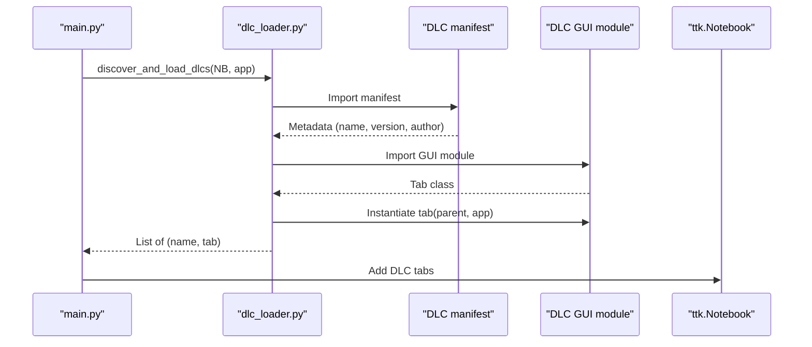
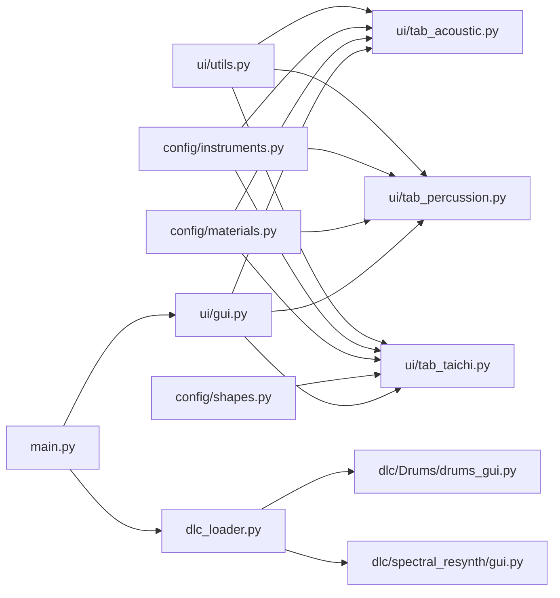

# UI Controls and Navigation

<cite>
**Referenced Files in This Document**
- [main.py](file://main.py)
- [ui/gui.py](file://ui/gui.py)
- [ui/utils.py](file://ui/utils.py)
- [ui/tab_acoustic.py](file://ui/tab_acoustic.py)
- [ui/tab_percussion.py](file://ui/tab_percussion.py)
- [ui/tab_taichi.py](file://ui/tab_taichi.py)
- [config/instruments.py](file://config/instruments.py)
- [config/materials.py](file://config/materials.py)
- [config/shapes.py](file://config/shapes.py)
- [dlc_loader.py](file://dlc_loader.py)
- [dlc/Drums/drums_gui.py](file://dlc/Drums/drums_gui.py)
- [dlc/spectral_resynth/gui.py](file://dlc/spectral_resynth/gui.py)
</cite>

## Table of Contents
1. [Introduction](#introduction)
2. [Project Structure](#project-structure)
3. [Core Components](#core-components)
4. [Architecture Overview](#architecture-overview)
5. [Detailed Component Analysis](#detailed-component-analysis)
6. [Dependency Analysis](#dependency-analysis)
7. [Performance Considerations](#performance-considerations)
8. [Troubleshooting Guide](#troubleshooting-guide)
9. [Conclusion](#conclusion)

## Introduction
This document describes the universal UI controls and navigation patterns used across the application. It covers common control widgets, validation mechanisms, keyboard shortcuts, and drag-and-drop functionality. It explains the status reporting system, progress indicators, and error handling patterns. Utility functions for UI management, parameter validation, and user feedback systems are documented alongside accessibility features, theme support, and interface customization options. Cross-tab data sharing, parameter synchronization, and state management across different interface components are addressed.

## Project Structure
The UI is organized around a central notebook-based layout with dedicated tabs for acoustic modeling, percussion synthesis, and a physics-based FDTD simulation. Dynamic DLC tabs are mounted at runtime, extending the interface with additional capabilities. Shared utilities provide consistent formatting and extraction of material keys from display strings.

**Diagram sources**
- [main.py:23-76](file://main.py#L23-L76)
- [ui/gui.py:8-46](file://ui/gui.py#L8-L46)
- [ui/tab_acoustic.py:17-193](file://ui/tab_acoustic.py#L17-L193)
- [ui/tab_percussion.py:17-144](file://ui/tab_percussion.py#L17-L144)
- [ui/tab_taichi.py:38-743](file://ui/tab_taichi.py#L38-L743)
- [dlc_loader.py:9-62](file://dlc_loader.py#L9-L62)
- [dlc/Drums/drums_gui.py:15-334](file://dlc/Drums/drums_gui.py#L15-L334)
- [dlc/spectral_resynth/gui.py:11-181](file://dlc/spectral_resynth/gui.py#L11-L181)
- [ui/utils.py:2-32](file://ui/utils.py#L2-L32)
- [config/instruments.py:187-279](file://config/instruments.py#L187-L279)
- [config/materials.py:18-766](file://config/materials.py#L18-L766)
- [config/shapes.py:2-7](file://config/shapes.py#L2-L7)

**Section sources**
- [main.py:23-76](file://main.py#L23-L76)
- [ui/gui.py:8-46](file://ui/gui.py#L8-L46)
- [dlc_loader.py:9-62](file://dlc_loader.py#L9-L62)

## Core Components
- Root application controller: Creates the main window, sets up the theme, and mounts dynamic DLC tabs.
- Notebook container: Hosts acoustic, percussion, and Taichi tabs; dynamically adds DLC tabs.
- Status bar: Centralized status reporting shared across tabs.
- Tabbed UIs: Each tab encapsulates controls, sliders, comboboxes, buttons, and preview canvases.
- Utilities: Category building, material display formatting, and key extraction helpers.

Key UI patterns:
- Comboboxes with category dictionaries built from configuration databases.
- Scale widgets with live label updates reflecting computed physical parameters.
- Checkbuttons toggling advanced options with dynamic widget enable/disable logic.
- Buttons triggering threaded tasks with progress bars and status updates.
- Drag-and-drop file lists for batch processing.

**Section sources**
- [ui/gui.py:8-46](file://ui/gui.py#L8-L46)
- [ui/utils.py:2-32](file://ui/utils.py#L2-L32)
- [ui/tab_acoustic.py:24-124](file://ui/tab_acoustic.py#L24-L124)
- [ui/tab_percussion.py:24-114](file://ui/tab_percussion.py#L24-L114)
- [ui/tab_taichi.py:75-279](file://ui/tab_taichi.py#L75-L279)

## Architecture Overview
The application follows a modular notebook architecture:
- The root creates a themed ttk Style and initializes the IRGeneratorApp.
- The app builds a Notebook and adds three core tabs plus any DLC tabs discovered at runtime.
- Tabs share a single status StringVar to report progress and errors.
- Tabs coordinate parameter updates via variable traces and callbacks.

**Diagram sources**
- [main.py:23-76](file://main.py#L23-L76)
- [ui/gui.py:27-46](file://ui/gui.py#L27-L46)
- [ui/tab_acoustic.py:126-193](file://ui/tab_acoustic.py#L126-L193)
- [ui/tab_percussion.py:80-114](file://ui/tab_percussion.py#L80-L114)
- [ui/tab_taichi.py:622-743](file://ui/tab_taichi.py#L622-L743)
- [ui/utils.py:2-32](file://ui/utils.py#L2-L32)
- [config/instruments.py:187-279](file://config/instruments.py#L187-L279)
- [config/materials.py:18-766](file://config/materials.py#L18-L766)

## Detailed Component Analysis

### Universal UI Controls and Patterns
- Comboboxes: Used for instrument/material selection with category grouping and display formatting.
- Scales: Continuous sliders for geometry, duration, material detail boost, nonlinearity, de-mud, and force parameters with real-time label updates.
- Checkbuttons: Enable/disable advanced options (auto-crop, stereo capture, alloy blending, degradation).
- Buttons: Trigger generation tasks; include specialized styles for emphasis.
- Progress indicators: ttk.Progressbar for batch rendering; status StringVar for textual feedback.
- Drag-and-drop: File lists accept dropped files via tkinterdnd2.

Validation and parameter extraction:
- Keys are extracted from display strings formatted as "Name [key]".
- Category dictionaries group presets by human-readable categories.
- Preset and material descriptions are shown to inform user choices.

Status reporting:
- A shared StringVar updates the status bar across all tabs.
- Tasks set the status before long-running operations and revert to success/error messages upon completion.

**Section sources**
- [ui/utils.py:2-32](file://ui/utils.py#L2-L32)
- [ui/gui.py:23-46](file://ui/gui.py#L23-L46)
- [ui/tab_acoustic.py:24-124](file://ui/tab_acoustic.py#L24-L124)
- [ui/tab_percussion.py:24-114](file://ui/tab_percussion.py#L24-L114)
- [ui/tab_taichi.py:75-279](file://ui/tab_taichi.py#L75-L279)
- [dlc/spectral_resynth/gui.py:50-54](file://dlc/spectral_resynth/gui.py#L50-L54)

### Acoustic Tab
Purpose: Generate acoustic impulse responses for instruments and spaces with automatic cropping.

Controls:
- Instrument selection (category-aware combobox).
- Material selection for soundboard/walls.
- Geometry scale slider with computed physical size labeling.
- Duration slider for maximum tail length.
- Microphone distance slider with contextual labels.
- Auto-crop checkbox.
- Generate button initiating threaded task.

Processing logic:
- Extracts keys from display strings.
- Computes physical size based on instrument template and scale.
- Calls DSP engine to generate IR.
- Applies auto-cropping using envelope detection and fade-out.
- Saves WAV and updates status and message box.

**Diagram sources**
- [ui/tab_acoustic.py:126-193](file://ui/tab_acoustic.py#L126-L193)

**Section sources**
- [ui/tab_acoustic.py:17-193](file://ui/tab_acoustic.py#L17-L193)

### Percussion Tab
Purpose: Generate drum impulse responses with batch export capability.

Controls:
- Instrument selection (category-aware combobox).
- Shell, head, and wire material selections.
- Size and duration sliders.
- Snare rattle toggle and batch export checkbox.
- Generate button.

Processing logic:
- Validates directory selection.
- Runs single or batch generation depending on checkbox.
- Calls drum engine with selected materials and parameters.
- Writes WAV files and updates status and message box.

**Diagram sources**
- [ui/tab_percussion.py:80-114](file://ui/tab_percussion.py#L80-L114)

**Section sources**
- [ui/tab_percussion.py:17-144](file://ui/tab_percussion.py#L17-L144)

### Taichi FDTD Tab
Purpose: Interactive FDTD simulation for impulse response generation with visual previews and material blending.

Controls:
- Instrument/preset selection.
- Base and optional second material selection with alloy blending.
- Geometry, duration, material detail boost, nonlinearity, de-mud, and force sliders.
- True stereo toggle and degradation controls.
- Strike/pickup point editing with canvas interaction.
- Resonance targets with note-to-frequency conversion.
- Purple and green buttons for strike and bow texture generation.

Processing logic:
- Builds heterogeneous grids from masks and materials.
- Updates preview canvases and optical mask displays.
- Generates IR via FDTD engine and saves WAV.
- Handles abort signals during batch rendering.

**Diagram sources**
- [ui/tab_taichi.py:350-436](file://ui/tab_taichi.py#L350-L436)
- [ui/tab_taichi.py:622-743](file://ui/tab_taichi.py#L622-L743)

**Section sources**
- [ui/tab_taichi.py:38-743](file://ui/tab_taichi.py#L38-L743)

### Utility Functions for UI Management
- Category dictionary builder: Groups presets by category for combobox population.
- Material display formatters: Formats entries as "Name [key]" and extracts keys.
- These utilities ensure consistent UI behavior across tabs and DLC modules.

**Section sources**
- [ui/utils.py:2-32](file://ui/utils.py#L2-L32)

### Configuration Databases
- Instruments: Presets and templates define geometry, resonance, and categories.
- Materials: Physics properties, tactile profiles, and inclusion definitions.
- Shapes: Shape definitions referenced by geometry modules.

These databases drive combobox values and parameter computations across tabs.

**Section sources**
- [config/instruments.py:187-279](file://config/instruments.py#L187-L279)
- [config/materials.py:18-766](file://config/materials.py#L18-L766)
- [config/shapes.py:2-7](file://config/shapes.py#L2-L7)

### Dynamic DLC Integration
- Discovery scans the dlc/ directory for manifests and loads GUI modules.
- Each DLC tab is instantiated with a reference to the main app and added to the notebook.
- Supports both standalone tabs and composite widgets (e.g., a Notebook-based DLC).

**Diagram sources**
- [dlc_loader.py:9-62](file://dlc_loader.py#L9-L62)
- [main.py:44-71](file://main.py#L44-L71)

**Section sources**
- [dlc_loader.py:9-62](file://dlc_loader.py#L9-L62)
- [dlc/Drums/drums_gui.py:15-334](file://dlc/Drums/drums_gui.py#L15-L334)
- [dlc/spectral_resynth/gui.py:11-181](file://dlc/spectral_resynth/gui.py#L11-L181)

## Dependency Analysis
- Tabs depend on shared utilities for consistent key extraction and formatting.
- Tabs depend on configuration databases for presets and materials.
- Taichi tab additionally depends on geometry and grid-builder modules.
- Root application depends on the notebook scanning utility to mount DLC tabs.

**Diagram sources**
- [ui/utils.py:2-32](file://ui/utils.py#L2-L32)
- [ui/tab_acoustic.py:12-16](file://ui/tab_acoustic.py#L12-L16)
- [ui/tab_percussion.py:12-16](file://ui/tab_percussion.py#L12-L16)
- [ui/tab_taichi.py:10-15](file://ui/tab_taichi.py#L10-L15)
- [config/instruments.py:187-279](file://config/instruments.py#L187-L279)
- [config/materials.py:18-766](file://config/materials.py#L18-L766)
- [config/shapes.py:2-7](file://config/shapes.py#L2-L7)
- [main.py:23-76](file://main.py#L23-L76)
- [ui/gui.py:27-46](file://ui/gui.py#L27-L46)
- [dlc_loader.py:9-62](file://dlc_loader.py#L9-L62)
- [dlc/Drums/drums_gui.py:15-334](file://dlc/Drums/drums_gui.py#L15-L334)
- [dlc/spectral_resynth/gui.py:11-181](file://dlc/spectral_resynth/gui.py#L11-L181)

**Section sources**
- [ui/utils.py:2-32](file://ui/utils.py#L2-L32)
- [ui/tab_acoustic.py:12-16](file://ui/tab_acoustic.py#L12-L16)
- [ui/tab_percussion.py:12-16](file://ui/tab_percussion.py#L12-L16)
- [ui/tab_taichi.py:10-15](file://ui/tab_taichi.py#L10-L15)
- [config/instruments.py:187-279](file://config/instruments.py#L187-L279)
- [config/materials.py:18-766](file://config/materials.py#L18-L766)
- [config/shapes.py:2-7](file://config/shapes.py#L2-L7)
- [main.py:23-76](file://main.py#L23-L76)
- [ui/gui.py:27-46](file://ui/gui.py#L27-L46)
- [dlc_loader.py:9-62](file://dlc_loader.py#L9-L62)
- [dlc/Drums/drums_gui.py:15-334](file://dlc/Drums/drums_gui.py#L15-L334)
- [dlc/spectral_resynth/gui.py:11-181](file://dlc/spectral_resynth/gui.py#L11-L181)

## Performance Considerations
- Long-running tasks run on separate threads to keep the UI responsive.
- Progress bars reflect cumulative progress across multiple files in batch modes.
- Auto-cropping trims silence with padding and fade-out to preserve audio quality.
- FDTD simulations use a fixed grid size and adjustable duration; larger durations increase computation time.
- Material blending and heterogeneous grids add computational overhead; use judiciously.

[No sources needed since this section provides general guidance]

## Troubleshooting Guide
Common issues and resolutions:
- No Notebook found: The root scans the widget tree and app attributes to locate the notebook for mounting DLC tabs. If neither is found, a critical error is logged and DLC mounting is skipped.
- Generation failures: Exceptions during generation are caught, logged, and surfaced via message boxes. Status is updated accordingly.
- Aborting renders: Some tabs support abort flags to stop rendering while preserving partial results.
- Drag-and-drop not working: Ensure tkinterdnd2 is installed and the listbox is registered as a drop target.

**Section sources**
- [main.py:44-71](file://main.py#L44-L71)
- [ui/tab_acoustic.py:187-190](file://ui/tab_acoustic.py#L187-L190)
- [ui/tab_percussion.py:109-112](file://ui/tab_percussion.py#L109-L112)
- [dlc/Drums/drums_gui.py:157-162](file://dlc/Drums/drums_gui.py#L157-L162)
- [dlc/spectral_resynth/gui.py:50-54](file://dlc/spectral_resynth/gui.py#L50-L54)

## Conclusion
The application’s UI is structured around a shared notebook with consistent controls, status reporting, and error handling. Tabs encapsulate domain-specific workflows while leveraging shared utilities and configuration databases. Dynamic DLC integration extends functionality seamlessly. The design balances usability with performance, using threading, progress indicators, and trimming to manage long-running tasks effectively.