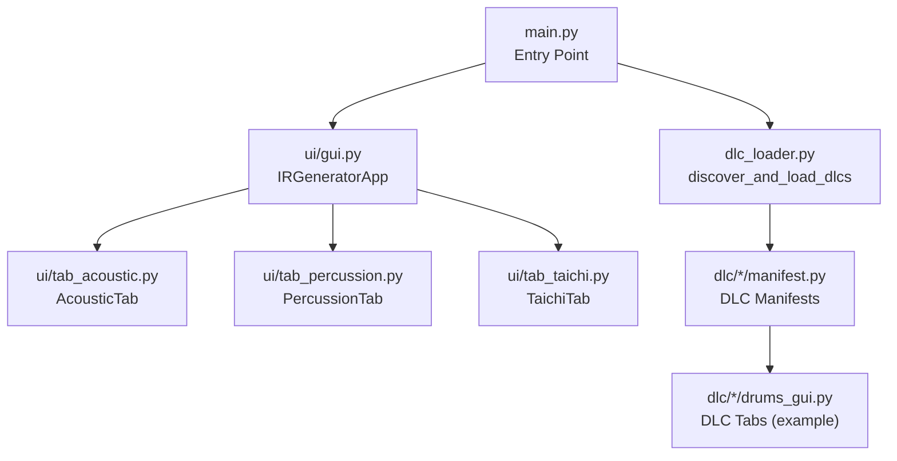
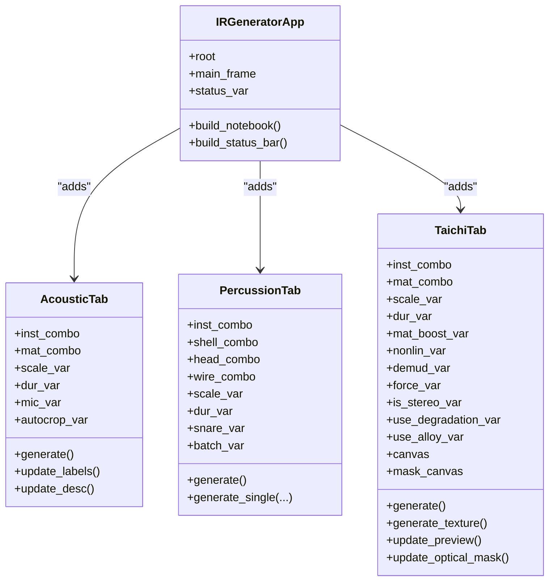
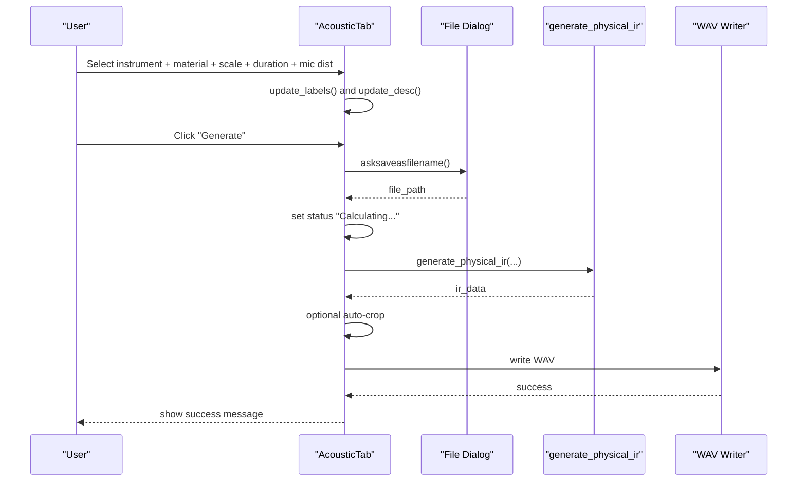
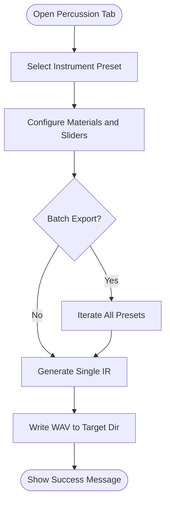
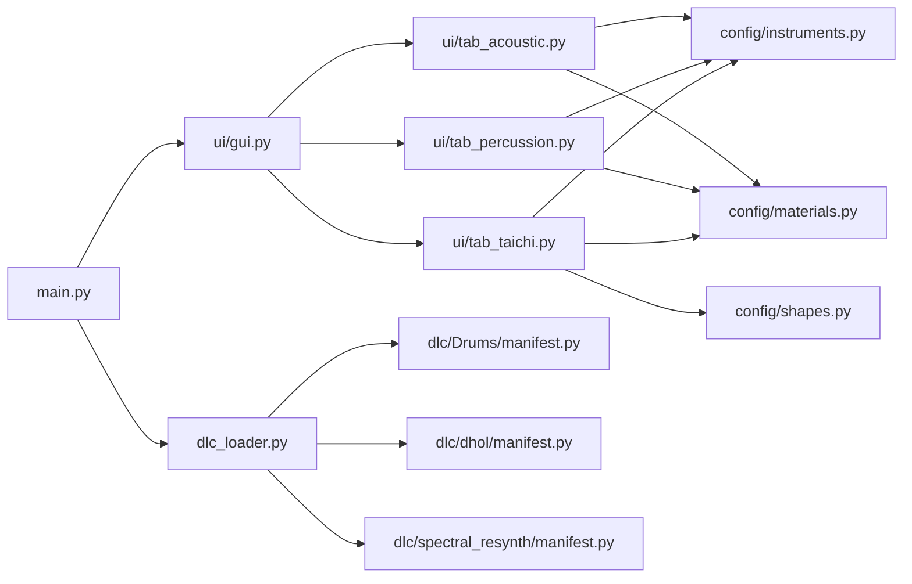

# User Interface Guide

<cite>
**Referenced Files in This Document**
- [main.py](file://main.py)
- [ui/gui.py](file://ui/gui.py)
- [ui/tab_acoustic.py](file://ui/tab_acoustic.py)
- [ui/tab_percussion.py](file://ui/tab_percussion.py)
- [ui/tab_taichi.py](file://ui/tab_taichi.py)
- [ui/utils.py](file://ui/utils.py)
- [config/instruments.py](file://config/instruments.py)
- [config/materials.py](file://config/materials.py)
- [config/shapes.py](file://config/shapes.py)
- [dlc_loader.py](file://dlc_loader.py)
- [dlc/Drums/manifest.py](file://dlc/Drums/manifest.py)
- [dlc/dhol/manifest.py](file://dlc/dhol/manifest.py)
- [dlc/spectral_resynth/manifest.py](file://dlc/spectral_resynth/manifest.py)
- [ui/README_tab_taichi.md](file://ui/README_tab_taichi.md)
</cite>

## Table of Contents
1. [Introduction](#introduction)
2. [Project Structure](#project-structure)
3. [Core Components](#core-components)
4. [Architecture Overview](#architecture-overview)
5. [Detailed Component Analysis](#detailed-component-analysis)
6. [Dependency Analysis](#dependency-analysis)
7. [Performance Considerations](#performance-considerations)
8. [Troubleshooting Guide](#troubleshooting-guide)
9. [Conclusion](#conclusion)
10. [Appendices](#appendices)

## Introduction
This guide documents the user interface of TroakarIR’s Tkinter-based desktop application. It explains the main window layout, tabbed interface organization, navigation patterns, and how each tab transforms user inputs into physical simulations. It also covers parameter controls, real-time preview systems, visualization components, export workflows, keyboard shortcuts, drag-and-drop features, accessibility considerations, customization options, and performance monitoring.

## Project Structure
The application is organized around a central notebook-based UI with three primary tabs plus optional DLC tabs. The main entry point initializes the window, applies a theme, builds the core tabs, and dynamically mounts DLC plugins discovered at runtime.



**Diagram sources**
- [main.py:23-73](file://main.py#L23-L73)
- [ui/gui.py:8-37](file://ui/gui.py#L8-L37)
- [dlc_loader.py:9-61](file://dlc_loader.py#L9-L61)

**Section sources**
- [main.py:23-73](file://main.py#L23-L73)
- [ui/gui.py:8-37](file://ui/gui.py#L8-L37)
- [dlc_loader.py:9-61](file://dlc_loader.py#L9-L61)

## Core Components
- Main Window and Layout
  - Root window with fixed minimum size and responsive grid layout.
  - Central frame with weighted rows/columns for flexible resizing.
  - Status bar with a dynamic status variable for user feedback.
- Tabbed Interface
  - Notebook container holds three core tabs and dynamically mounted DLC tabs.
  - Tabs are labeled in Russian: “Акустика” (Acoustics), “Ударные” (Percussion), and “Taichi FDTD Лаборатория” (Taichi FDTD Lab).
- Status Bar
  - Grayed informational label bound to a shared StringVar for global status updates.

**Section sources**
- [ui/gui.py:8-46](file://ui/gui.py#L8-L46)
- [main.py:34-73](file://main.py#L34-L73)

## Architecture Overview
The UI architecture follows a composition pattern:
- The main controller creates the window and notebook.
- Each tab encapsulates its own controls, previews, and export logic.
- Shared configuration modules supply presets and material definitions.
- The DLC loader scans a dedicated folder and injects additional tabs at runtime.



**Diagram sources**
- [ui/gui.py:8-37](file://ui/gui.py#L8-L37)
- [ui/tab_acoustic.py:17-193](file://ui/tab_acoustic.py#L17-L193)
- [ui/tab_percussion.py:17-144](file://ui/tab_percussion.py#L17-L144)
- [ui/tab_taichi.py:34-735](file://ui/tab_taichi.py#L34-L735)

## Detailed Component Analysis

### Acoustic Tab (Modal Synthesis and Material Exploration)
Purpose
- Generate impulse responses for acoustic spaces and string/wind instrument bodies using modal synthesis.
Key Controls
- Instrument selector with category grouping and descriptions.
- Material selector for top/bodies with descriptions.
- Geometry scale slider with live unit conversion (millimeters, centimeters, meters).
- Duration slider for maximum tail length.
- Microphone distance slider with contextual labels (“Close-field”, “Far-field”).
- Auto-crop checkbox to remove silent tails.
- Generate button initiates asynchronous generation.
Real-time Preview and Feedback
- Descriptive labels update instantly when selections change.
- Status bar reflects calculation progress.
Export Workflow
- Save dialog prompts for filename; writes WAV at 44.1 kHz, 32-bit float.
- Auto-crop post-processing trims silence with padding and fade.
Navigation Patterns
- Selection-driven updates via combobox events trigger immediate label refresh.
- Keyboard focus moves predictably through sliders and buttons.



**Diagram sources**
- [ui/tab_acoustic.py:126-193](file://ui/tab_acoustic.py#L126-L193)

**Section sources**
- [ui/tab_acoustic.py:17-193](file://ui/tab_acoustic.py#L17-L193)
- [config/instruments.py:177-279](file://config/instruments.py#L177-L279)
- [config/materials.py:18-766](file://config/materials.py#L18-L766)

### Percussion Tab (Drum and Cymbal Physics)
Purpose
- Generate impulse responses for drums, cymbals, and metallic objects using drum-specific synthesis.
Key Controls
- Instrument selector (drums, cymbals, metallic, special, lab).
- Shell, head, and wire material selectors.
- Size and decay sliders.
- Snare rattle toggle and batch export option.
- Generate button triggers single or batch export.
Real-time Preview and Feedback
- Description label updates per instrument selection.
- Status bar indicates progress; completion shows a success dialog.
Export Workflow
- Directory selection; generates one or all presets depending on batch mode.
- Writes individual WAV files at 44.1 kHz, 32-bit float.
Navigation Patterns
- Combobox selection drives description updates.
- Batch mode enables bulk processing for reproducible experiments.



**Diagram sources**
- [ui/tab_percussion.py:80-144](file://ui/tab_percussion.py#L80-L144)

**Section sources**
- [ui/tab_percussion.py:17-144](file://ui/tab_percussion.py#L17-L144)
- [config/instruments.py:103-178](file://config/instruments.py#L103-L178)
- [config/materials.py:18-766](file://config/materials.py#L18-L766)

### Taichi Lab (FDTD Simulation)
Purpose
- Interactive 2D FDTD simulation for musical instruments and objects with real-time visualization.
Layout and Panels
- Left panel: instrument/material selection, geometry scale, render duration, material detail boost, nonlinearity, de-mud, force, and two generation buttons (Strike and Bow).
- Right panel: interactive canvas for strike/pickup placement, optical mask visualization, experiment options (True Stereo, Degradation, Alloy).
- Resonance display: target lowest string and Helmholtz A0 controls with note entry.
Interactive Features
- Drag-and-drop-like click-and-place on the canvas to set strike and pickup positions (mono/stereo).
- Real-time preview updates geometry mask and sensor locations.
- Optical mask shows heterogeneous material distribution and sensor overlays.
- Alloy blending toggles second material and ratio slider.
- Degradation toggles gradient depth slider.
- True Stereo toggles dual pickup modes.
- Nonlinearity, de-mud, and material detail boost sliders adjust simulation characteristics.
- Force slider scales impact pressure.
- Resonance tuning: enter target frequency or note to compute new scale.
Export Workflow
- Save dialogs for Strike and Bow modes; writes WAV at 44.1 kHz, 32-bit float.
- Uses Taichi kernels for time-domain wave propagation with optional friction.
Status and Progress
- Status bar displays kernel launch messages and completion notifications.
- Heat map visualization appears during rendering.

```mermaid
sequenceDiagram
participant U as "User"
participant TT as "TaichiTab"
participant CAN as "Canvas"
participant OPT as "Optical Mask"
participant ENG as "generate_fdtd_ir"
participant IO as "WAV Writer"
U->>TT : Select instrument + materials + scale + options
TT->>CAN : update_preview()
CAN-->>TT : draw mask + sensors
TT->>OPT : update_optical_mask()
OPT-->>TT : draw heterogeneous grids
U->>TT : Click on canvas to place sensors
TT->>TT : update_preview() and update_optical_mask()
U->>TT : Press "Generate Strike" or "Generate Texture"
TT->>ENG : generate_fdtd_ir(..., is_friction=...)
ENG-->>TT : ir_data
TT->>IO : write WAV
IO-->>TT : success
TT-->>U : show success message
```

**Diagram sources**
- [ui/tab_taichi.py:342-428](file://ui/tab_taichi.py#L342-L428)
- [ui/tab_taichi.py:614-735](file://ui/tab_taichi.py#L614-L735)

**Section sources**
- [ui/tab_taichi.py:34-735](file://ui/tab_taichi.py#L34-L735)
- [ui/README_tab_taichi.md:1-119](file://ui/README_tab_taichi.md#L1-L119)
- [config/instruments.py:3-101](file://config/instruments.py#L3-L101)
- [config/materials.py:642-766](file://config/materials.py#L642-L766)

### Navigation Patterns and Keyboard Shortcuts
- Tab Switching
  - Use mouse clicks on tab headers or Ctrl+Tab/Ctrl+Shift+Tab to cycle tabs.
- Focus Movement
  - Tab key navigates through widgets; Shift+Tab reverses direction.
- Accelerators
  - No explicit menu accelerators are defined in the provided code; rely on default Tk behavior.
- Accessibility
  - All interactive widgets are standard ttk controls with automatic focus order.
  - Status bar provides textual feedback for current operation.

**Section sources**
- [ui/gui.py:27-46](file://ui/gui.py#L27-L46)
- [ui/tab_acoustic.py:74-76](file://ui/tab_acoustic.py#L74-L76)
- [ui/tab_percussion.py:73-74](file://ui/tab_percussion.py#L73-L74)

### Drag-and-Drop Features
- Canvas Interaction
  - Click-and-drag on the left canvas sets strike and pickup positions.
  - Edit mode toggles between “Strike”, “Pickup L”, and “Pickup R”.
- Automatic Reset
  - Changing presets resets sensor positions to defaults.
- Export Paths
  - Save dialogs prompt for filenames; Taichi uses separate dialogs for Strike and Bow modes.

**Section sources**
- [ui/tab_taichi.py:325-337](file://ui/tab_taichi.py#L325-L337)
- [ui/tab_taichi.py:319-324](file://ui/tab_taichi.py#L319-L324)
- [ui/tab_taichi.py:628-629](file://ui/tab_taichi.py#L628-L629)
- [ui/tab_taichi.py:687-690](file://ui/tab_taichi.py#L687-L690)

### Parameter Controls and Real-time Preview Systems
- Live Labels
  - Scale, duration, material detail boost, nonlinearity, de-mud, and force sliders update descriptive labels immediately.
- Resonance Tuning
  - Enter target frequency or note to compute new scale; updates preview and labels.
- Material Descriptions
  - Optical mask and description text reflect selected material properties and blends.

**Section sources**
- [ui/tab_acoustic.py:88-124](file://ui/tab_acoustic.py#L88-L124)
- [ui/tab_percussion.py:76-78](file://ui/tab_percussion.py#L76-L78)
- [ui/tab_taichi.py:429-477](file://ui/tab_taichi.py#L429-L477)
- [ui/tab_taichi.py:495-566](file://ui/tab_taichi.py#L495-L566)

### Export Functionality
- Acoustic Tab
  - Single-file export; optional auto-crop applied before writing.
- Percussion Tab
  - Single or batch export; saves to a chosen directory.
- Taichi Lab
  - Separate dialogs for Strike and Bow modes; writes WAV after simulation.

**Section sources**
- [ui/tab_acoustic.py:134-193](file://ui/tab_acoustic.py#L134-L193)
- [ui/tab_percussion.py:90-144](file://ui/tab_percussion.py#L90-L144)
- [ui/tab_taichi.py:614-735](file://ui/tab_taichi.py#L614-L735)

### Practical Workflows
- Acoustic Spaces
  - Choose an instrument preset (e.g., “Space Cathedral”), adjust geometry scale to desired room size, set microphone distance for near/far field, enable auto-crop, and export.
- Drums and Cymbals
  - Pick a drum/cymbal preset, select shell/head/wire materials, tune size and decay, optionally enable snare rattle, and export either single or batch.
- Taichi FDTD
  - Select instrument and material, adjust scale and render duration, place sensors on the canvas, toggle stereo/degradation/alloy, and generate Strike or Bow IR.

**Section sources**
- [config/instruments.py:177-279](file://config/instruments.py#L177-L279)
- [config/instruments.py:103-178](file://config/instruments.py#L103-L178)
- [config/materials.py:18-766](file://config/materials.py#L18-L766)

### Interface Customization Options
- True Stereo
  - Enables dual-pickup recording for spatial IRs.
- Degradation
  - Adds gradient viscosity for varied damping profiles.
- Alloy Blending
  - Mixes two materials with adjustable ratios; affects optical mask and material description.
- Material Detail Boost
  - Increases perceived texture and harmonic complexity.
- Nonlinearity
  - Introduces controlled fracture-like reactivity.
- De-mud
  - Reduces low-frequency muddiness in the IR.

**Section sources**
- [ui/tab_taichi.py:236-266](file://ui/tab_taichi.py#L236-L266)
- [ui/tab_taichi.py:293-314](file://ui/tab_taichi.py#L293-L314)
- [ui/tab_taichi.py:315-324](file://ui/tab_taichi.py#L315-L324)
- [config/materials.py:642-766](file://config/materials.py#L642-L766)

### Performance Monitoring Features
- Status Bar
  - Reflects current operation (e.g., kernel launch, completion).
- Heat Map Visualization
  - Real-time Taichi heat map during FDTD rendering.
- Render Duration Control
  - Longer durations capture more resonances but increase computation time.

**Section sources**
- [ui/tab_taichi.py:631-632](file://ui/tab_taichi.py#L631-L632)
- [ui/tab_taichi.py:666-668](file://ui/tab_taichi.py#L666-L668)

## Dependency Analysis
The UI depends on configuration modules for presets and material definitions. The main entry point dynamically discovers and loads DLC tabs, extending the notebook at runtime.



**Diagram sources**
- [main.py:23-73](file://main.py#L23-L73)
- [ui/gui.py:8-37](file://ui/gui.py#L8-L37)
- [dlc_loader.py:9-61](file://dlc_loader.py#L9-L61)
- [dlc/Drums/manifest.py:1-8](file://dlc/Drums/manifest.py#L1-L8)
- [dlc/dhol/manifest.py:1-9](file://dlc/dhol/manifest.py#L1-L9)
- [dlc/spectral_resynth/manifest.py:1-8](file://dlc/spectral_resynth/manifest.py#L1-L8)
- [config/instruments.py:1-279](file://config/instruments.py#L1-L279)
- [config/materials.py:1-766](file://config/materials.py#L1-L766)
- [config/shapes.py:1-8](file://config/shapes.py#L1-L8)

**Section sources**
- [main.py:23-73](file://main.py#L23-L73)
- [dlc_loader.py:9-61](file://dlc_loader.py#L9-L61)
- [config/instruments.py:1-279](file://config/instruments.py#L1-L279)
- [config/materials.py:1-766](file://config/materials.py#L1-L766)
- [config/shapes.py:1-8](file://config/shapes.py#L1-L8)

## Performance Considerations
- Rendering Complexity
  - Larger geometry scales and longer durations increase computational load.
- Material Complexity
  - Inclusions and heterogeneous grids add cost; consider disabling for quick iterations.
- Preview Updates
  - Frequent updates to sliders trigger preview recalculations; reduce unnecessary adjustments during long sessions.
- Export Post-processing
  - Auto-crop trims tails but adds extra processing; disable for speed if manual trimming is acceptable.

[No sources needed since this section provides general guidance]

## Troubleshooting Guide
Common Issues and Resolutions
- Kernel Launch Failures (Taichi)
  - Verify Taichi backend availability; check status messages indicating kernel launch.
  - Reduce render duration or disable advanced options (degradation, nonlinearity) temporarily.
- Silent or Dead IRs
  - Adjust microphone/strike positions; ensure sensors are inside the instrument mask.
  - Increase material detail boost or force to improve signal strength.
- Slow Performance
  - Lower geometry scale or duration; disable optical mask and preview updates during heavy runs.
- Export Errors
  - Confirm write permissions for target location; ensure sufficient disk space.
- DLC Mounting Failures
  - Check manifest entries and GUI class names; review logs for import errors.

**Section sources**
- [ui/tab_taichi.py:631-632](file://ui/tab_taichi.py#L631-L632)
- [ui/tab_taichi.py:669-671](file://ui/tab_taichi.py#L669-L671)
- [dlc_loader.py:59-61](file://dlc_loader.py#L59-L61)

## Conclusion
TroakarIR’s UI offers a structured, interactive pathway from physical intuition to digital impulse responses. The Acoustic tab enables modal exploration, the Percussion tab streamlines drum and cymbal IR creation, and the Taichi Lab provides deep, real-time insight into FDTD dynamics. With robust export workflows, customizable options, and runtime extensibility via DLCs, the interface supports both rapid prototyping and detailed experimentation.

[No sources needed since this section summarizes without analyzing specific files]

## Appendices

### Appendix A: Preset and Material Categories
- Instruments
  - Strings (bowed/plucked), wind horns, 3D spaces, industrial anomalies, lab testing.
- Materials
  - Wood, metal, bio, polymer, mineral, synthetic; with tactile profiles and inclusions.
- Shapes
  - Square plate, circular membrane, cello-style outline, zurna bell.

**Section sources**
- [config/instruments.py:177-279](file://config/instruments.py#L177-L279)
- [config/materials.py:9-766](file://config/materials.py#L9-L766)
- [config/shapes.py:1-8](file://config/shapes.py#L1-L8)

### Appendix B: DLC Plugin Architecture
- Discovery
  - Scans the dlc/ directory for manifests and loads GUI classes dynamically.
- Mounting
  - Injects plugin tabs into the main notebook with prefixed labels.

**Section sources**
- [dlc_loader.py:9-61](file://dlc_loader.py#L9-L61)
- [dlc/Drums/manifest.py:1-8](file://dlc/Drums/manifest.py#L1-L8)
- [dlc/dhol/manifest.py:1-9](file://dlc/dhol/manifest.py#L1-L9)
- [dlc/spectral_resynth/manifest.py:1-8](file://dlc/spectral_resynth/manifest.py#L1-L8)