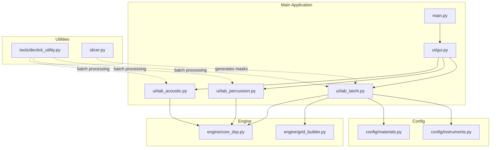
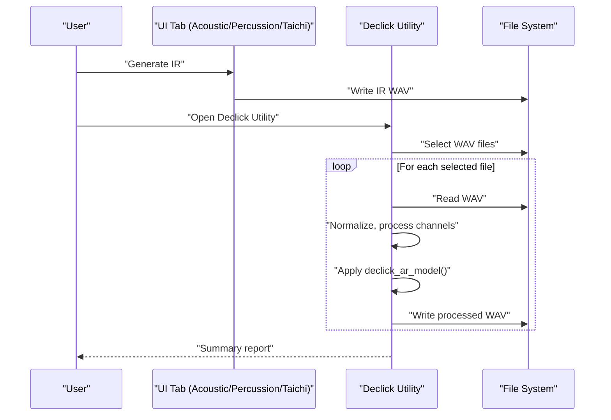
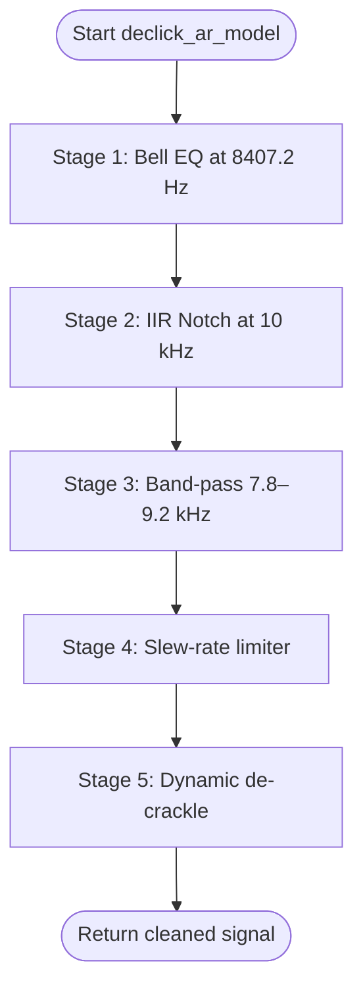
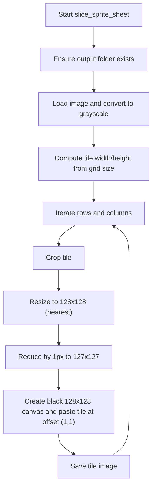
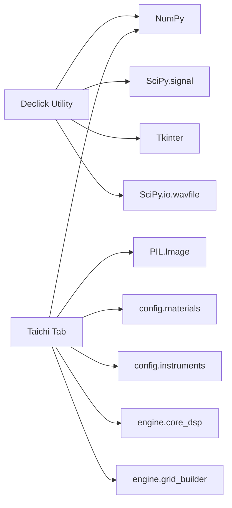

# Utility Tools

<cite>
**Referenced Files in This Document**
- [declick_utility.py](file://tools/declick_utility.py)
- [slicer.py](file://slicer.py)
- [main.py](file://main.py)
- [gui.py](file://ui/gui.py)
- [tab_acoustic.py](file://ui/tab_acoustic.py)
- [tab_percussion.py](file://ui/tab_percussion.py)
- [tab_taichi.py](file://ui/tab_taichi.py)
- [core_dsp.py](file://engine/core_dsp.py)
- [grid_builder.py](file://engine/grid_builder.py)
- [materials.py](file://config/materials.py)
- [instruments.py](file://config/instruments.py)
- [dlc_loader.py](file://dlc_loader.py)
</cite>

## Table of Contents
1. [Introduction](#introduction)
2. [Project Structure](#project-structure)
3. [Core Components](#core-components)
4. [Architecture Overview](#architecture-overview)
5. [Detailed Component Analysis](#detailed-component-analysis)
6. [Dependency Analysis](#dependency-analysis)
7. [Performance Considerations](#performance-considerations)
8. [Troubleshooting Guide](#troubleshooting-guide)
9. [Conclusion](#conclusion)
10. [Appendices](#appendices)

## Introduction
This document describes the utility tools that support the TroakarIR impulse response (IR) generation pipeline. It focuses on:
- Declick utility: a surgical high-frequency de-clicking and de-crackle processor for removing clicks, grid artifacts, and high-frequency noise from generated IRs.
- Slicer tool: a sprite-sheet cutter for preparing geometric masks and textures used by the Taichi FDTD engine.
It also explains how these utilities integrate with the main application, how to use them in IR library creation and quality control workflows, and how to optimize performance and troubleshoot common issues.

## Project Structure
The utility tools live alongside the main application and UI modules:
- tools/declick_utility.py: Declicking algorithm and GUI for batch processing WAV files.
- slicer.py: Sprite sheet cropping utility for generating masks and textures.
- ui/*: Main application tabs and UI wiring.
- engine/*: DSP and grid building logic used by the Taichi tab.
- config/*: Material and instrument presets used across the application.

**Diagram sources**
- [main.py:23-73](file://main.py#L23-L73)
- [gui.py:8-46](file://ui/gui.py#L8-L46)
- [tab_acoustic.py:126-192](file://ui/tab_acoustic.py#L126-L192)
- [tab_percussion.py:80-142](file://ui/tab_percussion.py#L80-L142)
- [tab_taichi.py:614-734](file://ui/tab_taichi.py#L614-L734)
- [core_dsp.py:90-273](file://engine/core_dsp.py#L90-L273)
- [grid_builder.py:10-87](file://engine/grid_builder.py#L10-L87)
- [materials.py:642-766](file://config/materials.py#L642-L766)
- [instruments.py:4-101](file://config/instruments.py#L4-L101)
- [declick_utility.py:101-225](file://tools/declick_utility.py#L101-L225)
- [slicer.py:6-60](file://slicer.py#L6-L60)

**Section sources**
- [main.py:23-73](file://main.py#L23-L73)
- [gui.py:8-46](file://ui/gui.py#L8-L46)
- [tab_acoustic.py:126-192](file://ui/tab_acoustic.py#L126-L192)
- [tab_percussion.py:80-142](file://ui/tab_percussion.py#L80-L142)
- [tab_taichi.py:614-734](file://ui/tab_taichi.py#L614-L734)
- [core_dsp.py:90-273](file://engine/core_dsp.py#L90-L273)
- [grid_builder.py:10-87](file://engine/grid_builder.py#L10-L87)
- [materials.py:642-766](file://config/materials.py#L642-L766)
- [instruments.py:4-101](file://config/instruments.py#L4-L101)
- [declick_utility.py:101-225](file://tools/declick_utility.py#L101-L225)
- [slicer.py:6-60](file://slicer.py#L6-L60)

## Core Components
- Declick utility
  - Purpose: Remove clicks, grid harmonics, and high-frequency noise from IRs.
  - Algorithm: Multi-stage surgical processing including parametric equalization, notch filtering, band-pass isolation, slew-rate limiting, and dynamic de-crackle.
  - Batch processing: GUI supports adding/removing files, overwrite vs append mode, and per-file progress/status.
  - Output: Preserves original bit depth and channel layout; writes WAV files.
- Slicer tool
  - Purpose: Slice sprite sheets into square tiles and resize them for downstream use (e.g., Taichi masks).
  - Features: Grid-based cropping, grayscale conversion, resizing with nearest-neighbor interpolation, border padding, and saving to a folder.

**Section sources**
- [declick_utility.py:9-99](file://tools/declick_utility.py#L9-L99)
- [declick_utility.py:101-225](file://tools/declick_utility.py#L101-L225)
- [slicer.py:6-60](file://slicer.py#L6-L60)

## Architecture Overview
The declick utility integrates as a standalone tool invoked from the main application’s UI tabs (Acoustic, Percussion, Taichi). The Taichi tab also generates masks and textures that benefit from the slicer tool. Materials and instrument presets feed into the generation pipeline, while the grid builder constructs heterogeneous material grids for FDTD simulations.

**Diagram sources**
- [tab_acoustic.py:126-192](file://ui/tab_acoustic.py#L126-L192)
- [tab_percussion.py:80-142](file://ui/tab_percussion.py#L80-L142)
- [tab_taichi.py:614-734](file://ui/tab_taichi.py#L614-L734)
- [declick_utility.py:152-220](file://tools/declick_utility.py#L152-L220)

## Detailed Component Analysis

### Declick Utility
The declick utility applies a surgical four-stage pipeline to clean high-frequency artifacts:
1. Parametric bell EQ centered at a specific frequency to reduce a prominent resonance peak.
2. IIR notch filtering at a fixed frequency to remove persistent grid hum.
3. Band-pass filtering around problematic frequencies to isolate the region requiring treatment.
4. Slew-rate limiting with a windowed envelope to smooth hard clipping transitions.
5. Dynamic de-crackle suppression based on impulsiveness detection with a tunable threshold and strength.

**Diagram sources**
- [declick_utility.py:31-99](file://tools/declick_utility.py#L31-L99)

Key implementation notes:
- Frequency-domain and time-domain filters leverage SciPy and NumPy.
- The algorithm preserves stereo channels and handles integer and floating-point WAV inputs by normalizing to float and rescaling back to the original dtype.
- The GUI supports batch processing with overwrite or append modes and displays a summary of successes and errors.

Practical usage examples:
- IR library creation: After generating IRs via Acoustic, Percussion, or Taichi tabs, run the declick utility to remove grid artifacts and clicks before exporting.
- Quality control: Use the utility to standardize IRs for a catalog, ensuring consistent high-frequency cleanliness.
- Post-processing workflows: Apply declicking after convolution or mixing to eliminate introduced artifacts.

**Section sources**
- [declick_utility.py:9-99](file://tools/declick_utility.py#L9-L99)
- [declick_utility.py:101-225](file://tools/declick_utility.py#L101-L225)
- [tab_acoustic.py:126-192](file://ui/tab_acoustic.py#L126-L192)
- [tab_percussion.py:80-142](file://ui/tab_percussion.py#L80-L142)
- [tab_taichi.py:614-734](file://ui/tab_taichi.py#L614-L734)

### Slicer Tool
The slicer tool prepares sprite sheets for mask/texturing workflows:
- Loads an image and converts to grayscale.
- Computes tile size from a grid dimension.
- Crops tiles, resizes to a smaller size with nearest-neighbor interpolation, reduces by one pixel to create a 1-pixel border, and saves to a target folder.

**Diagram sources**
- [slicer.py:6-60](file://slicer.py#L6-L60)

Integration with the main application:
- The Taichi tab generates optical masks and preview canvases; the slicer can be used to prepare additional assets or batch-export tiles for external tools.

**Section sources**
- [slicer.py:6-60](file://slicer.py#L6-L60)
- [tab_taichi.py:342-427](file://ui/tab_taichi.py#L342-L427)

## Dependency Analysis
The declick utility depends on:
- NumPy for numerical processing.
- SciPy for signal processing (filters, IIR notch).
- Tkinter for the GUI.
- WAV reading/writing via SciPy.

The Taichi tab depends on:
- NumPy and PIL for image handling.
- Config materials and instruments for physical modeling.
- Core DSP and grid builder for heterogeneous material grids and FDTD IR synthesis.

**Diagram sources**
- [declick_utility.py:1-8](file://tools/declick_utility.py#L1-L8)
- [tab_taichi.py:1-15](file://ui/tab_taichi.py#L1-L15)
- [core_dsp.py:1-9](file://engine/core_dsp.py#L1-L9)
- [grid_builder.py:1-5](file://engine/grid_builder.py#L1-L5)
- [materials.py:1-8](file://config/materials.py#L1-L8)
- [instruments.py:1-16](file://config/instruments.py#L1-L16)

**Section sources**
- [declick_utility.py:1-8](file://tools/declick_utility.py#L1-L8)
- [tab_taichi.py:1-15](file://ui/tab_taichi.py#L1-L15)
- [core_dsp.py:1-9](file://engine/core_dsp.py#L1-L9)
- [grid_builder.py:1-5](file://engine/grid_builder.py#L1-L5)
- [materials.py:1-8](file://config/materials.py#L1-L8)
- [instruments.py:1-16](file://config/instruments.py#L1-L16)

## Performance Considerations
- Declick utility
  - Memory: Operates in-place on normalized float arrays; original dtype scaling is applied before writing to preserve precision.
  - Complexity: Primarily linear-time operations with small constant factors; convolution-like steps are localized windows.
  - Recommendations:
    - Prefer mono processing when working with single-channel IRs to halve compute.
    - Use overwrite mode to avoid extra disk writes during batch runs.
    - Process files in batches of moderate size to keep the GUI responsive.
- Slicer tool
  - Memory: Grayscale conversion and resizing are O(N) with small overhead; nearest-neighbor resizing is efficient.
  - Recommendations:
    - Use appropriate grid sizes to avoid excessive tile counts.
    - Pre-verify image dimensions to prevent unnecessary resampling.
- Taichi tab and core DSP
  - Memory: Heterogeneous grids are float32 arrays sized to the mask; Gaussian smoothing and gradient computations add minimal overhead.
  - Recommendations:
    - Keep mask sizes reasonable to balance fidelity and speed.
    - Use the “fatness” and “demud” sliders judiciously to avoid excessive filtering.

[No sources needed since this section provides general guidance]

## Troubleshooting Guide
Common issues and resolutions:
- Declick utility
  - Symptom: Clicks still audible after processing.
    - Resolution: Adjust overwrite mode to rewrite originals; verify that the input is mono or that channel processing is enabled.
  - Symptom: Errors reading certain WAV files.
    - Resolution: Ensure files are standard PCM WAV; check file permissions and path validity.
  - Symptom: Output clipped or distorted.
    - Resolution: Verify that normalization and rescaling preserve the original dtype; inspect clipping thresholds.
- Slicer tool
  - Symptom: Tiles not saved or missing borders.
    - Resolution: Confirm output folder exists and is writable; ensure grid size matches the sprite sheet layout.
  - Symptom: Incorrect tile dimensions.
    - Resolution: Validate that the image width and height are divisible by the grid size.
- Taichi tab and core DSP
  - Symptom: Excessively long reverberation tails or metallic artifacts.
    - Resolution: Reduce “fatness,” adjust “demud,” and tune nonlinearity sliders; verify material selections.
  - Symptom: Memory errors on large masks.
    - Resolution: Lower mask resolution or simplify material inclusions.

**Section sources**
- [declick_utility.py:152-220](file://tools/declick_utility.py#L152-L220)
- [slicer.py:6-60](file://slicer.py#L6-L60)
- [tab_taichi.py:614-734](file://ui/tab_taichi.py#L614-L734)

## Conclusion
The declick utility and slicer tool complement the main IR generation pipeline by providing targeted cleaning and asset preparation. Together with the Acoustic, Percussion, and Taichi tabs, they enable robust IR library creation, quality control, and post-processing workflows. Proper configuration of parameters and batch processing strategies ensures efficient and reliable results.

[No sources needed since this section summarizes without analyzing specific files]

## Appendices

### Practical Workflows
- IR library creation
  - Generate IRs via Acoustic/Percussion/Taichi tabs.
  - Run declick utility in overwrite mode to sanitize outputs.
  - Export to a central directory; optionally use the slicer to prepare masks for texture experiments.
- Quality control
  - Compare pre- and post-declick versions; flag outliers for manual inspection.
  - Use batch mode to process large sets consistently.
- Post-processing
  - Apply declicking after convolution or mixing to remove introduced artifacts.
  - Use Taichi-generated masks to guide further processing or visualization.

[No sources needed since this section provides general guidance]